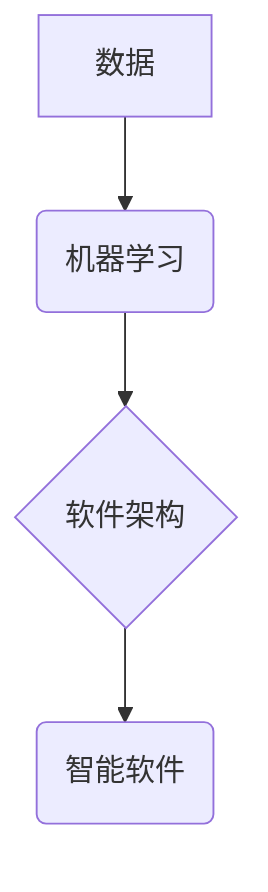

> 数据驱动，软件2.0，机器学习，深度学习，数学建模，算法优化，软件架构

## 1. 背景介绍

软件行业正经历一场深刻的变革，数据驱动的软件2.0正在逐渐取代传统的软件开发模式。数据驱动的软件2.0的核心在于利用海量数据进行训练和优化，从而构建出更加智能、高效、适应性的软件系统。

传统的软件开发模式主要依赖于人工设计和编码，而数据驱动的软件2.0则更加依赖于机器学习和深度学习等算法，通过对海量数据的分析和学习，自动生成软件代码、优化软件性能、预测用户需求等。

这种转变带来了巨大的机遇和挑战。一方面，数据驱动的软件2.0能够帮助我们构建出更加智能、高效、适应性的软件系统，解决传统软件开发模式难以解决的问题。另一方面，数据驱动的软件2.0也需要我们掌握新的技术和知识，例如机器学习、深度学习、数学建模等。

## 2. 核心概念与联系

数据驱动的软件2.0的核心概念包括：

* **数据驱动**: 软件开发过程的核心驱动力来自于数据，而不是人工设计。
* **机器学习**: 利用算法从数据中学习，自动发现模式和规律。
* **深度学习**: 一种更高级的机器学习方法，利用多层神经网络模拟人类大脑的学习过程。
* **软件架构**: 数据驱动的软件系统需要新的软件架构，以支持海量数据的处理和机器学习算法的运行。

这些概念相互关联，共同构成了数据驱动的软件2.0的框架。



## 3. 核心算法原理 & 具体操作步骤

### 3.1  算法原理概述

机器学习算法的核心原理是通过训练模型来学习数据中的模式和规律。训练模型的过程可以看作是一个参数调整的过程，通过不断调整模型的参数，使得模型能够更好地预测或分类数据。

常见的机器学习算法包括：

* **线性回归**: 用于预测连续数值。
* **逻辑回归**: 用于分类问题。
* **决策树**: 用于分类和回归问题。
* **支持向量机**: 用于分类问题。
* **神经网络**: 用于各种机器学习任务，例如图像识别、自然语言处理等。

### 3.2  算法步骤详解

一个典型的机器学习算法训练流程包括以下步骤：

1. **数据预处理**: 将原始数据进行清洗、转换、特征工程等操作，使其适合模型训练。
2. **模型选择**: 根据具体任务选择合适的机器学习算法。
3. **模型训练**: 利用训练数据训练模型，调整模型参数。
4. **模型评估**: 利用测试数据评估模型的性能，例如准确率、召回率、F1-score等。
5. **模型调优**: 根据评估结果调整模型参数或算法结构，提高模型性能。
6. **模型部署**: 将训练好的模型部署到实际应用场景中。

### 3.3  算法优缺点

不同的机器学习算法具有不同的优缺点，需要根据具体任务选择合适的算法。

例如，线性回归算法简单易实现，但对于复杂的数据关系难以建模；神经网络算法能够学习复杂的数据关系，但训练时间长，参数量大。

### 3.4  算法应用领域

机器学习算法广泛应用于各个领域，例如：

* **图像识别**: 自动识别图像中的物体、场景等。
* **自然语言处理**: 处理和理解自然语言，例如文本分类、机器翻译等。
* **推荐系统**: 根据用户的历史行为推荐感兴趣的内容。
* **欺诈检测**: 检测网络欺诈行为。
* **医疗诊断**: 辅助医生进行疾病诊断。

## 4. 数学模型和公式 & 详细讲解 & 举例说明

### 4.1  数学模型构建

机器学习算法的本质是构建数学模型，并将数据映射到模型中。

例如，线性回归模型可以表示为：

$$y = w_0 + w_1x_1 + w_2x_2 + ... + w_nx_n$$

其中：

* $y$ 是预测值。
* $w_0, w_1, w_2, ..., w_n$ 是模型参数。
* $x_1, x_2, ..., x_n$ 是输入特征。

### 4.2  公式推导过程

模型参数的学习过程通常使用梯度下降算法。梯度下降算法的目标是找到使模型预测值与真实值误差最小化的参数值。

梯度下降算法的公式如下：

$$w_i = w_i - \alpha \frac{\partial Loss}{\partial w_i}$$

其中：

* $w_i$ 是模型参数。
* $\alpha$ 是学习率。
* $Loss$ 是损失函数，用于衡量模型预测值与真实值之间的误差。

### 4.3  案例分析与讲解

例如，假设我们有一个线性回归模型，用于预测房价。

输入特征包括房屋面积、房间数量等，输出特征是房价。

我们可以使用梯度下降算法训练模型，找到最佳的模型参数，使得模型能够准确预测房价。

## 5. 项目实践：代码实例和详细解释说明

### 5.1  开发环境搭建

数据驱动的软件2.0开发通常需要使用Python语言和相关的机器学习库，例如Scikit-learn、TensorFlow、PyTorch等。

需要安装Python环境和相关的库，例如：

```bash
pip install scikit-learn tensorflow pytorch
```

### 5.2  源代码详细实现

以下是一个使用Scikit-learn库实现线性回归模型的代码示例：

```python
from sklearn.linear_model import LinearRegression
from sklearn.model_selection import train_test_split
from sklearn.metrics import mean_squared_error

# 加载数据
data = ...

# 将数据分为训练集和测试集
X_train, X_test, y_train, y_test = train_test_split(data.drop('price', axis=1), data['price'], test_size=0.2)

# 创建线性回归模型
model = LinearRegression()

# 训练模型
model.fit(X_train, y_train)

# 预测测试集数据
y_pred = model.predict(X_test)

# 计算模型性能
mse = mean_squared_error(y_test, y_pred)
print(f'Mean Squared Error: {mse}')
```

### 5.3  代码解读与分析

这段代码首先加载数据，然后将数据分为训练集和测试集。

接着，创建线性回归模型，并使用训练集训练模型。

最后，使用测试集数据预测房价，并计算模型性能。

### 5.4  运行结果展示

运行结果会显示模型的性能指标，例如均方误差。

## 6. 实际应用场景

数据驱动的软件2.0已经应用于各个领域，例如：

### 6.1  推荐系统

电商平台、视频网站等平台利用用户行为数据训练推荐模型，推荐用户感兴趣的内容。

### 6.2  个性化服务

社交媒体平台、新闻网站等平台利用用户数据提供个性化新闻、内容推荐等服务。

### 6.3  医疗诊断

利用患者数据训练疾病诊断模型，辅助医生进行诊断。

### 6.4  未来应用展望

数据驱动的软件2.0未来将更加智能、高效、适应性强。

例如，我们可以利用更强大的机器学习算法，构建更复杂的软件系统，解决更复杂的问题。

## 7. 工具和资源推荐

### 7.1  学习资源推荐

* **书籍**:
    * 《Python机器学习》
    * 《深度学习》
    * 《数据科学实战》
* **在线课程**:
    * Coursera
    * edX
    * Udacity

### 7.2  开发工具推荐

* **Python**: 
* **Scikit-learn**: 机器学习库
* **TensorFlow**: 深度学习库
* **PyTorch**: 深度学习库

### 7.3  相关论文推荐

* **《ImageNet Classification with Deep Convolutional Neural Networks》**
* **《Attention Is All You Need》**
* **《BERT: Pre-training of Deep Bidirectional Transformers for Language Understanding》**

## 8. 总结：未来发展趋势与挑战

### 8.1  研究成果总结

数据驱动的软件2.0已经取得了显著的成果，例如在推荐系统、个性化服务、医疗诊断等领域取得了突破。

### 8.2  未来发展趋势

未来数据驱动的软件2.0将朝着以下方向发展：

* **更强大的机器学习算法**: 
* **更复杂的软件系统**: 
* **更广泛的应用场景**: 

### 8.3  面临的挑战

数据驱动的软件2.0也面临着一些挑战，例如：

* **数据质量**: 
* **算法解释性**: 
* **伦理问题**: 

### 8.4  研究展望

未来需要进一步研究如何解决这些挑战，推动数据驱动的软件2.0的健康发展。

## 9. 附录：常见问题与解答

### 9.1  常见问题

* **什么是数据驱动的软件2.0?**
* **数据驱动的软件2.0有哪些优势?**
* **数据驱动的软件2.0有哪些应用场景?**

### 9.2  解答

...

作者：禅与计算机程序设计艺术 / Zen and the Art of Computer Programming


<end_of_turn>