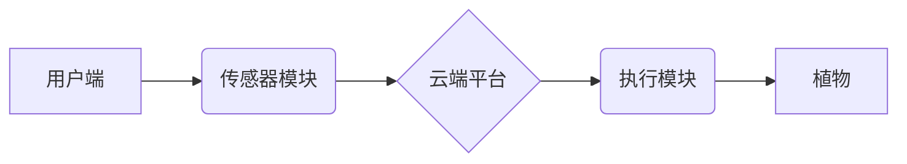

> 智能家居, 植物护理, 自动化, 室内园艺, 物联网, 机器学习, 深度学习, 计算机视觉, 数据分析

## 1. 背景介绍

随着城市化进程的加速和人们生活水平的提高，人们对绿色生活的追求日益强烈。室内园艺作为一种新型的绿色生活方式，越来越受到人们的关注。然而，传统的室内园艺需要花费大量的时间和精力进行浇水、施肥、除虫等日常维护，这对于忙碌的都市白领来说是一个很大的挑战。

智能家居技术的快速发展为室内园艺的自动化提供了新的机遇。通过传感器、物联网、人工智能等技术的结合，可以实现对植物生长环境的智能监测和控制，自动完成浇水、施肥、除虫等任务，从而解放双手，让室内园艺更加便捷、高效。

## 2. 核心概念与联系

**2.1 智能家居植物护理系统架构**

智能家居植物护理系统主要由以下几个核心模块组成：

* **传感器模块:** 用于监测植物生长环境中的各种参数，例如温度、湿度、光照强度、土壤湿度等。
* **物联网模块:** 用于将传感器采集到的数据传输到云端平台，并实现与用户端的交互。
* **云端平台:** 用于数据存储、分析和处理，并根据分析结果生成相应的控制指令。
* **执行模块:** 用于执行云端平台发出的控制指令，例如控制浇水、施肥、除虫等设备。
* **用户端:** 用于用户查看植物生长状态、设置护理参数、远程控制设备等。

**2.2 系统架构流程图**



**2.3 核心概念原理**

* **传感器技术:** 利用各种传感器技术，例如温度传感器、湿度传感器、光照传感器、土壤湿度传感器等，实时监测植物生长环境中的各种参数。
* **物联网技术:** 利用物联网技术，将传感器采集到的数据传输到云端平台，实现设备之间的互联互通。
* **人工智能技术:** 利用机器学习和深度学习算法，对植物生长数据进行分析和预测，并根据分析结果生成相应的控制指令。
* **数据分析技术:** 利用数据分析技术，对植物生长数据进行挖掘和分析，发现植物生长规律和问题，并提供相应的解决方案。

## 3. 核心算法原理 & 具体操作步骤

**3.1 算法原理概述**

智能家居植物护理系统中，常用的核心算法包括：

* **植物生长模型:** 建立植物生长模型，模拟植物生长过程，预测植物对水分、养分、光照等环境因素的需求。
* **状态识别算法:** 利用机器学习算法，识别植物的生长状态，例如是否缺水、缺肥、病虫害等。
* **控制策略算法:** 根据植物生长模型和状态识别算法的结果，制定相应的控制策略，例如何时浇水、施肥、除虫等。

**3.2 算法步骤详解**

1. **数据采集:** 利用传感器采集植物生长环境数据，例如温度、湿度、光照强度、土壤湿度等。
2. **数据预处理:** 对采集到的数据进行清洗、转换、归一化等预处理操作，以便于后续算法的训练和应用。
3. **模型训练:** 利用机器学习算法，对预处理后的数据进行训练，建立植物生长模型和状态识别算法。
4. **状态识别:** 将实时采集到的数据输入到状态识别算法中，识别植物的生长状态。
5. **控制策略制定:** 根据植物生长模型和状态识别算法的结果，制定相应的控制策略，例如何时浇水、施肥、除虫等。
6. **执行控制策略:** 将控制策略发送到执行模块，执行相应的控制指令。

**3.3 算法优缺点**

* **优点:**

    * 自动化程度高，解放双手，提高效率。
    * 数据驱动决策，更加精准和科学。
    * 可根据植物种类和生长环境进行个性化配置。

* **缺点:**

    * 系统成本较高，需要投入传感器、物联网设备、云平台等硬件和软件成本。
    * 算法模型的准确性需要不断改进，需要大量的训练数据和算法优化。
    * 系统的可靠性需要保证，需要考虑网络连接、设备故障等因素。

**3.4 算法应用领域**

* **家庭园艺:** 为家庭用户提供智能植物护理服务，帮助用户轻松养护植物。
* **商业园艺:** 为商业园艺企业提供智能化园艺解决方案，提高园艺效率和产品质量。
* **农业生产:** 为农业生产提供智能化农业解决方案，提高农业生产效率和效益。

## 4. 数学模型和公式 & 详细讲解 & 举例说明

**4.1 数学模型构建**

植物生长模型可以采用多种数学模型，例如Logistic模型、Gompertz模型等。

**Logistic模型:**

$$
\frac{dN}{dt} = rN\left(1-\frac{N}{K}\right)
$$

其中：

* $N$：植物数量
* $t$：时间
* $r$：增长率
* $K$：环境承载量

**4.2 公式推导过程**

Logistic模型的推导过程基于以下假设：

* 植物生长遵循指数增长规律。
* 环境承载量有限，当植物数量达到一定程度时，增长率会逐渐减小。

**4.3 案例分析与讲解**

假设我们有一个室内种植番茄的系统，初始番茄数量为10株，增长率为0.2，环境承载量为100株。

我们可以使用Logistic模型来预测番茄数量随时间的变化趋势。

**4.4 状态识别算法数学模型**

状态识别算法通常采用机器学习算法，例如支持向量机、决策树、神经网络等。这些算法通过学习训练数据，建立植物生长状态与环境参数之间的映射关系。

**4.5 控制策略算法数学模型**

控制策略算法通常采用优化算法，例如动态规划、遗传算法等，来寻找最优的控制策略，以实现植物的最佳生长状态。

## 5. 项目实践：代码实例和详细解释说明

**5.1 开发环境搭建**

* 操作系统：Ubuntu 20.04
* 编程语言：Python 3.8
* 框架：Flask
* 数据库：MongoDB

**5.2 源代码详细实现**

```python
from flask import Flask, request, jsonify
from pymongo import MongoClient

app = Flask(__name__)

# 连接数据库
client = MongoClient('mongodb://localhost:27017/')
db = client['plant_care']
plants = db['plants']

# 获取植物生长数据
@app.route('/get_plant_data', methods=['GET'])
def get_plant_data():
    plant_id = request.args.get('plant_id')
    plant = plants.find_one({'id': plant_id})
    return jsonify(plant)

# 更新植物生长数据
@app.route('/update_plant_data', methods=['POST'])
def update_plant_data():
    data = request.get_json()
    plant_id = data['id']
    plants.update_one({'id': plant_id}, {'$set': data})
    return jsonify({'message': 'success'})

if __name__ == '__main__':
    app.run(debug=True)
```

**5.3 代码解读与分析**

* 该代码实现了一个简单的Flask web应用，用于管理植物生长数据。
* 应用通过API接口提供数据获取和更新功能。
* 数据存储在MongoDB数据库中。

**5.4 运行结果展示**

* 运行该代码后，可以访问http://127.0.0.1:5000/get_plant_data?plant_id=1获取特定植物的生长数据。
* 访问http://127.0.0.1:5000/update_plant_data，并发送JSON格式的数据，可以更新特定植物的生长数据。

## 6. 实际应用场景

**6.1 家庭园艺**

智能家居植物护理系统可以帮助家庭用户轻松养护植物，无需花费大量的时间和精力。用户可以通过手机APP查看植物生长状态，设置护理参数，远程控制设备。

**6.2 商业园艺**

智能家居植物护理系统可以帮助商业园艺企业提高园艺效率和产品质量。例如，可以利用传感器监测植物生长环境，自动控制浇水、施肥、除虫等设备，提高资源利用率，降低成本。

**6.3 农业生产**

智能家居植物护理系统可以应用于农业生产，提高农业生产效率和效益。例如，可以利用传感器监测土壤湿度、温度、光照等环境参数，自动控制灌溉、施肥等设备，提高作物产量和品质。

**6.4 未来应用展望**

随着人工智能、物联网等技术的不断发展，智能家居植物护理系统将更加智能化、个性化、自动化。未来，智能家居植物护理系统将能够：

* 更精准地预测植物生长需求，提供个性化的护理方案。
* 更智能地控制设备，实现无人化管理。
* 更广泛地应用于农业生产、城市绿化等领域。

## 7. 工具和资源推荐

**7.1 学习资源推荐**

* **书籍:**
    * 《Python机器学习》
    * 《深度学习》
    * 《物联网编程》
* **在线课程:**
    * Coursera
    * edX
    * Udemy

**7.2 开发工具推荐**

* **编程语言:** Python
* **框架:** Flask, Django
* **数据库:** MongoDB, MySQL
* **物联网平台:** AWS IoT, Azure IoT, Google Cloud IoT

**7.3 相关论文推荐**

* **智能植物护理系统:**
    * A Review of Smart Plant Care Systems
    * Design and Implementation of a Smart Plant Care System
* **植物生长模型:**
    * Logistic Growth Model
    * Gompertz Growth Model
* **机器学习在植物科学中的应用:**
    * Machine Learning for Plant Phenotyping
    * Deep Learning for Plant Disease Detection

## 8. 总结：未来发展趋势与挑战

**8.1 研究成果总结**

智能家居植物护理系统是一个具有巨大潜力的创新领域，已经取得了一定的研究成果。

* 已经开发出多种智能植物护理系统，并应用于家庭、商业和农业领域。
* 已经建立了一些植物生长模型和状态识别算法，能够有效地监测和控制植物生长环境。

**8.2 未来发展趋势**

* **更加智能化:** 利用人工智能、机器学习等技术，实现更精准的植物生长预测和控制。
* **更加个性化:** 根据用户的喜好和植物的特性，提供个性化的护理方案。
* **更加自动化:** 实现无人化管理，减少人工干预。
* **更加生态化:** 利用可持续发展理念，设计更加环保的植物护理系统。

**8.3 面临的挑战**

* **算法精度:** 现有的算法模型精度还有待提高，需要更多的训练数据和算法优化。
* **系统可靠性:** 系统需要保证高可靠性，需要考虑网络连接、设备故障等因素。
* **成本问题:** 智能家居植物护理系统成本较高，需要降低成本，使其更加普及。

**8.4 研究展望**

未来，智能家居植物护理系统将朝着更加智能化、个性化、自动化、生态化的方向发展，为人们提供更加便捷、高效、环保的植物护理服务。


## 9. 附录：常见问题与解答

**9.1 如何选择合适的植物护理系统？**

选择合适的植物护理系统需要根据用户的需求和植物的特性进行选择。

* **家庭用户:** 可以选择功能简单、易于操作的智能植物护理系统。
* **商业园艺企业:** 可以选择功能强大的智能植物护理系统，例如能够自动控制浇水、施肥、除虫等设备的系统。

**9.2 如何安装和使用智能植物护理系统？**

安装和使用智能植物护理系统通常比较简单，可以参考产品的说明书进行操作。

* **安装:** 需要将传感器、执行模块等设备安装在植物附近