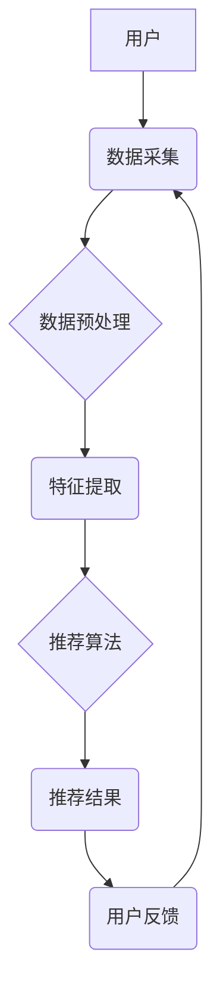

> 智能推荐系统, AI, 用户满意度, 协同过滤, 内容过滤, 深度学习, 自然语言处理, 个性化推荐

## 1. 背景介绍

在信息爆炸的时代，海量数据和信息涌现，用户面临着选择困难和信息过载的挑战。智能推荐系统应运而生，旨在通过分析用户行为、偏好和历史数据，为用户提供个性化、精准的推荐，从而提高用户体验和满意度。

智能推荐系统已广泛应用于各个领域，例如电商平台、视频网站、音乐平台、社交媒体等。它可以帮助用户发现感兴趣的内容，节省时间和精力，提升购物体验、娱乐体验和社交体验。

## 2. 核心概念与联系

**2.1 智能推荐系统的核心概念**

* **推荐系统:**  旨在根据用户历史行为、偏好和上下文信息，预测用户对特定物品的兴趣，并提供个性化的推荐列表。
* **个性化推荐:**  根据用户的独特特征和需求，提供定制化的推荐结果，满足用户的个性化需求。
* **协同过滤:**  通过分析其他用户对相同物品的评价或行为，预测用户对特定物品的兴趣。
* **内容过滤:**  根据物品的特征和用户偏好，预测用户对特定物品的兴趣。
* **深度学习:**  利用深度神经网络模型，从海量数据中学习用户行为模式和物品特征，进行更精准的推荐。
* **自然语言处理:**  利用自然语言处理技术，分析用户文本评论和反馈，理解用户的意图和需求，进行更智能的推荐。

**2.2 智能推荐系统架构**



**2.3 智能推荐系统与用户满意度的联系**

智能推荐系统通过提供个性化、精准的推荐，可以有效提升用户满意度。

* **提高用户体验:**  智能推荐系统可以帮助用户快速找到感兴趣的内容，节省时间和精力，提升用户体验。
* **增强用户粘性:**  个性化的推荐可以满足用户的个性化需求，增强用户粘性，提高用户复购率。
* **促进用户参与:**  智能推荐系统可以鼓励用户参与互动，例如评论、分享、点赞等，提升用户参与度。

## 3. 核心算法原理 & 具体操作步骤

**3.1 算法原理概述**

智能推荐系统常用的算法包括协同过滤和内容过滤。

* **协同过滤:**  基于用户的行为相似性或物品之间的关联性进行推荐。
* **内容过滤:**  基于物品的特征和用户的偏好进行推荐。

**3.2 算法步骤详解**

**3.2.1 协同过滤算法步骤**

1. **数据收集:**  收集用户对物品的评分、购买记录、浏览记录等数据。
2. **用户相似度计算:**  根据用户的评分或行为相似度，计算用户之间的相似度。
3. **物品相似度计算:**  根据物品的特征相似度，计算物品之间的相似度。
4. **推荐生成:**  根据用户的相似用户或物品的相似物品，生成推荐列表。

**3.2.2 内容过滤算法步骤**

1. **物品特征提取:**  提取物品的特征，例如类别、描述、价格等。
2. **用户偏好学习:**  根据用户的历史行为和评分，学习用户的偏好。
3. **推荐生成:**  根据物品的特征和用户的偏好，生成推荐列表。

**3.3 算法优缺点**

**3.3.1 协同过滤算法**

* **优点:**  能够发现隐含的用户偏好和物品关联性。
* **缺点:**  数据稀疏性问题、冷启动问题、数据规模庞大。

**3.3.2 内容过滤算法**

* **优点:**  无需用户历史数据，能够推荐新物品。
* **缺点:**  难以捕捉用户隐含的偏好，推荐结果可能过于单一。

**3.4 算法应用领域**

* **电商平台:**  商品推荐、用户画像、个性化营销。
* **视频网站:**  视频推荐、用户分类、内容创作。
* **音乐平台:**  音乐推荐、用户发现、音乐创作。
* **社交媒体:**  好友推荐、内容推荐、兴趣社区。

## 4. 数学模型和公式 & 详细讲解 & 举例说明

**4.1 数学模型构建**

协同过滤算法常用的数学模型是用户-物品评分矩阵。

* **用户-物品评分矩阵:**  一个二维矩阵，其中每一行代表一个用户，每一列代表一个物品，矩阵元素表示用户对物品的评分。

**4.2 公式推导过程**

协同过滤算法常用的相似度计算公式包括余弦相似度和皮尔逊相关系数。

* **余弦相似度:**  计算两个向量的夹角，值范围为-1到1，值越接近1，相似度越高。

$$
\text{余弦相似度}(u,v) = \frac{u \cdot v}{||u|| ||v||}
$$

* **皮尔逊相关系数:**  计算两个变量之间的线性相关性，值范围为-1到1，值越接近1，相关性越高。

$$
\text{皮尔逊相关系数}(u,v) = \frac{\sum_{i=1}^{n}(u_i - \bar{u})(v_i - \bar{v})}{\sqrt{\sum_{i=1}^{n}(u_i - \bar{u})^2} \sqrt{\sum_{i=1}^{n}(v_i - \bar{v})^2}}
$$

**4.3 案例分析与讲解**

假设有两个用户A和B，他们的评分矩阵如下：

| 物品 | A | B |
|---|---|---|
| 1 | 5 | 4 |
| 2 | 3 | 2 |
| 3 | 4 | 5 |
| 4 | 2 | 3 |

我们可以使用余弦相似度或皮尔逊相关系数计算A和B之间的相似度。

## 5. 项目实践：代码实例和详细解释说明

**5.1 开发环境搭建**

* Python 3.x
* scikit-learn
* pandas
* numpy

**5.2 源代码详细实现**

```python
import pandas as pd
from sklearn.metrics.pairwise import cosine_similarity

# 加载评分数据
ratings = pd.read_csv('ratings.csv')

# 计算用户之间的余弦相似度
user_similarity = cosine_similarity(ratings)

# 获取用户A的相似用户
similar_users = user_similarity[0].argsort()[:-6:-1]

# 获取用户A的相似用户评分
similar_user_ratings = ratings.iloc[similar_users, :]

# 计算用户A对物品的预测评分
predicted_ratings = similar_user_ratings.mean(axis=0)

# 生成推荐列表
recommendations = predicted_ratings.sort_values(ascending=False)
```

**5.3 代码解读与分析**

* 首先，我们加载评分数据，并使用scikit-learn库中的cosine_similarity函数计算用户之间的余弦相似度。
* 然后，我们获取用户A的相似用户，并获取这些用户的评分数据。
* 接着，我们计算用户A对物品的预测评分，并生成推荐列表。

**5.4 运行结果展示**

运行代码后，我们可以得到用户A的推荐列表，其中包含用户A可能感兴趣的物品。

## 6. 实际应用场景

**6.1 电商平台**

* **商品推荐:**  根据用户的浏览历史、购买记录和评分，推荐用户可能感兴趣的商品。
* **用户画像:**  分析用户的购买行为和偏好，构建用户画像，进行精准营销。
* **个性化营销:**  根据用户的兴趣和需求，推送个性化的促销信息和优惠券。

**6.2 视频网站**

* **视频推荐:**  根据用户的观看历史、点赞记录和评论，推荐用户可能感兴趣的视频。
* **用户分类:**  根据用户的观看习惯和偏好，将用户分类，提供个性化的内容推荐。
* **内容创作:**  分析用户观看数据，了解用户对不同类型的视频的偏好，指导内容创作。

**6.3 音乐平台**

* **音乐推荐:**  根据用户的播放历史、收藏记录和评分，推荐用户可能喜欢的音乐。
* **用户发现:**  根据用户的音乐偏好，推荐与用户兴趣相似的用户，促进用户之间的互动。
* **音乐创作:**  分析用户对不同音乐风格的偏好，指导音乐创作。

**6.4 未来应用展望**

* **多模态推荐:**  结合文本、图像、音频等多模态数据，进行更精准的推荐。
* **个性化学习推荐:**  根据用户的学习目标和进度，推荐个性化的学习资源。
* **情感分析推荐:**  分析用户的评论和反馈，了解用户的真实情感，进行更人性化的推荐。

## 7. 工具和资源推荐

**7.1 学习资源推荐**

* **书籍:**
    * 《推荐系统实践》
    * 《机器学习》
    * 《深度学习》
* **在线课程:**
    * Coursera: Recommender Systems
    * edX: Machine Learning
    * Udacity: Deep Learning

**7.2 开发工具推荐**

* **Python:**  Python 是推荐系统开发的常用语言，拥有丰富的库和工具。
* **scikit-learn:**  scikit-learn 是 Python 的机器学习库，提供多种推荐算法实现。
* **Spark:**  Spark 是分布式计算框架，可以用于处理海量数据。

**7.3 相关论文推荐**

* 《Collaborative Filtering for Implicit Feedback Datasets》
* 《Matrix Factorization Techniques for Recommender Systems》
* 《Deep Learning for Recommender Systems》

## 8. 总结：未来发展趋势与挑战

**8.1 研究成果总结**

智能推荐系统已取得了显著的成果，能够有效提升用户体验和满意度。

**8.2 未来发展趋势**

* **多模态推荐:**  结合文本、图像、音频等多模态数据，进行更精准的推荐。
* **个性化学习推荐:**  根据用户的学习目标和进度，推荐个性化的学习资源。
* **情感分析推荐:**  分析用户的评论和反馈，了解用户的真实情感，进行更人性化的推荐。

**8.3 面临的挑战**

* **数据稀疏性:**  用户对物品的评分数据往往稀疏，难以训练有效的推荐模型。
* **冷启动问题:**  对于新用户和新物品，缺乏历史数据，难以进行推荐。
* **公平性问题:**  推荐算法可能存在偏见，导致不公平的推荐结果。

**8.4 研究展望**

未来，智能推荐系统将朝着更精准、更个性化、更公平的方向发展。

## 9. 附录：常见问题与解答

**9.1 如何解决数据稀疏性问题？**

* 使用协同过滤算法的改进方法，例如基于矩阵分解的协同过滤算法。
* 使用内容过滤算法，结合物品的特征进行推荐。
* 使用混合推荐算法，结合协同过滤和内容过滤算法。

**9.2 如何解决冷启动问题？**

* 使用基于内容的推荐算法，推荐与新用户或新物品相关的物品。
* 使用基于用户的推荐算法，推荐与相似用户的喜好相关的物品。
* 使用知识图谱，利用物品之间的关系进行推荐。

**9.3 如何保证推荐结果的公平性？**

* 使用公平性度量指标，评估推荐算法的公平性。
* 使用公平性约束条件，约束推荐算法的决策过程。
* 使用对抗训练方法，提高推荐算法对偏见的影响力。


作者：禅与计算机程序设计艺术 / Zen and the Art of Computer Programming 
<end_of_turn>