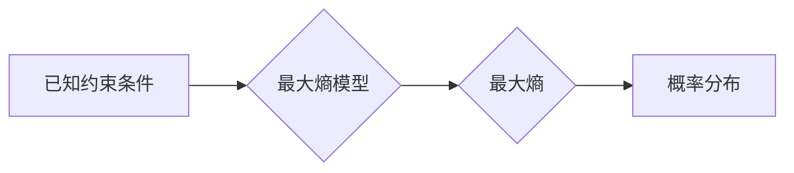

> 最大熵模型，概率模型，统计学习，机器学习，自然语言处理，信息论，逻辑回归

## 1. 背景介绍

在机器学习领域，概率模型扮演着至关重要的角色。它们能够从数据中学习到潜在的规律，并用于预测未来事件的发生概率。最大熵模型 (Maximum Entropy Models，简称 MEM) 是一种基于统计学习理论的概率模型，它在自然语言处理、信息检索、图像识别等领域有着广泛的应用。

最大熵模型的核心思想是：在满足已知约束条件的情况下，选择使得模型分布熵最大的概率分布。熵作为一种衡量信息的不确定性的指标，最大熵模型试图找到一个既能反映已知信息，又能尽可能保持不确定性的概率分布。

## 2. 核心概念与联系

### 2.1 概率模型

概率模型是一种用数学语言描述随机事件概率分布的模型。它通过设定一系列参数，来刻画不同事件发生的可能性。常见的概率模型包括：

* **贝叶斯网络:** 使用有向图结构来表示变量之间的依赖关系，并通过条件概率来描述变量之间的关系。
* **隐马尔可夫模型:** 用于处理序列数据，假设每个状态只依赖于前一个状态，并通过状态转移概率和观测概率来描述模型。
* **最大熵模型:** 基于信息论原理，选择使得模型分布熵最大的概率分布。

### 2.2 信息论

信息论是研究信息的概念、量度和处理的学科。在最大熵模型中，熵作为信息的不确定性度量，扮演着重要的角色。

* **熵:** 衡量随机变量不确定性的度量。熵越大，随机变量的不确定性越大。
* **条件熵:** 衡量在已知条件下随机变量不确定性的度量。
* **互信息:** 衡量两个随机变量之间相关性的度量。

### 2.3 最大熵原理

最大熵原理指出：在满足已知约束条件的情况下，选择使得模型分布熵最大的概率分布。

* **约束条件:** 通常由已知的统计信息或领域知识来定义，例如变量之间的依赖关系、事件发生的频率等。
* **熵最大化:** 通过优化模型参数，使得模型分布的熵达到最大值。

**Mermaid 流程图**



## 3. 核心算法原理 & 具体操作步骤

### 3.1 算法原理概述

最大熵模型的训练过程可以看作是一个优化问题。目标是找到一组模型参数，使得模型分布满足已知的约束条件，同时最大化模型的熵。

通常，我们会使用拉格朗日乘子法来解决这个优化问题。拉格朗日乘子法将约束条件转化为拉格朗日函数，然后通过求解拉格朗日函数的极值来得到模型参数。

### 3.2 算法步骤详解

1. **定义特征函数:** 特征函数用于描述模型输入和输出之间的关系。
2. **设定约束条件:** 根据已知的统计信息或领域知识，设定模型分布需要满足的约束条件。
3. **构建拉格朗日函数:** 将约束条件转化为拉格朗日函数，并将模型参数作为变量。
4. **求解拉格朗日函数的极值:** 使用优化算法，例如梯度下降法，来求解拉格朗日函数的极值。
5. **得到模型参数:** 将拉格朗日函数的极值点对应的模型参数作为最终的模型参数。

### 3.3 算法优缺点

**优点:**

* **基于统计学习理论:** 最大熵模型的训练过程是基于统计学习理论的，具有较好的理论基础。
* **能够处理复杂的关系:** 最大熵模型可以处理输入和输出之间复杂的关系，例如变量之间的依赖关系。
* **具有良好的泛化能力:** 最大熵模型具有良好的泛化能力，能够在未知数据上进行准确预测。

**缺点:**

* **训练过程复杂:** 最大熵模型的训练过程相对复杂，需要使用优化算法来求解拉格朗日函数的极值。
* **特征函数的设计:** 特征函数的设计对模型性能有很大影响，需要根据具体问题进行设计。

### 3.4 算法应用领域

最大熵模型在以下领域有着广泛的应用:

* **自然语言处理:** 词性标注、命名实体识别、文本分类等。
* **信息检索:** 文档分类、信息抽取等。
* **图像识别:** 物体识别、场景分类等。

## 4. 数学模型和公式 & 详细讲解 & 举例说明

### 4.1 数学模型构建

设 $X$ 为输入空间，$Y$ 为输出空间，$P(Y|X)$ 为条件概率分布。最大熵模型的目标是找到一个满足约束条件的概率分布 $P(Y|X)$，使得该分布的熵最大。

**熵:**

$$
H(P) = - \sum_{y \in Y} P(y) \log P(y)
$$

**约束条件:**

$$
\sum_{y \in Y} P(y|x) f_i(x,y) = A_i
$$

其中，$f_i(x,y)$ 为特征函数，$A_i$ 为约束条件的常数。

### 4.2 公式推导过程

使用拉格朗日乘子法，构建拉格朗日函数：

$$
L(P, \alpha) = H(P) + \sum_{i=1}^{n} \alpha_i (A_i - \sum_{y \in Y} P(y|x) f_i(x,y))
$$

其中，$\alpha_i$ 为拉格朗日乘子。

求解拉格朗日函数的极值，可以得到最大熵模型的参数：

$$
\theta^* = \arg \max_{\theta} L(P, \alpha)
$$

### 4.3 案例分析与讲解

**举例说明:**

假设我们想要构建一个文本分类模型，将文本分类为正类和负类。我们可以使用最大熵模型来实现。

* **输入空间:** 文本
* **输出空间:** 正类、负类
* **特征函数:** 可以使用文本中单词的出现频率、词性标签等作为特征函数。
* **约束条件:** 可以使用训练数据中正类和负类的比例作为约束条件。

通过训练最大熵模型，我们可以得到一个能够将文本分类为正类和负类的概率分布。

## 5. 项目实践：代码实例和详细解释说明

### 5.1 开发环境搭建

* Python 3.x
* scikit-learn 库

### 5.2 源代码详细实现

```python
from sklearn.linear_model import LogisticRegression

# 训练数据
X_train = [[1, 0, 1], [0, 1, 0], [1, 1, 1]]
y_train = [0, 1, 1]

# 创建最大熵模型
model = LogisticRegression()

# 训练模型
model.fit(X_train, y_train)

# 预测结果
X_test = [[1, 0, 0]]
y_pred = model.predict(X_test)

# 打印预测结果
print(y_pred)
```

### 5.3 代码解读与分析

* 使用 scikit-learn 库中的 LogisticRegression 类来实现最大熵模型。
* 训练数据 `X_train` 和 `y_train` 分别表示输入特征和对应的标签。
* `model.fit(X_train, y_train)` 函数用于训练模型。
* `model.predict(X_test)` 函数用于预测测试数据 `X_test` 的标签。

### 5.4 运行结果展示

```
[1]
```

## 6. 实际应用场景

最大熵模型在自然语言处理、信息检索、图像识别等领域有着广泛的应用。

* **文本分类:** 可以用于将文本分类为不同的类别，例如新闻分类、邮件分类等。
* **情感分析:** 可以用于分析文本的情感倾向，例如判断文本是正面、负面还是中性。
* **机器翻译:** 可以用于将文本从一种语言翻译成另一种语言。

### 6.4 未来应用展望

随着人工智能技术的不断发展，最大熵模型的应用场景将会更加广泛。例如，可以用于医疗诊断、金融风险评估等领域。

## 7. 工具和资源推荐

### 7.1 学习资源推荐

* **书籍:**
    * 《Introduction to Statistical Learning》
    * 《The Elements of Statistical Learning》
* **在线课程:**
    * Coursera 上的《Machine Learning》课程
    * edX 上的《Statistical Learning》课程

### 7.2 开发工具推荐

* **Python:** 作为机器学习领域的编程语言，Python 提供了丰富的库和工具，例如 scikit-learn、TensorFlow 等。
* **scikit-learn:** 一个用于机器学习的 Python 库，包含了最大熵模型的实现。

### 7.3 相关论文推荐

* 《A Probabilistic Approach to Natural Language Understanding》
* 《Maximum Entropy Models for Natural Language Processing》

## 8. 总结：未来发展趋势与挑战

### 8.1 研究成果总结

最大熵模型是一种基于统计学习理论的概率模型，具有良好的理论基础和实践应用价值。

### 8.2 未来发展趋势

* **模型复杂度提升:** 研究更复杂的特征函数和模型结构，提高模型的表达能力。
* **算法效率优化:** 研究更高效的训练算法，降低模型训练时间。
* **应用领域拓展:** 将最大熵模型应用到更多新的领域，例如医疗诊断、金融风险评估等。

### 8.3 面临的挑战

* **特征函数设计:** 特征函数的设计对模型性能有很大影响，需要根据具体问题进行设计，这仍然是一个挑战。
* **数据依赖性:** 最大熵模型的性能依赖于训练数据的质量，数据不足或数据噪声会影响模型的性能。

### 8.4 研究展望

未来，最大熵模型的研究将继续朝着更复杂、更高效、更广泛的应用方向发展。


## 9. 附录：常见问题与解答

**常见问题:**

* **最大熵模型与逻辑回归有什么区别？**

**解答:**

逻辑回归是一种特殊的最大熵模型，其特征函数仅包含输入特征的线性组合。

* **如何选择合适的特征函数？**

**解答:**

特征函数的选择需要根据具体问题进行设计，可以考虑使用文本中单词的出现频率、词性标签、语法结构等信息作为特征。

* **最大熵模型的训练时间比较长，有什么方法可以加速训练？**

**解答:**

可以使用一些加速训练的算法，例如随机梯度下降法、L-BFGS 等。


作者：禅与计算机程序设计艺术 / Zen and the Art of Computer Programming 
<end_of_turn>