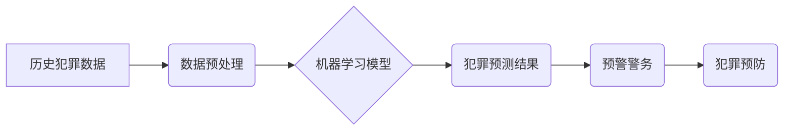

> 智能安防, 犯罪预测, 预警警务, 机器学习, 深度学习, 数据分析, 人工智能, 计算机视觉

## 1. 背景介绍

随着科技的飞速发展，人工智能（AI）正在深刻地改变着我们的生活，其中之一就是安防领域。传统的安防模式主要依靠人力的巡逻和监控，效率低下，且难以应对突发事件。而智能安防则利用人工智能技术，通过数据分析、预测和预警，实现更智能、更精准、更有效的安防保障。

犯罪预测与预警警务（Predictive Policing）是智能安防的重要组成部分，它通过分析历史犯罪数据、社会经济因素、人口流动等信息，预测未来可能发生的犯罪事件，并及时预警相关部门，从而有效预防犯罪发生。

## 2. 核心概念与联系

**2.1 犯罪预测与预警警务**

犯罪预测与预警警务是指利用数据分析、机器学习等人工智能技术，分析历史犯罪数据、社会经济因素、人口流动等信息，预测未来可能发生的犯罪事件，并及时预警相关部门，从而有效预防犯罪发生。

**2.2 核心技术**

* **机器学习:** 机器学习算法可以从海量数据中学习模式和规律，并根据这些模式预测未来事件。常用的机器学习算法包括回归分析、分类算法、聚类算法等。
* **深度学习:** 深度学习是机器学习的一个分支，它利用多层神经网络模拟人类大脑的学习过程，能够处理更复杂的数据，并获得更准确的预测结果。
* **数据分析:** 数据分析是获取、处理和分析数据以发现有价值信息的过程。在犯罪预测中，数据分析可以帮助我们识别犯罪热点、犯罪模式和犯罪趋势。
* **计算机视觉:** 计算机视觉技术可以使计算机“看”图像和视频，并从中提取信息。例如，可以利用计算机视觉技术识别犯罪嫌疑人、分析犯罪现场等。

**2.3 架构图**



## 3. 核心算法原理 & 具体操作步骤

### 3.1  算法原理概述

犯罪预测算法通常基于统计学和机器学习原理，通过分析历史犯罪数据、社会经济因素、人口流动等信息，建立预测模型，并预测未来可能发生的犯罪事件。常用的算法包括：

* **逻辑回归:** 用于预测二分类问题，例如犯罪发生与否。
* **支持向量机:** 用于分类和回归问题，可以处理高维数据。
* **决策树:** 用于分类和回归问题，易于理解和解释。
* **随机森林:** 结合多个决策树，提高预测精度。
* **神经网络:** 能够处理复杂数据，并获得更准确的预测结果。

### 3.2  算法步骤详解

1. **数据收集:** 收集历史犯罪数据、社会经济因素、人口流动等相关数据。
2. **数据预处理:** 对收集到的数据进行清洗、转换、编码等处理，使其适合算法训练。
3. **特征选择:** 选择与犯罪发生相关的特征，并进行降维处理，提高算法效率。
4. **模型训练:** 利用选定的算法，对预处理后的数据进行训练，建立预测模型。
5. **模型评估:** 利用测试数据评估模型的预测精度，并进行模型调优。
6. **部署与应用:** 将训练好的模型部署到实际应用场景中，用于预测未来犯罪事件。

### 3.3  算法优缺点

| 算法 | 优点 | 缺点 |
|---|---|---|
| 逻辑回归 | 易于理解和实现，计算效率高 | 只能处理线性关系，预测精度有限 |
| 支持向量机 | 能够处理高维数据，预测精度高 | 计算复杂度高，参数调优困难 |
| 决策树 | 易于理解和解释，可处理非线性关系 | 容易过拟合，预测精度有限 |
| 随机森林 | 结合多个决策树，提高预测精度 | 计算复杂度高，参数调优困难 |
| 神经网络 | 能够处理复杂数据，预测精度高 | 计算复杂度高，参数调优困难，解释性差 |

### 3.4  算法应用领域

犯罪预测算法广泛应用于以下领域：

* **犯罪热点预测:** 预测未来可能发生犯罪的区域。
* **犯罪类型预测:** 预测未来可能发生的犯罪类型。
* **犯罪嫌疑人预测:** 预测未来可能成为犯罪嫌疑人的个人。
* **犯罪时间预测:** 预测未来可能发生的犯罪时间。

## 4. 数学模型和公式 & 详细讲解 & 举例说明

### 4.1  数学模型构建

犯罪预测模型通常基于统计学和机器学习原理，可以采用以下几种数学模型：

* **线性回归模型:** 用于预测连续变量，例如犯罪次数。
* **逻辑回归模型:** 用于预测二分类问题，例如犯罪发生与否。
* **支持向量机模型:** 用于分类和回归问题，可以处理高维数据。
* **决策树模型:** 用于分类和回归问题，易于理解和解释。
* **神经网络模型:** 能够处理复杂数据，并获得更准确的预测结果。

### 4.2  公式推导过程

这里以逻辑回归模型为例，推导其公式：

假设我们有n个样本数据，每个样本包含m个特征和一个标签（0或1，表示犯罪发生与否）。

* **目标函数:** 
$$
J(\theta) = -\frac{1}{m} \sum_{i=1}^{m} [y^{(i)}\log(h_\theta(x^{(i)})) + (1-y^{(i)})\log(1-h_\theta(x^{(i)}))]
$$

其中：

* $J(\theta)$ 是损失函数，用于衡量模型预测结果与真实标签之间的误差。
* $\theta$ 是模型参数。
* $y^{(i)}$ 是第i个样本的真实标签。
* $h_\theta(x^{(i)})$ 是模型对第i个样本预测的概率。

* **梯度下降算法:** 用于优化模型参数，使其最小化损失函数。

$$
\theta = \theta - \alpha \nabla J(\theta)
$$

其中：

* $\alpha$ 是学习率。
* $\nabla J(\theta)$ 是损失函数的梯度。

### 4.3  案例分析与讲解

假设我们想要预测某个城市的犯罪发生概率。我们可以收集该城市的过去几年的犯罪数据，以及相关社会经济因素和人口流动数据。然后，我们可以使用逻辑回归模型对这些数据进行训练，建立一个预测犯罪发生概率的模型。

例如，我们可以发现犯罪发生概率与人口密度、失业率、教育水平等因素相关。模型可以根据这些因素的组合，预测未来某个区域的犯罪发生概率。

## 5. 项目实践：代码实例和详细解释说明

### 5.1  开发环境搭建

* 操作系统：Windows/macOS/Linux
* Python版本：3.6+
* 必要的库：pandas, numpy, scikit-learn, matplotlib

### 5.2  源代码详细实现

```python
import pandas as pd
from sklearn.model_selection import train_test_split
from sklearn.linear_model import LogisticRegression
from sklearn.metrics import accuracy_score

# 加载数据
data = pd.read_csv('crime_data.csv')

# 选择特征和目标变量
features = ['population_density', 'unemployment_rate', 'education_level']
target = 'crime_rate'

# 数据分割
X_train, X_test, y_train, y_test = train_test_split(data[features], data[target], test_size=0.2, random_state=42)

# 创建逻辑回归模型
model = LogisticRegression()

# 模型训练
model.fit(X_train, y_train)

# 模型预测
y_pred = model.predict(X_test)

# 模型评估
accuracy = accuracy_score(y_test, y_pred)
print(f'模型准确率: {accuracy}')
```

### 5.3  代码解读与分析

* 首先，我们加载犯罪数据，并选择相关的特征和目标变量。
* 然后，我们将数据分割成训练集和测试集，用于模型训练和评估。
* 接下来，我们创建逻辑回归模型，并使用训练集进行模型训练。
* 训练完成后，我们使用测试集进行模型预测，并计算模型的准确率。

### 5.4  运行结果展示

运行上述代码后，会输出模型的准确率。

## 6. 实际应用场景

### 6.1  犯罪热点预测

利用犯罪预测算法，可以预测未来可能发生犯罪的区域，并对这些区域进行重点巡逻和防控。

### 6.2  犯罪类型预测

根据历史犯罪数据和社会经济因素，可以预测未来可能发生的犯罪类型，以便警方提前做好准备，并采取相应的预防措施。

### 6.3  犯罪嫌疑人预测

通过分析犯罪嫌疑人的特征和行为模式，可以预测未来可能成为犯罪嫌疑人的个人，并对其进行重点监控。

### 6.4  未来应用展望

随着人工智能技术的不断发展，犯罪预测与预警警务将更加智能化、精准化和自动化。未来，我们可以期待以下应用场景：

* **实时犯罪预测:** 利用实时数据流，实时预测犯罪事件发生概率，并及时预警相关部门。
* **个性化犯罪预防:** 根据个人的犯罪风险评估，提供个性化的犯罪预防建议。
* **智能监控系统:** 利用计算机视觉技术，对监控视频进行分析，识别犯罪嫌疑人，并自动报警。

## 7. 工具和资源推荐

### 7.1  学习资源推荐

* **书籍:**
    * "Predictive Policing: The Promise and Peril of Forecasting Crime" by Jeff Asher
    * "The Master Algorithm" by Pedro Domingos
* **在线课程:**
    * Coursera: Machine Learning
    * edX: Artificial Intelligence

### 7.2  开发工具推荐

* **Python:** 
    * scikit-learn: 机器学习库
    * pandas: 数据分析库
    * numpy: 数值计算库
* **R:** 
    * caret: 机器学习库
    * dplyr: 数据处理库

### 7.3  相关论文推荐

* "Predicting Crime with Machine Learning" by Jeff Asher
* "Crime Prediction Using Machine Learning: A Survey" by A. K. Sharma et al.

## 8. 总结：未来发展趋势与挑战

### 8.1  研究成果总结

近年来，犯罪预测与预警警务取得了显著进展，人工智能技术为其提供了强大的工具。通过分析历史犯罪数据和社会经济因素，我们可以预测未来可能发生的犯罪事件，并采取相应的预防措施。

### 8.2  未来发展趋势

* **更精准的预测:** 利用更先进的机器学习算法和更丰富的训练数据，提高犯罪预测的准确率。
* **更实时化的预测:** 利用实时数据流，实现对犯罪事件的实时预测和预警。
* **更个性化的预防:** 根据个人的犯罪风险评估，提供个性化的犯罪预防建议。
* **更智能的监控系统:** 利用计算机视觉技术，对监控视频进行分析，识别犯罪嫌疑人，并自动报警。

### 8.3  面临的挑战

* **数据质量:** 犯罪预测模型的准确性依赖于数据质量。需要收集高质量、全面、准确的犯罪数据。
* **算法偏见:** 机器学习算法可能存在偏见，导致预测结果不公平。需要开发算法去偏见的方法。
* **伦理问题:** 犯罪预测与预警警务涉及到隐私、公平、透明等伦理问题，需要谨慎考虑。

### 8.4  研究展望