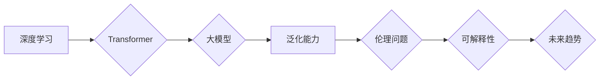

> 人工智能，深度学习，Transformer，大模型，泛化能力，伦理问题，可解释性，未来趋势

## 1. 背景介绍

人工智能（AI）技术近年来发展迅速，从语音识别、图像识别到自然语言处理等领域取得了突破性进展。其中，深度学习作为AI的核心技术之一，凭借其强大的学习能力和泛化能力，推动了AI技术的飞速发展。

李开复，一位享誉全球的人工智能专家，在《AI 2.0 时代的挑战》一文中，深刻地分析了当前AI技术的发展现状以及未来面临的挑战。他指出，我们正处于AI 2.0时代，即从传统AI向更智能、更通用、更安全的人工智能迈进的时代。

## 2. 核心概念与联系

**2.1 深度学习**

深度学习是一种基于多层神经网络的机器学习方法。它能够从海量数据中学习复杂的特征和模式，从而实现对各种任务的智能化处理。

**2.2 Transformer**

Transformer是一种新型的深度学习架构，其核心是注意力机制，能够有效地捕捉序列数据中的长距离依赖关系。它在自然语言处理领域取得了显著的成果，例如机器翻译、文本摘要和对话系统等。

**2.3 大模型**

大模型是指参数量庞大的深度学习模型，通常拥有数十亿甚至数千亿个参数。大模型能够学习更复杂的知识和模式，从而在更广泛的应用场景中展现出强大的能力。

**2.4 泛化能力**

泛化能力是指模型在未见过的数据上也能保持良好性能的能力。这是一个非常重要的指标，因为AI模型需要能够应对现实世界中的各种复杂情况。

**2.5 伦理问题**

随着AI技术的不断发展，其伦理问题也日益凸显。例如，AI算法的偏见、数据隐私保护、AI的责任归属等问题都需要得到认真思考和解决。

**2.6 可解释性**

可解释性是指能够理解AI模型的决策过程的能力。对于一些重要的决策，例如医疗诊断、金融风险评估等，可解释性至关重要。

**2.7 未来趋势**

李开复认为，未来AI技术将朝着更加智能、通用、安全的方向发展。例如，

* **通用人工智能 (AGI)：** 能够像人类一样进行思考、学习和解决问题的AI。
* **边缘计算：** 将AI模型部署到边缘设备上，实现更快速的响应和更低的延迟。
* **联邦学习：** 在不共享原始数据的情况下，通过模型参数的更新来进行联合训练。

**Mermaid 流程图**



## 3. 核心算法原理 & 具体操作步骤

### 3.1 算法原理概述

Transformer是一种基于注意力机制的深度学习架构，其核心思想是通过注意力机制来捕捉序列数据中的长距离依赖关系。

### 3.2 算法步骤详解

1. **输入嵌入:** 将输入序列中的每个单词转换为向量表示。
2. **多头注意力:** 使用多个注意力头来捕捉不同类型的依赖关系。
3. **前馈神经网络:** 对每个单词的注意力输出进行非线性变换。
4. **位置编码:** 添加位置信息，以便模型能够理解单词的顺序。
5. **堆叠层:** 将多个Transformer编码器或解码器层堆叠在一起，以学习更深层次的特征。
6. **输出解码:** 将解码器的输出转换为目标序列。

### 3.3 算法优缺点

**优点:**

* 能够有效地捕捉长距离依赖关系。
* 训练速度快，性能优异。
* 在自然语言处理任务中取得了显著的成果。

**缺点:**

* 计算量大，需要大量的计算资源。
* 对训练数据要求较高。
* 可解释性较差。

### 3.4 算法应用领域

Transformer在自然语言处理领域有着广泛的应用，例如：

* 机器翻译
* 文本摘要
* 问答系统
* 对话系统
* 代码生成

## 4. 数学模型和公式 & 详细讲解 & 举例说明

### 4.1 数学模型构建

Transformer模型的数学模型主要包括以下几个部分:

* **注意力机制:**

$$
Attention(Q, K, V) = \frac{exp(Q \cdot K^T / \sqrt{d_k})}{exp(Q \cdot K^T / \sqrt{d_k})} \cdot V
$$

其中，Q、K、V分别代表查询矩阵、键矩阵和值矩阵，$d_k$代表键向量的维度。

* **多头注意力:**

$$
MultiHead(Q, K, V) = Concat(head_1, head_2, ..., head_h) \cdot W_o
$$

其中，$head_i$代表第i个注意力头的输出，$h$代表注意力头的数量，$W_o$代表一个线性变换矩阵。

* **前馈神经网络:**

$$
FFN(x) = \max(0, xW_1 + b_1)W_2 + b_2
$$

其中，$x$代表输入向量，$W_1$、$b_1$、$W_2$、$b_2$分别代表前馈神经网络的权重和偏置。

### 4.2 公式推导过程

注意力机制的公式推导过程可以参考相关文献，例如Vaswani et al. (2017)的论文《Attention Is All You Need》。

### 4.3 案例分析与讲解

例如，在机器翻译任务中，Transformer模型可以将源语言句子转换为目标语言句子。

* **输入:** 源语言句子“The cat sat on the mat.”
* **输出:** 目标语言句子“El gato se sentó en la alfombra.”

Transformer模型通过注意力机制来捕捉源语言句子中的每个单词之间的依赖关系，并将其转换为目标语言句子。

## 5. 项目实践：代码实例和详细解释说明

### 5.1 开发环境搭建

* Python 3.6+
* TensorFlow/PyTorch
* CUDA/cuDNN

### 5.2 源代码详细实现

```python
# 使用TensorFlow实现Transformer模型的编码器部分

import tensorflow as tf

class EncoderLayer(tf.keras.layers.Layer):
    def __init__(self, d_model, num_heads, dff, rate=0.1):
        super(EncoderLayer, self).__init__()
        self.mha = tf.keras.layers.MultiHeadAttention(num_heads=num_heads, key_dim=d_model)
        self.ffn = tf.keras.layers.Dense(dff, activation="relu")
        self.layernorm1 = tf.keras.layers.LayerNormalization(epsilon=1e-6)
        self.layernorm2 = tf.keras.layers.LayerNormalization(epsilon=1e-6)
        self.dropout1 = tf.keras.layers.Dropout(rate)
        self.dropout2 = tf.keras.layers.Dropout(rate)

    def call(self, x, training):
        attn_output = self.mha(x, x, x)
        attn_output = self.dropout1(attn_output, training=training)
        out1 = self.layernorm1(x + attn_output)
        ffn_output = self.ffn(out1)
        ffn_output = self.dropout2(ffn_output, training=training)
        out2 = self.layernorm2(out1 + ffn_output)
        return out2
```

### 5.3 代码解读与分析

* `EncoderLayer`类定义了Transformer模型的编码器层。
* `mha`属性代表多头注意力层。
* `ffn`属性代表前馈神经网络层。
* `layernorm1`和`layernorm2`属性代表层归一化层。
* `dropout1`和`dropout2`属性代表Dropout层，用于防止过拟合。
* `call`方法定义了编码器层的计算过程。

### 5.4 运行结果展示

运行上述代码可以训练一个Transformer模型，并评估其在机器翻译等任务上的性能。

## 6. 实际应用场景

### 6.1 机器翻译

Transformer模型在机器翻译领域取得了显著的成果，例如Google Translate、DeepL等翻译工具都采用了Transformer架构。

### 6.2 文本摘要

Transformer模型能够自动生成文本摘要，例如新闻摘要、会议记录摘要等。

### 6.3 问答系统

Transformer模型可以用于构建问答系统，例如自动回答用户的问题。

### 6.4 对话系统

Transformer模型可以用于构建对话系统，例如聊天机器人、虚拟助手等。

### 6.5 代码生成

Transformer模型可以用于生成代码，例如根据自然语言描述生成代码。

## 7. 工具和资源推荐

### 7.1 学习资源推荐

* **论文:**

    * Attention Is All You Need (Vaswani et al., 2017)
    * BERT: Pre-training of Deep Bidirectional Transformers for Language Understanding (Devlin et al., 2018)
    * GPT-3: Language Models are Few-Shot Learners (Brown et al., 2020)

* **书籍:**

    * Deep Learning (Goodfellow et al., 2016)
    * Natural Language Processing with Transformers (Hugging Face, 2020)

* **在线课程:**

    * Stanford CS224N: Natural Language Processing with Deep Learning
    * DeepLearning.AI: TensorFlow for Deep Learning Specialization

### 7.2 开发工具推荐

* **TensorFlow:**

    * https://www.tensorflow.org/

* **PyTorch:**

    * https://pytorch.org/

* **Hugging Face Transformers:**

    * https://huggingface.co/transformers/

### 7.3 相关论文推荐

* **BERT:** https://arxiv.org/abs/1810.04805
* **GPT-3:** https://arxiv.org/abs/2005.14165
* **T5:** https://arxiv.org/abs/1910.10683

## 8. 总结：未来发展趋势与挑战

### 8.1 研究成果总结

近年来，Transformer模型在自然语言处理领域取得了显著的成果，推动了AI技术的飞速发展。

### 8.2 未来发展趋势

* **通用人工智能 (AGI)：** 将Transformer模型应用于更广泛的领域，例如计算机视觉、语音识别等，实现更通用的人工智能。
* **边缘计算：** 将Transformer模型部署到边缘设备上，实现更快速的响应和更低的延迟。
* **联邦学习：** 在不共享原始数据的情况下，通过模型参数的更新来进行联合训练，提高模型的泛化能力。

### 8.3 面临的挑战

* **计算资源:** Transformer模型的训练需要大量的计算资源，这对于资源有限的机构或个人来说是一个挑战。
* **数据隐私:** Transformer模型的训练需要大量的训练数据，这可能会涉及到数据隐私问题。
* **可解释性:** Transformer模型的决策过程比较复杂，难以解释，这对于一些重要的决策来说是一个挑战。

### 8.4 研究展望

未来，研究人员将继续探索Transformer模型的潜力，并致力于解决其面临的挑战，推动AI技术的进一步发展。

## 9. 附录：常见问题与解答

**Q1: Transformer模型的优势是什么？**

**A1:** Transformer模型能够有效地捕捉长距离依赖关系，训练速度快，性能优异。

**Q2: Transformer模型的缺点是什么？**

**A2:** 计算量大，对训练数据要求较高，可解释性较差。

**Q3: Transformer模型有哪些应用场景？**

**A3:** 机器翻译、文本摘要、问答系统、对话系统、代码生成等。