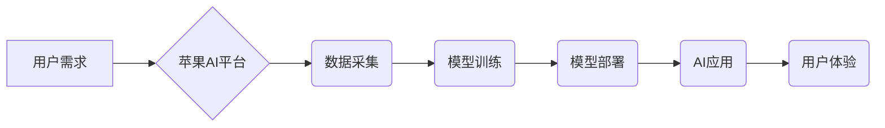

> 苹果, AI, 应用, 机遇, 发展趋势, 挑战

## 1. 背景介绍

近年来，人工智能（AI）技术取得了飞速发展，并在各个领域展现出巨大的应用潜力。从自动驾驶到医疗诊断，从语音识别到图像生成，AI正在深刻地改变着我们的生活。作为科技巨头，苹果也积极布局AI领域，并不断将AI技术融入其产品和服务中。

李开复，一位享誉全球的AI专家，在一次演讲中指出，苹果发布AI应用的机会正在到来。他认为，苹果拥有强大的硬件、软件和生态系统，以及对用户体验的极致追求，这些优势使其成为AI应用的理想平台。

## 2. 核心概念与联系

### 2.1 AI应用的本质

AI应用的核心在于利用机器学习算法，使计算机能够从数据中学习，并根据学习到的知识完成特定的任务。

### 2.2 苹果的优势

* **硬件优势:** 苹果拥有强大的芯片设计能力，其自研芯片A系列在性能和功耗方面都处于领先地位，为AI应用提供了硬件基础。
* **软件优势:** 苹果的iOS和macOS操作系统拥有完善的开发工具和生态系统，为开发者提供了便捷的AI应用开发环境。
* **生态优势:** 苹果拥有庞大的用户群体和完善的应用商店，为AI应用提供了广阔的市场空间。

### 2.3 AI应用的未来

AI技术的发展将继续推动智能设备的普及，并改变人们的生活方式。未来，AI应用将更加智能化、个性化和便捷化。

**Mermaid 流程图:**



## 3. 核心算法原理 & 具体操作步骤

### 3.1  算法原理概述

机器学习算法是AI应用的核心，其原理是通过训练模型，使模型能够从数据中学习规律，并根据学习到的规律进行预测或分类。常见的机器学习算法包括：

* **监督学习:** 利用标记数据训练模型，例如图像分类、文本识别等。
* **无监督学习:** 利用未标记数据发现数据中的潜在结构，例如聚类分析、异常检测等。
* **强化学习:** 通过奖励机制训练模型，使其在特定环境中做出最优决策，例如游戏AI、机器人控制等。

### 3.2  算法步骤详解

以监督学习为例，其基本步骤如下：

1. **数据收集和预处理:** 收集相关数据，并进行清洗、转换、特征提取等预处理工作。
2. **模型选择:** 根据任务需求选择合适的机器学习算法模型。
3. **模型训练:** 利用训练数据训练模型，调整模型参数，使其能够准确地预测或分类。
4. **模型评估:** 利用测试数据评估模型的性能，例如准确率、召回率、F1-score等。
5. **模型部署:** 将训练好的模型部署到实际应用场景中。

### 3.3  算法优缺点

不同的机器学习算法具有不同的优缺点，需要根据具体任务需求进行选择。

### 3.4  算法应用领域

机器学习算法广泛应用于各个领域，例如：

* **图像识别:** 人脸识别、物体检测、图像分类等。
* **自然语言处理:** 文本分类、情感分析、机器翻译等。
* **推荐系统:** 商品推荐、内容推荐、用户画像等。
* **医疗诊断:** 疾病预测、影像分析、药物研发等。

## 4. 数学模型和公式 & 详细讲解 & 举例说明

### 4.1  数学模型构建

机器学习算法通常基于数学模型，例如线性回归、逻辑回归、支持向量机等。这些模型通过数学公式来描述数据之间的关系，并利用这些关系进行预测或分类。

### 4.2  公式推导过程

例如，线性回归模型的数学公式如下：

$$
y = \theta_0 + \theta_1 x_1 + \theta_2 x_2 + ... + \theta_n x_n
$$

其中：

* $y$ 是预测值
* $\theta_0, \theta_1, ..., \theta_n$ 是模型参数
* $x_1, x_2, ..., x_n$ 是输入特征

通过最小化模型预测值与真实值的误差，可以求解出模型参数。

### 4.3  案例分析与讲解

例如，假设我们想要预测房屋价格，输入特征包括房屋面积、房间数量、地理位置等。我们可以使用线性回归模型来构建预测模型，并利用历史房屋交易数据进行训练。

## 5. 项目实践：代码实例和详细解释说明

### 5.1  开发环境搭建

使用Python语言开发AI应用，需要安装Python环境和相关库，例如TensorFlow、PyTorch等。

### 5.2  源代码详细实现

```python
# 导入必要的库
import tensorflow as tf

# 定义模型结构
model = tf.keras.models.Sequential([
    tf.keras.layers.Dense(64, activation='relu', input_shape=(784,)),
    tf.keras.layers.Dense(10, activation='softmax')
])

# 编译模型
model.compile(optimizer='adam',
              loss='sparse_categorical_crossentropy',
              metrics=['accuracy'])

# 训练模型
model.fit(x_train, y_train, epochs=10)

# 评估模型
loss, accuracy = model.evaluate(x_test, y_test)
print('Test loss:', loss)
print('Test accuracy:', accuracy)
```

### 5.3  代码解读与分析

这段代码实现了简单的图像分类模型，使用TensorFlow框架进行开发。

### 5.4  运行结果展示

训练完成后，可以利用测试数据评估模型的性能，例如准确率。

## 6. 实际应用场景

### 6.1  智能助手

AI技术可以用于开发智能助手，例如Siri、Alexa等，帮助用户完成各种任务，例如设置提醒、播放音乐、查询信息等。

### 6.2  个性化推荐

AI技术可以分析用户的行为数据，并根据用户的喜好推荐个性化的内容，例如商品、电影、音乐等。

### 6.3  医疗诊断

AI技术可以辅助医生进行医疗诊断，例如分析医学影像、预测疾病风险等。

### 6.4  未来应用展望

未来，AI技术将更加广泛地应用于各个领域，例如自动驾驶、机器人、教育、金融等。

## 7. 工具和资源推荐

### 7.1  学习资源推荐

* **在线课程:** Coursera、edX、Udacity等平台提供丰富的AI课程。
* **书籍:** 《深度学习》、《机器学习实战》等书籍是学习AI的基础教材。
* **开源项目:** TensorFlow、PyTorch等开源项目提供了丰富的代码示例和学习资源。

### 7.2  开发工具推荐

* **Python:** Python语言是AI开发的常用语言，拥有丰富的库和工具。
* **TensorFlow:** TensorFlow是Google开发的开源机器学习框架。
* **PyTorch:** PyTorch是Facebook开发的开源机器学习框架。

### 7.3  相关论文推荐

* **《ImageNet Classification with Deep Convolutional Neural Networks》**
* **《Attention Is All You Need》**
* **《BERT: Pre-training of Deep Bidirectional Transformers for Language Understanding》**

## 8. 总结：未来发展趋势与挑战

### 8.1  研究成果总结

近年来，AI技术取得了显著进展，例如深度学习、强化学习等领域取得了突破性进展。

### 8.2  未来发展趋势

未来，AI技术将朝着更加智能化、个性化、安全可靠的方向发展。

### 8.3  面临的挑战

AI技术的发展也面临着一些挑战，例如数据安全、算法偏见、伦理问题等。

### 8.4  研究展望

未来，需要加强对AI技术的伦理规范、安全保障和可解释性研究，推动AI技术朝着更加安全、可控、可解释的方向发展。

## 9. 附录：常见问题与解答

### 9.1  什么是机器学习？

机器学习是一种人工智能技术，通过训练模型，使计算机能够从数据中学习规律，并根据学习到的规律进行预测或分类。

### 9.2  有哪些常见的机器学习算法？

常见的机器学习算法包括监督学习、无监督学习和强化学习。

### 9.3  如何评估机器学习模型的性能？

常用的评估指标包括准确率、召回率、F1-score等。

### 9.4  AI技术有哪些应用场景？

AI技术广泛应用于各个领域，例如图像识别、自然语言处理、推荐系统、医疗诊断等。


作者：禅与计算机程序设计艺术 / Zen and the Art of Computer Programming 
<end_of_turn>