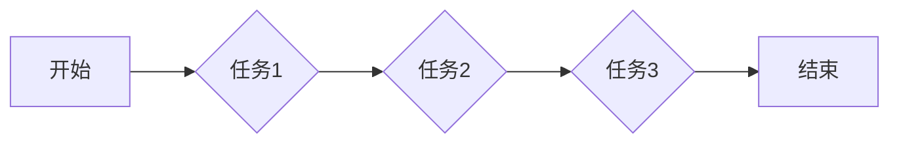

> Large Action Model, 模仿式学习, 工作流, 知识蒸馏, 强化学习, 迁移学习

## 1. 背景介绍

在人工智能领域，大型语言模型（LLM）取得了令人瞩目的成就，例如在文本生成、翻译、问答等任务上展现出强大的能力。然而，现有的LLM主要基于文本数据进行训练，难以直接处理复杂的工作流任务，例如软件开发、科学研究、商业流程等。

工作流通常涉及多个步骤、不同的任务和复杂的交互，需要模型具备更强的推理能力、规划能力和执行能力。为了解决这一问题，模仿式工作流学习方法应运而生。

模仿式工作流学习旨在通过模仿人类专家完成工作流任务的方式，训练模型学习工作流的执行策略。这种方法可以有效地利用人类的经验和知识，提高模型的效率和准确性。

## 2. 核心概念与联系

### 2.1 模仿式学习

模仿式学习是一种监督学习方法，旨在通过模仿人类专家的行为来训练模型。在工作流学习中，模仿式学习可以利用人类专家完成工作流任务的记录，例如步骤、决策、交互等，作为训练数据，训练模型学习工作流的执行策略。

### 2.2 Large Action Model (LAM)

Large Action Model (LAM) 是模仿式工作流学习中的一种模型架构，其核心特点是：

* **动作空间扩展:** LAM 将工作流任务分解成一系列的动作，每个动作对应一个具体的步骤或操作。动作空间的扩展使得模型能够学习更细粒度的策略，提高执行效率。
* **强化学习策略:** LAM 通常结合强化学习算法，例如深度Q网络 (DQN)，通过奖励机制引导模型学习最优的执行策略。

### 2.3 工作流图

工作流图是一种常用的表示工作流结构的图形模型，它将工作流任务分解成一系列的节点和边，节点代表任务或步骤，边代表任务之间的依赖关系。

**Mermaid 流程图**



## 3. 核心算法原理 & 具体操作步骤

### 3.1 算法原理概述

模仿式工作流学习的核心算法原理是基于人类专家完成工作流任务的记录，训练模型学习工作流的执行策略。

具体步骤如下：

1. **数据收集:** 收集人类专家完成工作流任务的记录，例如步骤、决策、交互等。
2. **数据预处理:** 对收集到的数据进行预处理，例如清洗、格式化、标注等。
3. **模型训练:** 使用模仿式学习算法，例如行为克隆 (Behavior Cloning) 或深度强化学习 (Deep Reinforcement Learning)，训练模型学习工作流的执行策略。
4. **模型评估:** 使用测试数据评估模型的性能，例如准确率、效率、鲁棒性等。
5. **模型部署:** 将训练好的模型部署到实际应用场景中，用于自动执行工作流任务。

### 3.2 算法步骤详解

1. **数据收集:**

* **记录类型:** 可以记录专家完成任务的步骤、决策、交互等信息。
* **数据来源:** 可以通过专家示范、日志记录、屏幕录制等方式收集数据。

2. **数据预处理:**

* **清洗:** 去除数据中的噪声、错误信息等。
* **格式化:** 将数据转换为模型可以理解的格式。
* **标注:** 为数据添加标签，例如任务类型、步骤编号、决策结果等。

3. **模型训练:**

* **行为克隆:** 使用监督学习算法，将专家行为作为训练数据，训练模型预测下一个动作。
* **深度强化学习:** 使用强化学习算法，将工作流任务定义为一个马尔可夫决策过程 (MDP)，训练模型学习最优的策略，以最大化奖励。

4. **模型评估:**

* **指标:** 可以使用准确率、效率、鲁棒性等指标评估模型的性能。
* **方法:** 可以使用测试数据进行评估，也可以使用交叉验证等方法进行评估。

5. **模型部署:**

* **环境:** 可以部署到云平台、本地服务器等环境。
* **接口:** 可以提供API接口，方便其他系统调用。

### 3.3 算法优缺点

**优点:**

* **利用人类经验:** 可以有效地利用人类专家的经验和知识，提高模型的效率和准确性。
* **可解释性:** 相比于黑盒模型，模仿式学习模型的决策过程相对可解释。
* **适应性强:** 可以根据不同的工作流任务进行调整和定制。

**缺点:**

* **数据依赖:** 需要大量的专家行为数据进行训练，数据收集和标注成本较高。
* **泛化能力:** 模型的泛化能力可能受限于训练数据，难以应对新的工作流任务。
* **效率问题:** 训练大型模型可能需要大量的计算资源和时间。

### 3.4 算法应用领域

模仿式工作流学习方法在以下领域具有广泛的应用前景：

* **软件开发:** 自动化代码生成、测试用例编写、缺陷修复等。
* **科学研究:** 自动化实验设计、数据分析、论文写作等。
* **商业流程:** 自动化审批流程、客户服务、订单处理等。
* **医疗保健:** 自动化诊断、治疗方案制定、病历记录等。

## 4. 数学模型和公式 & 详细讲解 & 举例说明

### 4.1 数学模型构建

模仿式工作流学习可以建模为一个马尔可夫决策过程 (MDP)，其中：

* **状态空间:** 工作流任务的当前状态，例如任务进度、数据输入等。
* **动作空间:** 可执行的动作，例如执行任务步骤、获取数据、做出决策等。
* **奖励函数:** 根据模型的执行策略和任务结果，给予模型奖励或惩罚。
* **转移概率:** 从一个状态到另一个状态的概率，取决于模型执行的动作。

### 4.2 公式推导过程

强化学习算法，例如深度Q网络 (DQN)，的目标是学习一个动作价值函数 $Q(s,a)$，该函数估计在状态 $s$ 执行动作 $a$ 的期望累积奖励。

DQN 使用深度神经网络来逼近动作价值函数，并通过经验回放 (Experience Replay) 和目标网络 (Target Network) 等技术来稳定训练过程。

### 4.3 案例分析与讲解

假设一个简单的工作流任务是“自动生成代码”，其中状态空间包括代码片段、输入参数等，动作空间包括添加代码行、删除代码行、修改代码等。

模型的目标是学习一个动作价值函数，能够预测在每个状态下执行每个动作的期望奖励。

通过训练，模型可以学习到哪些动作在哪些状态下更有利于生成高质量的代码。

## 5. 项目实践：代码实例和详细解释说明

### 5.1 开发环境搭建

* **操作系统:** Ubuntu 20.04
* **Python 版本:** 3.8
* **深度学习框架:** TensorFlow 2.x
* **其他依赖:** numpy, pandas, matplotlib等

### 5.2 源代码详细实现

```python
import tensorflow as tf

# 定义动作价值函数模型
class DQN(tf.keras.Model):
    def __init__(self, state_size, action_size):
        super(DQN, self).__init__()
        self.dense1 = tf.keras.layers.Dense(64, activation='relu')
        self.dense2 = tf.keras.layers.Dense(32, activation='relu')
        self.output = tf.keras.layers.Dense(action_size)

    def call(self, state):
        x = self.dense1(state)
        x = self.dense2(x)
        return self.output(x)

# 定义训练函数
def train_dqn(model, experience_replay, optimizer):
    # 从经验回放中采样数据
    batch_size = 32
    batch = experience_replay.sample(batch_size)

    # 计算损失
    with tf.GradientTape() as tape:
        states = tf.convert_to_tensor(batch['state'])
        actions = tf.convert_to_tensor(batch['action'])
        rewards = tf.convert_to_tensor(batch['reward'])
        next_states = tf.convert_to_tensor(batch['next_state'])
        target_q_values = model(next_states)
        q_values = model(states)
        target_q_values = tf.reduce_max(target_q_values, axis=1)
        loss = tf.keras.losses.mean_squared_error(target_q_values, q_values)

    # 更新模型参数
    gradients = tape.gradient(loss, model.trainable_variables)
    optimizer.apply_gradients(zip(gradients, model.trainable_variables))

# ... 其他代码 ...
```

### 5.3 代码解读与分析

* **DQN 模型:** 定义了一个深度神经网络模型，用于逼近动作价值函数。
* **训练函数:** 定义了一个训练函数，用于更新模型参数。
* **经验回放:** 使用经验回放技术，从历史数据中随机采样数据进行训练，提高训练效率和稳定性。
* **目标网络:** 使用目标网络技术，将训练模型的权重复制到目标网络中，用于计算目标Q值，避免训练过程中的震荡。

### 5.4 运行结果展示

训练完成后，可以将模型部署到实际应用场景中，例如自动生成代码、自动化测试等。

## 6. 实际应用场景

### 6.1 软件开发

* **代码生成:** 根据用户需求，自动生成代码片段，提高开发效率。
* **测试用例编写:** 自动生成测试用例，提高测试覆盖率。
* **缺陷修复:** 自动识别和修复代码缺陷，提高软件质量。

### 6.2 科学研究

* **实验设计:** 自动设计实验方案，提高实验效率。
* **数据分析:** 自动分析实验数据，发现隐藏规律。
* **论文写作:** 自动生成论文草稿，提高科研效率。

### 6.3 商业流程

* **审批流程:** 自动化审批流程，提高审批效率。
* **客户服务:** 自动化客户服务，提高客户满意度。
* **订单处理:** 自动化订单处理，提高运营效率。

### 6.4 未来应用展望

随着人工智能技术的不断发展，模仿式工作流学习方法将在更多领域得到应用，例如医疗保健、教育、金融等。

## 7. 工具和资源推荐

### 7.1 学习资源推荐

* **书籍:**
    * Reinforcement Learning: An Introduction by Sutton and Barto
    * Deep Learning by Goodfellow, Bengio, and Courville
* **在线课程:**
    * Deep Reinforcement Learning Specialization by DeepLearning.AI
    * Reinforcement Learning by David Silver

### 7.2 开发工具推荐

* **深度学习框架:** TensorFlow, PyTorch
* **强化学习库:** Stable Baselines3, Dopamine
* **工作流管理工具:** Apache Airflow, Prefect

### 7.3 相关论文推荐

* Imitation Learning with Deep Reinforcement Learning
* Learning to Execute Tasks from Demonstrations
* Deep Reinforcement Learning for Robotics

## 8. 总结：未来发展趋势与挑战

### 8.1 研究成果总结

模仿式工作流学习方法取得了显著的进展，能够有效地学习人类专家完成工作流任务的策略。

### 8.2 未来发展趋势

* **模型架构:** 研究更强大的模型架构，例如Transformer、Graph Neural Networks等，提高模型的学习能力和泛化能力。
* **数据增强:** 研究数据增强技术，例如合成数据、迁移学习等，缓解数据稀缺问题。
* **安全性和可靠性:** 研究提高模型安全性和可靠性的方法，例如对抗训练、鲁棒性学习等。

### 8.3 面临的挑战

* **数据收集和标注:** 收集高质量的专家行为数据成本高昂。
* **泛化能力:** 模型的泛化