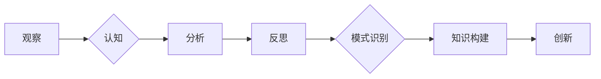

> 洞察力，观察，反思，模式识别，知识构建，创新，人工智能，机器学习

## 1. 背景介绍

在瞬息万变的科技时代，洞察力已成为至关重要的竞争优势。无论是企业决策、产品创新还是技术突破，都离不开对复杂现象的深刻理解和前瞻性预判。然而，洞察力并非天生的天赋，而是通过不断观察、思考和反思逐步积累的宝贵财富。

人工智能的兴起为洞察力的提升提供了强大的工具和平台。机器学习算法能够从海量数据中识别出隐藏的模式和趋势，为人类提供更全面、更精准的洞察。然而，人工智能仅仅是工具，真正的洞察力来自于人类的思考和判断。

## 2. 核心概念与联系

洞察力的形成是一个复杂的过程，涉及到观察、认知、分析和反思等多个环节。

**2.1 观察：**

观察是洞察力的起点，也是最基础的环节。通过敏锐的观察，我们可以捕捉到周围世界中微小的变化和细节，并将其记录下来。

**2.2 认知：**

观察到的信息需要经过认知和理解才能转化为有价值的洞察。认知的过程涉及到知识的提取、归纳和联想，需要我们对所观察到的现象进行分类、比较和分析。

**2.3 分析：**

分析是将观察到的信息和已有的知识进行整合，以发现其中的规律和联系。分析的过程需要我们运用逻辑思维、批判性思维和创造性思维，从不同的角度去思考问题，寻找问题的根源和解决办法。

**2.4 反思：**

反思是洞察力的关键环节，也是提升洞察力的重要途径。通过反思，我们可以对自己的观察、认知和分析进行回顾和总结，发现自己的不足之处，并不断改进自己的思维方式和方法。

**2.5 模式识别：**

模式识别是洞察力的核心能力之一。通过观察和分析，我们可以识别出隐藏在数据和现象背后的模式和规律。模式识别能够帮助我们预测未来的趋势，并做出更明智的决策。

**2.6 知识构建：**

洞察力是知识的产物，也是知识的延伸。通过观察、分析和反思，我们可以不断积累新的知识，并将其与已有的知识进行整合，构建更加完整的知识体系。

**2.7 创新：**

洞察力是创新的源泉。通过对现象的深入理解和思考，我们可以发现新的问题、新的机会和新的解决方案。

**Mermaid 流程图：**



## 3. 核心算法原理 & 具体操作步骤

### 3.1  算法原理概述

**3.1.1  机器学习算法：**

机器学习算法能够从数据中学习，并根据学习到的知识进行预测或分类。常见的机器学习算法包括：

* **监督学习：** 利用标记数据训练模型，例如分类和回归问题。
* **无监督学习：** 从未标记数据中发现模式，例如聚类和降维。
* **强化学习：** 通过试错学习，在环境中获得最大奖励。

**3.1.2  深度学习算法：**

深度学习算法是一种更高级的机器学习算法，它使用多层神经网络来模拟人类大脑的学习过程。深度学习算法在图像识别、自然语言处理等领域取得了突破性的进展。

### 3.2  算法步骤详解

**3.2.1  数据收集和预处理：**

收集相关数据并进行预处理，例如清洗、转换和特征工程。

**3.2.2  模型选择和训练：**

根据具体问题选择合适的机器学习算法，并使用训练数据训练模型。

**3.2.3  模型评估和调参：**

使用测试数据评估模型的性能，并根据评估结果进行模型调参。

**3.2.4  模型部署和应用：**

将训练好的模型部署到实际应用场景中，并进行监控和维护。

### 3.3  算法优缺点

**3.3.1  优点：**

* 自动化学习：无需人工编程，算法能够自动从数据中学习。
* 高精度：机器学习算法能够达到很高的预测精度。
* 可扩展性：机器学习算法能够处理海量数据。

**3.3.2  缺点：**

* 数据依赖：机器学习算法需要大量的数据进行训练。
* 黑盒效应：一些机器学习算法的决策过程难以解释。
* 算法偏差：机器学习算法可能存在算法偏差，导致预测结果不准确。

### 3.4  算法应用领域

机器学习算法广泛应用于各个领域，例如：

* **图像识别：** 人脸识别、物体检测、图像分类。
* **自然语言处理：** 文本分类、机器翻译、语音识别。
* **推荐系统：** 产品推荐、内容推荐、用户画像。
* **金融领域：** 风险评估、欺诈检测、投资预测。
* **医疗领域：** 疾病诊断、药物研发、患者管理。

## 4. 数学模型和公式 & 详细讲解 & 举例说明

### 4.1  数学模型构建

**4.1.1  线性回归模型：**

线性回归模型是一种用于预测连续变量的机器学习算法。其数学模型如下：

$$
y = \theta_0 + \theta_1 x_1 + \theta_2 x_2 + ... + \theta_n x_n + \epsilon
$$

其中：

* $y$ 是预测变量。
* $\theta_0, \theta_1, ..., \theta_n$ 是模型参数。
* $x_1, x_2, ..., x_n$ 是输入特征。
* $\epsilon$ 是误差项。

**4.1.2  逻辑回归模型：**

逻辑回归模型是一种用于预测分类变量的机器学习算法。其数学模型如下：

$$
p(y=1|x) = \frac{1}{1 + e^{-( \theta_0 + \theta_1 x_1 + \theta_2 x_2 + ... + \theta_n x_n)}}
$$

其中：

* $p(y=1|x)$ 是预测类别为1的概率。
* $\theta_0, \theta_1, ..., \theta_n$ 是模型参数。
* $x_1, x_2, ..., x_n$ 是输入特征。

### 4.2  公式推导过程

**4.2.1  线性回归模型参数估计：**

可以使用最小二乘法估计线性回归模型的参数。最小二乘法的目标是找到参数值，使得模型预测值与实际值之间的误差平方和最小。

**4.2.2  逻辑回归模型参数估计：**

可以使用最大似然估计法估计逻辑回归模型的参数。最大似然估计法的目标是找到参数值，使得模型能够最大化观测数据的似然概率。

### 4.3  案例分析与讲解

**4.3.1  线性回归模型案例：**

假设我们想要预测房屋价格，输入特征包括房屋面积、房间数量、地理位置等。我们可以使用线性回归模型来建立房屋价格预测模型。

**4.3.2  逻辑回归模型案例：**

假设我们想要预测客户是否会购买产品，输入特征包括客户年龄、收入、购买历史等。我们可以使用逻辑回归模型来建立客户购买预测模型。

## 5. 项目实践：代码实例和详细解释说明

### 5.1  开发环境搭建

* **操作系统：** Linux/macOS/Windows
* **编程语言：** Python
* **机器学习库：** scikit-learn, TensorFlow, PyTorch

### 5.2  源代码详细实现

```python
# 线性回归模型示例

from sklearn.linear_model import LinearRegression
from sklearn.model_selection import train_test_split
from sklearn.metrics import mean_squared_error

# 数据加载和预处理
# ...

# 数据分割
X_train, X_test, y_train, y_test = train_test_split(X, y, test_size=0.2)

# 模型训练
model = LinearRegression()
model.fit(X_train, y_train)

# 模型预测
y_pred = model.predict(X_test)

# 模型评估
mse = mean_squared_error(y_test, y_pred)
print(f"Mean Squared Error: {mse}")

# ...
```

### 5.3  代码解读与分析

* **数据加载和预处理：** 首先需要加载数据并进行预处理，例如清洗、转换和特征工程。
* **数据分割：** 将数据分为训练集和测试集，用于模型训练和评估。
* **模型训练：** 使用训练集训练线性回归模型。
* **模型预测：** 使用训练好的模型对测试集进行预测。
* **模型评估：** 使用测试集评估模型的性能，例如使用均方误差 (MSE) 作为评价指标。

### 5.4  运行结果展示

运行代码后，会输出模型的均方误差值，用于评估模型的预测精度。

## 6. 实际应用场景

### 6.1  金融领域：

* **风险评估：** 使用机器学习算法评估客户的信用风险，帮助银行和金融机构做出更明智的贷款决策。
* **欺诈检测：** 使用机器学习算法识别异常交易行为，帮助金融机构预防和打击欺诈活动。
* **投资预测：** 使用机器学习算法分析市场数据，预测股票价格走势，帮助投资者做出更明智的投资决策。

### 6.2  医疗领域：

* **疾病诊断：** 使用机器学习算法分析患者的医疗影像和病历数据，辅助医生诊断疾病。
* **药物研发：** 使用机器学习算法分析药物分子结构和生物活性数据，加速药物研发过程。
* **患者管理：** 使用机器学习算法分析患者的健康数据，预测患者的健康风险，并提供个性化的健康建议。

### 6.3  其他领域：

* **电商推荐：** 使用机器学习算法分析用户的购买历史和浏览记录，推荐个性化的商品。
* **搜索引擎优化：** 使用机器学习算法分析搜索引擎的排名算法，帮助网站提高搜索排名。
* **自动驾驶：** 使用机器学习算法分析车辆周围环境数据，帮助车辆自动驾驶。

### 6.4  未来应用展望

随着人工智能技术的不断发展，机器学习算法将在更多领域得到应用，为人类社会带来更多便利和福祉。

## 7. 工具和资源推荐

### 7.1  学习资源推荐

* **在线课程：** Coursera, edX, Udacity
* **书籍：**
    * 《机器学习》 - 周志华
    * 《深度学习》 - Ian Goodfellow
* **博客和网站：**
    * Towards Data Science
    * Machine Learning Mastery

### 7.2  开发工具推荐

* **Python：** 
* **Jupyter Notebook：** 用于代码编写和可视化
* **Scikit-learn：** 机器学习库
* **TensorFlow/PyTorch：** 深度学习库

### 7.3  相关论文推荐

* **《ImageNet Classification with Deep Convolutional Neural Networks》** - Alex Krizhevsky, Ilya Sutskever, Geoffrey E. Hinton
* **《Attention Is All You Need》** - Ashish Vaswani, Noam Shazeer, Niki Parmar, Jakob Uszkoreit, Llion Jones, Aidan N. Gomez, Łukasz Kaiser, Illia Polosukhin

## 8. 总结：未来发展趋势与挑战

### 8.1  研究成果总结

近年来，人工智能领域取得了长足的进步，机器学习算法在各个领域取得了突破性的应用。

### 8.2  未来发展趋势

* **模型更加强大：** 模型规模将继续扩大，算法更加复杂，能够处理更复杂的任务。
* **数据更加丰富：** 数据收集和处理技术将更加成熟，数据质量和数量将得到提升。
* **应用更加广泛