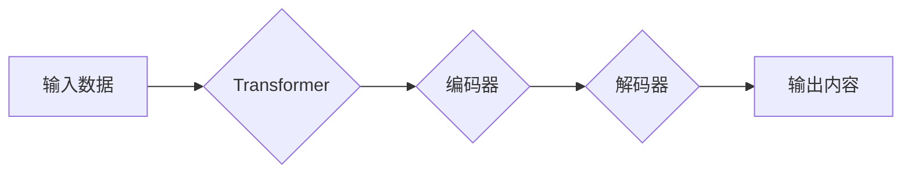

> 生成式AI, 
> 大语言模型, 
> Transformer, 
> 潜在风险, 
> 伦理问题, 
> 未来发展

## 1. 背景介绍

近年来，人工智能（AI）领域取得了令人瞩目的进展，其中生成式AI作为一类新兴技术，展现出强大的潜力，引发了广泛的关注和讨论。生成式AI是指能够根据输入数据生成新内容的AI模型，例如文本、图像、音频、视频等。

与传统的AI模型相比，生成式AI更注重创造性和表达能力，能够生成具有原创性和艺术性的作品。这使得生成式AI在各个领域都拥有广阔的应用前景，例如：

* **内容创作:** 自动生成新闻报道、小说、诗歌、剧本等，提高创作效率，激发创作灵感。
* **艺术设计:** 生成绘画、音乐、视频等艺术作品，为艺术家提供新的创作工具和灵感来源。
* **教育培训:** 个性化定制学习内容，提供智能化的辅导和答疑服务。
* **科学研究:** 辅助科学家进行数据分析、模型构建、实验设计等，加速科研进度。

然而，生成式AI的快速发展也带来了潜在的风险和挑战，例如：

* **信息虚假和误导:** 生成式AI可以生成高度逼真的虚假信息，可能被用于传播谣言、制造假新闻，造成社会混乱。
* **版权和知识产权问题:** 生成式AI生成的內容是否属于原创，如何界定版权归属，这些问题尚待解决。
* **伦理道德问题:** 生成式AI可能被用于制作深度伪造视频、音频等，侵犯个人隐私，损害社会公信力。

因此，理性看待生成式AI的机遇与风险，制定相应的规范和政策，引导其健康发展至关重要。

## 2. 核心概念与联系

### 2.1 生成式AI

生成式AI是指能够根据输入数据生成新内容的AI模型。它与传统的AI模型不同，传统的AI模型主要用于分类、预测等任务，而生成式AI则更注重创造性和表达能力。

### 2.2 大语言模型 (LLM)

大语言模型 (LLM) 是生成式AI的一种重要类型，它通过训练大量的文本数据，学习语言的语法、语义和上下文关系，能够理解和生成人类语言。

### 2.3 Transformer

Transformer是一种深度学习架构，它在处理序列数据方面表现出色，是构建大语言模型的基础。Transformer的核心是注意力机制，它能够捕捉文本中不同词语之间的关系，提高模型的理解和生成能力。

**Mermaid 流程图**



## 3. 核心算法原理 & 具体操作步骤

### 3.1 算法原理概述

生成式AI的核心算法原理是基于深度学习，特别是Transformer架构。通过训练大量的文本数据，模型能够学习语言的规律和模式，并生成新的文本内容。

具体来说，生成式AI模型通常包含以下几个部分：

* **编码器:** 将输入文本转换为向量表示，捕捉文本的语义信息。
* **解码器:** 根据编码器的输出，生成新的文本内容。
* **注意力机制:** 帮助模型关注文本中重要的信息，提高生成质量。

### 3.2 算法步骤详解

1. **数据预处理:** 将文本数据进行清洗、分词、标记等预处理操作，使其适合模型训练。
2. **模型训练:** 使用训练数据训练生成式AI模型，调整模型参数，使其能够生成高质量的文本内容。
3. **模型评估:** 使用测试数据评估模型的性能，例如准确率、流畅度、多样性等。
4. **模型部署:** 将训练好的模型部署到实际应用场景中，例如聊天机器人、文本生成工具等。

### 3.3 算法优缺点

**优点:**

* **生成高质量的文本内容:** 生成式AI模型能够生成具有原创性和艺术性的文本内容。
* **自动化内容创作:** 可以自动化完成内容创作任务，提高效率。
* **个性化定制:** 可以根据用户的需求生成个性化的内容。

**缺点:**

* **训练数据依赖:** 生成式AI模型的性能依赖于训练数据的质量和数量。
* **潜在的偏见:** 训练数据可能包含偏见，导致模型生成的文本内容也存在偏见。
* **解释性差:** 生成式AI模型的决策过程难以解释，难以理解模型是如何生成文本内容的。

### 3.4 算法应用领域

* **内容创作:** 自动生成新闻报道、小说、诗歌、剧本等。
* **艺术设计:** 生成绘画、音乐、视频等艺术作品。
* **教育培训:** 个性化定制学习内容，提供智能化的辅导和答疑服务。
* **科学研究:** 辅助科学家进行数据分析、模型构建、实验设计等。

## 4. 数学模型和公式 & 详细讲解 & 举例说明

### 4.1 数学模型构建

生成式AI模型通常基于概率模型，例如条件概率分布。目标是学习一个概率分布，能够从输入数据中生成新的数据。

例如，对于文本生成任务，我们可以使用条件概率分布 $P(w_t | w_{1:t-1})$ 来表示第 $t$ 个词的生成概率，其中 $w_{1:t-1}$ 是前 $t-1$ 个词的序列。

### 4.2 公式推导过程

Transformer模型中使用的注意力机制可以表示为以下公式：

$$
Attention(Q, K, V) = softmax(\frac{QK^T}{\sqrt{d_k}})V
$$

其中：

* $Q$, $K$, $V$ 分别是查询矩阵、键矩阵和值矩阵。
* $d_k$ 是键向量的维度。
* $softmax$ 函数将注意力权重归一化到 [0, 1] 之间。

### 4.3 案例分析与讲解

假设我们有一个句子 "The cat sat on the mat"，我们想要预测下一个词。

使用注意力机制，模型可以计算每个词与目标词之间的注意力权重，并根据权重加权求和，得到目标词的生成概率。

例如，模型可能会将 "sat" 和 "on" 两个词的注意力权重分配得更高，因为它们与目标词 "mat" 相关性更高。

## 5. 项目实践：代码实例和详细解释说明

### 5.1 开发环境搭建

* Python 3.7+
* TensorFlow 或 PyTorch 深度学习框架
* CUDA 和 cuDNN (可选，用于GPU加速)

### 5.2 源代码详细实现

```python
# 使用 TensorFlow 实现简单的文本生成模型

import tensorflow as tf

# 定义模型结构
model = tf.keras.Sequential([
    tf.keras.layers.Embedding(input_dim=vocab_size, output_dim=embedding_dim),
    tf.keras.layers.LSTM(units=lstm_units),
    tf.keras.layers.Dense(units=vocab_size, activation='softmax')
])

# 编译模型
model.compile(optimizer='adam', loss='sparse_categorical_crossentropy', metrics=['accuracy'])

# 训练模型
model.fit(x_train, y_train, epochs=epochs)

# 生成文本
def generate_text(seed_text, num_words):
    for _ in range(num_words):
        # 使用模型预测下一个词
        predictions = model.predict(seed_text)
        # 选择概率最高的词
        predicted_word = tf.math.argmax(predictions).numpy()
        # 添加预测的词到seed_text
        seed_text = tf.concat([seed_text, tf.expand_dims(predicted_word, axis=0)], axis=0)
    return seed_text.numpy().decode('utf-8')

# 生成文本示例
seed_text = tf.constant(['The'])
generated_text = generate_text(seed_text, num_words=10)
print(generated_text)
```

### 5.3 代码解读与分析

* 代码首先定义了一个简单的文本生成模型，使用 Embedding 层将词向量化，LSTM 层捕捉文本序列的上下文信息，Dense 层输出每个词的概率分布。
* 然后，代码编译模型，使用 Adam 优化器和交叉熵损失函数进行训练。
* 最后，代码定义了一个 `generate_text` 函数，使用训练好的模型生成文本。

### 5.4 运行结果展示

运行代码后，会输出一个基于给定种子文本的生成的文本序列。例如，如果种子文本是 "The cat"，生成的文本序列可能为 "The cat sat on the mat"。

## 6. 实际应用场景

### 6.1 内容创作

* **新闻报道:** 自动生成新闻报道的摘要、标题、正文等。
* **小说创作:** 根据用户提供的主题、人物、情节等信息，自动生成小说故事。
* **诗歌创作:** 根据用户提供的主题、风格、韵律等信息，自动生成诗歌作品。

### 6.2 艺术设计

* **绘画生成:** 根据用户提供的文字描述、风格、颜色等信息，自动生成绘画作品。
* **音乐生成:** 根据用户提供的旋律、节奏、风格等信息，自动生成音乐作品。
* **视频生成:** 根据用户提供的场景、人物、情节等信息，自动生成视频作品。

### 6.3 教育培训

* **个性化学习:** 根据学生的学习进度、知识点掌握情况，自动生成个性化的学习内容。
* **智能辅导:** 提供智能化的辅导和答疑服务，帮助学生解决学习难题。
* **虚拟助手:** 为学生提供虚拟的学习伙伴，帮助他们进行学习交流和互动。

### 6.4 未来应用展望

* **更逼真的虚拟现实和增强现实体验:** 生成式AI可以生成更逼真的虚拟场景和虚拟人物，为用户提供更沉浸式的体验。
* **个性化医疗服务:** 生成式AI可以根据患者的病史、基因信息等数据，生成个性化的治疗方案。
* **智能客服:** 生成式AI可以为用户提供更智能、更自然的客服服务，提高用户体验。

## 7. 工具和资源推荐

### 7.1 学习资源推荐

* **书籍:**
    * 《深度学习》 by Ian Goodfellow, Yoshua Bengio, Aaron Courville
    * 《自然语言处理》 by Dan Jurafsky, James H. Martin
* **在线课程:**
    * Coursera: Deep Learning Specialization
    * Udacity: Natural Language Processing Nanodegree
* **博客和网站:**
    * TensorFlow Blog: https://blog.tensorflow.org/
    * PyTorch Blog: https://pytorch.org/blog/

### 7.2 开发工具推荐

* **TensorFlow:** https://www.tensorflow.org/
* **PyTorch:** https://pytorch.org/
* **Hugging Face Transformers:** https://huggingface.co/transformers/

### 7.3 相关论文推荐

* **Attention Is All You Need:** https://arxiv.org/abs/1706.03762
* **BERT: Pre-training of Deep Bidirectional Transformers for Language Understanding:** https://arxiv.org/abs/1810.04805
* **GPT-3: Language Models are Few-Shot Learners:** https://arxiv.org/abs/2005.14165

## 8. 总结：未来发展趋势与挑战

### 8.1 研究成果总结

近年来，生成式AI取得了显著进展，例如大语言模型的出现，使得文本生成、翻译、摘要等任务取得了突破性进展。

### 8.2 未来发展趋势

* **模型规模和能力的提升:** 未来，生成式AI模型的规模和能力将会进一步提升，能够生成更复杂、更逼真的内容。
* **多模态生成:** 生成式AI将能够处理多种模态数据，例如文本、图像、音频、视频等，实现跨模态的生成任务。
* **个性化定制:** 生成式AI将更加注重个性化定制，能够根据用户的需求生成个性化的内容。

### 8.3 面临的挑战

*