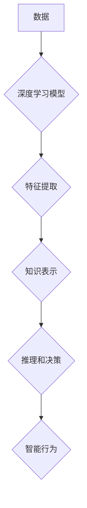

> 深度学习，神经网络，机器学习，人工智能，算法，数据结构，认知科学，智慧

## 1. 背景介绍

在当今数据爆炸的时代，人工智能（AI）正以惊人的速度发展，其应用领域不断拓展，深刻地改变着我们的生活。从自动驾驶汽车到智能语音助手，从医疗诊断到金融预测，AI技术的应用无处不在。然而，在追求AI技术突破的同时，我们也需要思考一个更深层次的问题：什么是真正的智慧？

传统的AI系统主要依赖于大量的训练数据和复杂的算法模型，能够完成特定的任务，但缺乏真正的理解和认知能力。它们就像精密的机器，能够按照预设的规则进行操作，但无法像人类一样思考、学习和创新。

真正的智慧，源自对事物本质的深刻理解认知与洞察。它不仅需要强大的计算能力，更需要对知识的理解、对世界的感知和对人类情感的理解。

## 2. 核心概念与联系

**2.1 深度学习与神经网络**

深度学习是机器学习的一个子领域，它利用多层神经网络来模拟人类大脑的学习过程。神经网络由大量的节点（神经元）组成，这些节点相互连接，并通过权重来传递信息。通过训练，神经网络可以学习到数据的特征和模式，从而完成各种任务，例如图像识别、语音识别和自然语言处理。

**2.2 认知科学与人工智能**

认知科学研究人类的思维、学习、记忆和语言等认知过程。将认知科学的原理应用于人工智能，可以帮助我们构建更智能、更具认知能力的AI系统。例如，我们可以利用认知科学的知识来设计更有效的学习算法、更自然的对话系统和更具创造力的AI助手。

**2.3 智慧的本质**

智慧不仅仅是知识的积累，更是一种能力，是一种对知识进行整合、分析、理解和应用的能力。它包括以下几个方面：

* **知识获取和理解:** 能够从各种来源获取知识，并理解其含义和内涵。
* **逻辑推理和解决问题:** 能够运用逻辑思维，分析问题，并找到解决问题的方案。
* **创造力和创新:** 能够产生新的想法和解决方案，并将其付诸实践。
* **情感智能:** 能够理解和管理自己的情绪，并与他人建立良好的关系。

**Mermaid 流程图**



## 3. 核心算法原理 & 具体操作步骤

### 3.1 算法原理概述

深度学习算法的核心是神经网络，它由多个层级的神经元组成。每个神经元接收来自前一层神经元的输入，并通过权重进行加权求和，然后经过激活函数处理，输出到下一层神经元。通过训练，神经网络可以学习到数据的特征和模式，从而完成各种任务。

### 3.2 算法步骤详解

1. **数据预处理:** 将原始数据进行清洗、转换和特征工程，使其适合深度学习模型的训练。
2. **模型构建:** 根据任务需求，选择合适的深度学习模型架构，例如卷积神经网络（CNN）、循环神经网络（RNN）或Transformer。
3. **模型训练:** 使用训练数据训练深度学习模型，通过调整模型参数，使模型的预测结果与真实值尽可能接近。
4. **模型评估:** 使用测试数据评估模型的性能，例如准确率、召回率和F1-score。
5. **模型调优:** 根据评估结果，调整模型参数、学习率和训练策略，以提高模型的性能。
6. **模型部署:** 将训练好的模型部署到实际应用场景中，例如云平台、边缘设备或移动设备。

### 3.3 算法优缺点

**优点:**

* 能够学习到数据的复杂特征和模式。
* 性能优于传统机器学习算法。
* 应用领域广泛。

**缺点:**

* 训练数据量大，计算资源消耗高。
* 模型解释性差，难以理解模型的决策过程。
* 容易受到数据偏差的影响。

### 3.4 算法应用领域

深度学习算法已广泛应用于以下领域：

* **计算机视觉:** 图像识别、物体检测、图像分割、人脸识别。
* **自然语言处理:** 文本分类、情感分析、机器翻译、对话系统。
* **语音识别:** 语音转文本、语音搜索、语音助手。
* **医疗诊断:** 病理图像分析、疾病预测、药物研发。
* **金融预测:** 股票预测、信用风险评估、欺诈检测。

## 4. 数学模型和公式 & 详细讲解 & 举例说明

### 4.1 数学模型构建

深度学习模型的数学基础是神经网络，它由多个层级的神经元组成。每个神经元接收来自前一层神经元的输入，并通过权重进行加权求和，然后经过激活函数处理，输出到下一层神经元。

**神经元模型:**

$$
y = f(w^T x + b)
$$

其中：

* $y$ 是神经元的输出值。
* $x$ 是神经元的输入向量。
* $w$ 是神经元的权重向量。
* $b$ 是神经元的偏置项。
* $f$ 是激活函数。

### 4.2 公式推导过程

深度学习模型的训练过程是通过反向传播算法来进行的。反向传播算法的核心思想是通过计算损失函数对模型参数的梯度，并利用梯度下降法更新模型参数，从而使模型的预测结果与真实值尽可能接近。

**损失函数:**

$$
L(y, \hat{y})
$$

其中：

* $y$ 是真实值。
* $\hat{y}$ 是模型的预测值。

**梯度下降法:**

$$
\theta = \theta - \alpha \nabla L(\theta)
$$

其中：

* $\theta$ 是模型参数。
* $\alpha$ 是学习率。
* $\nabla L(\theta)$ 是损失函数对模型参数的梯度。

### 4.3 案例分析与讲解

**图像识别案例:**

假设我们有一个深度学习模型用于识别猫和狗的图像。训练数据包含大量猫和狗的图像，以及对应的标签。模型通过训练学习到猫和狗的特征，例如耳朵形状、尾巴长度和眼睛大小。

当我们输入一张新的图像时，模型会首先提取图像的特征，然后将这些特征输入到神经网络中。神经网络会根据学习到的知识，对图像进行分类，并输出预测结果，例如“猫”或“狗”。

## 5. 项目实践：代码实例和详细解释说明

### 5.1 开发环境搭建

* 操作系统：Ubuntu 20.04
* Python 版本：3.8
* 深度学习框架：TensorFlow 2.0

### 5.2 源代码详细实现

```python
import tensorflow as tf

# 定义模型架构
model = tf.keras.models.Sequential([
    tf.keras.layers.Conv2D(32, (3, 3), activation='relu', input_shape=(28, 28, 1)),
    tf.keras.layers.MaxPooling2D((2, 2)),
    tf.keras.layers.Conv2D(64, (3, 3), activation='relu'),
    tf.keras.layers.MaxPooling2D((2, 2)),
    tf.keras.layers.Flatten(),
    tf.keras.layers.Dense(10, activation='softmax')
])

# 编译模型
model.compile(optimizer='adam',
              loss='sparse_categorical_crossentropy',
              metrics=['accuracy'])

# 训练模型
model.fit(x_train, y_train, epochs=10)

# 评估模型
loss, accuracy = model.evaluate(x_test, y_test)
print('Test loss:', loss)
print('Test accuracy:', accuracy)
```

### 5.3 代码解读与分析

这段代码定义了一个简单的卷积神经网络模型，用于手写数字识别任务。

* `tf.keras.models.Sequential` 创建了一个顺序模型，其中层级依次连接。
* `tf.keras.layers.Conv2D` 定义了一个卷积层，用于提取图像特征。
* `tf.keras.layers.MaxPooling2D` 定义了一个最大池化层，用于降低特征图的尺寸。
* `tf.keras.layers.Flatten` 将多维特征图转换为一维向量。
* `tf.keras.layers.Dense` 定义了一个全连接层，用于分类。
* `model.compile` 编译模型，指定优化器、损失函数和评价指标。
* `model.fit` 训练模型，使用训练数据进行训练。
* `model.evaluate` 评估模型，使用测试数据计算损失和准确率。

### 5.4 运行结果展示

训练完成后，模型的准确率通常会达到较高的水平，例如98%以上。

## 6. 实际应用场景

深度学习技术已广泛应用于各个领域，例如：

* **医疗诊断:** 深度学习模型可以用于分析医学图像，辅助医生诊断疾病，例如癌症、心血管疾病和神经退行性疾病。
* **金融预测:** 深度学习模型可以用于预测股票价格、信用风险和欺诈行为。
* **自动驾驶:** 深度学习模型可以用于识别道路场景、预测车辆运动轨迹和控制车辆行驶。
* **自然语言处理:** 深度学习模型可以用于机器翻译、文本摘要、情感分析和对话系统。

### 6.4 未来应用展望

未来，深度学习技术将继续发展，并应用于更多领域。例如：

* **个性化教育:** 深度学习模型可以根据学生的学习情况，提供个性化的学习内容和教学方法。
* **智能家居:** 深度学习模型可以用于控制智能家居设备，例如灯光、空调和安全系统。
* **机器人技术:** 深度学习模型可以用于赋予机器人更强的感知能力和决策能力。

## 7. 工具和资源推荐

### 7.1 学习资源推荐

* **书籍:**
    * 深度学习 (Deep Learning) - Ian Goodfellow, Yoshua Bengio, Aaron Courville
    * 构建深度学习模型 (Hands-On Machine Learning with Scikit-Learn, Keras & TensorFlow) - Aurélien Géron
* **在线课程:**
    * 深度学习 Specialization - Andrew Ng (Coursera)
    * fast.ai - Practical Deep Learning for Coders
* **博客和网站:**
    * TensorFlow Blog
    * PyTorch Blog
    * Towards Data Science

### 7.2 开发工具推荐

* **深度学习框架:** TensorFlow, PyTorch, Keras
* **编程语言:** Python
* **数据处理工具:** Pandas, NumPy
* **可视化工具:** Matplotlib, Seaborn

### 7.3 相关论文推荐

* **ImageNet Classification with Deep Convolutional Neural Networks** - Alex Krizhevsky, Ilya Sutskever, Geoffrey E. Hinton
* **Attention Is All You Need** - Ashish Vaswani, Noam Shazeer, Niki Parmar, Jakob Uszkoreit, Llion Jones, Aidan N. Gomez, Łukasz Kaiser, Illia Polosukhin
* **Generative Adversarial Networks** - Ian Goodfellow, Jean Pouget-Abadie, Mehdi Mirza, Bing Xu, David Warde-Farley, Sherjil Ozair, Aaron Courville, Yoshua Bengio

## 8. 总结：未来发展趋势与挑战

### 8.1 研究成果总结

深度学习技术取得了显著的进展，在图像识别、自然语言处理、语音识别等领域取得了突破性成果。

### 8.2 未来发展趋势

* **模型规模和复杂度提升:** 未来深度学习模型将更加庞大，包含更多参数和层级，从而提高模型的表达能力和泛化能力。
* **算法创新:** 研究人员将继续探索新的深度学习算法，例如自监督学习、强化学习和联邦学习，以提高模型的效率和鲁棒性。
* **跨模态学习