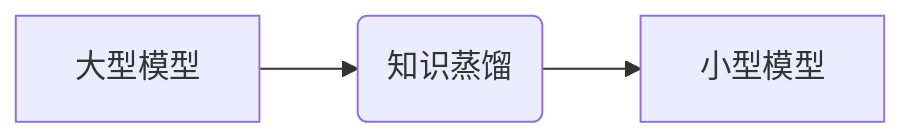

> 知识蒸馏，大模型，小模型，泛化能力，迁移学习，模型压缩

## 1. 背景介绍

随着深度学习技术的蓬勃发展，大型神经网络模型在图像识别、自然语言处理等领域取得了令人瞩目的成就。然而，这些模型通常具有参数量庞大、计算资源需求高、部署成本高等缺点，限制了其在资源有限的设备和场景中的应用。

知识蒸馏（Knowledge Distillation）是一种模型压缩技术，旨在将大型模型的知识“蒸馏”到小型模型中，从而获得性能优异且资源高效的模型。

## 2. 核心概念与联系

知识蒸馏的核心思想是，将大型模型的知识（例如特征表示、决策边界等）传递给小型模型。

**知识蒸馏的流程图：**



**知识蒸馏的联系：**

* **迁移学习:** 知识蒸馏可以看作是一种迁移学习的范式，将大型模型的预训练知识迁移到小型模型中。
* **模型压缩:** 知识蒸馏是一种有效的模型压缩技术，可以显著减少模型参数量和计算复杂度。
* **泛化能力:** 通过知识蒸馏，小型模型可以继承大型模型的泛化能力，在新的数据上表现更优。

## 3. 核心算法原理 & 具体操作步骤

### 3.1  算法原理概述

知识蒸馏的核心算法是利用软标签（Soft Targets）进行训练。

* **硬标签:** 传统机器学习模型使用硬标签进行训练，即每个样本只有一个确定的类别标签。
* **软标签:** 知识蒸馏使用大型模型的输出概率分布作为软标签，即每个样本有多个类别标签的概率分布。

通过最小化小型模型的输出概率分布与大型模型软标签之间的距离，可以将大型模型的知识“蒸馏”到小型模型中。

### 3.2  算法步骤详解

1. **预训练大型模型:** 使用大量数据预训练一个大型模型，使其获得丰富的知识和特征表示能力。
2. **生成软标签:** 使用预训练的大型模型对训练数据进行预测，获取每个样本的概率分布作为软标签。
3. **训练小型模型:** 使用软标签训练小型模型，最小化小型模型的输出概率分布与大型模型软标签之间的距离。
4. **评估模型性能:** 使用测试数据评估小型模型的性能，并与大型模型进行比较。

### 3.3  算法优缺点

**优点:**

* **模型压缩:** 可以显著减少模型参数量和计算复杂度。
* **泛化能力提升:** 小型模型可以继承大型模型的泛化能力，在新的数据上表现更优。
* **部署效率高:** 小型模型更容易部署在资源有限的设备上。

**缺点:**

* **训练时间长:** 训练小型模型需要使用大量的软标签，训练时间相对较长。
* **性能差异:** 小型模型的性能可能无法完全达到大型模型的水平。

### 3.4  算法应用领域

知识蒸馏在图像识别、自然语言处理、语音识别等领域都有广泛的应用。

* **图像识别:** 将大型图像识别模型的知识蒸馏到小型模型中，用于手机端图像识别应用。
* **自然语言处理:** 将大型语言模型的知识蒸馏到小型模型中，用于文本分类、情感分析等任务。
* **语音识别:** 将大型语音识别模型的知识蒸馏到小型模型中，用于语音助手、智能家居等应用。

## 4. 数学模型和公式 & 详细讲解 & 举例说明

### 4.1  数学模型构建

知识蒸馏的目标是最小化小型模型的输出概率分布与大型模型软标签之间的距离。常用的距离度量方法包括交叉熵损失函数和KL散度。

**交叉熵损失函数:**

$$
L_{CE} = - \sum_{i=1}^{N} y_i \log(p_i)
$$

其中：

* $N$ 是样本数量。
* $y_i$ 是真实标签。
* $p_i$ 是模型输出的概率分布。

**KL散度:**

$$
D_{KL}(P||Q) = \sum_{i=1}^{N} P(i) \log \frac{P(i)}{Q(i)}
$$

其中：

* $P$ 是大型模型的软标签概率分布。
* $Q$ 是小型模型的输出概率分布。

### 4.2  公式推导过程

知识蒸馏的目标函数通常是交叉熵损失函数和KL散度的组合。

$$
L = L_{CE} + \lambda D_{KL}(Q||P)
$$

其中：

* $\lambda$ 是平衡系数，用于控制交叉熵损失和KL散度的权重。

### 4.3  案例分析与讲解

假设我们有一个大型图像识别模型和一个小型图像识别模型。

* 大型模型的输出概率分布为 $P(i)$，其中 $i$ 代表不同的类别。
* 小型模型的输出概率分布为 $Q(i)$。

我们可以使用知识蒸馏算法将大型模型的知识“蒸馏”到小型模型中。

* 使用交叉熵损失函数 $L_{CE}$ 训练小型模型，使其输出概率分布与真实标签尽可能接近。
* 使用KL散度 $D_{KL}(Q||P)$ 约束小型模型的输出概率分布与大型模型的软标签概率分布尽可能接近。

通过最小化目标函数 $L$，可以使小型模型学习到大型模型的知识，从而提升其泛化能力。

## 5. 项目实践：代码实例和详细解释说明

### 5.1  开发环境搭建

* Python 3.7+
* PyTorch 1.7+
* CUDA 10.2+

### 5.2  源代码详细实现

```python
import torch
import torch.nn as nn

# 定义小型模型
class SmallModel(nn.Module):
    def __init__(self):
        super(SmallModel, self).__init__()
        # ...

    def forward(self, x):
        # ...

# 定义大型模型
class LargeModel(nn.Module):
    def __init__(self):
        super(LargeModel, self).__init__()
        # ...

    def forward(self, x):
        # ...

# 加载预训练的大型模型
large_model = LargeModel()
large_model.load_state_dict(torch.load('large_model.pth'))

# 实例化小型模型
small_model = SmallModel()

# 定义优化器和损失函数
optimizer = torch.optim.Adam(small_model.parameters(), lr=0.001)
criterion = nn.CrossEntropyLoss()

# 训练循环
for epoch in range(num_epochs):
    for batch_idx, (data, target) in enumerate(train_loader):
        # 前向传播
        output = small_model(data)
        # 计算损失
        loss = criterion(output, target)
        # 反向传播
        optimizer.zero_grad()
        loss.backward()
        # 更新参数
        optimizer.step()

# 保存训练好的小型模型
torch.save(small_model.state_dict(), 'small_model.pth')
```

### 5.3  代码解读与分析

* 代码首先定义了小型模型和大型模型的架构。
* 然后加载预训练的大型模型权重。
* 使用交叉熵损失函数和KL散度作为损失函数，训练小型模型。
* 最后保存训练好的小型模型权重。

### 5.4  运行结果展示

训练完成后，可以将训练好的小型模型用于实际应用，并与大型模型的性能进行比较。

## 6. 实际应用场景

### 6.1  移动端应用

知识蒸馏可以将大型模型压缩到更小的尺寸，使其能够在移动设备上运行。例如，可以将大型图像识别模型蒸馏到小型模型，用于手机端的图像识别应用。

### 6.2  嵌入式系统应用

知识蒸馏可以将大型模型压缩到更小的尺寸，使其能够在资源有限的嵌入式系统上运行。例如，可以将大型语音识别模型蒸馏到小型模型，用于智能家居设备的语音控制。

### 6.3  边缘计算应用

知识蒸馏可以将大型模型部署到边缘设备上，实现本地数据处理和决策，从而降低网络延迟和数据传输成本。例如，可以将大型物体检测模型蒸馏到小型模型，用于无人驾驶汽车的实时物体检测。

### 6.4  未来应用展望

随着人工智能技术的不断发展，知识蒸馏技术将有更广泛的应用场景。例如，可以将知识蒸馏应用于自然语言理解、机器翻译、药物发现等领域。

## 7. 工具和资源推荐

### 7.1  学习资源推荐

* **论文:**
    * Hinton, G., Vinyals, O., & Dean, J. (2015). Distilling the knowledge in a neural network. arXiv preprint arXiv:1503.02531.
* **博客:**
    * https://blog.openai.com/better-language-models/
    * https://towardsdatascience.com/knowledge-distillation-a-powerful-technique-for-model-compression-a3999999999a

### 7.2  开发工具推荐

* **PyTorch:** https://pytorch.org/
* **TensorFlow:** https://www.tensorflow.org/

### 7.3  相关论文推荐

* **Teacher-Student Generative Adversarial Networks**
* **Multi-Teacher Knowledge Distillation**
* **Progressive Knowledge Distillation**

## 8. 总结：未来发展趋势与挑战

### 8.1  研究成果总结

知识蒸馏技术取得了显著的成果，成功地将大型模型的知识压缩到小型模型中，提升了模型的泛化能力和部署效率。

### 8.2  未来发展趋势

* **更有效的蒸馏算法:** 研究更有效的知识蒸馏算法，例如基于强化学习的蒸馏算法。
* **跨模态知识蒸馏:** 研究跨模态知识蒸馏，例如将图像识别模型的知识蒸馏到文本分类模型中。
* **联邦学习下的知识蒸馏:** 研究联邦学习下的知识蒸馏，实现隐私保护的同时提升模型性能。

### 8.3  面临的挑战

* **知识蒸馏的理论基础:** 知识蒸馏的理论基础尚不完善，需要进一步研究如何更好地理解和量化知识的传递过程。
* **蒸馏过程中知识损失:** 在知识蒸馏过程中，可能会导致部分知识的损失，需要研究如何更好地保留和传递知识。
* **蒸馏模型的泛化能力:** 蒸馏模型的泛化能力可能不如原模型，需要研究如何进一步提升蒸馏模型的泛化能力。

### 8.4  研究展望

未来，知识蒸馏技术将继续发展，并在更多领域得到应用。随着人工智能技术的不断发展，知识蒸馏技术将成为模型压缩和迁移学习的重要工具。

## 9. 附录：常见问题与解答

**Q1: 知识蒸馏的训练时间长吗？**

A1: 知识蒸馏的训练时间确实相对较长，因为需要使用大量的软标签进行训练。但是，随着硬件性能的提升和算法的优化，训练时间也在不断缩短。

**Q2: 知识蒸馏的性能是否可以达到大型模型的水平？**

A2: 知识蒸馏的性能可能无法完全达到大型模型的水平，但是可以取得接近大型模型性能的成果。

**Q3: 知识蒸馏有哪些应用场景？**

A3: 知识蒸馏的应用场景非常广泛，例如移动端应用、嵌入式系统应用、边缘计算应用等。

**Q4: 如何选择合适的蒸馏算法？**

A4: 选择合适的蒸馏算法需要根据具体的应用场景和模型架构进行选择。

**Q5: 知识蒸馏的未来发展趋势是什么？**

A5: 知识蒸馏的未来发展趋势包括更有效的蒸馏算法、跨模态知识蒸馏、联邦学习下的知识蒸馏等。


作者：禅与计算机程序