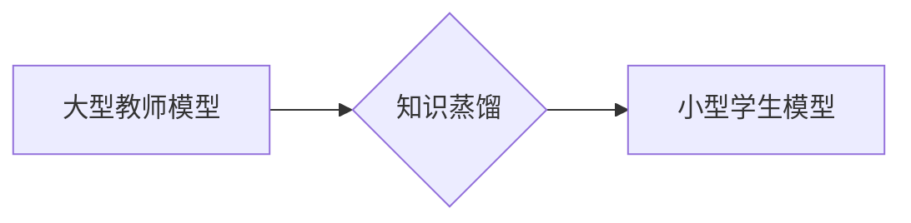

> 知识蒸馏，模型压缩，迁移学习，深度学习，集成学习

## 1. 背景介绍

深度学习模型在图像识别、自然语言处理等领域取得了显著的成就，但这些模型通常体积庞大，计算资源消耗巨大，难以部署在资源受限的设备上。知识蒸馏是一种模型压缩技术，旨在从大型教师模型中提取知识，并将其传递到小型学生模型中，从而实现模型压缩和性能提升。

传统的模型压缩方法主要包括模型剪枝、量化和知识蒸馏。模型剪枝通过移除冗余的模型参数来减小模型规模，量化则通过将模型参数的精度降低来减少存储空间和计算量。知识蒸馏是一种更先进的模型压缩方法，它通过训练一个小型学生模型来模仿大型教师模型的输出分布，从而学习到教师模型的知识。

## 2. 核心概念与联系

知识蒸馏的核心思想是将大型教师模型的知识传递给小型学生模型。教师模型通常是一个经过充分训练的、性能优异的模型，而学生模型则是一个小型、高效的模型。知识蒸馏的目标是训练学生模型能够尽可能地模仿教师模型的输出分布，从而学习到教师模型的知识。

**知识蒸馏的流程图：**



**知识蒸馏的优势：**

* **模型压缩:** 可以有效地减小模型规模，降低计算资源消耗。
* **性能提升:** 学生模型在学习到教师模型的知识后，其性能通常会优于未进行知识蒸馏的模型。
* **迁移学习:** 可以将教师模型的知识迁移到新的任务或领域。

**知识蒸馏的挑战:**

* **教师模型的选择:** 选择合适的教师模型对于知识蒸馏的效果至关重要。
* **蒸馏策略:** 不同的蒸馏策略会对学生模型的性能产生不同的影响。
* **训练效率:** 知识蒸馏的训练过程通常比传统的模型训练过程更复杂，训练效率较低。

## 3. 核心算法原理 & 具体操作步骤

### 3.1  算法原理概述

知识蒸馏的核心算法是通过最小化教师模型和学生模型的输出分布之间的差异来训练学生模型。

**损失函数:**

```latex
L = L_{CE} + \lambda L_{KD}
```

其中：

* $L_{CE}$ 是交叉熵损失函数，用于衡量学生模型预测结果与真实标签之间的差异。
* $L_{KD}$ 是知识蒸馏损失函数，用于衡量教师模型和学生模型的输出分布之间的差异。
* $\lambda$ 是一个权重参数，用于平衡交叉熵损失和知识蒸馏损失。

**知识蒸馏损失函数:**

```latex
L_{KD} = D_{KL}(P_{s} || P_{t})
```

其中：

* $P_{s}$ 是学生模型的输出分布。
* $P_{t}$ 是教师模型的输出分布。
* $D_{KL}$ 是KL散度，用于衡量两个概率分布之间的差异。

### 3.2  算法步骤详解

1. **预训练教师模型:** 使用大型数据集训练一个性能优异的教师模型。
2. **初始化学生模型:** 使用随机初始化或迁移学习初始化一个小型学生模型。
3. **训练学生模型:** 使用教师模型的输出作为软标签，训练学生模型。
4. **评估学生模型:** 在测试集上评估学生模型的性能。
5. **调整参数:** 根据学生模型的性能，调整损失函数中的权重参数 $\lambda$ 和学习率等参数。

### 3.3  算法优缺点

**优点:**

* 可以有效地压缩模型规模，降低计算资源消耗。
* 学生模型的性能通常会优于未进行知识蒸馏的模型。
* 可以将教师模型的知识迁移到新的任务或领域。

**缺点:**

* 教师模型的选择对于知识蒸馏的效果至关重要。
* 不同的蒸馏策略会对学生模型的性能产生不同的影响。
* 知识蒸馏的训练过程通常比传统的模型训练过程更复杂，训练效率较低。

### 3.4  算法应用领域

知识蒸馏在图像识别、自然语言处理、语音识别等领域都有广泛的应用。

* **图像识别:** 将大型卷积神经网络的知识蒸馏到小型模型，用于移动设备上的图像识别。
* **自然语言处理:** 将大型语言模型的知识蒸馏到小型模型，用于文本分类、机器翻译等任务。
* **语音识别:** 将大型语音识别模型的知识蒸馏到小型模型，用于语音助手、语音搜索等应用。

## 4. 数学模型和公式 & 详细讲解 & 举例说明

### 4.1  数学模型构建

知识蒸馏的数学模型可以概括为一个优化问题，目标是最小化教师模型和学生模型的输出分布之间的差异。

**优化目标:**

```latex
\min_{w_s} L = L_{CE} + \lambda L_{KD}
```

其中：

* $w_s$ 是学生模型的参数。
* $L_{CE}$ 是交叉熵损失函数。
* $L_{KD}$ 是知识蒸馏损失函数。
* $\lambda$ 是一个权重参数，用于平衡交叉熵损失和知识蒸馏损失。

### 4.2  公式推导过程

知识蒸馏损失函数的推导过程如下：

1. **KL散度定义:** KL散度是两个概率分布之间的差异度量，定义为：

```latex
D_{KL}(P || Q) = \sum_{x} P(x) \log \frac{P(x)}{Q(x)}
```

其中：

* $P$ 是真实分布。
* $Q$ 是预测分布。

2. **知识蒸馏损失函数:** 知识蒸馏损失函数定义为教师模型和学生模型的输出分布之间的KL散度：

```latex
L_{KD} = D_{KL}(P_s || P_t)
```

其中：

* $P_s$ 是学生模型的输出分布。
* $P_t$ 是教师模型的输出分布。

### 4.3  案例分析与讲解

假设我们有一个图像分类任务，我们使用一个大型教师模型预训练了图像分类任务，然后使用知识蒸馏技术将教师模型的知识蒸馏到一个小型学生模型中。

在训练过程中，我们使用教师模型的输出作为软标签，即教师模型对每个图像的预测概率分布作为学生模型的训练目标。

通过最小化教师模型和学生模型的输出分布之间的差异，学生模型能够学习到教师模型的知识，从而提高其分类性能。

## 5. 项目实践：代码实例和详细解释说明

### 5.1  开发环境搭建

* Python 3.7+
* PyTorch 1.7+
* CUDA 10.2+

### 5.2  源代码详细实现

```python
import torch
import torch.nn as nn
import torch.optim as optim

# 定义教师模型
class TeacherModel(nn.Module):
    # ...

# 定义学生模型
class StudentModel(nn.Module):
    # ...

# 加载预训练的教师模型
teacher_model = TeacherModel()
teacher_model.load_state_dict(torch.load('teacher_model.pth'))

# 初始化学生模型
student_model = StudentModel()

# 定义损失函数和优化器
criterion = nn.CrossEntropyLoss()
optimizer = optim.Adam(student_model.parameters(), lr=0.001)

# 训练循环
for epoch in range(num_epochs):
    for images, labels in dataloader:
        # 前向传播
        outputs_t = teacher_model(images)
        outputs_s = student_model(images)

        # 计算损失
        loss_ce = criterion(outputs_s, labels)
        loss_kd = torch.nn.KLDivLoss()(F.log_softmax(outputs_s, dim=1), F.softmax(outputs_t, dim=1))
        loss = loss_ce + 0.1 * loss_kd

        # 反向传播
        optimizer.zero_grad()
        loss.backward()
        optimizer.step()

# 保存训练好的学生模型
torch.save(student_model.state_dict(), 'student_model.pth')
```

### 5.3  代码解读与分析

* 代码首先定义了教师模型和学生模型，并加载预训练的教师模型。
* 然后定义了损失函数和优化器，并开始训练循环。
* 在训练循环中，首先使用教师模型对输入图像进行前向传播，得到教师模型的输出分布。
* 然后使用学生模型对输入图像进行前向传播，得到学生模型的输出分布。
* 计算交叉熵损失和知识蒸馏损失，并将两者相加作为总损失。
* 使用优化器更新学生模型的参数。
* 最后保存训练好的学生模型。

### 5.4  运行结果展示

训练完成后，可以将训练好的学生模型在测试集上进行评估，并与未进行知识蒸馏的模型进行比较。

## 6. 实际应用场景

### 6.1  移动设备上的图像识别

知识蒸馏可以将大型图像识别模型的知识蒸馏到小型模型，从而实现移动设备上的高效图像识别。

### 6.2  资源受限环境下的语音识别

知识蒸馏可以将大型语音识别模型的知识蒸馏到小型模型，从而在资源受限的环境下实现语音识别功能。

### 6.3  个性化推荐系统

知识蒸馏可以将大型推荐模型的知识蒸馏到小型模型，从而实现个性化推荐系统的部署。

### 6.4  未来应用展望

知识蒸馏技术在未来将有更广泛的应用场景，例如：

* **边缘计算:** 将知识蒸馏应用于边缘计算设备，实现高效的本地推理。
* **联邦学习:** 将知识蒸馏应用于联邦学习，提高模型的隐私保护能力。
* **自动机器学习:** 将知识蒸馏应用于自动机器学习，自动生成高效的模型。

## 7. 工具和资源推荐

### 7.1  学习资源推荐

* **论文:**
    * Hinton, G., Vinyals, O., & Dean, J. (2015). Distilling the knowledge in a neural network. arXiv preprint arXiv:1503.02531.
* **博客:**
    * https://blog.openai.com/distilling-knowledge-in-neural-networks/
    * https://towardsdatascience.com/knowledge-distillation-a-powerful-technique-for-model-compression-a3999999999a

### 7.2  开发工具推荐

* **PyTorch:** https://pytorch.org/
* **TensorFlow:** https://www.tensorflow.org/

### 7.3  相关论文推荐

* **Teacher-Student Generative Adversarial Networks**
* **Multi-Teacher Knowledge Distillation**
* **Progressive Knowledge Distillation**

## 8. 总结：未来发展趋势与挑战

### 8.1  研究成果总结

知识蒸馏技术取得了显著的成果，有效地压缩了模型规模，提高了模型性能，并拓展了模型的应用场景。

### 8.2  未来发展趋势

* **更有效的蒸馏策略:** 研究更有效的蒸馏策略，例如动态蒸馏、渐进式蒸馏等。
* **多任务知识蒸馏:** 研究将多个任务的知识蒸馏到一个模型中，实现模型的多任务学习能力。
* **跨模态知识蒸馏:** 研究将不同模态的知识蒸馏到一个模型中，实现跨模态的知识共享。

### 8.3  面临的挑战

* **教师模型的选择:** 选择合适的教师模型对于知识蒸馏的效果至关重要，但目前还没有一个统一的标准来选择教师模型。
* **蒸馏策略的优化:** 不同的蒸馏策略会对学生模型的性能产生不同的影响，需要根据具体任务和模型进行优化。
* **训练效率:** 知识蒸馏的