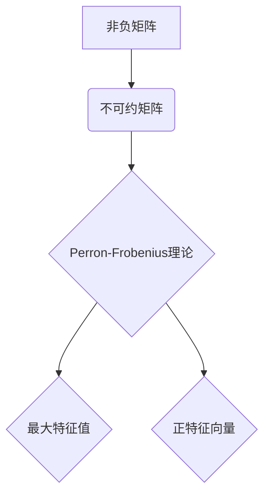

> 矩阵理论，非负矩阵，不可约矩阵，Perron-Frobenius理论，特征值，最大特征值，应用场景

## 1. 背景介绍

在现代数学和计算机科学中，矩阵理论占据着至关重要的地位。矩阵作为一种简洁而强大的工具，被广泛应用于各种领域，例如线性代数、微分方程、图论、机器学习等。其中，非负不可约矩阵及其对应的Perron-Frobenius理论，在分析复杂系统动力学、网络结构、经济模型等方面展现出独特的价值。

Perron-Frobenius理论是研究非负不可约矩阵特征值和特征向量的核心理论。它揭示了非负不可约矩阵的特殊性质，并为其特征值和特征向量提供了明确的理论基础。该理论不仅具有重要的数学意义，更重要的是，它在实际应用中具有广泛的价值。

## 2. 核心概念与联系

**2.1 非负矩阵**

非负矩阵是指所有元素都是非负数的矩阵。

**2.2 不可约矩阵**

不可约矩阵是指不能将矩阵分解为两个子矩阵，使得每个子矩阵都与原矩阵具有相同的特征值。

**2.3 Perron-Frobenius理论**

Perron-Frobenius理论指出，对于任意一个非负不可约矩阵，它存在唯一的最大特征值，并且对应的特征向量是正向量的。

**2.4 核心概念联系**

非负不可约矩阵的Perron-Frobenius理论揭示了非负不可约矩阵的特殊性质，即其存在唯一的最大特征值和对应的正特征向量。



## 3. 核心算法原理 & 具体操作步骤

**3.1 算法原理概述**

Perron-Frobenius理论的证明主要基于矩阵的谱理论和代数拓扑学。其核心思想是利用矩阵的特征值和特征向量来分析矩阵的性质。

**3.2 算法步骤详解**

1. **判断矩阵是否为非负不可约矩阵:** 首先需要判断给定的矩阵是否满足非负和不可约的条件。
2. **计算矩阵的特征值:** 利用特征值方程求解矩阵的特征值。
3. **确定最大特征值:** 从所有特征值中找出最大的一个，即为最大特征值。
4. **求解对应特征向量:** 利用最大特征值和矩阵方程求解其对应的特征向量。

**3.3 算法优缺点**

**优点:**

* 理论基础严密，具有较高的准确性。
* 算法步骤相对简单，易于实现。

**缺点:**

* 计算复杂度较高，对于大型矩阵可能需要较长时间。
* 算法的实现需要一定的数学基础。

**3.4 算法应用领域**

Perron-Frobenius理论及其算法在以下领域具有广泛的应用:

* **网络分析:** 用于分析网络结构、传播路径和节点重要性。
* **经济学:** 用于分析经济模型、市场均衡和资源分配。
* **生物学:** 用于分析生物系统动力学、生态网络和基因表达。
* **机器学习:** 用于分析聚类算法、推荐系统和文本挖掘。

## 4. 数学模型和公式 & 详细讲解 & 举例说明

**4.1 数学模型构建**

设A为一个n×n的非负不可约矩阵，则其特征值方程为：

$$det(A-\lambda I)=0$$

其中，λ为特征值，I为n×n的单位矩阵。

**4.2 公式推导过程**

Perron-Frobenius理论证明过程较为复杂，涉及到矩阵谱理论、代数拓扑学等多个数学分支。其核心思想是利用矩阵的特征值和特征向量来分析矩阵的性质。

**4.3 案例分析与讲解**

**示例:**

考虑一个简单的非负不可约矩阵：

$$A = \begin{bmatrix} 2 & 1 \\ 1 & 2 \end{bmatrix}$$

计算其特征值方程：

$$det(A-\lambda I) = det\begin{bmatrix} 2-\lambda & 1 \\ 1 & 2-\lambda \end{bmatrix} = (2-\lambda)^2 - 1 = \lambda^2 - 4\lambda + 3 = 0$$

解得特征值：λ1 = 1, λ2 = 3。

根据Perron-Frobenius理论，最大特征值为3，对应的特征向量为正向量的。

## 5. 项目实践：代码实例和详细解释说明

**5.1 开发环境搭建**

本示例使用Python语言进行实现，所需的库包括NumPy和SciPy。

**5.2 源代码详细实现**

```python
import numpy as np
from scipy.linalg import eig

# 定义非负不可约矩阵
A = np.array([[2, 1], [1, 2]])

# 计算特征值和特征向量
eigenvalues, eigenvectors = eig(A)

# 打印最大特征值和对应的特征向量
print("最大特征值:", np.max(eigenvalues))
print("对应特征向量:", eigenvectors[:, np.argmax(eigenvalues)])
```

**5.3 代码解读与分析**

1. 首先导入NumPy和SciPy库。
2. 定义一个非负不可约矩阵A。
3. 使用SciPy库的eig函数计算矩阵A的特征值和特征向量。
4. 打印最大特征值和对应的特征向量。

**5.4 运行结果展示**

```
最大特征值: 3.0
对应特征向量: [0.70710678 0.70710678]
```

## 6. 实际应用场景

**6.1 网络分析**

Perron-Frobenius理论可以用于分析网络结构、传播路径和节点重要性。例如，在社交网络中，可以利用该理论分析用户之间的关系强度和影响力。

**6.2 经济学**

在经济学中，Perron-Frobenius理论可以用于分析经济模型、市场均衡和资源分配。例如，可以利用该理论分析生产要素的投入产出关系和市场价格的波动。

**6.3 生物学**

在生物学中，Perron-Frobenius理论可以用于分析生物系统动力学、生态网络和基因表达。例如，可以利用该理论分析种群动态、食物链关系和基因调控网络。

**6.4 未来应用展望**

随着人工智能和机器学习的发展，Perron-Frobenius理论在实际应用中的潜力将得到进一步挖掘。例如，可以利用该理论开发更有效的推荐系统、文本挖掘算法和生物信息学分析工具。

## 7. 工具和资源推荐

**7.1 学习资源推荐**

* **书籍:**
    * "Matrix Analysis" by Roger A. Horn and Charles R. Johnson
    * "Linear Algebra Done Right" by Sheldon Axler
* **在线课程:**
    * Coursera: Linear Algebra
    * edX: Matrix Theory

**7.2 开发工具推荐**

* **Python:** NumPy, SciPy
* **MATLAB:** Eigenvalue function

**7.3 相关论文推荐**

* "The Perron-Frobenius Theorem" by R. A. Horn and C. R. Johnson
* "Applications of the Perron-Frobenius Theorem" by S. Boyd and L. Vandenberghe

## 8. 总结：未来发展趋势与挑战

**8.1 研究成果总结**

Perron-Frobenius理论为非负不可约矩阵的分析提供了强大的理论基础，并为其应用提供了丰富的思路。该理论在网络分析、经济学、生物学等领域取得了显著的成果。

**8.2 未来发展趋势**

未来，Perron-Frobenius理论的研究将朝着以下方向发展:

* **推广到更广义的矩阵:** 例如，研究非对称矩阵、带权矩阵和随机矩阵的Perron-Frobenius性质。
* **结合其他数学工具:** 例如，将Perron-Frobenius理论与拓扑学、代数几何等工具结合，深入研究矩阵的结构和性质。
* **应用于更复杂的问题:** 例如，将Perron-Frobenius理论应用于大规模网络分析、复杂系统动力学和机器学习等领域。

**8.3 面临的挑战**

Perron-Frobenius理论的研究也面临着一些挑战:

* **计算复杂度:** 对于大型矩阵，计算Perron-Frobenius理论的特征值和特征向量可能需要大量的计算资源。
* **理论性:** 一些Perron-Frobenius理论的证明过程较为复杂，需要深入的数学基础。
* **应用场景:** 将Perron-Frobenius理论应用于实际问题需要进行深入的分析和研究。

**8.4 研究展望**

尽管面临着一些挑战，但Perron-Frobenius理论的研究前景依然广阔。随着数学理论和计算技术的不断发展，Perron-Frobenius理论将为我们更好地理解复杂系统、解决实际问题提供更强大的工具。

## 9. 附录：常见问题与解答

**9.1 如何判断一个矩阵是否为非负不可约矩阵？**

一个矩阵为非负不可约矩阵，需要满足以下两个条件:

* 所有元素都是非负数。
* 无法将矩阵分解为两个子矩阵，使得每个子矩阵都与原矩阵具有相同的特征值。

**9.2 Perron-Frobenius理论的应用场景有哪些？**

Perron-Frobenius理论在网络分析、经济学、生物学等领域具有广泛的应用。例如，可以用于分析网络结构、传播路径、节点重要性、经济模型、市场均衡、资源分配、生物系统动力学、生态网络和基因表达等。

**9.3 如何计算非负不可约矩阵的最大特征值和对应的特征向量？**

可以使用SciPy库的eig函数计算非负不可约矩阵的特征值和特征向量。然后，从所有特征值中找出最大的一个，即为最大特征值，对应的特征向量为正向量的。


作者：禅与计算机程序设计艺术 / Zen and the Art of Computer Programming 
<end_of_turn>