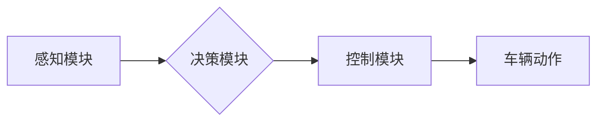

> 自动驾驶, 端到端学习, 深度学习, 计算机视觉, 预测模型, 决策控制, 仿真环境, 数据标注

## 1. 背景介绍

自动驾驶技术作为未来交通运输的重要发展方向，近年来取得了显著进展。从早期基于规则的控制系统到如今的深度学习驱动的端到端自动驾驶，技术演进速度惊人。端到端自动驾驶，顾名思义，是指将整个驾驶过程，从感知环境到做出决策并控制车辆，全部整合在一个深度学习模型中，实现从输入到输出的直接映射。这种方法简化了系统设计，提高了模型的鲁棒性和泛化能力，但也带来了新的挑战。

## 2. 核心概念与联系

端到端自动驾驶的核心概念是将感知、决策和控制三个模块融合在一个统一的深度学习模型中。

**2.1 感知模块**

感知模块负责收集车辆周围的环境信息，包括道路、车道、行人、障碍物等。常用的感知技术包括：

* **摄像头:** 提供视觉信息，用于识别道路标志、车道线、行人等。
* **雷达:** 提供距离和速度信息，用于检测障碍物和车辆。
* **激光雷达:** 提供高精度三维点云数据，用于构建车辆周围的环境地图。
* **超声波传感器:** 提供短距离距离信息，用于辅助泊车和避障。

**2.2 决策模块**

决策模块根据感知模块获取的环境信息，预测未来场景并做出驾驶决策，例如：

* **路径规划:** 规划车辆行驶的最佳路径。
* **速度控制:** 根据路况和交通规则调整车辆速度。
* **转向控制:** 控制车辆转向方向。
* **加速/减速控制:** 控制车辆的加速和减速。

**2.3 控制模块**

控制模块将决策模块的指令转化为车辆的实际动作，例如：

* **油门控制:** 控制车辆的加速和减速。
* **刹车控制:** 控制车辆的减速和停车。
* **转向控制:** 控制车辆的转向方向。

**2.4 流程图**



## 3. 核心算法原理 & 具体操作步骤

**3.1 算法原理概述**

端到端自动驾驶的核心算法是深度学习，特别是卷积神经网络（CNN）和循环神经网络（RNN）。

* **CNN:** 用于处理图像数据，例如摄像头采集的图像，可以提取图像中的特征，例如道路标志、车道线、行人等。
* **RNN:** 用于处理序列数据，例如车辆速度、方向、加速度等，可以学习时间序列中的模式，例如车辆的行驶轨迹。

**3.2 算法步骤详解**

1. **数据收集和标注:** 收集大量真实驾驶场景的数据，包括图像、雷达数据、激光雷达数据等，并对数据进行标注，例如标注道路边界、行人位置、车辆速度等。
2. **模型训练:** 使用深度学习算法训练模型，将标注数据作为训练样本，让模型学习驾驶规则和环境感知能力。
3. **模型评估:** 使用测试数据评估模型的性能，例如准确率、召回率、平均位移误差等。
4. **模型部署:** 将训练好的模型部署到车辆上，实现自动驾驶功能。

**3.3 算法优缺点**

**优点:**

* **鲁棒性强:** 可以适应各种复杂的环境和场景。
* **泛化能力强:** 可以应用于不同的车辆类型和驾驶环境。
* **学习能力强:** 可以不断学习和改进驾驶技能。

**缺点:**

* **数据依赖性强:** 需要大量高质量的数据进行训练。
* **训练成本高:** 训练深度学习模型需要大量的计算资源和时间。
* **解释性差:** 深度学习模型的决策过程难以解释。

**3.4 算法应用领域**

端到端自动驾驶算法广泛应用于：

* **自动驾驶汽车:** 实现车辆的自动驾驶功能。
* **无人机:** 实现无人机的自动飞行和路径规划。
* **机器人:** 实现机器人的自主导航和避障。

## 4. 数学模型和公式 & 详细讲解 & 举例说明

**4.1 数学模型构建**

端到端自动驾驶的数学模型通常是一个多层神经网络，其中每个层都包含多个神经元。神经元之间通过权重连接，权重决定了神经元之间的传递强度。

**4.2 公式推导过程**

神经网络的输出可以通过以下公式计算：

$$
y = f(W_L x_L + b_L)
$$

其中：

* $y$ 是神经网络的输出。
* $x_L$ 是输入层的神经元激活值。
* $W_L$ 是第 $L$ 层的权重矩阵。
* $b_L$ 是第 $L$ 层的偏置向量。
* $f$ 是激活函数，例如ReLU、Sigmoid等。

**4.3 案例分析与讲解**

例如，在路径规划任务中，输入层接收车辆周围的环境信息，例如道路地图、障碍物位置等。隐藏层学习这些信息的特征表示，输出层输出车辆行驶的最佳路径。

## 5. 项目实践：代码实例和详细解释说明

**5.1 开发环境搭建**

* 操作系统: Ubuntu 20.04
* 编程语言: Python 3.8
* 深度学习框架: TensorFlow 2.0
* 仿真环境: CARLA

**5.2 源代码详细实现**

```python
import tensorflow as tf

# 定义模型结构
model = tf.keras.models.Sequential([
    tf.keras.layers.Conv2D(32, (3, 3), activation='relu', input_shape=(64, 64, 3)),
    tf.keras.layers.MaxPooling2D((2, 2)),
    tf.keras.layers.Conv2D(64, (3, 3), activation='relu'),
    tf.keras.layers.MaxPooling2D((2, 2)),
    tf.keras.layers.Flatten(),
    tf.keras.layers.Dense(10, activation='softmax')
])

# 编译模型
model.compile(optimizer='adam',
              loss='sparse_categorical_crossentropy',
              metrics=['accuracy'])

# 训练模型
model.fit(x_train, y_train, epochs=10)

# 评估模型
loss, accuracy = model.evaluate(x_test, y_test)
print('Loss:', loss)
print('Accuracy:', accuracy)
```

**5.3 代码解读与分析**

这段代码定义了一个简单的卷积神经网络模型，用于图像分类任务。模型包含两个卷积层、两个最大池化层、一个全连接层和一个输出层。

* **卷积层:** 用于提取图像特征。
* **最大池化层:** 用于降低特征图的维度，提高模型的鲁棒性。
* **全连接层:** 用于将特征映射到输出类别。
* **输出层:** 使用 softmax 函数将输出映射到概率分布，预测图像类别。

**5.4 运行结果展示**

训练完成后，模型可以用于预测新的图像类别。

## 6. 实际应用场景

端到端自动驾驶技术已在多个实际应用场景中得到应用，例如：

* **自动驾驶汽车:** Tesla、Waymo、Cruise 等公司都在开发基于端到端自动驾驶技术的自动驾驶汽车。
* **无人配送:** Amazon、Domino's 等公司正在使用无人配送车进行商品配送。
* **智能交通:** 端到端自动驾驶技术可以用于优化交通流量、减少拥堵和事故。

**6.4 未来应用展望**

未来，端到端自动驾驶技术将应用于更广泛的领域，例如：

* **公共交通:** 自动驾驶公交车、自动驾驶出租车等。
* **农业:** 自动驾驶拖拉机、自动驾驶喷洒机等。
* **物流:** 自动驾驶卡车、自动驾驶货车等。

## 7. 工具和资源推荐

**7.1 学习资源推荐**

* **书籍:**
    * Deep Learning by Ian Goodfellow, Yoshua Bengio, and Aaron Courville
    * Hands-On Machine Learning with Scikit-Learn, Keras & TensorFlow by Aurélien Géron
* **在线课程:**
    * TensorFlow Tutorials: https://www.tensorflow.org/tutorials
    * Deep Learning Specialization by Andrew Ng: https://www.deeplearning.ai/

**7.2 开发工具推荐**

* **深度学习框架:** TensorFlow, PyTorch, Keras
* **仿真环境:** CARLA, Gazebo, SUMO
* **数据标注工具:** LabelImg, CVAT

**7.3 相关论文推荐**

* End to End Learning for Self-Driving Cars by Bojarski et al. (2016)
* Attention Is All You Need by Vaswani et al. (2017)
* Deep Reinforcement Learning for End-to-End Autonomous Driving by Chen et al. (2018)

## 8. 总结：未来发展趋势与挑战

**8.1 研究成果总结**

端到端自动驾驶技术取得了显著进展，模型性能不断提升，应用场景不断拓展。

**8.2 未来发展趋势**

* **模型复杂度提升:** 使用更深、更复杂的网络结构，提高模型的表达能力和泛化能力。
* **数据规模扩大:** 收集更多、更丰富的数据，提高模型的训练质量。
* **场景多样化:** 针对不同场景，例如城市道路、高速公路、乡村道路等，开发针对性的模型。
* **安全性和可靠性提升:** 加强模型的安全性测试和验证，确保自动驾驶系统的可靠性。

**8.3 面临的挑战**

* **数据标注成本高:** 自动驾驶数据标注需要大量人力和时间，成本较高。
* **模型解释性差:** 深度学习模型的决策过程难以解释，难以获得公众的信任。
* **安全性和可靠性问题:** 自动驾驶系统需要能够应对各种复杂和不可预测的场景，确保安全性和可靠性。

**8.4 研究展望**

未来，端到端自动驾驶技术将继续朝着更安全、更可靠、更智能的方向发展。

## 9. 附录：常见问题与解答

**9.1 Q: 端到端自动驾驶和传统规则式自动驾驶有什么区别？**

**A:** 端到端自动驾驶将整个驾驶过程整合在一个深度学习模型中，而传统规则式自动驾驶则依赖于预先定义的规则和逻辑。端到端自动驾驶具有更强的鲁棒性和泛化能力，但同时也面临着数据依赖性和解释性差等挑战。

**9.2 Q: 端到端自动驾驶需要多少数据才能训练？**

**A:** 端到端自动驾驶模型需要大量的真实驾驶场景数据进行训练，通常需要百万甚至数十万级别的数据。

**9.3 Q: 端到端自动驾驶技术是否安全可靠？**

**A:** 端到端自动驾驶技术仍在发展阶段，安全性与可靠性仍然是一个挑战。需要通过大量的测试和验证，确保自动驾驶系统的安全性和可靠性。


作者：禅与计算机程序设计艺术 / Zen and the Art of Computer Programming 
<end_of_turn>