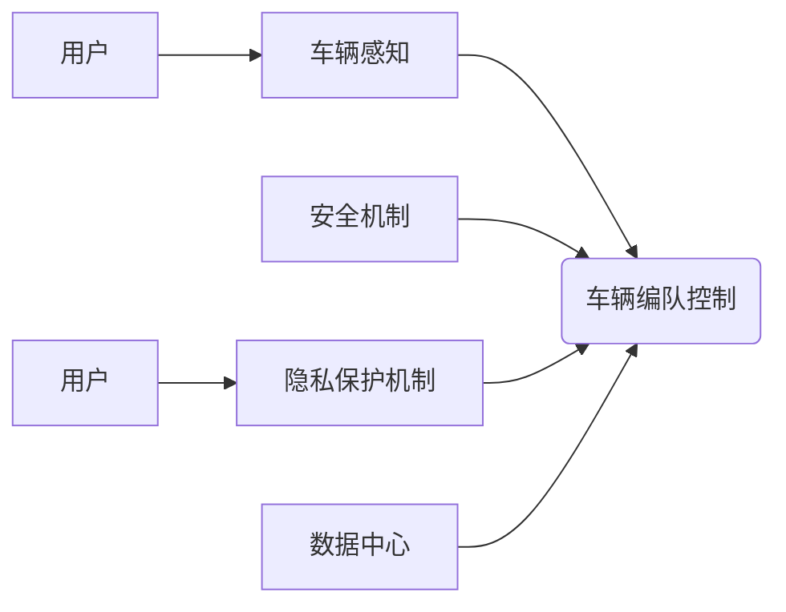

> 自动驾驶,车辆编队,安全,隐私,深度学习,强化学习,联邦学习

## 1. 背景介绍

随着自动驾驶技术的快速发展，车辆编队技术作为一种提高道路交通效率和安全性的重要手段，逐渐受到广泛关注。车辆编队是指多个车辆按照预定的规则和策略，紧密地排列行驶，形成有序的队列。相比于独立行驶，车辆编队可以显著减少车辆之间的安全距离，提高道路通行能力，并降低车辆的能耗。

然而，车辆编队技术也面临着诸多挑战，其中安全和隐私保护尤为重要。

* **安全挑战:** 车辆编队需要精确的感知、决策和控制能力，以确保车辆之间保持安全距离，避免碰撞事故。同时，编队车辆需要能够应对复杂的路况和突发事件，例如其他车辆的突然变道、行人突然出现等。
* **隐私挑战:** 车辆编队系统通常需要收集和共享大量车辆数据，例如位置、速度、方向等，这些数据可能包含敏感的隐私信息。如果这些数据被恶意利用，可能会导致车辆被跟踪、定位、甚至被攻击。

## 2. 核心概念与联系

车辆编队安全与隐私保护是一个多学科交叉的领域，涉及到自动驾驶、计算机视觉、机器学习、网络安全等多个领域。

**2.1 核心概念**

* **自动驾驶:** 自动驾驶是指车辆能够自主感知周围环境、规划路径、控制行驶，无需人工干预。
* **车辆编队:** 车辆编队是指多个车辆按照预定的规则和策略，紧密地排列行驶，形成有序的队列。
* **安全:** 安全是指车辆编队系统能够在各种情况下，避免碰撞事故，保障车辆和人员的安全。
* **隐私:** 隐私是指车辆数据不被未经授权的第三方访问、使用或泄露。

**2.2 核心联系**

车辆编队安全与隐私保护之间存在着密切的联系。

* **安全依赖隐私:** 安全算法需要依赖车辆数据进行训练和运行，而这些数据也可能包含隐私信息。如果数据被泄露，可能会导致安全算法失效，从而增加安全风险。
* **隐私依赖安全:** 为了保护车辆隐私，需要采用安全机制来确保数据不被恶意访问和使用。如果安全机制失效，可能会导致隐私泄露，从而损害用户信任。

**2.3 架构图**



## 3. 核心算法原理 & 具体操作步骤

### 3.1  算法原理概述

车辆编队安全与隐私保护的核心算法通常基于深度学习和强化学习。

* **深度学习:** 用于训练车辆感知模型，识别周围环境中的障碍物、行人、其他车辆等。
* **强化学习:** 用于训练车辆编队控制模型，学习如何根据感知到的环境信息，规划路径、控制行驶，以实现安全、高效的编队行驶。

### 3.2  算法步骤详解

1. **数据采集:** 收集车辆行驶过程中产生的各种数据，例如位置、速度、方向、传感器数据等。
2. **数据预处理:** 对采集到的数据进行清洗、格式化、特征提取等处理，以便于后续算法训练和使用。
3. **模型训练:** 使用深度学习和强化学习算法，训练车辆感知模型和车辆编队控制模型。
4. **模型评估:** 对训练好的模型进行评估，测试其在不同场景下的性能，例如安全性和效率性。
5. **模型部署:** 将训练好的模型部署到车辆上，使其能够实时感知环境、规划路径、控制行驶。

### 3.3  算法优缺点

**优点:**

* **高精度:** 深度学习和强化学习算法能够学习复杂的非线性关系，从而实现高精度的车辆感知和编队控制。
* **自适应性强:** 这些算法能够根据环境变化自适应地调整策略，提高车辆编队的鲁棒性。

**缺点:**

* **数据依赖:** 深度学习和强化学习算法需要大量的训练数据，而获取高质量的训练数据成本较高。
* **计算复杂度高:** 这些算法的训练和推理过程计算量较大，对硬件资源要求较高。

### 3.4  算法应用领域

车辆编队安全与隐私保护算法在自动驾驶、智能交通、物流运输等领域都有广泛的应用前景。

## 4. 数学模型和公式 & 详细讲解 & 举例说明

### 4.1  数学模型构建

车辆编队安全与隐私保护的数学模型通常基于以下几个方面：

* **车辆动力学模型:** 描述车辆运动状态的数学模型，例如速度、加速度、转角等。
* **车辆感知模型:** 描述车辆感知周围环境的数学模型，例如距离、角度、速度等。
* **编队控制模型:** 描述车辆编队行驶的数学模型，例如编队距离、速度匹配等。
* **隐私保护模型:** 描述如何保护车辆数据的数学模型，例如数据加密、差分隐私等。

### 4.2  公式推导过程

例如，车辆编队控制模型可以采用线性二次调节 (LQR) 算法，其目标函数为：

$$
J = \int_0^T (x(t)^T Q x(t) + u(t)^T R u(t)) dt
$$

其中：

* $x(t)$ 是车辆状态向量，例如位置、速度等。
* $u(t)$ 是控制输入向量，例如加速度、转向角等。
* $Q$ 和 $R$ 是权重矩阵，用于平衡状态误差和控制输入的惩罚。

通过求解上述目标函数，可以得到车辆编队控制器的控制律。

### 4.3  案例分析与讲解

例如，假设有两个车辆编队行驶，目标是保持一定的安全距离。可以使用车辆动力学模型和编队控制模型，计算出每个车辆的控制输入，以实现安全距离的保持。

## 5. 项目实践：代码实例和详细解释说明

### 5.1  开发环境搭建

* 操作系统: Ubuntu 20.04
* 编程语言: Python 3.8
* 深度学习框架: TensorFlow 2.0
* 仿真环境: CARLA

### 5.2  源代码详细实现

```python
# 车辆编队控制模型
class VehicleFormationController:
    def __init__(self, vehicle_id, formation_config):
        self.vehicle_id = vehicle_id
        self.formation_config = formation_config

    def control(self, state, target_state):
        # 计算控制输入
        control_input = self.calculate_control_input(state, target_state)
        return control_input

    def calculate_control_input(self, state, target_state):
        # ...
```

### 5.3  代码解读与分析

* `VehicleFormationController` 类负责控制车辆编队行驶。
* `control()` 方法接收车辆当前状态和目标状态作为输入，计算出控制输入。
* `calculate_control_input()` 方法根据车辆动力学模型和编队控制模型，计算出控制输入。

### 5.4  运行结果展示

通过在 CARLA 仿真环境中运行代码，可以观察到车辆编队行驶的效果。

## 6. 实际应用场景

### 6.1  自动驾驶公交车

自动驾驶公交车可以采用车辆编队技术，提高道路通行效率，减少拥堵。

### 6.2  无人货车运输

无人货车可以采用车辆编队技术，提高运输效率，降低运输成本。

### 6.3  智能巡逻

无人机或机器人可以采用车辆编队技术，实现智能巡逻，提高巡逻效率。

### 6.4  未来应用展望

车辆编队技术在未来将有更广泛的应用场景，例如：

* **智能交通系统:** 优化交通流量，减少拥堵。
* **城市物流:** 提高物流效率，降低成本。
* **灾害救援:** 快速高效地进行灾害救援。

## 7. 工具和资源推荐

### 7.1  学习资源推荐

* **书籍:**
    * "Autonomous Driving: Principles and Practice" by Peter Corke
    * "Reinforcement Learning: An Introduction" by Richard S. Sutton and Andrew G. Barto
* **在线课程:**
    * Coursera: "Self-Driving Cars" by University of Toronto
    * Udacity: "Self-Driving Car Engineer Nanodegree"

### 7.2  开发工具推荐

* **仿真环境:** CARLA, SUMO
* **深度学习框架:** TensorFlow, PyTorch
* **编程语言:** Python

### 7.3  相关论文推荐

* "End-to-End Learning for Self-Driving Cars" by Bojarski et al.
* "Deep Reinforcement Learning for Autonomous Driving" by Schulman et al.
* "Privacy-Preserving Vehicle Data Sharing for Cooperative Driving" by Liu et al.

## 8. 总结：未来发展趋势与挑战

### 8.1  研究成果总结

车辆编队安全与隐私保护领域取得了显著的进展，例如：

* 深度学习和强化学习算法在车辆感知和编队控制方面取得了突破。
* 隐私保护技术在车辆数据共享方面取得了进展。

### 8.2  未来发展趋势

未来，车辆编队安全与隐私保护领域将朝着以下方向发展：

* **更智能的编队控制:** 利用人工智能技术，实现更智能、更灵活的编队控制策略。
* **更安全的隐私保护:** 开发更有效的隐私保护技术，确保车辆数据安全。
* **更广泛的应用场景:** 将车辆编队技术应用于更多领域，例如智能交通、城市物流等。

### 8.3  面临的挑战

车辆编队安全与隐私保护领域还面临着一些挑战：

* **数据安全:** 确保车辆数据不被恶意攻击和泄露。
* **算法鲁棒性:** 提高算法在复杂路况下的鲁棒性。
* **法律法规:** 制定完善的法律法规，规范车辆编队技术的应用。

### 8.4  研究展望

未来，我们将继续致力于车辆编队安全与隐私保护的研究，探索更智能、更安全的编队技术，为自动驾驶和智能交通的发展做出贡献。

## 9. 附录：常见问题与解答

### 9.1  车辆编队安全可靠吗？

车辆编队技术已经取得了显著的进展，但仍然存在一些安全风险。为了提高安全可靠性，需要采用多重安全机制，例如冗余传感器、故障检测和恢复机制等。

### 9.2  车辆编队会侵犯隐私吗？

车辆编队系统需要收集和共享车辆数据，因此需要采取有效的隐私保护措施，例如数据加密、差分隐私等，确保车辆数据不被恶意访问和使用。

### 9.3  车辆编队技术何时能够大规模应用？

随着技术的不断发展和法规的完善，车辆编队技术有望在未来几年内大规模应用。


作者：禅与计算机程序设计艺术 / Zen and the Art of Computer Programming 
<end_of_turn>