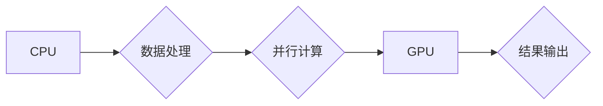

> 算力、GPU、深度学习、人工智能、NVIDIA、CUDA、TensorRT、DGX

## 1. 背景介绍

在当今科技飞速发展的时代，算力已成为推动社会进步和经济增长的关键驱动力。从互联网的兴起到移动互联网的普及，再到人工智能的蓬勃发展，算力的需求量呈指数级增长。而GPU（图形处理单元），作为一种专门用于并行计算的处理器，凭借其强大的并行处理能力，在加速计算任务方面展现出巨大的优势，成为算力革命的先锋。

NVIDIA，作为全球领先的GPU芯片设计和制造商，在算力革命中扮演着至关重要的角色。自1993年成立以来，NVIDIA不断突破技术边界，推出了多代高性能GPU，为人工智能、高性能计算、游戏等领域提供了强大的算力支撑。

## 2. 核心概念与联系

### 2.1  GPU与CPU

**CPU（中央处理器）**是传统计算机的核心处理器，擅长处理顺序性任务，但其并行处理能力有限。

**GPU（图形处理单元）**最初设计用于处理图形渲染，拥有大量的并行计算单元，能够同时处理数千个任务，在并行计算方面具有显著优势。

### 2.2  CUDA与深度学习

**CUDA（Compute Unified Device Architecture）**是NVIDIA开发的一种并行计算平台，允许程序员利用GPU的强大并行处理能力加速计算任务。

**深度学习**是一种机器学习方法，利用多层神经网络模拟人类大脑的学习过程，在图像识别、自然语言处理等领域取得了突破性进展。深度学习算法的训练过程需要大量的计算资源，GPU的并行计算能力使其成为深度学习训练的理想平台。

**Mermaid 流程图：**



## 3. 核心算法原理 & 具体操作步骤

### 3.1  算法原理概述

深度学习算法的核心是神经网络，它由多个层级的神经元组成，每个神经元接收输入信号，经过激活函数处理后输出信号。神经网络通过训练学习数据之间的映射关系，从而实现预测、分类等功能。

### 3.2  算法步骤详解

1. **数据预处理:** 将原始数据转换为深度学习模型可以理解的格式，例如归一化、编码等。
2. **模型构建:** 根据任务需求选择合适的深度学习模型架构，例如卷积神经网络（CNN）、循环神经网络（RNN）等。
3. **模型训练:** 使用训练数据训练模型，调整模型参数，使模型的预测结果与真实值尽可能接近。
4. **模型评估:** 使用测试数据评估模型的性能，例如准确率、召回率等。
5. **模型部署:** 将训练好的模型部署到实际应用场景中，用于预测、分类等任务。

### 3.3  算法优缺点

**优点:**

* 能够学习复杂的数据模式，实现高精度预测。
* 具有强大的泛化能力，能够应用于多种不同的任务。

**缺点:**

* 训练过程需要大量的计算资源和时间。
* 对训练数据的质量要求较高，数据不足或噪声数据会影响模型性能。

### 3.4  算法应用领域

深度学习算法已广泛应用于各个领域，例如：

* **图像识别:** 人脸识别、物体检测、图像分类等。
* **自然语言处理:** 机器翻译、文本摘要、情感分析等。
* **语音识别:** 语音转文本、语音助手等。
* **医疗诊断:** 疾病预测、影像分析等。
* **金融分析:** 风险评估、欺诈检测等。

## 4. 数学模型和公式 & 详细讲解 & 举例说明

### 4.1  数学模型构建

深度学习模型的核心是神经网络，其数学模型可以表示为多层感知机（MLP）。

**MLP模型结构:**

```
输入层 -> 隐藏层1 -> 隐藏层2 -> ... -> 隐藏层n -> 输出层
```

每个神经元接收来自上一层的输入信号，经过加权求和和激活函数处理后输出信号。

**激活函数:**

激活函数的作用是引入非线性，使神经网络能够学习复杂的数据模式。常用的激活函数包括ReLU、Sigmoid、Tanh等。

### 4.2  公式推导过程

**前向传播:**

给定输入数据 $x$，通过神经网络层层传递，最终得到输出结果 $y$。

$$
y = f(W_n \cdot a_{n-1} + b_n)
$$

其中：

* $W_n$ 是第n层的权重矩阵。
* $a_{n-1}$ 是第n-1层的激活输出。
* $b_n$ 是第n层的偏置向量。
* $f$ 是激活函数。

**反向传播:**

通过计算输出结果与真实值的误差，利用梯度下降算法更新权重和偏置，使模型的预测结果越来越接近真实值。

### 4.3  案例分析与讲解

**图像分类:**

使用CNN模型对图像进行分类。CNN模型的结构包含多个卷积层、池化层和全连接层。卷积层提取图像特征，池化层降低特征维度，全连接层进行分类。

**训练过程:**

1. 使用大量图像数据训练CNN模型。
2. 计算模型的预测结果与真实标签的误差。
3. 利用反向传播算法更新模型参数。
4. 重复步骤2和3，直到模型性能达到预期水平。

## 5. 项目实践：代码实例和详细解释说明

### 5.1  开发环境搭建

* 操作系统：Ubuntu 20.04
* CUDA版本：11.4
* cuDNN版本：8.2
* Python版本：3.8
* 深度学习框架：TensorFlow 2.x

### 5.2  源代码详细实现

```python
import tensorflow as tf

# 定义模型结构
model = tf.keras.models.Sequential([
    tf.keras.layers.Conv2D(32, (3, 3), activation='relu', input_shape=(28, 28, 1)),
    tf.keras.layers.MaxPooling2D((2, 2)),
    tf.keras.layers.Conv2D(64, (3, 3), activation='relu'),
    tf.keras.layers.MaxPooling2D((2, 2)),
    tf.keras.layers.Flatten(),
    tf.keras.layers.Dense(10, activation='softmax')
])

# 编译模型
model.compile(optimizer='adam',
              loss='sparse_categorical_crossentropy',
              metrics=['accuracy'])

# 训练模型
model.fit(x_train, y_train, epochs=5)

# 评估模型
loss, accuracy = model.evaluate(x_test, y_test)
print('Test loss:', loss)
print('Test accuracy:', accuracy)
```

### 5.3  代码解读与分析

* **模型结构:** 该代码定义了一个简单的CNN模型，包含两个卷积层、两个池化层和一个全连接层。
* **激活函数:** 使用ReLU作为激活函数，可以加速训练过程。
* **损失函数:** 使用sparse_categorical_crossentropy作为损失函数，适用于多分类问题。
* **优化器:** 使用adam优化器，可以有效地更新模型参数。

### 5.4  运行结果展示

训练完成后，可以评估模型的性能，例如准确率。

## 6. 实际应用场景

### 6.1  人工智能

* **图像识别:** 人脸识别、物体检测、图像分类等。
* **自然语言处理:** 机器翻译、文本摘要、情感分析等。
* **语音识别:** 语音转文本、语音助手等。
* **医疗诊断:** 疾病预测、影像分析等。

### 6.2  高性能计算

* **科学计算:** 天体模拟、分子动力学等。
* **金融建模:** 风险评估、股票预测等。
* **工程仿真:** 结构分析、流体模拟等。

### 6.3  游戏开发

* **图形渲染:** 高质量的图形效果、逼真的物理模拟等。
* **人工智能游戏:** 智能对手、动态游戏世界等。

### 6.4  未来应用展望

随着算力技术的不断发展，深度学习算法将应用于更多领域，例如：

* **自动驾驶:** 提高自动驾驶汽车的安全性、可靠性和智能化水平。
* **机器人技术:** 开发更智能、更灵活的机器人。
* **个性化医疗:** 提供更精准、更有效的医疗服务。

## 7. 工具和资源推荐

### 7.1  学习资源推荐

* **书籍:**
    * 深度学习
    * 构建深度学习模型
* **在线课程:**
    * Coursera深度学习课程
    * Udacity深度学习工程师课程

### 7.2  开发工具推荐

* **深度学习框架:** TensorFlow、PyTorch、Keras
* **GPU加速库:** CUDA、cuDNN

### 7.3  相关论文推荐

* **ImageNet Classification with Deep Convolutional Neural Networks**
* **Attention Is All You Need**

## 8. 总结：未来发展趋势与挑战

### 8.1  研究成果总结

NVIDIA在GPU技术和深度学习平台的研发方面取得了显著成果，为算力革命提供了强大的技术支撑。深度学习算法在各个领域取得了突破性进展，推动了人工智能的快速发展。

### 8.2  未来发展趋势

* **算力继续提升:** GPU架构不断演进，算力将继续提升，支持更复杂的深度学习模型和应用场景。
* **模型规模扩大:** 模型规模将进一步扩大，训练更复杂的模型，实现更精细的预测和分析。
* **边缘计算:** 将深度学习模型部署到边缘设备，实现更实时、更低延迟的应用。

### 8.3  面临的挑战

* **算力需求增长:** 深度学习模型的训练和推理需要大量的算力资源，如何满足不断增长的算力需求是一个挑战。
* **模型可解释性:** 深度学习模型的决策过程往往难以理解，如何提高模型的可解释性是一个重要的研究方向。
* **数据安全和隐私:** 深度学习模型的训练和应用需要大量数据，如何保护数据安全和隐私是一个关键问题。

### 8.4  研究展望

未来，我们将继续探索更强大的GPU架构、更有效的深度学习算法和更安全的应用场景，推动算力革命和人工智能的持续发展。

## 9. 附录：常见问题与解答

**Q1: CUDA是什么？**

A1: CUDA（Compute Unified Device Architecture）是NVIDIA开发的一种并行计算平台，允许程序员利用GPU的强大并行处理能力加速计算任务。

**Q2: TensorRT是什么？**

A2: TensorRT是一个高性能的深度学习推理优化器，可以将深度学习模型转换为高效的推理引擎，加速模型的部署和推理速度。

**Q3: DGX是什么？**

A3: DGX是NVIDIA推出的高性能计算平台，集成了多个GPU、高速互联网络和软件工具，为深度学习训练和推理提供强大的算力支撑。


作者：禅与计算机程序设计艺术 / Zen and the Art of Computer Programming 
<end_of_turn>