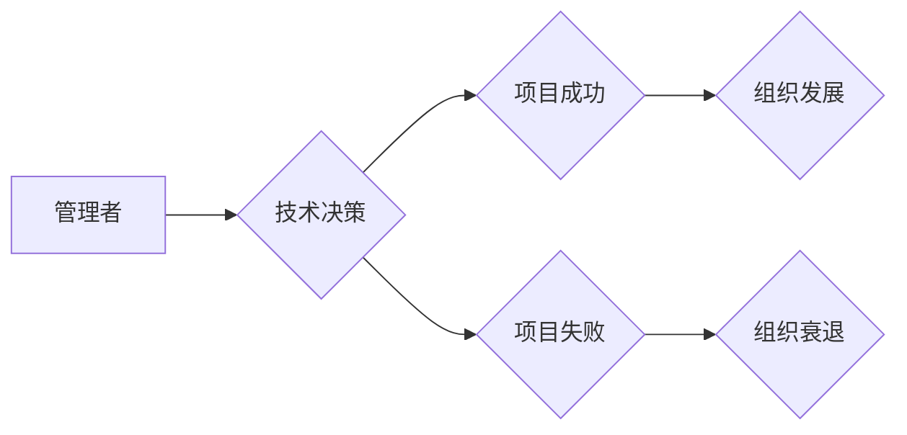

> 认知盲区，管理者，技术决策，沟通障碍，团队协作，数据驱动，人工智能，机器学习

## 1. 背景介绍

在当今科技飞速发展的时代，管理者在面对日新月异的技术变革时，常常会陷入“认知盲区”。 认知盲区是指由于自身知识、经验和思维模式的局限性，导致管理者对某些技术趋势、发展方向或潜在风险缺乏准确的理解和判断。这种认知偏差可能会导致一系列问题，例如：

* **技术决策失误：** 管理者可能选择不合适的技术方案，导致项目成本过高、进度延迟或最终失败。
* **沟通障碍：** 管理者与技术团队之间存在理解偏差，导致沟通不畅，难以达成共识。
* **团队协作效率低下：** 管理者对技术团队的运作方式缺乏了解，导致团队协作效率低下，难以发挥团队的潜能。

## 2. 核心概念与联系

认知盲区是管理者在面对复杂的技术环境时，由于自身知识和经验的局限性，导致对技术趋势、发展方向或潜在风险缺乏准确的理解和判断。这种认知偏差会影响管理者的决策、沟通和团队协作，最终导致项目失败或组织发展受阻。

**Mermaid 流程图：**



## 3. 核心算法原理 & 具体操作步骤

### 3.1  算法原理概述

为了帮助管理者识别和突破认知盲区，我们可以借鉴人工智能领域的算法原理，例如机器学习算法。机器学习算法能够通过分析大量数据，识别出隐藏的模式和趋势，从而帮助管理者做出更准确的决策。

### 3.2  算法步骤详解

1. **数据收集：** 收集与技术相关的各种数据，例如市场趋势、技术发展动态、项目进展情况等。
2. **数据预处理：** 对收集到的数据进行清洗、转换和格式化，使其能够被机器学习算法处理。
3. **模型训练：** 选择合适的机器学习算法，并利用训练数据对算法进行训练，使其能够识别出技术趋势和潜在风险。
4. **模型评估：** 对训练好的模型进行评估，测试其准确性和可靠性。
5. **模型应用：** 将训练好的模型应用于实际场景，例如帮助管理者做出技术决策、预测项目风险等。

### 3.3  算法优缺点

**优点：**

* **数据驱动：** 基于数据分析，能够提供更客观、更准确的决策依据。
* **自动化决策：** 可以自动化一些技术决策，提高效率和准确性。
* **预测风险：** 可以预测潜在的风险，帮助管理者提前做好应对措施。

**缺点：**

* **数据依赖：** 算法的准确性依赖于数据的质量和数量。
* **算法选择：** 选择合适的算法需要专业知识和经验。
* **解释性：** 一些机器学习算法的决策过程难以解释，难以获得管理者的信任。

### 3.4  算法应用领域

* **技术路线选择：** 根据市场趋势和技术发展动态，帮助管理者选择最合适的技术路线。
* **项目风险评估：** 预测项目潜在的风险，帮助管理者制定风险应对策略。
* **人才招聘：** 根据技术需求，识别出具备所需技能的人才。
* **技术培训：** 根据团队成员的技能水平，制定个性化的技术培训计划。

## 4. 数学模型和公式 & 详细讲解 & 举例说明

### 4.1  数学模型构建

我们可以使用贝叶斯定理来构建一个简单的技术趋势预测模型。贝叶斯定理描述了在已知条件下，事件发生的概率如何更新。

### 4.2  公式推导过程

$$P(A|B) = \frac{P(B|A)P(A)}{P(B)}$$

其中：

* $P(A|B)$ 是在已知事件 B 发生的情况下，事件 A 发生的概率。
* $P(B|A)$ 是在已知事件 A 发生的情况下，事件 B 发生的概率。
* $P(A)$ 是事件 A 发生的概率。
* $P(B)$ 是事件 B 发生的概率。

### 4.3  案例分析与讲解

假设我们想要预测某个新技术的市场普及率。我们可以将事件 A 定义为“新技术普及”，事件 B 定义为“市场对新技术的接受度”。

我们可以根据历史数据和市场调研结果，估计 $P(B|A)$、$P(A)$ 和 $P(B)$ 的值。然后，利用贝叶斯定理计算出 $P(A|B)$，即在市场对新技术的接受度较高的情况下，新技术普及的概率。

## 5. 项目实践：代码实例和详细解释说明

### 5.1  开发环境搭建

为了演示技术趋势预测模型的实现，我们可以使用 Python 语言和 scikit-learn 库。

### 5.2  源代码详细实现

```python
from sklearn.naive_bayes import GaussianNB
from sklearn.model_selection import train_test_split
from sklearn.metrics import accuracy_score

# 加载数据
data = ...

# 将数据分为特征和标签
X = data.drop('target', axis=1)
y = data['target']

# 将数据分为训练集和测试集
X_train, X_test, y_train, y_test = train_test_split(X, y, test_size=0.2)

# 创建贝叶斯分类器
model = GaussianNB()

# 训练模型
model.fit(X_train, y_train)

# 对测试集进行预测
y_pred = model.predict(X_test)

# 计算模型准确率
accuracy = accuracy_score(y_test, y_pred)
print(f'模型准确率: {accuracy}')
```

### 5.3  代码解读与分析

这段代码首先加载数据，然后将数据分为特征和标签。接着，将数据分为训练集和测试集，并使用贝叶斯分类器对训练集进行训练。最后，对测试集进行预测，并计算模型的准确率。

### 5.4  运行结果展示

运行这段代码后，会输出模型的准确率。

## 6. 实际应用场景

### 6.1  技术路线选择

管理者可以使用技术趋势预测模型，分析市场趋势和技术发展动态，选择最合适的技术路线。例如，在选择云计算平台时，可以利用模型预测不同平台的市场普及率和未来发展潜力，做出更明智的决策。

### 6.2  项目风险评估

管理者可以使用技术风险评估模型，识别项目潜在的风险，制定风险应对策略。例如，在开发新产品时，可以利用模型预测技术风险和市场风险，并制定相应的风险控制措施。

### 6.3  人才招聘

管理者可以使用人才需求预测模型，分析未来技术人才的需求，制定人才招聘策略。例如，可以利用模型预测未来几年对人工智能、大数据等领域的专业人才的需求，并提前进行人才储备。

### 6.4  未来应用展望

随着人工智能技术的不断发展，技术趋势预测模型将能够更加准确、更加智能。未来，我们可以期待看到更多基于人工智能的管理工具，帮助管理者更好地应对技术变革，实现组织的持续发展。

## 7. 工具和资源推荐

### 7.1  学习资源推荐

* **书籍：**
    * 《人工智能：一种现代方法》
    * 《机器学习》
* **在线课程：**
    * Coursera 上的机器学习课程
    * edX 上的人工智能课程

### 7.2  开发工具推荐

* **Python:** 
    * scikit-learn
    * TensorFlow
    * PyTorch

### 7.3  相关论文推荐

* **《机器学习》**
* **《深度学习》**

## 8. 总结：未来发展趋势与挑战

### 8.1  研究成果总结

本文探讨了管理者认知盲区及其突破，并介绍了利用人工智能算法，特别是机器学习算法，帮助管理者识别和突破认知盲区的方法。

### 8.2  未来发展趋势

未来，人工智能技术将更加成熟，能够提供更准确、更智能的管理工具，帮助管理者更好地应对技术变革。

### 8.3  面临的挑战

* **数据质量：** 算法的准确性依赖于数据的质量和数量。
* **算法解释性：** 一些机器学习算法的决策过程难以解释，难以获得管理者的信任。
* **伦理问题：** 人工智能技术的应用可能会带来一些伦理问题，需要谨慎考虑。

### 8.4  研究展望

未来研究方向包括：

* 开发更准确、更智能的管理工具。
* 提高算法的解释性，增强管理者的信任。
* 研究人工智能技术的伦理问题，确保其安全、可控地应用。

## 9. 附录：常见问题与解答

**问题：** 如何获取高质量的数据用于训练机器学习模型？

**解答：** 可以从以下几个方面获取高质量的数据：

* **公开数据平台：** 许多网站提供公开的数据集，例如 Kaggle、UCI Machine Learning Repository 等。
* **企业内部数据：** 企业可以利用自身的业务数据进行训练。
* **数据采集：** 可以通过网络爬虫、传感器等方式采集数据。

**问题：** 如何选择合适的机器学习算法？

**解答：** 选择合适的算法需要根据具体任务和数据特点进行选择。可以参考以下原则：

* **数据类型：** 不同的算法适用于不同的数据类型，例如分类算法适用于分类任务，回归算法适用于回归任务。
* **数据规模：** 对于大规模数据，可以使用深度学习算法；对于小规模数据，可以使用传统机器学习算法。
* **模型复杂度：** 模型的复杂度越高，训练时间越长，过拟合风险越高。

**问题：** 如何解释机器学习模型的决策结果？

**解答：** 

* **特征重要性分析：** 可以分析哪些特征对模型决策的影响最大。
* **局部解释：** 可以对单个样本进行解释，分析模型是如何做出决策的。
* **可解释性模型：** 可以使用可解释性模型，例如决策树、线性回归等，更容易理解模型的决策过程。


作者：禅与计算机程序设计艺术 / Zen and the Art of Computer Programming 
<end_of_turn>