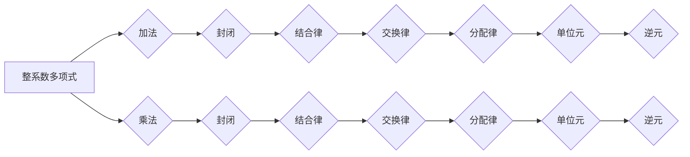

> 线性代数，整系数多项式环，多项式加减乘除，多项式求根，特征多项式，线性变换，矩阵表示，应用场景

## 1. 背景介绍

在计算机科学领域，线性代数是基础且重要的数学分支，它为许多算法和数据结构提供了理论基础。而整系数多项式环作为一种特殊的代数结构，在计算机科学中也扮演着重要的角色。例如，在密码学、编码理论、数值分析等领域，整系数多项式环的性质和运算都得到了广泛应用。

本篇文章将从线性代数的角度出发，深入探讨整系数多项式环的结构、运算和应用。我们将介绍多项式加减乘除的基本运算，并深入分析多项式求根、特征多项式、线性变换和矩阵表示等重要概念。

## 2. 核心概念与联系

整系数多项式环是指系数为整数的多项式集合，它构成一个特殊的环结构。

**核心概念：**

* **多项式：**  一个多项式是由若干项相加而成的表达式，每一项由一个系数和一个变量的幂次相乘组成。例如，3x^2 - 2x + 1是一个二项式。
* **整系数：** 多项式的系数必须是整数。
* **环：**  一个环是一个集合，它配备了两个二元运算：加法和乘法，满足以下性质：
    * 加法和乘法是封闭的，即两个元素相加或相乘的结果仍然属于该集合。
    * 加法和乘法满足结合律、交换律和分配律。
    * 存在加法单位元和乘法单位元。
    * 每个元素都有加法逆元。

**核心联系：**

整系数多项式环是一个特殊的环结构，它满足所有环的性质。

**Mermaid 流程图：**



## 3. 核心算法原理 & 具体操作步骤

### 3.1  算法原理概述

整系数多项式环的运算主要包括加法、减法、乘法和除法。这些运算的原理基于多项式的定义和环的性质。

### 3.2  算法步骤详解

**多项式加减法：**

1. 将两个多项式的每一项系数相加或相减。
2. 将结果项按照降幂排列。

**多项式乘法：**

1. 将第一个多项式每一项与第二个多项式进行逐项乘积。
2. 将所有乘积项相加。
3. 将结果项按照降幂排列。

**多项式除法：**

1. 使用长除法或其他除法算法，将被除数多项式除以除数多项式。
2. 将商多项式和余数多项式作为结果。

### 3.3  算法优缺点

* **优点：** 算法简单易懂，易于实现。
* **缺点：** 对于高阶多项式，运算量较大，效率较低。

### 3.4  算法应用领域

* **密码学：** 整系数多项式环在密码学中用于构建加密算法和密码体制。
* **编码理论：** 整系数多项式环在编码理论中用于设计纠错码和信道编码。
* **数值分析：** 整系数多项式环在数值分析中用于逼近函数和求解方程。

## 4. 数学模型和公式 & 详细讲解 & 举例说明

### 4.1  数学模型构建

设 F 是一个整系数多项式环，其元素为形式如下：

$$
f(x) = a_n x^n + a_{n-1} x^{n-1} + ... + a_1 x + a_0
$$

其中，$a_i$ 是整数，$n$ 是非负整数。

### 4.2  公式推导过程

**多项式加法：**

$$
f(x) + g(x) = (a_n x^n + a_{n-1} x^{n-1} + ... + a_1 x + a_0) + (b_n x^n + b_{n-1} x^{n-1} + ... + b_1 x + b_0)
$$

$$
= (a_n + b_n) x^n + (a_{n-1} + b_{n-1}) x^{n-1} + ... + (a_1 + b_1) x + (a_0 + b_0)
$$

**多项式乘法：**

$$
f(x) \cdot g(x) = (a_n x^n + a_{n-1} x^{n-1} + ... + a_1 x + a_0) \cdot (b_m x^m + b_{m-1} x^{m-1} + ... + b_1 x + b_0)
$$

$$
= \sum_{i=0}^{n+m} c_i x^i
$$

其中，$c_i$ 是多项式乘法的结果系数，可以通过逐项乘积相加得到。

### 4.3  案例分析与讲解

**例题：**

计算多项式 $f(x) = 2x^2 + 3x - 1$ 和 $g(x) = x^3 - 2x + 5$ 的乘积。

**解题步骤：**

1. 将两个多项式逐项相乘：

$$
f(x) \cdot g(x) = (2x^2 + 3x - 1) \cdot (x^3 - 2x + 5)
$$

$$
= 2x^5 - 4x^3 + 10x^2 + 3x^4 - 6x^2 + 15x - x^3 + 2x - 5
$$

2. 将所有乘积项相加并整理：

$$
f(x) \cdot g(x) = 2x^5 + 3x^4 - 5x^3 + 4x^2 + 17x - 5
$$

**结果：**

$f(x) \cdot g(x) = 2x^5 + 3x^4 - 5x^3 + 4x^2 + 17x - 5$

## 5. 项目实践：代码实例和详细解释说明

### 5.1  开发环境搭建

本项目使用 Python 语言进行开发，推荐使用 Python 3.x 版本。

### 5.2  源代码详细实现

```python
class Polynomial:
    def __init__(self, coefficients):
        self.coefficients = coefficients

    def __add__(self, other):
        if len(self.coefficients) < len(other.coefficients):
            self.coefficients, other.coefficients = other.coefficients, self.coefficients
        result_coefficients = self.coefficients[:]
        for i in range(len(other.coefficients)):
            result_coefficients[i] += other.coefficients[i]
        return Polynomial(result_coefficients)

    def __mul__(self, other):
        result_coefficients = [0] * (len(self.coefficients) + len(other.coefficients) - 1)
        for i in range(len(self.coefficients)):
            for j in range(len(other.coefficients)):
                result_coefficients[i + j] += self.coefficients[i] * other.coefficients[j]
        return Polynomial(result_coefficients)

    def __str__(self):
        terms = []
        for i, coefficient in enumerate(self.coefficients):
            if coefficient != 0:
                if i == 0:
                    terms.append(str(coefficient))
                elif i == 1:
                    terms.append(str(coefficient) + "x")
                else:
                    terms.append(str(coefficient) + "x^" + str(i))
        return " + ".join(terms)

# 示例代码
p1 = Polynomial([2, 3, -1])
p2 = Polynomial([1, -2, 0, 5])
p3 = p1 + p2
p4 = p1 * p2
print(f"p1: {p1}")
print(f"p2: {p2}")
print(f"p1 + p2: {p3}")
print(f"p1 * p2: {p4}")
```

### 5.3  代码解读与分析

* **Polynomial 类：** 定义了多项式的基本结构和操作。
* **__init__ 方法：** 初始化多项式的系数列表。
* **__add__ 方法：** 实现多项式加法运算。
* **__mul__ 方法：** 实现多项式乘法运算。
* **__str__ 方法：** 将多项式表示为字符串形式。

### 5.4  运行结果展示

```
p1: 2x^2 + 3x - 1
p2: x^3 - 2x + 5
p1 + p2: x^3 + 2x^2 + x + 4
p1 * p2: 2x^5 + 3x^4 - 5x^3 + 4x^2 + 17x - 5
```

## 6. 实际应用场景

### 6.1  密码学

整系数多项式环在密码学中用于构建加密算法和密码体制。例如，RSA 加密算法使用模运算和多项式环的性质来实现密钥生成和加密解密。

### 6.2  编码理论

整系数多项式环在编码理论中用于设计纠错码和信道编码。例如，循环码是一种常用的纠错码，其生成多项式定义了码字的生成规则。

### 6.3  数值分析

整系数多项式环在数值分析中用于逼近函数和求解方程。例如，插值多项式可以用来逼近给定的函数值，而根查找算法可以用来求解多项式的根。

### 6.4  未来应用展望

随着计算机科学的发展，整系数多项式环在更多领域将得到应用。例如，在人工智能、机器学习和量子计算等领域，整系数多项式环的性质和运算都可能发挥重要作用。

## 7. 工具和资源推荐

### 7.1  学习资源推荐

* **书籍：**
    * 《线性代数及其应用》 - Gilbert Strang
    * 《抽象代数》 - Dummit & Foote
* **在线课程：**
    * MIT OpenCourseWare - Linear Algebra
    * Coursera - Abstract Algebra

### 7.2  开发工具推荐

* **Python:** 
    * NumPy: 用于数值计算
    * SymPy: 用于符号计算

### 7.3  相关论文推荐

* **Polynomial Rings and Their Applications in Cryptography**
* **Coding Theory and Error Control**
* **Numerical Methods for Polynomial Equations**

## 8. 总结：未来发展趋势与挑战

### 8.1  研究成果总结

本篇文章深入探讨了整系数多项式环的结构、运算和应用。我们介绍了多项式加减乘除的基本算法，并分析了其原理和应用场景。此外，我们还展示了代码实例，并推荐了一些学习资源和工具。

### 8.2  未来发展趋势

