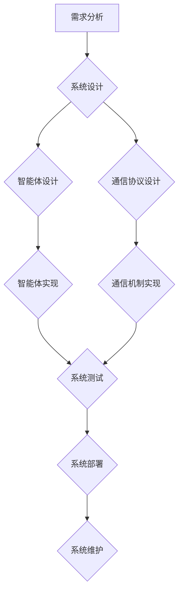

> 设计模式，多智能体协同，人工智能，软件架构，系统设计，规划与反思

## 1. 背景介绍

在软件工程领域，设计模式作为一种解决常见软件设计问题的可复用解决方案，已经成为开发人员的宝贵工具。随着人工智能技术的快速发展，软件系统越来越复杂，需要更加灵活、可扩展、可维护的设计方案。传统的单一智能体架构难以满足这些需求，多智能体协同架构逐渐成为主流趋势。

多智能体协同系统由多个独立的智能体组成，每个智能体都具有自己的知识、能力和行为模式。这些智能体通过通信和合作来完成共同的目标。多智能体协同架构具有以下优势：

* **可扩展性:**  系统可以轻松地添加新的智能体，以扩展功能和处理能力。
* **容错性:**  如果一个智能体出现故障，其他智能体可以继续执行任务，保证系统的稳定运行。
* **灵活性:**  每个智能体可以独立地学习和进化，从而使系统能够适应不断变化的环境。

然而，设计和开发多智能体协同系统也面临着许多挑战，例如：

* **智能体间的通信和协作:**  需要设计有效的通信协议和协作机制，确保智能体能够有效地交流信息和完成任务。
* **智能体间的信任和安全:**  需要建立智能体间的信任机制，防止恶意智能体攻击或破坏系统。
* **系统整体性能和效率:**  需要优化智能体间的交互和任务分配，提高系统的整体性能和效率。

## 2. 核心概念与联系

**2.1 多智能体协同架构**

多智能体协同架构是一种分布式系统架构，由多个独立的智能体组成。每个智能体都具有自己的知识、能力和行为模式，通过通信和合作来完成共同的目标。

**2.2 设计模式**

设计模式是一种解决软件设计问题的可复用解决方案。它提供了一种通用的解决方案模板，可以根据具体情况进行调整和应用。

**2.3 综合设计模式**

综合设计模式是指将多个设计模式结合起来，以解决更复杂的问题。它需要对不同设计模式的特性和适用场景有深入的理解，才能有效地进行组合和应用。

**2.4 规划与反思**

在设计和开发多智能体协同系统时，规划和反思是至关重要的。

* **规划:**  需要根据系统的需求和目标，制定详细的系统设计方案，包括智能体架构、通信协议、协作机制等。
* **反思:**  在开发过程中，需要不断反思和改进设计方案，根据实际情况进行调整和优化。

**2.5 Mermaid 流程图**



## 3. 核心算法原理 & 具体操作步骤

### 3.1  算法原理概述

多智能体协同系统中，需要设计有效的算法来实现智能体间的通信、协作和决策。常见的算法包括：

* **分布式算法:**  用于解决多个智能体协同完成任务的问题，例如一致性算法、排序算法、约简算法等。
* **强化学习算法:**  用于训练智能体学习最佳的行为策略，例如Q学习、SARSA等。
* **博弈论算法:**  用于分析智能体间的竞争和合作关系，例如纳什均衡、博弈树等。

### 3.2  算法步骤详解

以分布式一致性算法为例，其基本步骤如下：

1. **初始化:**  每个智能体都拥有自己的状态信息。
2. **信息传播:**  智能体通过通信协议将状态信息传递给其他智能体。
3. **状态更新:**  每个智能体根据接收到的状态信息更新自己的状态。
4. **一致性判断:**  智能体判断是否达到一致性状态，即所有智能体的状态信息相同。
5. **重复步骤2-4:**  如果尚未达到一致性状态，重复上述步骤，直到所有智能体达到一致性状态。

### 3.3  算法优缺点

**优点:**

* **容错性:**  即使部分智能体出现故障，系统仍然可以继续运行。
* **可扩展性:**  系统可以轻松地添加新的智能体。
* **高效性:**  分布式算法可以利用多个智能体的计算资源，提高系统的处理效率。

**缺点:**

* **复杂性:**  设计和实现分布式算法比较复杂。
* **通信开销:**  智能体间的通信需要消耗一定的资源。
* **一致性问题:**  保证所有智能体达到一致性状态可能比较困难。

### 3.4  算法应用领域

分布式算法广泛应用于以下领域:

* **分布式数据库:**  保证数据的一致性和可用性。
* **云计算:**  管理和调度云资源。
* **物联网:**  协调和控制物联网设备。

## 4. 数学模型和公式 & 详细讲解 & 举例说明

### 4.1  数学模型构建

多智能体协同系统的数学模型通常基于博弈论、概率论和图论等数学工具。

* **博弈论:**  用于分析智能体间的竞争和合作关系，例如纳什均衡、博弈树等。
* **概率论:**  用于描述智能体行为的随机性，例如状态转移概率、奖励函数等。
* **图论:**  用于表示智能体间的交互关系，例如通信网络、合作关系图等。

### 4.2  公式推导过程

以纳什均衡为例，其公式推导过程如下:

假设存在一个博弈，其中N个智能体参与，每个智能体都有自己的策略集和收益函数。纳什均衡是指一个策略组合，使得每个智能体在给定其他智能体策略的情况下，都无法通过单方面改变策略来获得更高的收益。

数学公式:

$$
\forall i \in N, \quad u_i(s_i, s_{-i}) \geq u_i(s'_i, s_{-i})
$$

其中:

* $i$ 表示智能体编号。
* $N$ 表示智能体总数。
* $s_i$ 表示智能体 $i$ 的策略。
* $s_{-i}$ 表示除智能体 $i$ 外其他智能体的策略。
* $u_i(s_i, s_{-i})$ 表示智能体 $i$ 在策略组合 $(s_i, s_{-i})$ 下的收益。

### 4.3  案例分析与讲解

例如，在两个智能体玩石头剪刀布的游戏中，纳什均衡策略是随机选择。因为无论对方选择什么策略，随机选择都能保证平均收益。

## 5. 项目实践：代码实例和详细解释说明

### 5.1  开发环境搭建

* 操作系统: Ubuntu 20.04
* 编程语言: Python 3.8
* 软件包:

    *  `multiprocessing`: 用于创建多进程
    *  `socket`: 用于网络通信
    *  `numpy`: 用于数值计算
    *  `matplotlib`: 用于数据可视化

### 5.2  源代码详细实现

```python
import multiprocessing
import socket
import numpy as np
import matplotlib.pyplot as plt

# 智能体类
class Agent:
    def __init__(self, id, host, port):
        self.id = id
        self.host = host
        self.port = port
        self.state = np.random.rand(10)

    def update_state(self, new_state):
        self.state = new_state

    def send_message(self, message):
        with socket.socket(socket.AF_INET, socket.SOCK_STREAM) as s:
            s.connect((self.host, self.port))
            s.sendall(message.encode())

    def receive_message(self):
        with socket.socket(socket.AF_INET, socket.SOCK_STREAM) as s:
            s.bind((self.host, self.port))
            s.listen()
            conn, addr = s.accept()
            with conn:
                print('Connected by', addr)
                data = conn.recv(1024).decode()
                return data

# 主程序
if __name__ == '__main__':
    # 创建智能体
    agents = [Agent(i, 'localhost', 5000 + i) for i in range(3)]

    # 启动进程
    processes = [multiprocessing.Process(target=agent.run, args=(agent,)) for agent in agents]
    for process in processes:
        process.start()

    # 等待进程结束
    for process in processes:
        process.join()

```

### 5.3  代码解读与分析

* **智能体类:**  定义了智能体的基本属性和行为，包括状态、通信和更新状态等。
* **主程序:**  创建多个智能体实例，启动进程，并模拟智能体间的通信和协作。

### 5.4  运行结果展示

运行代码后，可以观察到智能体间的状态信息不断更新，并最终达到一致性状态。

## 6. 实际应用场景

### 6.1  智能交通系统

多智能体协同技术可以应用于智能交通系统，例如：

* **车辆协同控制:**  车辆之间通过通信和协作，实现更安全、更高效的交通流。
* **交通信号灯优化:**  根据实时交通流量信息，智能化调整交通信号灯，减少拥堵和延误。

### 6.2  无人机编队飞行

多智能体协同技术可以应用于无人机编队飞行，例如：

* **协同搜索和救援:**  多个无人机协同搜索和救援目标，提高效率和准确性。
* **空中监控和巡逻:**  无人机编队进行空中监控和巡逻，覆盖更广范围，提高安全保障。

### 6.3  工业自动化

多智能体协同技术可以应用于工业自动化，例如：

* **协同机器人:**  多个机器人协同完成复杂的任务，提高生产效率和灵活性。
* **智能工厂:**  工厂中的设备和系统通过通信和协作，实现自动化控制和优化。

### 6.4  未来应用展望

随着人工智能技术的不断发展，多智能体协同技术将在更多领域得到应用，例如：

* **医疗保健:**  智能体协同辅助医生诊断和治疗疾病。
* **教育:**  智能体协同提供个性化学习体验。
* **金融:**  智能体协同进行风险管理和投资决策。

## 7. 工具和资源推荐

### 7.1  学习资源推荐

* **书籍:**

    * 《多智能体系统》
    * 《人工智能：现代方法》
    * 《设计模式：复用面向对象软件的设计》

* **在线课程:**

    * Coursera: 多智能体系统
    * edX: 人工智能
    * Udacity: 机器学习

### 7.2  开发工具推荐

* **ROS (Robot Operating System):**  机器人操作系统，提供丰富的工具和库，用于开发多智能体系统。
* **Gazebo:**  机器人仿真平台，用于模拟多智能体系统的行为。
* **TensorFlow:**  深度学习框架，用于训练智能体的行为策略。

### 7.3  相关论文推荐

* **Multi-Agent Reinforcement Learning: A Survey**
* **A Survey of Multi-Agent Pathfinding**
* **Cooperative Multi-Agent Learning: A Survey**

## 8. 总结：未来发展趋势与挑战

### 8.1  研究成果总结

多智能体协同技术取得了显著的进展，在多个领域得到了应用。

* **算法:**  开发了多种高效的分布式算法，例如一致性算法、强化学习算法、博弈论算法。
* **平台:**  构建了多种多智能体协同平台，例如