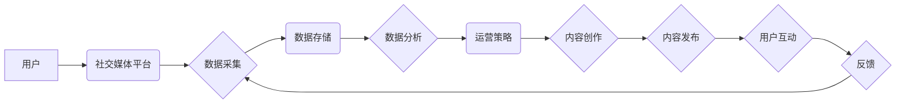

> 自动化、创业、社交媒体、运营、人工智能、机器学习、数据分析、内容创作、用户互动

## 1. 背景介绍

在当今数字时代，社交媒体已成为企业营销、品牌建设和用户互动不可或缺的一部分。对于创业公司来说，有效利用社交媒体平台可以帮助他们快速提升品牌知名度、拓展用户群体、建立忠诚客户群。然而，社交媒体运营工作量巨大，需要持续发布高质量内容、与用户进行互动、分析数据并进行优化，这对于创业公司来说往往是一个巨大的挑战。

自动化社交媒体运营应运而生，它利用人工智能、机器学习等技术，自动完成社交媒体运营的许多重复性任务，例如内容创作、发布、互动、分析等，从而解放创业团队的时间和精力，让他们能够专注于更重要的战略性工作。

## 2. 核心概念与联系

**2.1 社交媒体运营自动化**

社交媒体运营自动化是指利用技术手段，自动完成社交媒体运营的各种任务，例如：

* **内容创作:** 利用人工智能技术自动生成社交媒体内容，例如文案、图片、视频等。
* **内容发布:** 自动根据预设的时间表或触发条件，将内容发布到社交媒体平台。
* **用户互动:** 自动回复用户评论、私信等，进行简单的用户互动。
* **数据分析:** 自动收集和分析社交媒体数据，例如用户行为、内容表现等，并生成报告。

**2.2 核心技术**

社交媒体运营自动化主要依赖以下核心技术：

* **人工智能 (AI):**  人工智能技术可以帮助自动完成内容创作、用户互动等任务。
* **机器学习 (ML):** 机器学习算法可以从海量数据中学习，并自动优化运营策略。
* **自然语言处理 (NLP):** 自然语言处理技术可以帮助理解和生成人类语言，从而实现更自然的用户互动。
* **数据分析:** 数据分析技术可以帮助分析社交媒体数据，并从中发现有价值的 insights。

**2.3 架构图**



## 3. 核心算法原理 & 具体操作步骤

### 3.1 算法原理概述

社交媒体运营自动化算法的核心是利用机器学习技术，从历史数据中学习用户行为模式、内容表现趋势等，并根据这些模式预测未来用户需求和内容表现，从而自动完成内容创作、发布、互动等任务。

常见的算法包括：

* **推荐算法:**  根据用户的兴趣爱好和历史行为，推荐相关的内容。
* **内容生成算法:**  利用自然语言处理技术，自动生成符合特定主题和风格的内容。
* **互动分析算法:**  分析用户评论、点赞、转发等行为，识别用户情绪和反馈，并自动生成相应的回复。

### 3.2 算法步骤详解

1. **数据收集:** 收集社交媒体平台上的用户数据、内容数据、互动数据等。
2. **数据预处理:** 对收集到的数据进行清洗、转换、格式化等处理，使其适合算法训练。
3. **特征提取:** 从数据中提取有价值的特征，例如用户年龄、性别、兴趣爱好、内容主题、情感倾向等。
4. **模型训练:** 利用机器学习算法，对训练数据进行训练，建立预测模型。
5. **模型评估:** 对训练好的模型进行评估，测试其预测准确率和性能。
6. **模型部署:** 将训练好的模型部署到生产环境中，用于自动完成社交媒体运营任务。

### 3.3 算法优缺点

**优点:**

* **提高效率:** 自动化运营可以解放人力，提高运营效率。
* **个性化体验:**  根据用户数据，提供个性化的内容和互动体验。
* **数据驱动:**  通过数据分析，优化运营策略，提升运营效果。

**缺点:**

* **数据依赖:**  算法效果依赖于数据质量和数量。
* **缺乏创意:**  自动化内容创作可能缺乏创意和个性。
* **伦理风险:**  算法可能存在偏见或歧视，需要谨慎使用。

### 3.4 算法应用领域

* **内容营销:** 自动生成和发布营销内容，提高品牌曝光度。
* **客户服务:** 自动回复用户咨询，提高客户满意度。
* **用户关系管理:**  分析用户行为，识别潜在客户，进行精准营销。
* **品牌监测:**  监控品牌相关话题，及时应对负面舆情。

## 4. 数学模型和公式 & 详细讲解 & 举例说明

### 4.1 数学模型构建

社交媒体运营自动化算法通常使用以下数学模型：

* **推荐系统:**  基于协同过滤、内容过滤、深度学习等算法，预测用户对特定内容的兴趣。
* **内容生成模型:**  基于循环神经网络 (RNN) 或 Transformer 等模型，生成符合特定主题和风格的内容。
* **用户互动预测模型:**  基于时间序列分析、机器学习等算法，预测用户对特定内容的互动行为。

### 4.2 公式推导过程

推荐系统中的协同过滤算法，例如基于用户的协同过滤，可以利用以下公式计算用户对物品的评分预测：

$$
\hat{r}_{u,i} = \bar{r}_u + \frac{\sum_{v \in N(u)} (r_{v,i} - \bar{r}_v) * sim(u,v)}{\sum_{v \in N(u)} sim(u,v)}
$$

其中：

* $\hat{r}_{u,i}$: 用户 $u$ 对物品 $i$ 的评分预测
* $\bar{r}_u$: 用户 $u$ 的平均评分
* $r_{v,i}$: 用户 $v$ 对物品 $i$ 的真实评分
* $N(u)$: 用户 $u$ 的邻居用户集合
* $sim(u,v)$: 用户 $u$ 和 $v$ 之间的相似度

### 4.3 案例分析与讲解

假设我们有一个电商平台，想要推荐用户购买商品。我们可以利用协同过滤算法，根据用户的购买历史和商品的评分数据，预测用户对特定商品的兴趣。

例如，如果用户 A 和用户 B 都购买了商品 X 和商品 Y，并且对这两个商品的评分都较高，那么我们可以认为用户 A 和用户 B 的兴趣相似。如果用户 A 对商品 Z 表现出兴趣，那么我们可以预测用户 B 也可能对商品 Z 感兴趣。

## 5. 项目实践：代码实例和详细解释说明

### 5.1 开发环境搭建

* **操作系统:**  Windows/macOS/Linux
* **编程语言:**  Python
* **开发工具:**  VS Code/PyCharm
* **库依赖:**  pandas, numpy, scikit-learn, tensorflow/pytorch

### 5.2 源代码详细实现

```python
# 导入必要的库
import pandas as pd
from sklearn.metrics.pairwise import cosine_similarity

# 加载用户评分数据
ratings_data = pd.read_csv('ratings.csv')

# 计算用户-物品评分矩阵
user_item_matrix = ratings_data.pivot_table(index='user_id', columns='item_id', values='rating')

# 计算用户相似度矩阵
user_similarity = cosine_similarity(user_item_matrix)

# 获取用户 A 的 ID
user_a_id = 1

# 获取用户 A 的邻居用户
neighbors = user_similarity[user_a_id].argsort()[:-10:-1]

# 预测用户 A 对物品 B 的评分
item_b_id = 10
predicted_rating = user_item_matrix.loc[user_a_id, item_b_id] + sum(
    (user_item_matrix.loc[neighbor, item_b_id] - user_item_matrix.loc[neighbor, :].mean()) * user_similarity[user_a_id][neighbor]
    for neighbor in neighbors
) / sum(user_similarity[user_a_id][neighbor] for neighbor in neighbors)

# 打印预测评分
print(f'预测用户 {user_a_id} 对物品 {item_b_id} 的评分: {predicted_rating}')
```

### 5.3 代码解读与分析

这段代码实现了基于用户的协同过滤算法，用于预测用户对特定商品的评分。

首先，我们加载用户评分数据，并计算用户-物品评分矩阵。然后，我们使用余弦相似度计算用户之间的相似度，并获取用户 A 的邻居用户。最后，我们利用邻居用户的评分信息，预测用户 A 对物品 B 的评分。

### 5.4 运行结果展示

运行代码后，会输出用户 A 对物品 B 的预测评分。

## 6. 实际应用场景

### 6.1 内容推荐

社交媒体平台可以利用自动化算法，根据用户的兴趣爱好和浏览历史，推荐相关的内容，例如新闻、视频、文章等。

### 6.2 个性化营销

电商平台可以利用自动化算法，根据用户的购买历史和浏览记录，推送个性化的营销信息，例如优惠券、促销活动等。

### 6.3 用户互动

社交媒体平台可以利用自动化算法，自动回复用户评论、私信等，进行简单的用户互动，提高用户体验。

### 6.4 未来应用展望

随着人工智能技术的不断发展，社交媒体运营自动化将更加智能化、个性化和自动化。未来，我们可以期待看到以下应用场景：

* **智能内容创作:**  利用人工智能技术，自动生成更具创意和吸引力的内容。
* **个性化用户体验:**  根据用户的行为和偏好，提供更加个性化的内容和互动体验。
* **数据驱动的运营策略:**  利用数据分析，更加精准地制定运营策略，提升运营效果。

## 7. 工具和资源推荐

### 7.1 学习资源推荐

* **书籍:**
    * 《深度学习》
    * 《机器学习实战》
    * 《自然语言处理入门》
* **在线课程:**
    * Coursera: 深度学习、机器学习
    * edX: 自然语言处理
    * Udacity: 人工智能工程师

### 7.2 开发工具推荐

* **Python:**  Python 是机器学习和人工智能领域最常用的编程语言。
* **TensorFlow/PyTorch:**  TensorFlow 和 PyTorch 是深度学习框架，用于构建和训练神经网络模型。
* **Scikit-learn:**  Scikit-learn 是机器学习库，提供各种机器学习算法和工具。

### 7.3 相关论文推荐

* **Attention Is All You Need:**  Transformer 模型的论文
* **BERT: Pre-training of Deep Bidirectional Transformers for Language Understanding:**  BERT 模型的论文
* **Generative Adversarial Networks:**  生成对抗网络的论文

## 8. 总结：未来发展趋势与挑战

### 8.1 研究成果总结

社交媒体运营自动化技术取得了显著的进展，能够有效提高运营效率、个性化用户体验和数据驱动决策。

### 8.2 未来发展趋势

* **更智能化的算法:**  利用更先进的机器学习算法，例如深度学习、强化学习等，构建更智能的运营模型。
* **更个性化的体验:**  根据用户的行为和偏好，提供更加个性化的内容和互动体验。
* **更全面的数据分析:**  收集和分析更全面的数据，例如用户情绪、行为意图等，进行更深入的分析和洞察。

### 8.3 面临的挑战

* **数据隐私和安全:**  社交媒体运营自动化需要处理大量用户数据，需要确保数据隐私和安全。
* **算法偏见和歧视:**  算法可能存在偏见或歧视，需要进行公平性和可解释性的研究。
* **技术伦理:**  社交媒体运营自动化需要考虑技术伦理问题，例如算法的透明度、责任归属等。

### 8.4 研究展望

未来，社交媒体运营自动化将继续朝着更智能化、个性化和自动化方向发展，需要进一步研究算法的公平性、可解释性和伦理问题，确保其