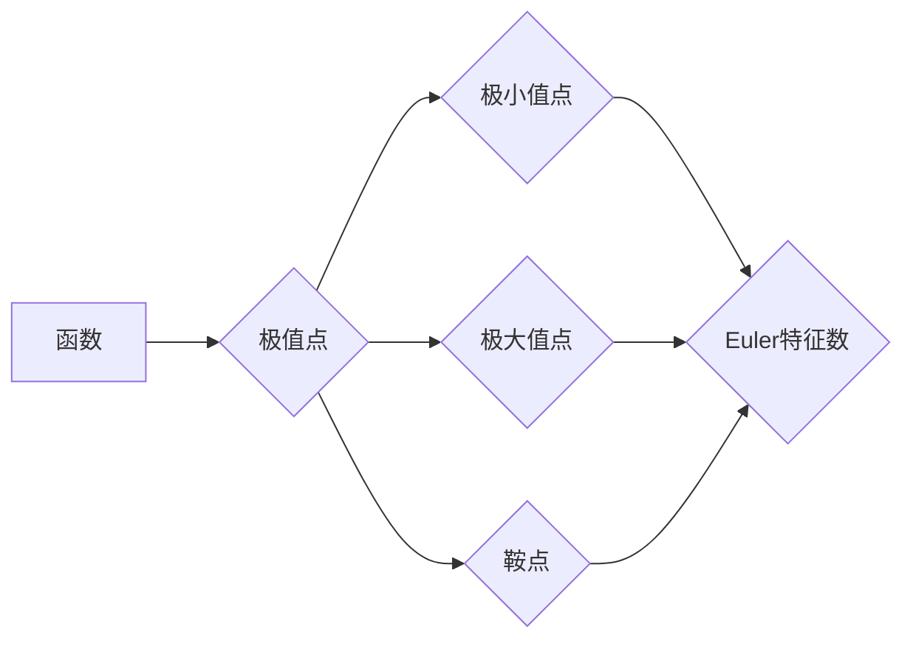

> 莫尔斯理论，Euler特征数，最小值，鞍点，Morse函数，拓扑学，机器学习，数据分析

## 1. 背景介绍

在数学和计算机科学领域，莫尔斯理论是一个重要的概念，它将微分几何和拓扑学联系起来，并为理解复杂系统提供了新的视角。莫尔斯理论的核心思想是通过分析函数的极值点来研究函数的拓扑结构。

Euler特征数是拓扑学中的一个重要概念，它可以用来描述空间的“孔洞”数量。对于一个简单闭合曲面，Euler特征数等于其顶点数减去边数加上面数。

在机器学习和数据分析领域，莫尔斯理论和Euler特征数被用来分析高维数据，识别模式和结构，并进行数据降维。

## 2. 核心概念与联系

### 2.1 莫尔斯理论

莫尔斯理论的核心是研究函数的极值点，即函数的驻点。驻点可以分为极小值点、极大值点和鞍点。莫尔斯理论指出，函数的拓扑结构与它的极值点密切相关。

### 2.2 Euler特征数

Euler特征数是一个拓扑不变量，它可以用来描述空间的“孔洞”数量。对于一个简单闭合曲面，Euler特征数等于其顶点数减去边数加上面数。

### 2.3 联系

莫尔斯理论和Euler特征数之间的联系在于，可以通过分析函数的极值点来计算其Euler特征数。

**Mermaid 流程图**



## 3. 核心算法原理 & 具体操作步骤

### 3.1 算法原理概述

莫尔斯理论的应用通常涉及以下步骤：

1. 选择一个合适的Morse函数。
2. 计算函数的极值点。
3. 根据极值点的类型和分布，构建函数的拓扑结构。
4. 计算Euler特征数。

### 3.2 算法步骤详解

1. **选择Morse函数:**

Morse函数是一种具有许多极值点的函数。选择合适的Morse函数取决于具体的应用场景。

2. **计算极值点:**

可以使用数值方法，例如梯度下降法，来计算函数的极值点。

3. **构建拓扑结构:**

根据极值点的类型和分布，可以构建函数的拓扑结构。例如，极小值点可以表示为“洞”，极大值点可以表示为“山峰”，鞍点可以表示为“山谷”。

4. **计算Euler特征数:**

可以使用Morse理论中的公式来计算函数的Euler特征数。

### 3.3 算法优缺点

**优点:**

* 可以有效地分析复杂系统的拓扑结构。
* 可以识别模式和结构。
* 可以进行数据降维。

**缺点:**

* 需要选择合适的Morse函数。
* 计算极值点可能需要耗费大量时间和计算资源。

### 3.4 算法应用领域

* 机器学习
* 数据分析
* 图像处理
* 信号处理
* 药物设计

## 4. 数学模型和公式 & 详细讲解 & 举例说明

### 4.1 数学模型构建

莫尔斯理论的核心是将函数的极值点与拓扑结构联系起来。

假设我们有一个函数 $f: \mathbb{R}^n \rightarrow \mathbb{R}$，其中 $n$ 是函数的输入维度。

我们可以定义函数的极值点为：

$$
\nabla f(x) = 0
$$

其中 $\nabla f(x)$ 是函数 $f$ 在点 $x$ 的梯度。

### 4.2 公式推导过程

Euler特征数可以用来描述空间的“孔洞”数量。对于一个简单闭合曲面，Euler特征数等于其顶点数减去边数加上面数。

对于一个Morse函数，其Euler特征数可以表示为：

$$
\chi(f) = \sum_{i=1}^{k} (-1)^{i} \text{dim}(M_i)
$$

其中：

* $\chi(f)$ 是函数 $f$ 的Euler特征数。
* $k$ 是函数 $f$ 的极值点的数量。
* $M_i$ 是函数 $f$ 的第 $i$ 个极值点的稳定流形。
* $\text{dim}(M_i)$ 是稳定流形 $M_i$ 的维数。

### 4.3 案例分析与讲解

**例子:**

考虑一个简单的Morse函数 $f(x, y) = x^2 + y^2$。

这个函数只有一个极小值点 $(0, 0)$，其稳定流形是二维平面。

因此，函数 $f$ 的Euler特征数为：

$$
\chi(f) = (-1)^1 \cdot 2 = -2
$$

## 5. 项目实践：代码实例和详细解释说明

### 5.1 开发环境搭建

* Python 3.x
* NumPy
* SciPy
* Matplotlib

### 5.2 源代码详细实现

```python
import numpy as np
from scipy.optimize import minimize

def f(x):
  return x[0]**2 + x[1]**2

def gradient(x):
  return np.array([2*x[0], 2*x[1]])

# 寻找极值点
result = minimize(f, [1, 1], method='BFGS', jac=gradient)
x_min = result.x

# 绘制函数图像
x = np.linspace(-2, 2, 100)
y = np.linspace(-2, 2, 100)
X, Y = np.meshgrid(x, y)
Z = X**2 + Y**2

import matplotlib.pyplot as plt
plt.contourf(X, Y, Z)
plt.plot(x_min[0], x_min[1], 'ro')
plt.title('Morse Function')
plt.xlabel('x')
plt.ylabel('y')
plt.show()
```

### 5.3 代码解读与分析

* 函数 `f(x)` 定义了Morse函数。
* 函数 `gradient(x)` 计算函数的梯度。
* 使用 `scipy.optimize.minimize` 函数寻找极值点。
* 使用 `matplotlib.pyplot` 绘制函数图像并标注极值点。

### 5.4 运行结果展示

运行代码后，会生成一个包含Morse函数图像和极值点的图形。

## 6. 实际应用场景

### 6.1 机器学习

莫尔斯理论和Euler特征数可以用于特征提取和数据降维。

例如，可以将高维数据映射到低维空间，并保留数据的拓扑结构。

### 6.2 数据分析

莫尔斯理论可以用于分析复杂数据的结构和模式。

例如，可以识别数据中的“洞”和“山峰”，并进行聚类分析。

### 6.3 图像处理

莫尔斯理论可以用于图像分割和目标检测。

例如，可以利用图像的拓扑结构来识别图像中的物体。

### 6.4 未来应用展望

莫尔斯理论和Euler特征数在未来将有更广泛的应用，例如：

* 药物设计
* 材料科学
* 生物信息学

## 7. 工具和资源推荐

### 7.1 学习资源推荐

* **书籍:**

* Morse Theory by John Milnor
* Topology by James Munkres

* **在线课程:**

* MIT OpenCourseWare: Topology
* Coursera: Introduction to Topology

### 7.2 开发工具推荐

* Python
* NumPy
* SciPy
* Matplotlib

### 7.3 相关论文推荐

* Morse Theory and Data Analysis
* Topological Data Analysis: A Review
* Applications of Morse Theory in Machine Learning

## 8. 总结：未来发展趋势与挑战

### 8.1 研究成果总结

莫尔斯理论和Euler特征数为理解复杂系统提供了新的视角，并为机器学习、数据分析等领域提供了新的工具。

### 8.2 未来发展趋势

未来，莫尔斯理论和Euler特征数的研究将继续深入，并应用于更多领域。

例如，可以开发新的算法和工具，以更有效地分析复杂数据，并进行更深入的拓扑分析。

### 8.3 面临的挑战

* 如何选择合适的Morse函数。
* 如何计算高维数据的Euler特征数。
* 如何将莫尔斯理论应用于更复杂的系统。

### 8.4 研究展望

未来，莫尔斯理论和Euler特征数的研究将继续深入，并为我们理解复杂世界提供新的见解。

## 9. 附录：常见问题与解答

* **什么是Morse函数？**

Morse函数是一种具有许多极值点的函数。

* **如何计算Euler特征数？**

Euler特征数可以表示为：

$$
\chi(f) = \sum_{i=1}^{k} (-1)^{i} \text{dim}(M_i)
$$

其中：

* $\chi(f)$ 是函数 $f$ 的Euler特征数。
* $k$ 是函数 $f$ 的极值点的数量。
* $M_i$ 是函数 $f$ 的第 $i$ 个极值点的稳定流形。
* $\text{dim}(M_i)$ 是稳定流形 $M_i$ 的维数。

* **莫尔斯理论有什么应用？**

莫尔斯理论的应用领域包括机器学习、数据分析、图像处理等。

作者：禅与计算机程序设计艺术 / Zen and the Art of Computer Programming


<end_of_turn>