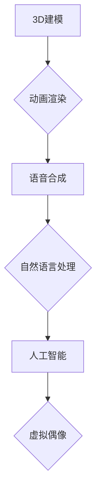

> 虚拟偶像、数字人、人工智能、计算机视觉、自然语言处理、商业价值

## 1. 背景介绍

近年来，虚拟偶像（Virtual Idol）作为一种新兴的数字娱乐形式，迅速崛起并引发了广泛关注。虚拟偶像是指利用计算机技术创造出的虚拟形象，拥有独立的个性、故事和粉丝群体。与传统明星不同，虚拟偶像不受时间和空间限制，可以随时随地进行表演和互动，拥有无限的可能性。

虚拟偶像的出现，是人工智能、计算机视觉、自然语言处理等技术的快速发展的结果。这些技术赋予虚拟偶像以逼真的外貌、流畅的肢体动作和自然的语言表达能力，使其能够与观众产生更深层次的共鸣。

## 2. 核心概念与联系

虚拟偶像的构建和运营涉及多个核心概念和技术，包括：

* **3D建模:**  创建虚拟偶像的虚拟形象，包括外貌、服装、动作等。
* **动画渲染:**  赋予虚拟偶像生命力，使其能够进行流畅的动作和表情变化。
* **语音合成:**  为虚拟偶像生成逼真的语音，使其能够进行对话和演唱。
* **自然语言处理:**  使虚拟偶像能够理解和回应用户的语言输入，进行自然流畅的互动。
* **人工智能:**  赋予虚拟偶像一定的智能，使其能够学习用户喜好，个性化互动。

**核心概念与联系流程图:**



## 3. 核心算法原理 & 具体操作步骤

### 3.1  算法原理概述

虚拟偶像的构建和运营涉及多种算法，包括：

* **3D建模算法:**  用于创建虚拟偶像的虚拟形象，常用的算法包括 NURBS 曲面建模、 Subdivision 算法等。
* **动画渲染算法:**  用于赋予虚拟偶像生命力，常用的算法包括骨骼动画、物理模拟等。
* **语音合成算法:**  用于生成逼真的语音，常用的算法包括声码器、声纹合成等。
* **自然语言处理算法:**  用于使虚拟偶像能够理解和回应用户的语言输入，常用的算法包括词性标注、依存句法分析、机器翻译等。
* **人工智能算法:**  用于赋予虚拟偶像一定的智能，常用的算法包括深度学习、强化学习等。

### 3.2  算法步骤详解

以语音合成算法为例，详细说明其操作步骤：

1. **文本预处理:** 将用户输入的文本进行预处理，例如去除标点符号、规范化词汇等。
2. **语音合成模型训练:** 使用深度学习算法训练语音合成模型，模型需要学习语音的声学特征和语义信息。
3. **语音参数生成:** 将预处理后的文本输入到训练好的语音合成模型中，模型会生成语音参数，例如音调、音长、音量等。
4. **语音信号合成:** 使用语音合成引擎将生成的语音参数转换为音频信号。
5. **音频处理:** 对合成后的音频信号进行处理，例如降噪、均衡等，使其更加自然流畅。

### 3.3  算法优缺点

每个算法都有其优缺点，需要根据实际应用场景选择合适的算法。

* **3D建模算法:**  优点是能够创建逼真的虚拟形象，缺点是建模过程复杂，需要专业的技能和软件。
* **动画渲染算法:**  优点是能够赋予虚拟偶像流畅的动作和表情变化，缺点是渲染过程耗时，需要强大的硬件支持。
* **语音合成算法:**  优点是能够生成逼真的语音，缺点是语音合成效果仍然存在一定的局限性，例如情感表达不够丰富。
* **自然语言处理算法:**  优点是能够使虚拟偶像理解和回应用户的语言输入，缺点是自然语言理解仍然是一个复杂的问题，需要不断改进算法和模型。
* **人工智能算法:**  优点是能够赋予虚拟偶像一定的智能，缺点是人工智能技术还处于发展阶段，虚拟偶像的智能水平有限。

### 3.4  算法应用领域

虚拟偶像相关的算法广泛应用于多个领域，例如：

* **娱乐:**  虚拟偶像可以用于制作动画、游戏、音乐等娱乐内容。
* **教育:**  虚拟偶像可以作为教学助手，帮助学生学习知识。
* **营销:**  虚拟偶像可以作为品牌代言人，进行产品推广。
* **医疗:**  虚拟偶像可以用于模拟手术、提供医疗咨询等。

## 4. 数学模型和公式 & 详细讲解 & 举例说明

### 4.1  数学模型构建

虚拟偶像的构建和运营涉及多种数学模型，例如：

* **3D建模数学模型:**  用于描述虚拟偶像的几何形状，常用的模型包括 B-样条曲线、NURBS 曲面等。
* **动画渲染数学模型:**  用于描述虚拟偶像的动作和表情变化，常用的模型包括骨骼动画、物理模拟等。
* **语音合成数学模型:**  用于描述语音的声学特征，常用的模型包括 Mel-Frequency Cepstral Coefficients (MFCC)、Hidden Markov Models (HMM) 等。
* **自然语言处理数学模型:**  用于描述语言的语法和语义信息，常用的模型包括词嵌入、深度神经网络等。

### 4.2  公式推导过程

以语音合成为例，MFCC 是一种常用的语音特征提取方法，其计算公式如下：

$$
MFCC_i = \frac{1}{T} \sum_{t=0}^{T-1} \log \left( \frac{S_i(t)}{S_{i-1}(t)} \right)
$$

其中：

* $MFCC_i$ 表示第 $i$ 个 MFCC 特征值。
* $T$ 表示语音信号的长度。
* $S_i(t)$ 表示第 $i$ 个 Mel 滤波器的输出信号。

### 4.3  案例分析与讲解

通过 MFCC 特征提取，可以将语音信号转换为一系列数字特征，这些特征可以用于训练语音合成模型。例如，可以使用 MFCC 特征训练一个基于深度学习的语音合成模型，该模型能够生成逼真的语音。

## 5. 项目实践：代码实例和详细解释说明

### 5.1  开发环境搭建

虚拟偶像的开发需要搭建相应的开发环境，包括：

* **操作系统:**  Windows、macOS 或 Linux。
* **编程语言:**  Python、C++ 或 Java。
* **软件工具:**  3D建模软件、动画渲染软件、语音合成引擎、自然语言处理库等。

### 5.2  源代码详细实现

以下是一个简单的虚拟偶像代码示例，使用 Python 和 TensorFlow 库实现语音合成功能：

```python
import tensorflow as tf

# 加载预训练的语音合成模型
model = tf.keras.models.load_model('voice_synthesis_model.h5')

# 将文本转换为 MFCC 特征
text = '你好，世界！'
mfccs = text_to_mfccs(text)

# 使用模型生成语音
audio = model.predict(mfccs)

# 保存生成的语音文件
save_audio(audio, 'output.wav')
```

### 5.3  代码解读与分析

* `tf.keras.models.load_model()` 函数用于加载预训练的语音合成模型。
* `text_to_mfccs()` 函数用于将文本转换为 MFCC 特征。
* `model.predict()` 函数用于使用模型生成语音。
* `save_audio()` 函数用于保存生成的语音文件。

### 5.4  运行结果展示

运行上述代码后，将生成一个名为 `output.wav` 的语音文件，包含虚拟偶像的语音。

## 6. 实际应用场景

虚拟偶像的应用场景非常广泛，例如：

* **娱乐:**  虚拟偶像可以用于制作动画、游戏、音乐等娱乐内容，例如日本流行的虚拟歌手 Hatsune Miku。
* **教育:**  虚拟偶像可以作为教学助手，帮助学生学习知识，例如美国教育公司 Duolingo 使用虚拟偶像教授语言。
* **营销:**  虚拟偶像可以作为品牌代言人，进行产品推广，例如日本汽车公司 Nissan 使用虚拟偶像推广其新车。
* **医疗:**  虚拟偶像可以用于模拟手术、提供医疗咨询等，例如美国医疗公司 Johns Hopkins 使用虚拟偶像进行医疗培训。

### 6.4  未来应用展望

未来，虚拟偶像的应用场景将更加广泛，例如：

* **社交:**  虚拟偶像可以作为虚拟朋友，陪伴用户聊天、玩游戏等。
* **个性化服务:**  虚拟偶像可以根据用户的喜好，提供个性化的服务，例如推荐商品、提供生活建议等。
* **虚拟世界:**  虚拟偶像可以作为虚拟世界的居民，与用户互动、参与活动等。

## 7. 工具和资源推荐

### 7.1  学习资源推荐

* **书籍:**  《虚拟偶像的商业价值》、《人工智能与虚拟偶像》
* **在线课程:**  Coursera、edX 等平台上的虚拟偶像相关课程
* **博客:**  AI 相关的技术博客，例如 OpenAI、Google AI 等

### 7.2  开发工具推荐

* **3D建模软件:**  Blender、Maya、3ds Max
* **动画渲染软件:**  Unity、Unreal Engine
* **语音合成引擎:**  Google Cloud Text-to-Speech、Amazon Polly
* **自然语言处理库:**  NLTK、spaCy、Hugging Face Transformers

### 7.3  相关论文推荐

* **虚拟偶像的生成与应用研究**
* **基于深度学习的虚拟偶像语音合成技术**
* **虚拟偶像的社会影响与伦理问题**

## 8. 总结：未来发展趋势与挑战

### 8.1  研究成果总结

虚拟偶像技术近年来取得了显著进展，从最初的静态形象到如今的逼真互动，虚拟偶像已经成为数字娱乐、教育、营销等领域的热门应用。

### 8.2  未来发展趋势

未来，虚拟偶像技术将朝着以下方向发展：

* **更加逼真的虚拟形象:**  利用更先进的 3D 建模和动画渲染技术，创造更加逼真的虚拟形象。
* **更智能的虚拟交互:**  利用人工智能技术，赋予虚拟偶像更强的智能，使其能够进行更自然、更人性化的交互。
* **更广泛的应用场景:**  虚拟偶像将应用于更多领域，例如医疗、教育、金融等。

### 8.3  面临的挑战

虚拟偶像技术也面临着一些挑战，例如：

* **技术瓶颈:**  虚拟偶像的构建和运营需要整合多种技术，技术瓶颈仍然存在。
* **伦理问题:**  虚拟偶像的出现引发了一些伦理问题，例如虚假信息传播、隐私泄露等。
* **市场接受度:**  虚拟偶像的市场接受度仍然有限，需要进一步的推广和教育。

### 8.4  研究展望

未来，虚拟偶像技术将继续发展，并对我们的生活产生越来越大的影响。我们需要积极探索虚拟偶像技术的应用潜力，同时也要关注其带来的伦理问题，确保虚拟偶像技术能够健康、可持续地发展。

## 9. 附录：常见问题与解答

* **什么是虚拟偶像？**

虚拟偶像是指利用计算机技术创造出的虚拟形象，拥有独立的个性、故事和粉丝群体。

* **虚拟偶像的优势是什么？**

虚拟偶像不受时间和空间限制，可以随时随地进行表演和互动，拥有无限的可能性。

* **如何创建虚拟偶像？**

创建虚拟偶像需要整合多种技术，包括 3D 建模、动画渲染、语音合成、自然语言处理等。

* **虚拟偶像的应用场景有哪些？**

虚拟偶像的应用场景非常广泛，例如娱乐、教育、营销、医疗等。

* **虚拟偶像的未来发展趋势是什么？**

未来，虚拟偶像技术将朝着更加逼真、更加智能、更加广泛的应用方向发展。


作者：禅与计算机程序设计艺术 / Zen and the Art of Computer Programming 
<end_of_turn>