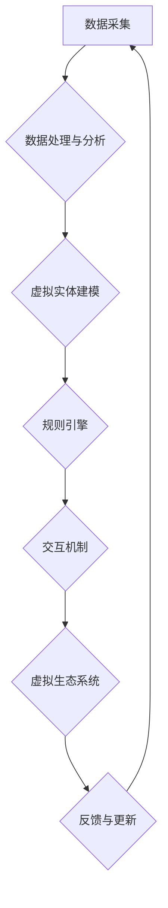

> 虚拟生态系统，AI，数字孪生，元宇宙，智能算法，机器学习，深度学习，数据驱动，可持续发展

## 1. 背景介绍

数字世界正在以惊人的速度发展，从增强现实到虚拟现实，再到元宇宙，我们正处于一个前所未有的技术变革时代。在这个过程中，虚拟生态系统（VES）作为构建数字世界的基石，扮演着越来越重要的角色。VES是指由虚拟实体、规则和交互机制组成的复杂系统，能够模拟现实世界或创造全新的虚拟世界。

传统的虚拟世界往往是静态的，缺乏生命力和可持续性。而AI驱动的VES则能够打破这些局限，通过智能算法和机器学习，赋予虚拟世界以自主性、适应性和演化能力。

## 2. 核心概念与联系

**2.1 虚拟生态系统 (VES)**

VES是一个由虚拟实体、规则和交互机制组成的复杂系统，能够模拟现实世界或创造全新的虚拟世界。

**2.2 数字孪生 (Digital Twin)**

数字孪生是指一个虚拟的、实时更新的模型，能够反映现实世界中的物理实体、过程和行为。

**2.3 元宇宙 (Metaverse)**

元宇宙是一个由多个虚拟世界连接起来的沉浸式、交互式、持久化的数字空间。

**2.4 AI驱动的VES架构**



**2.5 核心概念联系**

* 数字孪生可以作为VES的基础，提供真实世界的基础数据和模型。
* 元宇宙可以作为VES的应用场景，提供一个广阔的虚拟空间。
* AI算法可以赋予VES智能，使其能够自主学习、适应和演化。

## 3. 核心算法原理 & 具体操作步骤

**3.1 算法原理概述**

AI驱动的VES的核心算法包括：

* **机器学习 (Machine Learning)**：用于从数据中学习模式和规律，从而使VES能够自主学习和适应环境。
* **深度学习 (Deep Learning)**：一种更高级的机器学习方法，能够处理更复杂的数据，例如图像、语音和文本。
* **强化学习 (Reinforcement Learning)**：通过奖励和惩罚机制，训练VES做出最优决策。

**3.2 算法步骤详解**

1. **数据采集**: 从现实世界或虚拟世界中收集数据，例如传感器数据、用户行为数据、环境数据等。
2. **数据预处理**: 对收集到的数据进行清洗、转换和特征提取，使其能够被算法理解和处理。
3. **模型训练**: 使用机器学习、深度学习或强化学习算法，训练一个能够模拟VES行为的模型。
4. **模型评估**: 使用测试数据评估模型的性能，并根据评估结果进行模型调整和优化。
5. **模型部署**: 将训练好的模型部署到VES中，使其能够实时运行并控制虚拟实体的行为。

**3.3 算法优缺点**

* **优点**: 能够赋予VES智能，使其能够自主学习、适应和演化。
* **缺点**: 需要大量的训练数据，训练过程可能很耗时和耗能。

**3.4 算法应用领域**

* **虚拟城市规划**: 使用AI模拟城市发展，优化交通规划和资源分配。
* **虚拟医疗**: 使用AI模拟人体器官，进行疾病诊断和治疗方案模拟。
* **虚拟教育**: 使用AI创建个性化学习体验，提高学习效率。

## 4. 数学模型和公式 & 详细讲解 & 举例说明

**4.1 数学模型构建**

VES的数学模型可以基于以下几个方面构建：

* **实体模型**: 描述虚拟实体的属性、状态和行为。
* **交互模型**: 描述虚拟实体之间和环境之间的交互关系。
* **规则模型**: 描述虚拟世界中的规则和约束条件。

**4.2 公式推导过程**

例如，我们可以使用马尔可夫链模型来描述虚拟实体的状态转移过程。

$$
P(s_t|s_{t-1}) = \alpha_{s_{t-1},s_t}
$$

其中：

* $P(s_t|s_{t-1})$ 表示在时间步 $t$ 状态为 $s_t$ 的概率，给定时间步 $t-1$ 状态为 $s_{t-1}$。
* $\alpha_{s_{t-1},s_t}$ 表示从状态 $s_{t-1}$ 到状态 $s_t$ 的转移概率。

**4.3 案例分析与讲解**

例如，我们可以使用马尔可夫链模型来模拟虚拟动物在虚拟草场中的移动行为。

* 状态 $s_t$ 可以表示动物在草场中的位置。
* 转移概率 $\alpha_{s_{t-1},s_t}$ 可以根据动物的移动规则和环境因素来确定。

通过训练马尔可夫链模型，我们可以预测动物在未来时间步的移动轨迹。

## 5. 项目实践：代码实例和详细解释说明

**5.1 开发环境搭建**

* 操作系统：Ubuntu 20.04
* 编程语言：Python 3.8
* 库依赖：TensorFlow, PyTorch, NumPy, Pandas

**5.2 源代码详细实现**

```python
import tensorflow as tf

# 定义虚拟实体的模型
class VirtualEntity(tf.keras.Model):
    def __init__(self):
        super(VirtualEntity, self).__init__()
        self.dense1 = tf.keras.layers.Dense(128, activation='relu')
        self.dense2 = tf.keras.layers.Dense(64, activation='relu')
        self.output = tf.keras.layers.Dense(1)

    def call(self, inputs):
        x = self.dense1(inputs)
        x = self.dense2(x)
        return self.output(x)

# 实例化虚拟实体模型
entity = VirtualEntity()

# 加载训练数据
(x_train, y_train), (x_test, y_test) = tf.keras.datasets.mnist.load_data()

# 训练模型
entity.compile(optimizer='adam', loss='mse')
entity.fit(x_train, y_train, epochs=10)

# 评估模型
loss = entity.evaluate(x_test, y_test)
print('Loss:', loss)
```

**5.3 代码解读与分析**

* 该代码示例展示了如何使用TensorFlow框架构建一个简单的虚拟实体模型。
* 模型输入是一个图像，输出是一个标量值，可以表示实体的状态或行为。
* 模型使用两层全连接神经网络，并使用均方误差损失函数进行训练。

**5.4 运行结果展示**

训练完成后，我们可以使用训练好的模型对新的图像进行预测，并观察模型的输出结果。

## 6. 实际应用场景

**6.1 虚拟城市规划**

* 使用AI模拟城市发展，优化交通规划和资源分配。
* 创建虚拟城市模型，进行城市规划和管理的模拟实验。

**6.2 虚拟医疗**

* 使用AI模拟人体器官，进行疾病诊断和治疗方案模拟。
* 创建虚拟病人模型，进行医学训练和研究。

**6.3 虚拟教育**

* 使用AI创建个性化学习体验，提高学习效率。
* 创建虚拟课堂环境，进行沉浸式教学和互动学习。

**6.4 未来应用展望**

* **更逼真的虚拟体验**: 通过更先进的AI算法和渲染技术，创造更逼真的虚拟世界。
* **更智能的虚拟实体**: 通过更复杂的AI模型，赋予虚拟实体更智能的行为和决策能力。
* **更广泛的应用场景**: 将VES应用于更多领域，例如游戏、娱乐、商业、科学研究等。

## 7. 工具和资源推荐

**7.1 学习资源推荐**

* **书籍**:
    * 《深度学习》
    * 《机器学习实战》
    * 《人工智能：一种现代方法》
* **在线课程**:
    * Coursera: 深度学习
    * edX: 机器学习
    * Udacity: AI Nanodegree

**7.2 开发工具推荐**

* **TensorFlow**: 开源深度学习框架
* **PyTorch**: 开源深度学习框架
* **Unity**: 游戏引擎，支持虚拟现实和增强现实开发
* **Unreal Engine**: 游戏引擎，支持虚拟现实和增强现实开发

**7.3 相关论文推荐**

* **Generative Adversarial Networks**
* **Deep Reinforcement Learning**
* **Virtual Reality and Augmented Reality for Education**

## 8. 总结：未来发展趋势与挑战

**8.1 研究成果总结**

AI驱动的VES技术取得了显著进展，为构建更智能、更逼真、更具交互性的虚拟世界提供了强大的工具。

**8.2 未来发展趋势**

* **更强大的AI算法**: 发展更强大的AI算法，赋予虚拟实体更智能的行为和决策能力。
* **更逼真的虚拟体验**: 通过更先进的渲染技术和交互方式，创造更逼真的虚拟体验。
* **更广泛的应用场景**: 将VES应用于更多领域，例如医疗、教育、商业等。

**8.3 面临的挑战**

* **数据获取和处理**: 训练AI模型需要大量的训练数据，获取和处理这些数据是一个挑战。
* **算法复杂度**: 训练复杂的AI模型需要强大的计算能力，这对于资源有限的机构来说是一个挑战。
* **伦理问题**: AI驱动的VES可能会引发一些伦理问题，例如虚拟世界中的隐私保护和责任归属等。

**8.4 研究展望**

未来，我们将继续致力于研究AI驱动的VES技术，探索其在更多领域中的应用潜力，并积极应对技术发展带来的挑战。

## 9. 附录：常见问题与解答

**9.1 如何构建一个虚拟生态系统？**

构建一个虚拟生态系统需要考虑以下几个方面：

* **定义虚拟世界的目标和范围**: 确定虚拟世界的主题、功能和目标用户。
* **设计虚拟实体**: 确定虚拟世界的组成部分，例如虚拟生物、虚拟物体、虚拟环境等。
* **构建交互机制**: 设计虚拟实体之间的交互规则和行为模式。
* **实现规则引擎**: 编写代码实现虚拟世界的规则和约束条件。
* **测试和优化**: 对虚拟生态系统进行测试和优化，确保其稳定性和可玩性。

**9.2 如何使用AI赋予虚拟实体智能？**

可以使用机器学习、深度学习或强化学习算法来赋予虚拟实体智能。

* **机器学习**: 可以训练模型识别虚拟实体的状态和行为模式，并根据这些模式做出预测。
* **深度学习**: 可以训练更复杂的模型，例如卷积神经网络或循环神经网络，以处理更复杂的数据，例如图像、语音和文本。
* **强化学习**: 可以训练模型通过奖励和惩罚机制学习最佳的行为策略。


作者：禅与计算机程序设计艺术 / Zen and the Art of Computer Programming 
<end_of_turn>