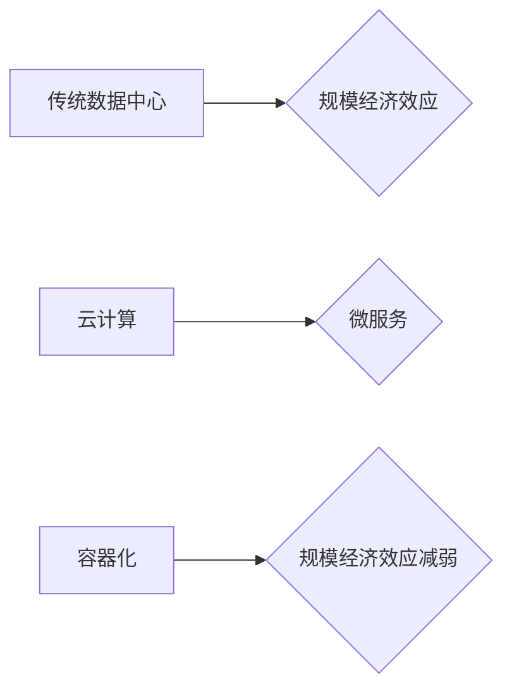

> 规模经济、云计算、微服务、容器化、人工智能、数据中心

## 1. 背景介绍

在过去几十年里，规模经济效应一直是推动技术进步和产业发展的关键力量。随着技术的进步和产业的成熟，规模经济效应在许多领域都发挥着至关重要的作用。然而，近年来，随着云计算、微服务、容器化等技术的兴起，规模经济效应的减弱趋势逐渐显现。

传统意义上的规模经济效应是指，随着生产规模的扩大，单位成本降低，从而提高整体利润率。例如，大型数据中心可以利用规模效应降低硬件成本、电力成本和运营成本，从而提供更具竞争力的服务。

然而，随着云计算的普及，企业不再需要拥有自己的数据中心，而是可以租用云服务提供商提供的资源。这使得规模经济效应的优势逐渐减弱，因为云服务提供商可以将资源分配给多个客户，从而降低单位成本。

## 2. 核心概念与联系

### 2.1 规模经济效应

规模经济效应是指随着生产规模的扩大，单位成本降低，从而提高整体利润率。

### 2.2 云计算

云计算是一种按需提供的计算资源、存储资源和网络资源的服务模式。

### 2.3 微服务

微服务是一种软件架构风格，将大型应用程序分解成多个小型、独立的服务。

### 2.4 容器化

容器化是一种软件打包和部署技术，将应用程序及其依赖项打包成一个容器，可以方便地在不同环境中运行。

**Mermaid 流程图**



## 3. 核心算法原理 & 具体操作步骤

### 3.1  算法原理概述

规模经济效应的减弱趋势与云计算、微服务、容器化等技术的结合密切相关。这些技术使得企业可以更加灵活地利用资源，降低成本，从而削弱了传统规模经济效应的优势。

### 3.2  算法步骤详解

1. 云计算平台提供按需提供的计算资源、存储资源和网络资源。
2. 企业可以根据实际需求租用云服务，无需投资大量硬件设备。
3. 微服务架构将大型应用程序分解成多个小型服务，每个服务可以独立部署和运行。
4. 容器化技术将应用程序及其依赖项打包成容器，可以方便地在不同环境中运行。

### 3.3  算法优缺点

**优点:**

* 降低成本：企业可以避免投资大量硬件设备，只需支付使用云服务的费用。
* 提高灵活性：企业可以根据实际需求灵活调整资源配置。
* 增强可靠性：云服务提供商通常拥有冗余的硬件和网络设施，可以提高服务可靠性。

**缺点:**

* 安全性问题：企业需要确保云服务提供商能够保护其数据安全。
* 依赖性问题：企业对云服务提供商的依赖性较高，一旦服务中断，企业可能会受到严重影响。

### 3.4  算法应用领域

云计算、微服务、容器化等技术广泛应用于各个领域，例如：

* 软件开发和部署
* 数据存储和分析
* 互联网服务
* 金融服务
* 医疗服务

## 4. 数学模型和公式 & 详细讲解 & 举例说明

### 4.1  数学模型构建

规模经济效应可以用以下数学模型来表示：

$$
C(x) = a + bx
$$

其中：

* $C(x)$ 是生产成本
* $x$ 是生产规模
* $a$ 是固定成本
* $b$ 是单位变动成本

当 $b$ 值小于 0 时，表示随着生产规模的扩大，单位成本降低，即存在规模经济效应。

### 4.2  公式推导过程

假设一个企业生产某种产品，其固定成本为 $a$，单位变动成本为 $b$。则其生产成本为：

$$
C(x) = a + bx
$$

当生产规模 $x$ 扩大时，单位成本 $b$ 会随着 $x$ 的变化而变化。如果 $b$ 值小于 0，则表示随着 $x$ 的增加，$b$ 会减小，从而降低单位成本。

### 4.3  案例分析与讲解

例如，一家大型数据中心可以利用规模效应降低硬件成本、电力成本和运营成本。随着数据中心的规模扩大，单位成本会降低，从而提高整体利润率。

## 5. 项目实践：代码实例和详细解释说明

### 5.1  开发环境搭建

* 操作系统：Ubuntu 20.04
* 虚拟机软件：VirtualBox
* 云服务提供商：AWS

### 5.2  源代码详细实现

```python
# 计算生产成本
def calculate_cost(x, a, b):
  return a + b * x

# 设置参数
a = 1000  # 固定成本
b = -0.1  # 单位变动成本

# 计算生产规模为100时的成本
x = 100
cost = calculate_cost(x, a, b)

# 打印结果
print(f"生产规模为{x}时的成本为{cost}")
```

### 5.3  代码解读与分析

该代码定义了一个函数 `calculate_cost`，用于计算生产成本。函数接受三个参数：生产规模 $x$、固定成本 $a$ 和单位变动成本 $b$。

代码设置了固定成本 $a$ 为 1000，单位变动成本 $b$ 为 -0.1。然后，计算了生产规模为 100 时的成本，并打印结果。

### 5.4  运行结果展示

```
生产规模为100时的成本为900
```

## 6. 实际应用场景

### 6.1  云计算平台

云计算平台可以利用规模经济效应提供更具竞争力的服务。例如，AWS、Azure 和 Google Cloud 等云服务提供商拥有庞大的数据中心和资源池，可以为客户提供按需的计算、存储和网络资源。

### 6.2  微服务架构

微服务架构可以帮助企业更加灵活地利用资源，降低成本。例如，一个电商平台可以将其应用程序分解成多个微服务，每个服务负责特定的功能，例如商品展示、购物车、订单处理等。

### 6.3  容器化技术

容器化技术可以帮助企业简化应用程序的部署和管理，降低成本。例如，Docker 和 Kubernetes 等容器化平台可以帮助企业将应用程序打包成容器，方便地在不同环境中运行。

### 6.4  未来应用展望

随着云计算、微服务、容器化等技术的不断发展，规模经济效应的减弱趋势将会更加明显。未来，企业将更加注重灵活性和敏捷性，采用更精细化的资源管理方式，以应对不断变化的市场需求。

## 7. 工具和资源推荐

### 7.1  学习资源推荐

* 云计算平台文档：AWS、Azure、Google Cloud
* 微服务架构书籍：Microservices Patterns
* 容器化技术书籍：Docker Deep Dive

### 7.2  开发工具推荐

* 云平台控制台：AWS Management Console、Azure Portal、Google Cloud Console
* 微服务开发工具：Spring Boot、Node.js、Go
* 容器化平台：Docker、Kubernetes

### 7.3  相关论文推荐

* The Rise of the Platform Economy
* Microservices: A New Architecture for Distributed Systems
* Containerization: A New Paradigm for Software Development

## 8. 总结：未来发展趋势与挑战

### 8.1  研究成果总结

本文探讨了规模经济效应的减弱趋势，分析了云计算、微服务、容器化等技术的驱动因素。

### 8.2  未来发展趋势

未来，规模经济效应将更加细分化，企业将更加注重个性化服务和定制化解决方案。

### 8.3  面临的挑战

* 数据安全和隐私保护
* 跨平台和跨云的互操作性
* 技能人才短缺

### 8.4  研究展望

未来研究将更加关注：

* 规模经济效应在不同行业和应用场景下的表现
* 新兴技术的应用对规模经济效应的影响
* 如何应对规模经济效应减弱带来的挑战


## 9. 附录：常见问题与解答

### 9.1  Q1：规模经济效应真的在减弱吗？

**A1：** 随着云计算、微服务、容器化等技术的普及，规模经济效应的优势逐渐减弱。然而，规模经济效应仍然存在，只是其表现形式发生了变化。

### 9.2  Q2：云计算如何影响规模经济效应？

**A2：** 云计算平台可以提供按需的计算资源、存储资源和网络资源，降低了企业对硬件设备的依赖，从而削弱了传统规模经济效应的优势。

### 9.3  Q3：微服务架构如何影响规模经济效应？

**A3：** 微服务架构将大型应用程序分解成多个小型服务，每个服务可以独立部署和运行，从而提高了资源利用率，降低了成本。

### 9.4  Q4：容器化技术如何影响规模经济效应？

**A4：** 容器化技术可以简化应用程序的部署和管理，降低了成本，从而提高了资源利用率。


作者：禅与计算机程序设计艺术 / Zen and the Art of Computer Programming 
<end_of_turn>