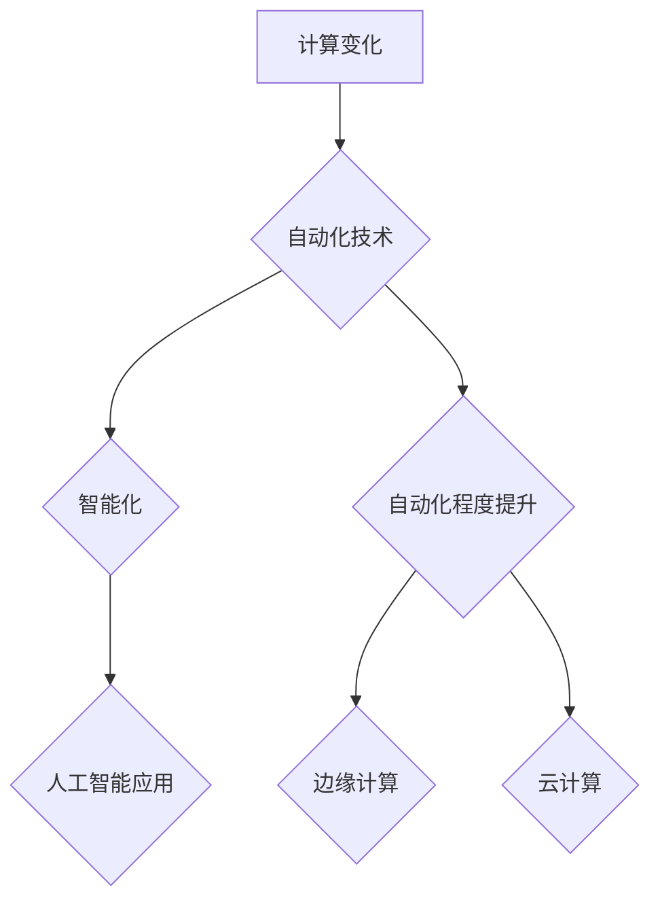

> 计算变化、自动化技术、人工智能、机器学习、深度学习、流程自动化、软件开发、效率提升、未来趋势

## 1. 背景介绍

在当今科技飞速发展的时代，计算能力的不断提升和自动化技术的蓬勃发展，正在深刻地改变着我们的生活和工作方式。从智能手机到自动驾驶汽车，从个性化推荐到医疗诊断，自动化技术已经渗透到各个领域，为人类社会带来了前所未有的便利和效率。

计算变化是指计算能力的不断增强和应用范围的不断扩展。随着摩尔定律的持续发展，计算机处理器性能不断提升，存储容量不断扩大，网络带宽不断提高。这些计算能力的提升为自动化技术的应用提供了坚实的基础。

自动化技术是指利用计算机和软件程序，自动完成一些原本需要人工完成的任务。自动化技术可以提高效率、降低成本、减少错误，并释放人类的生产力，使其能够专注于更具创造性和战略性的工作。

## 2. 核心概念与联系

**2.1 计算变化与自动化技术的相互促进**

计算变化和自动化技术是相互促进、相互依存的。计算能力的提升为自动化技术的应用提供了基础，而自动化技术的应用又推动了计算能力的进一步发展。

**2.2 自动化技术的发展趋势**

自动化技术的发展趋势是朝着更加智能化、自动化程度更高的方向发展。

* **人工智能 (AI) 的应用:** 人工智能技术，特别是深度学习技术，正在被广泛应用于自动化领域，赋予自动化系统更强的智能和适应能力。
* **边缘计算的兴起:** 边缘计算将计算能力部署到更靠近数据源的位置，可以降低延迟，提高实时性，为更复杂的自动化应用提供支持。
* **云计算的普及:** 云计算平台为自动化应用提供了弹性、可扩展的计算资源，降低了部署和维护成本。

**2.3 流程图**



## 3. 核心算法原理 & 具体操作步骤

**3.1 算法原理概述**

自动化技术的核心是算法，算法是解决特定问题的步骤或规则。不同的自动化应用需要不同的算法。例如，图像识别需要使用卷积神经网络算法，自然语言处理需要使用循环神经网络算法。

**3.2 算法步骤详解**

算法的步骤通常包括以下几个方面：

* **数据采集和预处理:** 收集相关数据，并进行清洗、转换、格式化等预处理操作。
* **特征提取:** 从数据中提取有用的特征，这些特征可以是数字特征、文本特征、图像特征等。
* **模型训练:** 使用训练数据训练算法模型，使模型能够学习数据中的规律。
* **模型评估:** 使用测试数据评估模型的性能，并进行调整和优化。
* **模型部署:** 将训练好的模型部署到实际应用环境中，用于处理新的数据。

**3.3 算法优缺点**

不同的算法有不同的优缺点，需要根据具体应用场景选择合适的算法。例如，深度学习算法具有强大的学习能力，但需要大量的训练数据和计算资源。

**3.4 算法应用领域**

自动化技术应用领域非常广泛，包括：

* **制造业:** 自动化生产线、机器人操作、质量检测等。
* **金融业:** 风险管理、欺诈检测、客户服务等。
* **医疗保健:** 疾病诊断、药物研发、患者管理等。
* **交通运输:** 自动驾驶汽车、交通流量管理等。

## 4. 数学模型和公式 & 详细讲解 & 举例说明

**4.1 数学模型构建**

在自动化技术中，数学模型是描述系统行为和关系的工具。例如，在控制系统中，可以使用数学模型来描述系统的动力学特性，并设计相应的控制算法。

**4.2 公式推导过程**

数学模型的构建通常需要进行公式推导过程，例如，在机器学习中，可以使用梯度下降算法来优化模型参数，其公式推导过程如下：

$$
\theta = \theta - \alpha \nabla J(\theta)
$$

其中：

* $\theta$ 是模型参数
* $\alpha$ 是学习率
* $\nabla J(\theta)$ 是损失函数 $J(\theta)$ 的梯度

**4.3 案例分析与讲解**

例如，在图像识别任务中，可以使用卷积神经网络模型来识别图像中的物体。卷积神经网络模型的结构和参数可以通过训练数据进行优化，从而提高识别准确率。

## 5. 项目实践：代码实例和详细解释说明

**5.1 开发环境搭建**

自动化技术开发通常需要使用特定的开发环境，例如，Python 语言的开发环境需要安装 Python 解释器、相关库和工具。

**5.2 源代码详细实现**

以下是一个简单的 Python 代码示例，演示了如何使用 Python 库实现一个简单的自动化任务：

```python
import time

def send_email(to, subject, body):
    # 发送邮件代码
    print(f"发送邮件到 {to}，主题：{subject}")

def schedule_task(task, interval):
    while True:
        task()
        time.sleep(interval)

if __name__ == "__main__":
    schedule_task(send_email, 60)
```

**5.3 代码解读与分析**

这段代码定义了两个函数：`send_email` 用于发送邮件，`schedule_task` 用于定时执行任务。

**5.4 运行结果展示**

运行这段代码后，程序会每隔 60 秒发送一次邮件。

## 6. 实际应用场景

**6.1 自动化测试**

自动化测试是指使用软件工具自动执行测试用例，以验证软件的质量和功能。自动化测试可以提高测试效率，降低测试成本，并确保软件的稳定性和可靠性。

**6.2 流程自动化**

流程自动化是指使用软件工具自动执行重复性的业务流程，例如，订单处理、发票生成、合同审批等。流程自动化可以提高工作效率，减少人为错误，并释放人力资源。

**6.3 数据分析**

数据分析是指使用工具和技术对数据进行收集、清洗、分析和可视化，以发现数据中的规律和趋势。自动化技术可以帮助自动化数据收集、清洗和分析过程，提高数据分析效率。

**6.4 未来应用展望**

随着计算能力和自动化技术的不断发展，自动化技术将在未来应用领域更加广泛，例如：

* **个性化定制:** 自动化技术可以根据用户的需求和喜好，提供个性化的产品、服务和体验。
* **智能家居:** 自动化技术可以使家居环境更加智能化，例如，自动控制灯光、温度、安全等。
* **医疗保健:** 自动化技术可以帮助医生进行更精准的诊断和治疗，并提高患者的生存率。

## 7. 工具和资源推荐

**7.1 学习资源推荐**

* **在线课程:** Coursera、edX、Udacity 等平台提供丰富的自动化技术课程。
* **书籍:** 《自动化测试的艺术》、《流程自动化实践》、《机器学习实战》等书籍。
* **博客和论坛:** 关注自动化技术领域的博客和论坛，例如，Stack Overflow、GitHub 等。

**7.2 开发工具推荐**

* **Python:** Python 是一种流行的编程语言，广泛应用于自动化技术开发。
* **Robot Framework:** Robot Framework 是一种自动化测试框架，支持多种测试用例类型。
* **UiPath:** UiPath 是一个流程自动化平台，可以帮助自动化桌面应用程序和网站操作。

**7.3 相关论文推荐**

* **深度学习论文:** 《ImageNet Classification with Deep Convolutional Neural Networks》
* **流程自动化论文:** 《A Survey of Workflow Management Systems》

## 8. 总结：未来发展趋势与挑战

**8.1 研究成果总结**

自动化技术已经取得了显著的成果，在各个领域都得到了广泛应用。

**8.2 未来发展趋势**

自动化技术将朝着更加智能化、自动化程度更高的方向发展，例如：

* **人工智能的进一步融合:** 人工智能技术将更加深入地融入自动化系统，赋予自动化系统更强的智能和适应能力。
* **边缘计算的普及:** 边缘计算将为更复杂的自动化应用提供支持，例如，自动驾驶汽车、工业自动化等。
* **云计算的扩展:** 云计算平台将为自动化应用提供更加弹性和可扩展的计算资源。

**8.3 面临的挑战**

自动化技术的发展也面临着一些挑战，例如：

* **数据安全和隐私保护:** 自动化系统需要处理大量的数据，因此数据安全和隐私保护是一个重要的挑战。
* **算法偏见:** 算法模型可能存在偏见，导致自动化系统产生不公平的结果。
* **伦理问题:** 自动化技术的发展可能会带来一些伦理问题，例如，工作岗位的替代、人工智能的控制等。

**8.4 研究展望**

未来，自动化技术的研究将更加注重以下方面：

* **开发更加安全、可靠、可解释的自动化算法。**
* **解决自动化技术带来的伦理问题。**
* **探索自动化技术在更多领域的新应用。**

## 9. 附录：常见问题与解答

**9.1 如何选择合适的自动化工具？**

选择合适的自动化工具需要根据具体的应用场景和需求进行考虑。例如，如果需要自动化测试，可以选择 Robot Framework 或 Selenium 等工具。如果需要自动化流程，可以选择 UiPath 或 Automation Anywhere 等工具。

**9.2 如何避免自动化算法的偏见？**

避免自动化算法的偏见需要从数据收集、算法设计和模型训练等各个环节进行控制。例如，可以使用多样化的训练数据，设计更加公平的算法模型，并定期评估模型的偏见情况。


作者：禅与计算机程序设计艺术 / Zen and the Art of Computer Programming 
<end_of_turn>