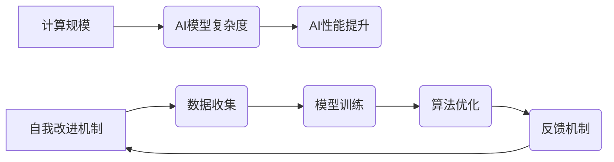

> 计算规模、自我改进、人工智能、算法、模型、数据、效率、可扩展性

## 1. 背景介绍

在信息时代，计算能力的飞速发展推动着人工智能（AI）的蓬勃发展。从语音识别到图像生成，AI已经渗透到我们生活的方方面面。然而，随着AI应用的不断深入，我们面临着新的挑战：如何构建更强大、更智能的AI系统？

传统AI系统通常依赖于人工设计的算法和模型，其性能受限于人类的认知和设计能力。而自我改进的AI系统则具有打破这一局限性的潜力。自我改进AI系统能够通过不断学习和优化自身算法和模型，从而提升自身的性能，最终实现超越人类智能的可能。

## 2. 核心概念与联系

**2.1 计算规模理论**

计算规模理论认为，计算能力的增长是推动AI发展的重要驱动力。随着计算资源的不断增加，我们可以训练更复杂、更强大的AI模型，从而实现更精细、更智能的应用。

**2.2 自我改进机制**

自我改进机制是指AI系统能够通过自身学习和优化，不断提升自身性能的过程。这通常涉及以下几个关键环节：

* **数据收集和分析:** AI系统需要从海量数据中学习，并从中提取有价值的信息。
* **模型训练和评估:** 基于收集到的数据，AI系统需要训练和评估不同的模型，选择性能最佳的模型。
* **算法优化:** AI系统可以利用机器学习算法，对自身算法进行优化，提高模型的效率和准确性。
* **反馈机制:** AI系统需要建立反馈机制，将学习到的知识和经验反馈到自身模型中，从而实现持续改进。

**2.3 核心概念关系图**



## 3. 核心算法原理 & 具体操作步骤

**3.1 算法原理概述**

自我改进AI系统通常采用强化学习算法，通过与环境交互，学习最优的策略。强化学习算法的核心思想是通过奖励机制，引导AI系统朝着目标方向学习。

**3.2 算法步骤详解**

1. **环境建模:** 建立一个模拟真实世界的环境，以便AI系统可以进行交互和学习。
2. **状态定义:** 定义环境中可能出现的各种状态，例如游戏中的棋盘状态或机器人运动状态。
3. **动作空间:** 定义AI系统可以执行的动作，例如在游戏中下棋或机器人移动。
4. **奖励函数:** 定义一个奖励函数，根据AI系统执行的动作和环境状态，给予相应的奖励或惩罚。
5. **策略学习:** 使用强化学习算法，例如Q学习或深度强化学习，学习一个策略，该策略能够最大化累积奖励。

**3.3 算法优缺点**

**优点:**

* 可以学习复杂的任务，无需人工设计规则。
* 可以适应不断变化的环境。
* 可以实现持续改进。

**缺点:**

* 训练时间长，需要大量的计算资源。
* 奖励函数的设计至关重要，如果设计不当，可能会导致AI系统学习到错误的策略。

**3.4 算法应用领域**

* 游戏AI
* 机器人控制
* 自动驾驶
* 金融交易
*医疗诊断

## 4. 数学模型和公式 & 详细讲解 & 举例说明

**4.1 数学模型构建**

强化学习的数学模型通常基于马尔可夫决策过程（MDP）。MDP由以下几个要素组成：

* 状态空间 S：环境中可能出现的各种状态。
* 动作空间 A：AI系统可以执行的动作。
* 转移概率矩阵 P：描述从一个状态到另一个状态的概率。
* 奖励函数 R：根据状态和动作，给予相应的奖励。
* 折扣因子 γ：控制未来奖励的权重。

**4.2 公式推导过程**

强化学习的目标是找到一个策略 π，该策略能够最大化累积奖励。可以使用Bellman方程来描述策略价值函数 Vπ(s)：

$$Vπ(s) = R(s, a) + γ \sum_{s'} P(s' | s, a) Vπ(s')$$

其中：

* Vπ(s) 是策略 π 下状态 s 的价值函数。
* R(s, a) 是状态 s 下执行动作 a 的奖励。
* P(s' | s, a) 是从状态 s 执行动作 a 到状态 s' 的转移概率。
* γ 是折扣因子。

**4.3 案例分析与讲解**

例如，在玩游戏时，AI系统可以将游戏状态作为状态空间，可以执行的动作作为动作空间，游戏规则作为转移概率矩阵，游戏得分作为奖励函数。通过学习Bellman方程，AI系统可以找到最优策略，从而获得更高的游戏得分。

## 5. 项目实践：代码实例和详细解释说明

**5.1 开发环境搭建**

* Python 3.x
* TensorFlow 或 PyTorch
* Jupyter Notebook

**5.2 源代码详细实现**

```python
import tensorflow as tf

# 定义模型
model = tf.keras.Sequential([
    tf.keras.layers.Dense(128, activation='relu'),
    tf.keras.layers.Dense(64, activation='relu'),
    tf.keras.layers.Dense(1)
])

# 定义损失函数和优化器
loss_fn = tf.keras.losses.MeanSquaredError()
optimizer = tf.keras.optimizers.Adam()

# 训练模型
for epoch in range(100):
    for batch in data:
        with tf.GradientTape() as tape:
            predictions = model(batch)
            loss = loss_fn(batch, predictions)
        gradients = tape.gradient(loss, model.trainable_variables)
        optimizer.apply_gradients(zip(gradients, model.trainable_variables))

# 评估模型
loss = loss_fn(test_data, model(test_data))
print(f'Loss: {loss}')
```

**5.3 代码解读与分析**

这段代码实现了简单的强化学习模型。模型使用多层感知机结构，损失函数为均方误差，优化器为Adam。训练过程迭代地更新模型参数，以最小化损失函数。

**5.4 运行结果展示**

训练完成后，可以评估模型的性能，例如计算损失函数的值。

## 6. 实际应用场景

**6.1 游戏AI**

自我改进AI可以学习玩各种游戏，例如围棋、象棋和电子游戏。通过不断学习和优化策略，AI可以超越人类玩家。

**6.2 机器人控制**

自我改进AI可以用于控制机器人，使其能够在复杂环境中自主导航和执行任务。例如，可以训练机器人学习如何避开障碍物、抓取物体和完成组装任务。

**6.3 自动驾驶**

自我改进AI可以用于开发自动驾驶汽车，使其能够感知周围环境、做出决策并安全驾驶。

**6.4 未来应用展望**

自我改进AI的应用前景广阔，未来可能在以下领域发挥重要作用：

* **医疗诊断:** 帮助医生诊断疾病，提高诊断准确率。
* **金融交易:** 自动化交易策略，提高投资收益。
* **科学研究:** 加速科学发现，解决复杂问题。

## 7. 工具和资源推荐

**7.1 学习资源推荐**

* **书籍:**
    * Reinforcement Learning: An Introduction by Richard S. Sutton and Andrew G. Barto
    * Deep Reinforcement Learning Hands-On by Maxim Lapan
* **在线课程:**
    * Coursera: Reinforcement Learning Specialization
    * Udacity: Deep Reinforcement Learning Nanodegree

**7.2 开发工具推荐**

* **TensorFlow:** 开源深度学习框架
* **PyTorch:** 开源深度学习框架
* **OpenAI Gym:** 强化学习环境库

**7.3 相关论文推荐**

* Deep Q-Network (DQN)
* Proximal Policy Optimization (PPO)
* AlphaGo

## 8. 总结：未来发展趋势与挑战

**8.1 研究成果总结**

近年来，自我改进AI取得了显著进展，在游戏、机器人控制和自动驾驶等领域取得了突破性成果。

**8.2 未来发展趋势**

* **更强大的模型:** 研究更复杂、更强大的AI模型，例如Transformer和Generative Adversarial Networks (GANs)。
* **更有效的算法:** 开发更有效的强化学习算法，提高训练效率和模型性能。
* **更安全的系统:** 研究如何确保自我改进AI系统的安全性和可靠性。

**8.3 面临的挑战**

* **数据获取和标注:** 强化学习需要大量的训练数据，获取和标注这些数据成本高昂。
* **计算资源:** 训练大型AI模型需要大量的计算资源，这对于资源有限的机构来说是一个挑战。
* **伦理问题:** 自我改进AI的强大能力也带来伦理问题，例如算法偏见和责任归属。

**8.4 研究展望**

未来，自我改进AI将继续朝着更智能、更安全、更可解释的方向发展。研究人员将致力于解决上述挑战，并探索自我改进AI在更多领域的新应用。

## 9. 附录：常见问题与解答

**9.1 如何选择合适的强化学习算法？**

选择合适的强化学习算法取决于具体的应用场景和任务需求。例如，对于离散动作空间的任务，可以使用Q学习算法；对于连续动作空间的任务，可以使用策略梯度算法。

**9.2 如何解决强化学习中的探索与利用问题？**

探索与利用问题是强化学习中的一个经典难题。常用的解决方法包括ε-贪婪策略和探索奖励机制。

**9.3 如何评估强化学习模型的性能？**

常用的评估指标包括累积奖励、平均奖励和成功率。

作者：禅与计算机程序设计艺术 / Zen and the Art of Computer Programming


<end_of_turn>