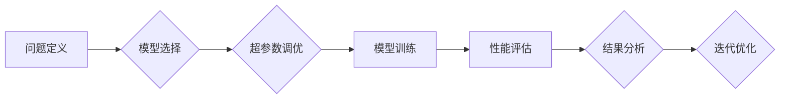

> 超参数调优, 模型选择, 机器学习, 深度学习, 梯度下降, 交叉验证, 网格搜索, 随机搜索, 贝叶斯优化

## 1. 背景介绍

在机器学习和深度学习领域，模型的性能很大程度上取决于超参数的设置。超参数是模型训练过程中需要预先设置的参数，它们不直接由训练数据学习，而是由人类专家根据经验和直觉进行设定。常见的超参数包括学习率、正则化系数、隐藏层数量、神经元数量等。

选择合适的超参数对于模型的训练效果至关重要。如果超参数设置不当，可能会导致模型训练不收敛、过拟合或欠拟合等问题。因此，超参数调优是机器学习和深度学习模型训练中一个至关重要的步骤。

## 2. 核心概念与联系

超参数调优的目标是找到最优的超参数组合，使得模型在给定数据集上达到最佳的性能。

**超参数调优与模型选择的联系：**

超参数调优和模型选择是相互关联的两个概念。模型选择是指从多个预定义的模型结构中选择最适合特定任务的模型。而超参数调优则是针对选定的模型结构，通过调整超参数来优化模型的性能。

**Mermaid 流程图：**



## 3. 核心算法原理 & 具体操作步骤

### 3.1  算法原理概述

超参数调优算法通常可以分为以下几种类型：

* **网格搜索:** 穷举所有超参数组合，并对每个组合进行模型训练和评估，选择性能最佳的组合。
* **随机搜索:** 从超参数空间中随机采样超参数组合，并对每个组合进行模型训练和评估，选择性能最佳的组合。
* **贝叶斯优化:** 利用贝叶斯理论和概率模型，根据历史的搜索结果，智能地选择下一个超参数组合进行探索和利用。

### 3.2  算法步骤详解

**网格搜索:**

1. 定义超参数搜索空间，即每个超参数的可取值范围。
2. 生成所有可能的超参数组合。
3. 对每个超参数组合进行模型训练和评估。
4. 选择性能最佳的超参数组合。

**随机搜索:**

1. 定义超参数搜索空间。
2. 从超参数空间中随机采样超参数组合。
3. 对每个超参数组合进行模型训练和评估。
4. 选择性能最佳的超参数组合。

**贝叶斯优化:**

1. 定义超参数搜索空间。
2. 初始化一个贝叶斯模型，用于预测超参数组合的性能。
3. 根据贝叶斯模型的预测，选择下一个超参数组合进行探索和利用。
4. 对每个超参数组合进行模型训练和评估，并更新贝叶斯模型。
5. 重复步骤3和4，直到达到预设的迭代次数或性能目标。

### 3.3  算法优缺点

| 算法 | 优点 | 缺点 |
|---|---|---|
| 网格搜索 | 易于实现，保证了所有超参数组合都被尝试 | 计算量大，效率低 |
| 随机搜索 | 计算量比网格搜索小，效率高 | 可能错过最优超参数组合 |
| 贝叶斯优化 | 效率高，能够快速找到最优超参数组合 | 需要一定的数学基础，实现复杂 |

### 3.4  算法应用领域

超参数调优算法广泛应用于机器学习和深度学习的各个领域，例如：

* **图像识别:** 调整卷积神经网络的超参数，提高图像识别精度。
* **自然语言处理:** 调整循环神经网络的超参数，提高文本分类、机器翻译等任务的性能。
* **推荐系统:** 调整协同过滤算法的超参数，提高推荐系统的准确率。

## 4. 数学模型和公式 & 详细讲解 & 举例说明

### 4.1  数学模型构建

在贝叶斯优化中，常用的数学模型是高斯过程 (Gaussian Process)。高斯过程是一种概率模型，它可以用来描述函数的分布。

假设我们有一个超参数空间 X，每个超参数组合 x ∈ X 对应一个模型性能值 y(x)。高斯过程假设 y(x) 服从一个高斯分布，其均值和协方差由超参数空间 X 和一个核函数 k(x, x') 决定。

### 4.2  公式推导过程

高斯过程的概率密度函数为：

$$
p(y(x) | X, k) = \mathcal{N}(m(x), C(x, x'))
$$

其中：

* $y(x)$ 是模型性能值
* $X$ 是超参数空间
* $k(x, x')$ 是核函数
* $m(x)$ 是高斯过程的均值函数
* $C(x, x')$ 是高斯过程的协方差函数

### 4.3  案例分析与讲解

假设我们有一个超参数空间 X = {learning_rate, hidden_layers}，其中 learning_rate 是学习率，hidden_layers 是隐藏层数量。我们使用一个径向基函数 (Radial Basis Function) 作为核函数，其形式为：

$$
k(x, x') = \exp(-||x - x'||^2 / 2\sigma^2)
$$

其中 $\sigma^2$ 是核函数的带宽参数。

通过贝叶斯优化算法，我们可以根据历史的搜索结果，更新高斯过程模型，并选择下一个超参数组合进行探索和利用。

## 5. 项目实践：代码实例和详细解释说明

### 5.1  开发环境搭建

* Python 3.6+
* TensorFlow 2.0+
* scikit-learn 0.22+
* NumPy 1.18+
* Matplotlib 3.2+

### 5.2  源代码详细实现

```python
import numpy as np
from sklearn.model_selection import train_test_split
from sklearn.linear_model import LogisticRegression
from skopt import gp_minimize
from skopt.space import Real, Integer

# 准备数据
X = np.random.rand(100, 2)
y = np.random.randint(0, 2, size=100)

# 数据划分
X_train, X_test, y_train, y_test = train_test_split(X, y, test_size=0.2, random_state=42)

# 定义超参数搜索空间
space = [Real(0.01, 1, name='learning_rate'), Integer(1, 10, name='hidden_layers')]

# 定义目标函数
def objective(params):
    learning_rate, hidden_layers = params
    model = LogisticRegression(learning_rate=learning_rate, max_iter=1000)
    model.fit(X_train, y_train)
    return -model.score(X_test, y_test)

# 使用贝叶斯优化进行超参数调优
result = gp_minimize(objective, space, n_calls=100)

# 打印最佳超参数
print(f'最佳超参数: {result.x}')
print(f'最佳性能: {result.fun}')
```

### 5.3  代码解读与分析

* 首先，我们定义了超参数搜索空间，包括学习率和隐藏层数量。
* 然后，我们定义了目标函数，该函数接受超参数组合作为输入，并返回模型在测试集上的准确率。
* 最后，我们使用贝叶斯优化算法进行超参数调优，并打印最佳超参数和最佳性能。

### 5.4  运行结果展示

运行代码后，会输出最佳超参数和最佳性能。

## 6. 实际应用场景

超参数调优和模型选择在机器学习和深度学习的各个领域都有广泛的应用场景，例如：

* **图像识别:** 调整卷积神经网络的超参数，提高图像识别精度。
* **自然语言处理:** 调整循环神经网络的超参数，提高文本分类、机器翻译等任务的性能。
* **推荐系统:** 调整协同过滤算法的超参数，提高推荐系统的准确率。

### 6.4  未来应用展望

随着机器学习和深度学习技术的不断发展，超参数调优和模型选择将变得更加重要。未来，我们可能会看到以下方面的进展：

* **自动化超参数调优:** 利用自动化工具和算法，自动完成超参数调优过程。
* **个性化超参数调优:** 根据用户的具体需求和数据特点，进行个性化的超参数调优。
* **跨平台超参数调优:** 实现跨平台的超参数调优，方便用户在不同的硬件平台上进行模型训练和评估。

## 7. 工具和资源推荐

### 7.1  学习资源推荐

* **书籍:**
    * "Hands-On Machine Learning with Scikit-Learn, Keras & TensorFlow" by Aurélien Géron
    * "Deep Learning" by Ian Goodfellow, Yoshua Bengio, and Aaron Courville
* **在线课程:**
    * Coursera: Machine Learning by Andrew Ng
    * Udacity: Deep Learning Nanodegree

### 7.2  开发工具推荐

* **Scikit-learn:** Python机器学习库，提供各种机器学习算法和超参数调优工具。
* **TensorFlow:** 开源深度学习框架，支持多种超参数调优算法。
* **Keras:** 深度学习框架，易于使用，支持多种超参数调优工具。

### 7.3  相关论文推荐

* **Bayesian Optimization: A Review** by Brochu, Cora, and De Freitas
* **Hyperparameter Optimization for Deep Learning** by Bergstra and Bengio

## 8. 总结：未来发展趋势与挑战

### 8.1  研究成果总结

超参数调优和模型选择是机器学习和深度学习领域的重要研究方向。近年来，随着算法和工具的不断发展，超参数调优和模型选择技术取得了显著的进展。

### 8.2  未来发展趋势

未来，超参数调优和模型选择技术将朝着以下几个方向发展：

* **自动化:** 自动化超参数调优工具将更加智能化和高效。
* **个性化:** 根据用户的具体需求和数据特点，进行个性化的超参数调优。
* **跨平台:** 实现跨平台的超参数调优，方便用户在不同的硬件平台上进行模型训练和评估。

### 8.3  面临的挑战

尽管超参数调优和模型选择技术取得了显著的进展，但仍然面临一些挑战：

* **高维超参数空间:** 对于复杂模型，超参数空间可能非常高维，导致搜索空间巨大，难以有效探索。
* **黑盒模型:** 一些深度学习模型是黑盒模型，难以理解模型内部的机制，导致超参数调优更加困难。
* **计算资源:** 超参数调优通常需要大量的计算资源，这对于一些资源有限的用户来说是一个挑战。

### 8.4  研究展望

未来，我们将继续致力于超参数调优和模型选择技术的研究，探索新的算法和方法，以解决上述挑战，并推动机器学习和深度学习技术的进一步发展。

## 9. 附录：常见问题与解答

**Q1: 如何选择合适的超参数调优算法？**

**A1:** 选择合适的超参数调优算法取决于具体的应用场景和数据特点。

* 如果超参数空间比较小，可以使用网格搜索。
* 如果超参数空间比较大，可以使用随机搜索或贝叶斯优化。

**Q2: 如何评估超参数调优的效果？**

**A2:** 可以使用交叉验证等方法评估超参数调优的效果。

**Q3: 如何处理高维超参数空间？**

**A3:** 可以使用 dimensionality reduction techniques 或 surrogate models 来处理高维超参数空间。

**Q4: 如何应对黑