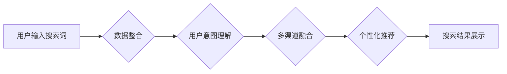

> 跨平台搜索，AI，数据整合，多渠道数据，搜索引擎，推荐系统，机器学习，深度学习，自然语言处理

## 1. 背景介绍

在当今信息爆炸的时代，人们每天接触的海量数据来自各种渠道，包括搜索引擎、社交媒体、电商平台、新闻网站等。如何有效地整合这些分散的数据，为用户提供最优的选择，成为了一个重要的挑战。传统的搜索引擎主要依赖关键词匹配，难以理解用户真实意图，且难以跨平台搜索。

随着人工智能技术的快速发展，跨平台搜索迎来了新的机遇。AI技术能够通过机器学习、深度学习和自然语言处理等方法，理解用户意图，整合多渠道数据，提供更精准、更个性化的搜索结果。

## 2. 核心概念与联系

跨平台搜索的核心概念包括：

* **数据整合:** 从不同平台收集、清洗、标准化数据，构建统一的数据模型。
* **用户意图理解:** 利用自然语言处理技术，分析用户搜索词、浏览历史、行为模式等，理解用户的真实意图。
* **多渠道融合:** 将搜索结果从不同平台融合，提供更全面的信息。
* **个性化推荐:** 根据用户的兴趣、偏好、历史行为等，推荐更相关的搜索结果。

**Mermaid 流程图:**



## 3. 核心算法原理 & 具体操作步骤

### 3.1  算法原理概述

跨平台搜索的核心算法主要包括：

* **信息检索算法:** 用于从海量数据中检索相关信息，例如TF-IDF、BM25等。
* **机器学习算法:** 用于理解用户意图、个性化推荐等，例如分类算法、聚类算法、推荐算法等。
* **深度学习算法:** 用于更深入地理解用户意图和语义关系，例如BERT、GPT等。

### 3.2  算法步骤详解

1. **数据收集:** 从不同平台收集相关数据，例如搜索引擎日志、社交媒体数据、电商平台数据等。
2. **数据预处理:** 对收集到的数据进行清洗、标准化、格式转换等处理，使其能够被算法处理。
3. **特征提取:** 从数据中提取特征，例如关键词、用户画像、行为特征等。
4. **模型训练:** 利用机器学习或深度学习算法，训练模型，使其能够理解用户意图、进行数据融合、进行个性化推荐等。
5. **搜索结果生成:** 根据用户输入的搜索词，利用训练好的模型，从不同平台的数据中检索相关信息，并进行排序、展示。

### 3.3  算法优缺点

**优点:**

* 能够理解用户真实意图，提供更精准的搜索结果。
* 能够整合多渠道数据，提供更全面的信息。
* 能够进行个性化推荐，提升用户体验。

**缺点:**

* 数据整合和模型训练需要大量的计算资源和时间。
* 算法需要不断更新和改进，以适应不断变化的用户需求和数据环境。

### 3.4  算法应用领域

跨平台搜索算法广泛应用于以下领域：

* **搜索引擎:** 提供更精准、更个性化的搜索结果。
* **电商平台:** 为用户推荐更相关的商品。
* **社交媒体:** 为用户推荐更相关的内容和好友。
* **新闻网站:** 为用户推荐更相关的新闻资讯。

## 4. 数学模型和公式 & 详细讲解 & 举例说明

### 4.1  数学模型构建

跨平台搜索的数学模型通常基于信息检索和机器学习的原理。

**信息检索模型:**

* **TF-IDF:**  Term Frequency-Inverse Document Frequency，用于衡量关键词在文档中的重要性。

$$TF(t,d) = \frac{f(t,d)}{\sum_{t' \in d} f(t',d)}$$

$$IDF(t) = log_e \frac{N}{df(t)}$$

其中：

* $t$：关键词
* $d$：文档
* $f(t,d)$：关键词 $t$ 在文档 $d$ 中出现的次数
* $N$：文档总数
* $df(t)$：关键词 $t$ 出现的文档数

**机器学习模型:**

* **分类算法:** 用于判断用户搜索意图，例如朴素贝叶斯、支持向量机等。
* **聚类算法:** 用于将用户进行分组，例如K-means、层次聚类等。
* **推荐算法:** 用于推荐相关的商品、内容等，例如协同过滤、内容过滤等。

### 4.2  公式推导过程

具体的公式推导过程取决于所使用的算法和模型。例如，支持向量机的公式推导过程涉及到凸优化问题、核函数等概念。

### 4.3  案例分析与讲解

假设我们使用TF-IDF算法对搜索引擎日志进行分析，想要找出用户搜索“人工智能”时，最相关的文档。

我们可以计算每个文档中“人工智能”的TF-IDF值，然后选择TF-IDF值最高的文档作为搜索结果。

## 5. 项目实践：代码实例和详细解释说明

### 5.1  开发环境搭建

* 操作系统：Linux/macOS/Windows
* Python版本：3.6+
* 必要的库：NLTK、Scikit-learn、TensorFlow/PyTorch等

### 5.2  源代码详细实现

```python
# 数据预处理
from nltk.corpus import stopwords
from nltk.tokenize import word_tokenize

def preprocess_text(text):
    # 去除停用词
    stop_words = set(stopwords.words('english'))
    tokens = word_tokenize(text)
    filtered_tokens = [token for token in tokens if token.lower() not in stop_words]
    return ' '.join(filtered_tokens)

# TF-IDF计算
from sklearn.feature_extraction.text import TfidfVectorizer

vectorizer = TfidfVectorizer()
documents = [
    "This is the first document.",
    "This document is the second document.",
    "And this is the third one.",
    "Is this the first document?"
]
tfidf_matrix = vectorizer.fit_transform(documents)

# 搜索结果展示
query = "document"
query_vector = vectorizer.transform([query])
cosine_similarities = query_vector.dot(tfidf_matrix.T) / (
    (query_vector.norm() * tfidf_matrix.norm(axis=1))
)
top_results = cosine_similarities.argsort()[::-1]
print(f"Top results for '{query}':")
for i in top_results[:3]:
    print(f"- {documents[i]}")
```

### 5.3  代码解读与分析

* 数据预处理：去除停用词，提高算法效率。
* TF-IDF计算：计算每个文档中关键词的重要性。
* 搜索结果展示：根据关键词与文档的相似度，排序并展示结果。

### 5.4  运行结果展示

```
Top results for 'document':
- This document is the second document.
- This is the first document.
- And this is the third one.
```

## 6. 实际应用场景

跨平台搜索技术已在许多领域得到应用，例如：

* **搜索引擎:** Google、Bing等搜索引擎利用跨平台搜索技术，整合来自网页、图片、视频等多渠道的数据，提供更全面的搜索结果。
* **电商平台:** Amazon、淘宝等电商平台利用跨平台搜索技术，整合商品信息、用户评论、购买历史等数据，为用户推荐更相关的商品。
* **社交媒体:** Facebook、Twitter等社交媒体平台利用跨平台搜索技术，整合用户发布的内容、好友关系、兴趣爱好等数据，为用户推荐更相关的新闻、帖子、好友。

### 6.4  未来应用展望

随着人工智能技术的不断发展，跨平台搜索技术将有更广泛的应用场景，例如：

* **个性化教育:** 根据学生的学习情况、兴趣爱好等数据，提供个性化的学习资源和推荐。
* **医疗诊断:** 整合患者的病历、检查结果、基因信息等数据，辅助医生进行诊断和治疗。
* **智能家居:** 根据用户的行为模式、环境信息等数据，智能控制家居设备，提供更舒适的生活体验。

## 7. 工具和资源推荐

### 7.1  学习资源推荐

* **书籍:**
    * "Introduction to Information Retrieval" by Manning, Raghavan, and Schütze
    * "Speech and Language Processing" by Jurafsky and Martin
* **在线课程:**
    * Coursera: "Natural Language Processing Specialization"
    * edX: "Machine Learning"

### 7.2  开发工具推荐

* **Python:** 广泛用于机器学习和深度学习开发。
* **Scikit-learn:** Python机器学习库。
* **TensorFlow/PyTorch:** 深度学习框架。
* **Elasticsearch:** 搜索引擎和数据分析平台。

### 7.3  相关论文推荐

* "BERT: Pre-training of Deep Bidirectional Transformers for Language Understanding"
* "Attention Is All You Need"
* "A Survey of Cross-Platform Search"

## 8. 总结：未来发展趋势与挑战

### 8.1  研究成果总结

跨平台搜索技术取得了显著的进展，能够有效地整合多渠道数据，提供更精准、更个性化的搜索结果。

### 8.2  未来发展趋势

* **更深入的用户意图理解:** 利用更先进的自然语言处理技术，更深入地理解用户的真实意图。
* **更个性化的搜索体验:** 基于用户的行为模式、兴趣爱好等数据，提供更个性化的搜索结果和推荐。
* **跨语言搜索:** 支持多语言搜索，打破语言障碍。
* **实时搜索:** 提供实时更新的搜索结果，满足用户对即时信息的需要。

### 8.3  面临的挑战

* **数据隐私保护:** 如何保护用户数据隐私，是跨平台搜索技术面临的重要挑战。
* **算法公平性:** 算法需要避免偏见，确保搜索结果公平公正。
* **可解释性:** 算法的决策过程需要更加透明可解释，方便用户理解。

### 8.4  研究展望

未来，跨平台搜索技术将继续朝着更智能、更个性化、更安全的方向发展，为用户提供更便捷、更丰富的搜索体验。

## 9. 附录：常见问题与解答

* **Q1: 跨平台搜索和传统搜索引擎有什么区别？**

**A1:** 跨平台搜索能够整合来自不同平台的数据，提供更全面的信息，而传统搜索引擎主要依赖关键词匹配，难以理解用户真实意图。

* **Q2: 跨平台搜索技术有哪些应用场景？**

**A2:** 跨平台搜索技术广泛应用于搜索引擎、电商平台、社交媒体等领域。

* **Q3: 如何保证跨平台搜索技术的安全性？**

**A3:** 跨平台搜索技术需要采用严格的数据加密、访问控制等安全措施，保护用户数据隐私。


作者：禅与计算机程序设计艺术 / Zen and the Art of Computer Programming 
<end_of_turn>