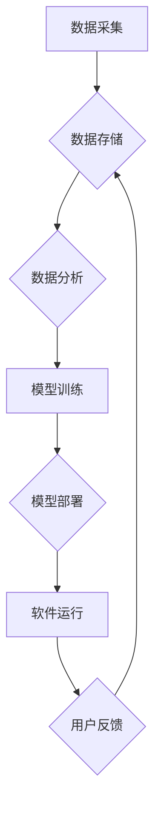

> 数据驱动，软件 2.0，人工智能，机器学习，深度学习，数据分析，云计算，大数据

## 1. 背景介绍

软件行业正处于一个前所未有的变革时期。传统的软件开发模式，以人为中心，依赖于静态的代码和固定的规则，难以适应日益复杂和动态变化的业务需求。随着大数据、人工智能和云计算技术的蓬勃发展，软件行业迎来了一个全新的时代——软件 2.0 的时代。

软件 2.0 的核心特征是数据驱动。它不再仅仅是代码的集合，而是以数据为基础，通过机器学习和人工智能算法，实现智能化、自适应和个性化的软件体验。

## 2. 核心概念与联系

**2.1 数据驱动**

数据驱动是指以数据为核心，利用数据分析、机器学习等技术，驱动软件的开发、运行和优化。

**2.2 软件 2.0**

软件 2.0 指的是以数据为驱动，以人工智能为核心，以用户体验为导向的新一代软件。它具有以下特点：

* **智能化:** 通过机器学习和人工智能算法，软件能够自动学习用户行为，提供个性化服务和智能决策。
* **自适应性:** 软件能够根据用户需求和环境变化，动态调整自身功能和行为。
* **实时性:** 软件能够实时处理数据，并提供即时反馈，满足用户对快速响应的需求。
* **协同性:** 软件能够与其他系统和设备协同工作，实现数据共享和业务协同。

**2.3 核心架构**



**2.4 核心技术**

* **大数据技术:** 用于收集、存储和处理海量数据。
* **机器学习技术:** 用于从数据中学习模式和规律，构建预测模型。
* **深度学习技术:** 用于处理复杂的数据模式，提高模型的准确性。
* **云计算技术:** 提供计算资源和存储空间，支持大规模数据处理和模型部署。

## 3. 核心算法原理 & 具体操作步骤

**3.1 算法原理概述**

机器学习算法的核心是通过学习数据中的模式和规律，构建预测模型。常见的机器学习算法包括：

* **监督学习:** 利用标记数据训练模型，预测新的数据标签。
* **无监督学习:** 利用未标记数据发现数据中的隐藏结构和模式。
* **强化学习:** 通过试错学习，在环境中获得最大奖励。

**3.2 算法步骤详解**

以监督学习为例，其基本步骤如下：

1. **数据收集和预处理:** 收集相关数据，并进行清洗、转换和特征工程等预处理操作。
2. **模型选择:** 根据任务需求选择合适的机器学习算法。
3. **模型训练:** 利用标记数据训练模型，调整模型参数，使其能够准确预测数据标签。
4. **模型评估:** 利用测试数据评估模型的性能，例如准确率、召回率等。
5. **模型部署:** 将训练好的模型部署到实际应用场景中，用于预测新的数据。

**3.3 算法优缺点**

不同的机器学习算法具有不同的优缺点，需要根据具体任务需求选择合适的算法。

**3.4 算法应用领域**

机器学习算法广泛应用于各个领域，例如：

* **图像识别:** 自动识别图像中的物体、场景和人物。
* **自然语言处理:** 理解和生成人类语言，例如机器翻译、文本摘要等。
* **推荐系统:** 根据用户行为和偏好，推荐相关商品或内容。
* **欺诈检测:** 识别和预防欺诈行为。

## 4. 数学模型和公式 & 详细讲解 & 举例说明

**4.1 数学模型构建**

机器学习算法通常基于数学模型，例如线性回归、逻辑回归、支持向量机等。这些模型通过数学公式来描述数据之间的关系。

**4.2 公式推导过程**

例如，线性回归模型的数学公式如下：

$$y = w_0 + w_1x_1 + w_2x_2 + ... + w_nx_n + \epsilon$$

其中：

* $y$ 是预测值
* $w_0, w_1, w_2, ..., w_n$ 是模型参数
* $x_1, x_2, ..., x_n$ 是输入特征
* $\epsilon$ 是误差项

模型参数可以通过最小化误差函数来求解。

**4.3 案例分析与讲解**

假设我们想要预测房价，输入特征包括房屋面积、房间数量、地理位置等。我们可以使用线性回归模型来构建预测模型。通过训练模型，我们可以得到模型参数，例如房屋面积每增加1平方米，房价会增加1000元。

## 5. 项目实践：代码实例和详细解释说明

**5.1 开发环境搭建**

可以使用Python语言和相关的机器学习库，例如Scikit-learn，TensorFlow等，进行项目开发。

**5.2 源代码详细实现**

```python
from sklearn.linear_model import LinearRegression
from sklearn.model_selection import train_test_split
import pandas as pd

# 加载数据
data = pd.read_csv('house_data.csv')

# 分割数据
X = data[['面积', '房间数量']]
y = data['房价']
X_train, X_test, y_train, y_test = train_test_split(X, y, test_size=0.2)

# 创建模型
model = LinearRegression()

# 训练模型
model.fit(X_train, y_train)

# 预测房价
y_pred = model.predict(X_test)

# 评估模型性能
print('模型准确率:', model.score(X_test, y_test))
```

**5.3 代码解读与分析**

这段代码首先加载数据，然后将数据分割成训练集和测试集。接着创建线性回归模型，并使用训练集训练模型。最后使用测试集预测房价，并评估模型性能。

**5.4 运行结果展示**

运行结果会显示模型的准确率，例如0.85，表示模型在预测房价方面准确率为85%。

## 6. 实际应用场景

**6.1 个性化推荐系统**

电商平台、视频网站等平台可以使用机器学习算法，根据用户的浏览历史、购买记录等数据，推荐个性化的商品或内容。

**6.2 医疗诊断辅助系统**

医疗机构可以使用机器学习算法，分析患者的病历、影像数据等信息，辅助医生进行诊断。

**6.3 金融风险控制**

金融机构可以使用机器学习算法，识别和预防欺诈行为、信用风险等。

**6.4 未来应用展望**

随着人工智能技术的不断发展，软件 2.0 的应用场景将更加广泛，例如：

* **智能家居:** 通过语音识别、图像识别等技术，实现家居设备的智能控制。
* **自动驾驶:** 利用机器学习算法，实现车辆的自动驾驶功能。
* **个性化教育:** 根据学生的学习情况，提供个性化的学习方案。

## 7. 工具和资源推荐

**7.1 学习资源推荐**

* **书籍:**
    * 《深度学习》
    * 《机器学习实战》
    * 《Python机器学习》
* **在线课程:**
    * Coursera
    * edX
    * Udacity

**7.2 开发工具推荐**

* **Python:** 
* **Scikit-learn:** 机器学习库
* **TensorFlow:** 深度学习框架
* **PyTorch:** 深度学习框架

**7.3 相关论文推荐**

* **《ImageNet Classification with Deep Convolutional Neural Networks》**
* **《Attention Is All You Need》**
* **《BERT: Pre-training of Deep Bidirectional Transformers for Language Understanding》**

## 8. 总结：未来发展趋势与挑战

**8.1 研究成果总结**

软件 2.0 的发展取得了显著成果，例如：

* **人工智能技术的进步:** 深度学习算法取得了突破性进展，在图像识别、自然语言处理等领域取得了优异的性能。
* **云计算技术的成熟:** 云计算平台提供了强大的计算资源和存储空间，支持大规模数据处理和模型部署。
* **数据分析技术的提升:** 数据分析技术不断发展，能够从海量数据中挖掘出有价值的洞察。

**8.2 未来发展趋势**

* **更智能的软件:** 软件将更加智能化，能够更好地理解用户需求，提供个性化服务。
* **更自适应的软件:** 软件将更加自适应，能够根据环境变化动态调整自身功能。
* **更协同的软件:** 软件将更加协同，能够与其他系统和设备协同工作，实现数据共享和业务协同。

**8.3 面临的挑战**

* **数据安全和隐私保护:** 数据驱动软件需要处理大量用户数据，如何保障数据安全和隐私保护是一个重要挑战。
* **算法偏见:** 机器学习算法可能存在偏见，导致软件产生不公平的结果。
* **可解释性:** 许多机器学习算法是黑箱模型，难以解释其决策过程，这可能会导致软件的可信度降低。

**8.4 研究展望**

未来，软件 2.0 的研究将集中在以下几个方面：

* **开发更安全、更可靠的机器学习算法。**
* **解决算法偏见问题，确保软件公平公正。**
* **提高机器学习算法的可解释性，增强软件的可信度。**
* **探索新的软件架构和开发模式，支持软件 2.0 的发展。**

## 9. 附录：常见问题与解答

**9.1 如何选择合适的机器学习算法？**

选择合适的机器学习算法需要根据具体任务需求和数据特点进行选择。例如，对于分类任务，可以考虑逻辑回归、支持向量机等算法；对于回归任务，可以考虑线性回归、决策树等算法。

**9.2 如何处理数据中的缺失值？**

数据中的缺失值可以通过多种方法处理，例如：删除缺失值、用平均值或中位数填充缺失值等。

**9.3 如何评估机器学习模型的性能？**

机器学习模型的性能可以通过多种指标评估，例如准确率、召回率、F1-score等。

作者：禅与计算机程序设计艺术 / Zen and the Art of Computer Programming


<end_of_turn>