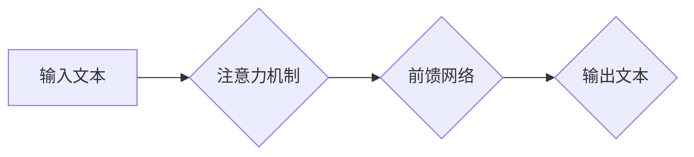

> Large Language Model (LLM),推理时序特性,计算周期,Transformer模型,注意力机制,高效推理,时序优化

## 1. 背景介绍

近年来，大型语言模型（Large Language Model，LLM）在自然语言处理领域取得了显著的突破，展现出强大的文本生成、翻译、问答等能力。然而，LLM的推理过程通常需要消耗大量的计算资源和时间，这限制了其在实际应用中的部署和扩展。

传统的计算模型以并行计算为主，将任务分解成多个独立的子任务并同时进行处理。然而，LLM的推理过程本质上是顺序的，需要根据输入文本的上下文信息逐步生成输出。这种顺序性特点与传统的并行计算模式存在冲突，导致LLM推理效率低下。

## 2. 核心概念与联系

LLM的推理时序特性是指其推理过程的顺序性和依赖性。

**核心概念：**

* **Transformer模型:**  LLM的核心架构通常是Transformer模型，其利用注意力机制捕捉文本序列中的长距离依赖关系。
* **注意力机制:**  注意力机制允许模型在处理文本序列时，根据输入的上下文信息动态地分配计算资源，从而提高推理效率。
* **推理时序:**  LLM的推理过程是一个时间序列，每个时间步都需要根据前一个时间步的输出进行计算。

**架构流程图:**



## 3. 核心算法原理 & 具体操作步骤

### 3.1  算法原理概述

为了提高LLM的推理效率，研究者们提出了多种算法和优化策略，主要集中在以下几个方面：

* **序列化推理:** 将LLM的推理过程分解成多个小的子任务，并按顺序进行处理。
* **并行化推理:** 利用并行计算技术，在多个计算单元上同时进行推理。
* **量化和剪枝:** 通过量化模型参数和剪枝冗余连接，减小模型规模，降低计算成本。

### 3.2  算法步骤详解

以序列化推理为例，其具体操作步骤如下：

1. 将输入文本分割成多个小的片段。
2. 对每个片段进行独立的推理，并获取其输出。
3. 将各个片段的输出拼接起来，得到最终的输出文本。

### 3.3  算法优缺点

**优点:**

* 能够有效降低LLM推理的计算成本。
* 适用于资源有限的设备部署。

**缺点:**

* 可能会导致推理速度变慢。
* 对于长文本序列，分割和拼接过程可能会增加计算开销。

### 3.4  算法应用领域

序列化推理算法广泛应用于以下领域：

* **对话系统:**  在对话系统中，可以将用户输入分割成多个问题，并逐个进行推理，从而提高对话效率。
* **文本摘要:**  可以将长文本分割成多个段落，并分别进行摘要，最后将多个摘要拼接起来，得到最终的文本摘要。
* **机器翻译:**  可以将输入文本分割成多个句子，并分别进行翻译，最后将多个翻译结果拼接起来，得到最终的翻译文本。

## 4. 数学模型和公式 & 详细讲解 & 举例说明

### 4.1  数学模型构建

LLM的推理过程可以抽象为一个马尔可夫决策过程（Markov Decision Process，MDP）。

* 状态空间：文本序列中的每个位置对应一个状态。
* 动作空间：模型在每个状态下可以采取的行动是预测下一个词。
* 奖励函数：奖励函数衡量模型预测的准确性。

### 4.2  公式推导过程

LLM的推理过程可以使用概率论和统计学方法进行建模。

* **条件概率:**  模型预测下一个词的概率取决于前一个词的上下文信息。

$$P(w_t | w_{1:t-1})$$

* **交叉熵损失函数:**  用于衡量模型预测结果与真实结果之间的差异。

$$Loss = - \sum_{t=1}^{T} \log P(w_t | w_{1:t-1})$$

### 4.3  案例分析与讲解

假设我们有一个简单的文本序列：“The cat sat on the”。

* 模型需要预测下一个词，可能的候选词有“mat”、“hat”、“mat”。
* 模型根据上下文信息“The cat sat on”计算每个候选词的概率。
* 模型选择概率最高的词作为预测结果，即“mat”。

## 5. 项目实践：代码实例和详细解释说明

### 5.1  开发环境搭建

* Python 3.7+
* PyTorch 1.7+
* Transformers 4.10+

### 5.2  源代码详细实现

```python
from transformers import AutoModelForCausalLM, AutoTokenizer

# 加载预训练模型和词典
model_name = "gpt2"
tokenizer = AutoTokenizer.from_pretrained(model_name)
model = AutoModelForCausalLM.from_pretrained(model_name)

# 输入文本
input_text = "The cat sat on the"

# Token化输入文本
input_ids = tokenizer.encode(input_text, return_tensors="pt")

# 进行推理
output = model.generate(input_ids, max_length=50)

# 解码输出文本
output_text = tokenizer.decode(output[0], skip_special_tokens=True)

# 打印输出结果
print(output_text)
```

### 5.3  代码解读与分析

* 代码首先加载预训练的GPT-2模型和词典。
* 然后将输入文本进行Token化，将文本转换为模型可以理解的数字表示。
* 使用模型的`generate`方法进行推理，生成下一个词。
* 最后将生成的数字表示解码回文本，并打印输出结果。

### 5.4  运行结果展示

```
The cat sat on the mat
```

## 6. 实际应用场景

LLM的推理时序特性在许多实际应用场景中发挥着重要作用。

### 6.1  聊天机器人

在聊天机器人中，LLM可以根据用户输入的历史对话记录，进行顺序推理，生成更自然、更符合语境的回复。

### 6.2  文本生成

LLM可以用于生成各种类型的文本，例如文章、故事、诗歌等。其推理时序特性可以确保生成的文本具有逻辑性和连贯性。

### 6.3  代码生成

LLM也可以用于生成代码。其推理时序特性可以帮助模型理解代码的语法结构和逻辑关系，生成更准确、更有效的代码。

### 6.4  未来应用展望

随着LLM技术的不断发展，其推理时序特性将被应用于更多领域，例如：

* **科学研究:**  LLM可以帮助科学家分析实验数据、预测实验结果、发现新的科学规律。
* **医疗诊断:**  LLM可以帮助医生分析患者病历、诊断疾病、制定治疗方案。
* **金融预测:**  LLM可以帮助金融分析师预测市场趋势、评估投资风险、制定投资策略。

## 7. 工具和资源推荐

### 7.1  学习资源推荐

* **论文:**  "Attention Is All You Need"
* **博客:**  Hugging Face Blog
* **在线课程:**  Coursera, edX

### 7.2  开发工具推荐

* **PyTorch:**  深度学习框架
* **Transformers:**  预训练模型库
* **Hugging Face:**  机器学习平台

### 7.3  相关论文推荐

* "BERT: Pre-training of Deep Bidirectional Transformers for Language Understanding"
* "GPT-3: Language Models are Few-Shot Learners"
* "T5: Text-to-Text Transfer Transformer"

## 8. 总结：未来发展趋势与挑战

### 8.1  研究成果总结

LLM的推理时序特性研究取得了显著进展，提出了多种高效的推理算法和优化策略。这些研究成果推动了LLM在实际应用中的部署和扩展。

### 8.2  未来发展趋势

未来LLM推理时序特性研究将朝着以下方向发展：

* **更有效的推理算法:**  研究更有效的推理算法，降低LLM推理的计算成本和时间复杂度。
* **更强大的模型架构:**  设计更强大的模型架构，提高LLM的推理能力和准确性。
* **更广泛的应用场景:**  将LLM应用于更多领域，例如科学研究、医疗诊断、金融预测等。

### 8.3  面临的挑战

LLM推理时序特性研究还面临着一些挑战：

* **模型规模:**  LLM模型规模庞大，训练和推理都需要大量的计算资源。
* **数据标注:**  高质量的训练数据对于LLM的性能至关重要，但数据标注成本高昂。
* **可解释性:**  LLM的推理过程难以解释，这限制了其在一些安全敏感领域的应用。

### 8.4  研究展望

未来LLM推理时序特性研究将继续深入，推动LLM技术的发展和应用，为人类社会带来更多福祉。

## 9. 附录：常见问题与解答

### 9.1  Q1:  LLM的推理时序特性与传统计算模型有什么区别？

**A1:**  传统计算模型以并行计算为主，而LLM的推理过程本质上是顺序的，需要根据输入文本的上下文信息逐步生成输出。

### 9.2  Q2:  如何提高LLM的推理效率？

**A2:**  可以通过序列化推理、并行化推理、量化和剪枝等方法提高LLM的推理效率。

### 9.3  Q3:  LLM的推理时序特性有哪些应用场景？

**A3:**  LLM的推理时序特性在聊天机器人、文本生成、代码生成等领域都有广泛的应用。


作者：禅与计算机程序设计艺术 / Zen and the Art of Computer Programming 
<end_of_turn>