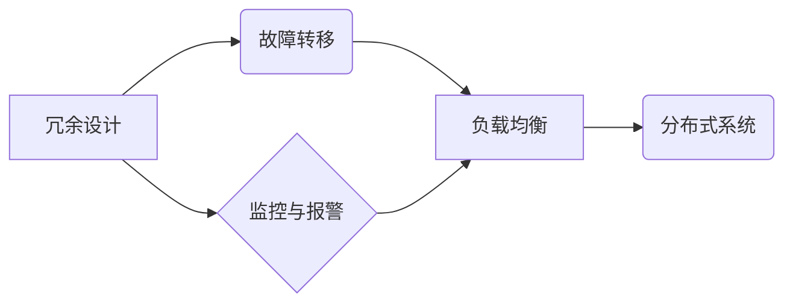

> 高可用性系统，容错机制，冗余设计，故障转移，监控与报警，负载均衡，分布式系统，微服务架构

## 1. 背景介绍

在当今数字化时代，高可用性系统已成为企业核心业务的基石。用户对服务稳定性和可靠性的需求日益增长，任何系统故障都可能导致巨大的经济损失和品牌形象损害。因此，设计和构建高可用性系统成为一项至关重要的任务。

高可用性系统是指能够在发生故障或部分组件失效的情况下，仍然能够持续提供服务，并保证服务质量的系统。其核心目标是最大程度地减少系统停机时间，提高系统可靠性和稳定性。

## 2. 核心概念与联系

高可用性系统的设计需要考虑多个核心概念和技术，这些概念相互关联，共同构成高可用性系统的架构和功能。

**2.1 核心概念**

* **冗余设计:**  在关键组件上进行多副本部署，以应对单个组件故障。
* **故障转移:**  在发生故障时，自动将请求转移到健康的副本上，确保服务不中断。
* **监控与报警:**  实时监控系统状态，并对异常情况进行报警，以便及时发现和解决问题。
* **负载均衡:**  将请求均匀分配到多个服务器上，避免单个服务器过载，提高系统吞吐量。
* **分布式系统:**  将系统分解成多个独立的组件，分布在不同的物理节点上，提高系统的容错性和扩展性。

**2.2 架构关系**



## 3. 核心算法原理 & 具体操作步骤

### 3.1 算法原理概述

高可用性系统中常用的算法包括：

* **一致性哈希算法:**  用于在分布式系统中实现数据分区和节点迁移。
* **Paxos算法:**  用于解决分布式系统中的一致性问题。
* **Raft算法:**  一种更简单的分布式一致性算法。

### 3.2 算法步骤详解

**3.2.1 一致性哈希算法**

1. 将所有节点映射到一个虚拟环上。
2. 将数据键哈希到虚拟环上，并将数据存储在对应的节点上。
3. 当节点加入或离开集群时，需要重新分配数据，以保证数据一致性。

**3.2.2 Paxos算法**

1. 选举一个领导者节点。
2. 领导者节点提出一个提案。
3. 所有节点投票决定是否接受提案。
4. 如果提案获得多数节点的投票，则提案被接受，并应用到所有节点上。

**3.2.3 Raft算法**

1. 选举一个领导者节点。
2. 领导者节点将日志记录发送给所有节点。
3. 所有节点根据日志记录同步数据。
4. 当领导者节点发生故障时，集群会选举新的领导者节点。

### 3.3 算法优缺点

| 算法 | 优点 | 缺点 |
|---|---|---|
| 一致性哈希算法 | 简单易实现，高效 | 无法处理节点故障 |
| Paxos算法 | 适用于任意网络拓扑，高可靠性 | 复杂度高，实现难度大 |
| Raft算法 | 更加简单易懂，更容易实现 | 性能不如 Paxos 算法 |

### 3.4 算法应用领域

* 一致性哈希算法：分布式缓存系统、数据库集群
* Paxos算法：分布式数据库、分布式文件系统
* Raft算法：分布式锁、分布式配置中心

## 4. 数学模型和公式 & 详细讲解 & 举例说明

### 4.1 数学模型构建

高可用性系统的设计可以抽象为一个数学模型，其中：

* **状态变量:**  系统当前的状态，例如节点状态、数据状态等。
* **状态转移函数:**  描述系统状态如何随时间变化的函数。
* **输入:**  外部事件或请求，例如节点故障、用户请求等。

### 4.2 公式推导过程

假设系统有 N 个节点，每个节点的状态可以为“正常”或“故障”。系统状态可以表示为一个长度为 N 的二进制向量，其中 1 表示正常状态，0 表示故障状态。

状态转移函数可以描述为：

$$
S_{t+1} = f(S_t, I_t)
$$

其中：

* $S_t$：系统状态在时间 t
* $I_t$：时间 t 的输入事件
* $f$：状态转移函数

### 4.3 案例分析与讲解

例如，如果一个节点发生故障，状态转移函数可以将该节点的状态从 1 变为 0。

## 5. 项目实践：代码实例和详细解释说明

### 5.1 开发环境搭建

* 操作系统：Linux
* 编程语言：Python
* 框架：Flask

### 5.2 源代码详细实现

```python
from flask import Flask, request, jsonify

app = Flask(__name__)

# 模拟节点状态
node_status = {
    'node1': True,
    'node2': True,
    'node3': True
}

@app.route('/health_check', methods=['GET'])
def health_check():
    # 检查节点状态
    for node_id in node_status:
        if not node_status[node_id]:
            return jsonify({'status': 'DOWN'}), 503

    return jsonify({'status': 'UP'})

if __name__ == '__main__':
    app.run(debug=True)
```

### 5.3 代码解读与分析

* 该代码实现了一个简单的健康检查接口。
* `node_status` 字典模拟了每个节点的状态。
* `health_check` 函数检查所有节点的状态，如果发现任何节点处于故障状态，则返回 503 错误码，否则返回 200 状态码。

### 5.4 运行结果展示

* 当所有节点状态正常时，访问 `/health_check` 接口会返回 `{"status": "UP"}`。
* 当某个节点状态为故障时，访问 `/health_check` 接口会返回 `{"status": "DOWN"}`。

## 6. 实际应用场景

高可用性系统广泛应用于各种场景，例如：

* **电商平台:**  确保用户能够随时访问商品信息和进行购买。
* **金融系统:**  保证交易安全可靠，防止资金损失。
* **社交媒体平台:**  提供流畅的用户体验，避免服务中断。
* **云计算平台:**  确保云服务的高可用性和可靠性。

### 6.4 未来应用展望

随着云计算、大数据、人工智能等技术的快速发展，高可用性系统将面临新的挑战和机遇。未来，高可用性系统将更加智能化、自动化，并能够更好地应对复杂和动态的业务需求。

## 7. 工具和资源推荐

### 7.1 学习资源推荐

* **书籍:**
    * 《Designing Data-Intensive Applications》
    * 《Site Reliability Engineering》
* **在线课程:**
    * Coursera: Distributed Systems
    * Udemy: Building Highly Available Systems

### 7.2 开发工具推荐

* **监控工具:** Prometheus, Grafana
* **负载均衡器:** Nginx, HAProxy
* **容器编排工具:** Kubernetes

### 7.3 相关论文推荐

* **Paxos Made Live: An Engineering Perspective**
* **The Raft Consensus Algorithm**

## 8. 总结：未来发展趋势与挑战

### 8.1 研究成果总结

高可用性系统设计已取得了显著成果，各种技术和工具不断涌现，为构建可靠和稳定的系统提供了强大的支持。

### 8.2 未来发展趋势

* **微服务架构:** 将系统分解成多个独立的服务，提高系统的可扩展性和容错性。
* **Serverless 架构:** 将服务器管理的责任卸载给云服务提供商，简化系统部署和维护。
* **人工智能:** 利用人工智能技术进行故障预测和自动修复，提高系统的自愈能力。

### 8.3 面临的挑战

* **复杂性:**  分布式系统和微服务架构的复杂性不断增加，需要更先进的工具和技术来管理和维护。
* **安全:**  高可用性系统需要具备更高的安全保障，防止攻击和数据泄露。
* **成本:**  构建和维护高可用性系统需要投入大量的资源，成本较高。

### 8.4 研究展望

未来，高可用性系统研究将继续深入，探索更智能、更自动化、更安全、更经济的解决方案。


## 9. 附录：常见问题与解答

**9.1 什么是高可用性？**

高可用性是指系统能够在发生故障或部分组件失效的情况下，仍然能够持续提供服务，并保证服务质量的系统。

**9.2 如何实现高可用性？**

常用的高可用性技术包括冗余设计、故障转移、监控与报警、负载均衡和分布式系统。

**9.3 什么是分布式系统？**

分布式系统是指将系统分解成多个独立的组件，分布在不同的物理节点上，以提高系统的容错性和扩展性。


作者：禅与计算机程序设计艺术 / Zen and the Art of Computer Programming 
<end_of_turn>