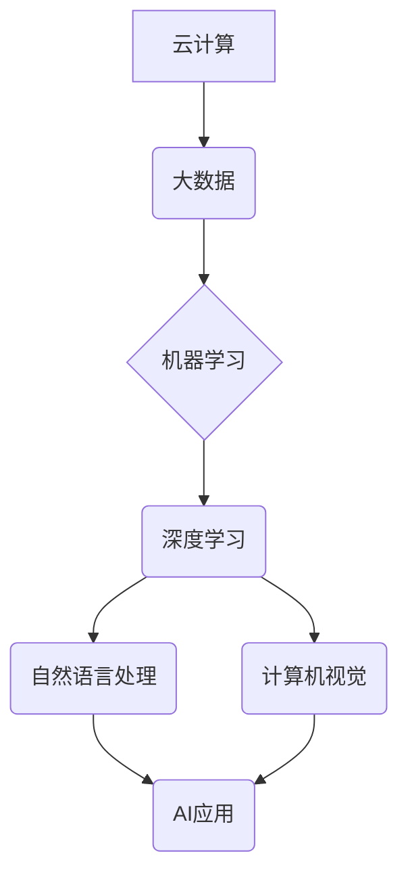

> 人工智能，基础设施，云计算，大数据，机器学习，深度学习，自然语言处理，计算机视觉，应用场景

## 1. 背景介绍

人工智能（AI）技术近年来发展迅速，从语音识别、图像识别到自然语言处理等领域取得了突破性进展。这些进展为我们带来了许多便利，但也暴露了一些问题。现有的AI系统大多依赖于海量数据和强大的计算能力，部署成本高，应用场景有限。为了更好地服务于人类，推动AI技术向更广泛领域渗透，我们需要构建一个更加完善的AI 2.0基础设施。

AI 2.0基础设施应具备以下特点：

* **可扩展性:**  能够根据需求灵活扩展计算资源和存储空间。
* **可定制性:**  能够根据不同应用场景定制模型和算法。
* **安全性:**  能够保障数据安全和模型隐私。
* **易用性:**  能够降低AI技术的使用门槛，让更多人能够受益。

## 2. 核心概念与联系

AI 2.0基础设施的核心概念包括：

* **云计算:** 提供弹性、可扩展的计算资源和存储空间。
* **大数据:**  提供海量数据支撑AI模型训练和优化。
* **机器学习:**  使AI系统能够从数据中学习，不断提升性能。
* **深度学习:**  一种更高级的机器学习方法，能够处理更复杂的数据。
* **自然语言处理:**  使AI系统能够理解和生成人类语言。
* **计算机视觉:**  使AI系统能够理解和处理图像和视频数据。

这些概念相互关联，共同构成了AI 2.0基础设施的框架。



## 3. 核心算法原理 & 具体操作步骤

### 3.1  算法原理概述

深度学习算法是AI 2.0基础设施的核心算法之一。它通过多层神经网络来模拟人类大脑的学习过程，能够处理复杂的数据模式，并实现高精度预测和分类。

### 3.2  算法步骤详解

1. **数据预处理:** 将原始数据清洗、转换、规范化，使其适合深度学习模型训练。
2. **网络结构设计:** 根据任务需求设计神经网络的层数、节点数、激活函数等参数。
3. **模型训练:** 使用训练数据训练神经网络模型，调整模型参数，使其能够准确预测或分类数据。
4. **模型评估:** 使用测试数据评估模型的性能，例如准确率、召回率、F1-score等指标。
5. **模型部署:** 将训练好的模型部署到实际应用场景中，用于预测或分类新的数据。

### 3.3  算法优缺点

**优点:**

* 能够处理复杂的数据模式，实现高精度预测和分类。
* 具有强大的泛化能力，能够应用于多种不同的任务。

**缺点:**

* 训练数据量大，训练时间长。
* 模型参数众多，需要大量的计算资源。
* 对数据质量要求高，数据噪声会影响模型性能。

### 3.4  算法应用领域

深度学习算法广泛应用于以下领域：

* **图像识别:** 人脸识别、物体检测、图像分类等。
* **自然语言处理:** 语音识别、机器翻译、文本摘要等。
* **推荐系统:** 商品推荐、内容推荐等。
* **医疗诊断:** 疾病诊断、影像分析等。
* **金融风险控制:** 欺诈检测、信用评估等。

## 4. 数学模型和公式 & 详细讲解 & 举例说明

### 4.1  数学模型构建

深度学习模型的核心是多层神经网络。每个神经元接收多个输入信号，经过加权和激活函数处理后输出信号。神经网络层数越多，模型的表达能力越强。

### 4.2  公式推导过程

神经网络的输出可以表示为：

$$
y = f(W^L x^L + b^L)
$$

其中：

* $y$ 是网络输出
* $f$ 是激活函数
* $W^L$ 是第L层的权重矩阵
* $x^L$ 是第L层的输入向量
* $b^L$ 是第L层的偏置向量

### 4.3  案例分析与讲解

例如，在图像分类任务中，输入图像经过多层卷积和池化操作后，得到特征向量。然后，特征向量输入全连接层，经过softmax函数处理后，得到每个类别的概率分布。选择概率最大的类别作为图像的分类结果。

## 5. 项目实践：代码实例和详细解释说明

### 5.1  开发环境搭建

使用Python语言和深度学习框架TensorFlow或PyTorch搭建开发环境。

### 5.2  源代码详细实现

```python
import tensorflow as tf

# 定义模型结构
model = tf.keras.models.Sequential([
    tf.keras.layers.Conv2D(32, (3, 3), activation='relu', input_shape=(28, 28, 1)),
    tf.keras.layers.MaxPooling2D((2, 2)),
    tf.keras.layers.Conv2D(64, (3, 3), activation='relu'),
    tf.keras.layers.MaxPooling2D((2, 2)),
    tf.keras.layers.Flatten(),
    tf.keras.layers.Dense(10, activation='softmax')
])

# 编译模型
model.compile(optimizer='adam',
              loss='sparse_categorical_crossentropy',
              metrics=['accuracy'])

# 训练模型
model.fit(x_train, y_train, epochs=5)

# 评估模型
loss, accuracy = model.evaluate(x_test, y_test)
print('Test loss:', loss)
print('Test accuracy:', accuracy)
```

### 5.3  代码解读与分析

这段代码定义了一个简单的卷积神经网络模型，用于手写数字识别任务。模型包含两层卷积层、两层池化层、一层全连接层和一层softmax输出层。

### 5.4  运行结果展示

训练完成后，模型能够准确识别手写数字。

## 6. 实际应用场景

AI 2.0基础设施在各个领域都有着广泛的应用场景：

* **医疗保健:** 辅助医生诊断疾病、预测患者风险、个性化治疗方案。
* **教育:** 提供个性化学习方案、智能辅导系统、自动批改作业。
* **金融:** 欺诈检测、信用评估、风险管理、智能投资。
* **交通:** 智能驾驶、交通流量预测、道路安全监控。
* **制造业:** 自动化生产、质量控制、设备故障预测。

### 6.4  未来应用展望

随着AI技术的发展，AI 2.0基础设施将应用于更多领域，例如：

* **智能家居:** 智能家居设备之间的协同控制、个性化家居环境定制。
* **智慧城市:** 城市管理优化、公共服务提升、环境监测与保护。
* **个性化娱乐:** 智能推荐系统、虚拟现实体验、个性化内容创作。

## 7. 工具和资源推荐

### 7.1  学习资源推荐

* **在线课程:** Coursera、edX、Udacity等平台提供丰富的AI课程。
* **书籍:** 《深度学习》、《机器学习》、《人工智能导论》等经典书籍。
* **开源社区:** TensorFlow、PyTorch、HuggingFace等开源社区提供丰富的资源和支持。

### 7.2  开发工具推荐

* **深度学习框架:** TensorFlow、PyTorch、Keras等。
* **云计算平台:** AWS、Azure、GCP等。
* **数据处理工具:** Pandas、NumPy等。

### 7.3  相关论文推荐

* **《ImageNet Classification with Deep Convolutional Neural Networks》**
* **《Attention Is All You Need》**
* **《BERT: Pre-training of Deep Bidirectional Transformers for Language Understanding》**

## 8. 总结：未来发展趋势与挑战

### 8.1  研究成果总结

AI 2.0基础设施的建设取得了显著成果，为AI技术的发展提供了坚实的基础。

### 8.2  未来发展趋势

* **模型规模和能力提升:** 模型参数量将继续增加，模型能力将进一步提升。
* **边缘计算的普及:** AI模型将部署到边缘设备，实现更低延迟、更高效率的计算。
* **联邦学习的应用:** 保护数据隐私的同时，实现模型训练和更新的协同。
* **跨模态学习的突破:** AI模型将能够处理多种模态数据，例如文本、图像、音频等。

### 8.3  面临的挑战

* **数据安全和隐私保护:** AI模型训练需要大量数据，如何保障数据安全和隐私是关键挑战。
* **算法可解释性和信任度:** AI模型的决策过程往往难以理解，如何提高算法的可解释性和信任度是重要课题。
* **计算资源和能源消耗:** 大型AI模型训练需要大量的计算资源和能源，如何降低能源消耗是需要解决的问题。

### 8.4  研究展望

未来，AI 2.0基础设施将继续发展，推动AI技术向更广泛领域渗透，为人类社会带来更多福祉。

## 9. 附录：常见问题与解答

**Q1: AI 2.0基础设施与传统AI基础设施有什么区别？**

**A1:** AI 2.0基础设施更加注重可扩展性、可定制性和安全性，能够更好地服务于更广泛的应用场景。

**Q2: 如何搭建AI 2.0基础设施？**

**A2:** 可以使用云计算平台、深度学习框架和数据处理工具搭建AI 2.0基础设施。

**Q3: AI 2.0基础设施有哪些应用场景？**

**A3:** AI 2.0基础设施应用于医疗保健、教育、金融、交通、制造业等各个领域。

**Q4: AI 2.0基础设施面临哪些挑战？**

**A4:** 数据安全和隐私保护、算法可解释性和信任度、计算资源和能源消耗是AI 2.0基础设施面临的挑战。


作者：禅与计算机程序设计艺术 / Zen and the Art of Computer Programming 
<end_of_turn>