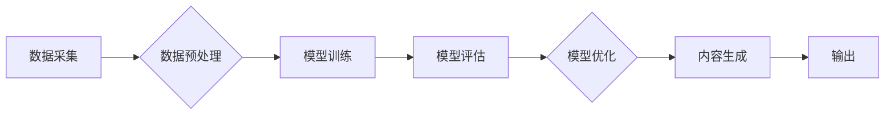

> AIGC, 文本生成, 图像生成, 职业变迁, 新机会, 算法原理, 实践应用

## 1. 背景介绍

人工智能（AI）技术近年来发展迅速，特别是生成式人工智能（AIGC）的兴起，正在深刻地改变着我们的生活和工作方式。AIGC是指能够生成新内容的AI模型，例如文本、图像、音频、视频等。其中，文本生成和图像生成是AIGC的两大热门应用领域。

文本生成模型，例如GPT-3、LaMDA等，能够理解和生成人类语言，可以用于自动写作、机器翻译、聊天机器人等多种场景。图像生成模型，例如DALL-E 2、Stable Diffusion等，能够根据文本描述生成逼真的图像，可以用于艺术创作、广告设计、游戏开发等领域。

AIGC技术的快速发展，一方面带来了巨大的机遇，另一方面也引发了人们对未来职业变迁的担忧。一些传统职业可能会被自动化取代，但也将涌现出许多新的职业机会。

## 2. 核心概念与联系

**2.1  AIGC的核心概念**

AIGC的核心概念是利用深度学习算法训练模型，使模型能够学习和理解数据中的模式，并根据这些模式生成新的内容。

**2.2  AIGC的应用场景**

AIGC的应用场景非常广泛，包括：

* **内容创作:** 自动生成新闻报道、广告文案、小说、诗歌等。
* **图像设计:** 根据文本描述生成图像，用于设计海报、logo、产品原型等。
* **视频制作:** 自动生成视频剪辑、动画、特效等。
* **教育培训:** 提供个性化学习内容、自动生成习题和答案等。
* **客服服务:** 开发智能客服机器人，自动回复用户咨询。

**2.3  AIGC的架构**

AIGC的架构通常包括以下几个部分：

* **数据采集和预处理:** 收集大量文本或图像数据，并进行清洗、格式化等预处理。
* **模型训练:** 利用深度学习算法训练模型，使模型能够学习数据中的模式。
* **模型评估和优化:** 对模型进行评估，并根据评估结果进行模型优化。
* **内容生成:** 利用训练好的模型生成新的内容。

**2.4  AIGC的流程图**



## 3. 核心算法原理 & 具体操作步骤

### 3.1  算法原理概述

AIGC的核心算法主要包括：

* **Transformer网络:** Transformer网络是一种深度学习模型，能够有效地处理序列数据，例如文本和音频。它利用注意力机制，能够捕捉序列中不同元素之间的关系，从而更好地理解和生成文本。
* **生成式对抗网络 (GAN):** GAN由两个网络组成：生成器和鉴别器。生成器试图生成逼真的数据，而鉴别器试图区分真实数据和生成数据。两者相互竞争，最终使得生成器能够生成高质量的生成数据。

### 3.2  算法步骤详解

**3.2.1 Transformer网络**

1. **输入嵌入:** 将输入文本序列中的每个单词转换为向量表示。
2. **多头注意力:** 利用多头注意力机制，捕捉文本序列中不同单词之间的关系。
3. **前馈神经网络:** 对每个单词的向量表示进行非线性变换。
4. **位置编码:** 添加位置信息，使模型能够理解单词在序列中的位置。
5. **输出层:** 将模型的输出转换为概率分布，预测下一个单词。

**3.2.2 生成式对抗网络 (GAN)**

1. **生成器:** 从随机噪声中生成数据样本。
2. **鉴别器:** 判别数据样本是真实数据还是生成数据。
3. **训练过程:** 生成器和鉴别器相互训练，生成器试图生成逼真的数据，而鉴别器试图区分真实数据和生成数据。

### 3.3  算法优缺点

**3.3.1 Transformer网络**

* **优点:** 能够有效地处理长序列数据，捕捉文本序列中长距离依赖关系。
* **缺点:** 计算量大，训练成本高。

**3.3.2 生成式对抗网络 (GAN)**

* **优点:** 可以生成高质量的生成数据。
* **缺点:** 训练过程不稳定，容易出现模式崩溃等问题。

### 3.4  算法应用领域

* **Transformer网络:** 自然语言处理、机器翻译、文本摘要、对话系统等。
* **生成式对抗网络 (GAN):** 图像生成、视频生成、音频生成、数据增强等。

## 4. 数学模型和公式 & 详细讲解 & 举例说明

### 4.1  数学模型构建

**4.1.1 Transformer网络的注意力机制**

注意力机制可以帮助模型关注输入序列中与当前任务相关的部分。Transformer网络中使用的注意力机制称为多头注意力机制，它可以同时关注多个不同的方面。

**4.1.2 生成式对抗网络 (GAN) 的损失函数**

GAN的训练目标是使生成器生成的样本尽可能逼真，而鉴别器能够准确地区分真实样本和生成样本。

GAN的损失函数通常由两个部分组成：

* **生成器损失函数:** 鼓励生成器生成能够欺骗鉴别器的样本。
* **鉴别器损失函数:** 鼓励鉴别器能够准确地区分真实样本和生成样本。

### 4.2  公式推导过程

**4.2.1 多头注意力机制的计算公式**

```latex
Attention(Q, K, V) = softmax(\frac{QK^T}{\sqrt{d_k}})V
```

其中：

* Q: 查询矩阵
* K: 键矩阵
* V: 值矩阵
* $d_k$: 键向量的维度

**4.2.2 GAN的损失函数公式**

```latex
L_G = E_{z \sim p_z(z)}[log D(G(z))]
L_D = E_{x \sim p_{data}(x)}[log D(x)] + E_{z \sim p_z(z)}[log(1 - D(G(z)))]
```

其中：

* $L_G$: 生成器损失函数
* $L_D$: 鉴别器损失函数
* $z$: 随机噪声
* $p_z(z)$: 噪声分布
* $x$: 真实样本
* $p_{data}(x)$: 真实样本分布
* $G(z)$: 生成器生成的样本
* $D(x)$: 鉴别器对样本 $x$ 的预测概率

### 4.3  案例分析与讲解

**4.3.1 Transformer网络在机器翻译中的应用**

Transformer网络在机器翻译领域取得了显著的成果，例如Google的BERT模型和Facebook的XLNet模型。这些模型能够更好地理解文本的语义和上下文，从而提高机器翻译的准确性和流畅度。

**4.3.2 生成式对抗网络 (GAN) 在图像生成中的应用**

GAN在图像生成领域也取得了突破性的进展，例如DeepFake技术能够生成逼真的视频，而StyleGAN可以生成高质量的图像，并能够控制图像的风格和属性。

## 5. 项目实践：代码实例和详细解释说明

### 5.1  开发环境搭建

* **操作系统:** Ubuntu 20.04
* **编程语言:** Python 3.8
* **深度学习框架:** TensorFlow 2.0

### 5.2  源代码详细实现

```python
# 导入必要的库
import tensorflow as tf

# 定义生成器模型
def generator_model():
    # ...

# 定义鉴别器模型
def discriminator_model():
    # ...

# 训练生成器和鉴别器
# ...

# 生成新的图像
# ...
```

### 5.3  代码解读与分析

* **生成器模型:** 生成器模型负责从随机噪声中生成图像。
* **鉴别器模型:** 鉴别器模型负责判断图像是否为真实图像或生成图像。
* **训练过程:** 生成器和鉴别器相互训练，生成器试图生成能够欺骗鉴别器的图像，而鉴别器试图准确地区分真实图像和生成图像。

### 5.4  运行结果展示

运行代码后，可以生成逼真的图像。

## 6. 实际应用场景

### 6.1  内容创作

AIGC可以用于自动生成新闻报道、广告文案、小说、诗歌等内容，提高内容创作效率，降低成本。

### 6.2  图像设计

AIGC可以根据文本描述生成图像，用于设计海报、logo、产品原型等，满足个性化需求。

### 6.3  视频制作

AIGC可以自动生成视频剪辑、动画、特效等，简化视频制作流程，降低成本。

### 6.4  未来应用展望

AIGC技术未来将应用于更广泛的领域，例如：

* **教育培训:** 提供个性化学习内容、自动生成习题和答案等。
* **医疗保健:** 辅助医生诊断疾病、生成医学图像等。
* **金融服务:** 自动分析财务数据、识别欺诈行为等。

## 7. 工具和资源推荐

### 7.1  学习资源推荐

* **书籍:**
    * 《深度学习》
    * 《生成对抗网络》
* **在线课程:**
    * Coursera: 深度学习
    * Udacity: 生成对抗网络

### 7.2  开发工具推荐

* **TensorFlow:** 开源深度学习框架
* **PyTorch:** 开源深度学习框架
* **Hugging Face:** 提供预训练模型和工具

### 7.3  相关论文推荐

* **Attention Is All You Need**
* **Generative Adversarial Networks**

## 8. 总结：未来发展趋势与挑战

### 8.1  研究成果总结

AIGC技术取得了显著的进展，能够生成逼真的文本和图像，并应用于多个领域。

### 8.2  未来发展趋势

* **模型规模和性能提升:** 未来AIGC模型将更加强大，能够生成更加复杂和逼真的内容。
* **多模态生成:** AIGC将能够生成多种模态的内容，例如文本、图像、音频、视频等。
* **个性化定制:** AIGC将能够根据用户的需求生成个性化的内容。

### 8.3  面临的挑战

* **数据安全和隐私:** AIGC模型需要大量数据进行训练，如何保证数据安全和隐私是一个重要挑战。
* **算法可解释性:** AIGC模型的决策过程往往难以理解，如何提高算法的可解释性是一个重要问题。
* **伦理问题:** AIGC技术可能带来一些伦理问题，例如深度伪造、信息操纵等，需要引起重视。

### 8.4  研究展望

未来AIGC研究将继续探索以下方向：

* **更强大的模型架构:** 设计更强大的AIGC模型，提高生成内容的质量和多样性。
* **更有效的训练方法:** 开发更有效的训练方法，降低训练成本和时间。
* **更广泛的应用场景:** 将AIGC技术应用于更多领域，解决更多实际问题。

## 9. 附录：常见问题与解答

**9.1  AIGC技术是否会取代人类工作？**

AIGC技术可以自动化一些重复性工作，但它并不会完全取代人类工作。人类仍然需要发挥创造力、批判性思维和解决问题的能力。

**9.2  如何学习AIGC技术？**

学习AIGC技术需要掌握深度学习、自然语言处理和计算机视觉等相关知识。可以参考书籍、在线课程和开源项目进行学习。

**9.3  AIGC技术有哪些伦理问题？**

AIGC技术可能带来一些伦理问题，例如深度伪造、信息操纵等。需要引起重视，制定