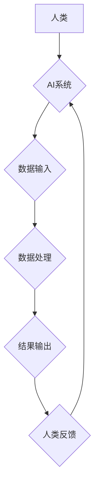

> 人工智能，深度学习，自然语言处理，计算机视觉，机器学习，人机交互，未来趋势

## 1. 背景介绍

人工智能（AI）正以惊人的速度发展，从自动驾驶汽车到医疗诊断，AI正在改变着我们生活的方方面面。随着技术的不断进步，AI将与人类更加紧密地互动和合作，共同创造更加美好的未来。

然而，AI的发展也引发了许多关于伦理、社会影响和未来趋势的讨论。我们需要认真思考AI与人类的未来互动与合作关系，确保AI技术能够真正造福人类。

## 2. 核心概念与联系

**2.1 人工智能 (AI)**

人工智能是指模拟人类智能行为的计算机系统。这些系统能够学习、推理、解决问题和做出决策，就像人类一样。

**2.2 深度学习 (Deep Learning)**

深度学习是机器学习的一种子集，它利用多层神经网络来模拟人类大脑的学习过程。深度学习算法能够从海量数据中自动提取特征，从而实现更准确的预测和识别。

**2.3 自然语言处理 (NLP)**

自然语言处理是指使计算机能够理解、处理和生成人类语言的技术。NLP应用广泛，例如机器翻译、语音识别、文本摘要等。

**2.4 计算机视觉 (CV)**

计算机视觉是指使计算机能够“看”和理解图像的技术。CV应用包括图像识别、物体检测、场景理解等。

**2.5 人机交互 (HCI)**

人机交互是指人类与计算机之间进行交互的方式和方法。随着AI的发展，人机交互方式将更加自然和智能。

**2.6 未来趋势**

* **通用人工智能 (AGI)**：AGI是指能够执行任何人类智能任务的AI系统。
* **解释性 AI (XAI)**：XAI是指能够解释其决策过程的AI系统。
* **联邦学习 (FL)**：FL是一种分布式机器学习方法，能够在不共享原始数据的情况下训练模型。

**Mermaid 流程图**



## 3. 核心算法原理 & 具体操作步骤

### 3.1 算法原理概述

深度学习算法的核心是多层神经网络。神经网络由许多相互连接的神经元组成，每个神经元接收输入信号，对其进行处理，并输出信号。通过调整神经元之间的连接权重，深度学习算法能够学习数据中的模式和关系。

### 3.2 算法步骤详解

1. **数据预处理**: 将原始数据转换为深度学习算法可以理解的格式。
2. **网络结构设计**: 根据任务需求设计神经网络的结构，包括层数、神经元数量等。
3. **参数初始化**: 为神经网络中的参数（权重和偏置）赋初值。
4. **前向传播**: 将输入数据通过神经网络传递，计算输出结果。
5. **反向传播**: 计算输出结果与真实值的误差，并根据误差调整神经网络的参数。
6. **迭代训练**: 重复前向传播和反向传播的过程，直到模型性能达到预期水平。

### 3.3 算法优缺点

**优点**:

* 能够从海量数据中自动提取特征，无需人工特征工程。
* 能够学习复杂非线性关系。
* 在图像识别、语音识别等领域取得了突破性进展。

**缺点**:

* 需要大量的训练数据。
* 训练过程耗时和耗能。
* 模型解释性较差。

### 3.4 算法应用领域

* **图像识别**: 人脸识别、物体检测、图像分类等。
* **语音识别**: 语音转文本、语音助手等。
* **自然语言处理**: 机器翻译、文本摘要、情感分析等。
* **推荐系统**: 商品推荐、内容推荐等。
* **医疗诊断**: 疾病诊断、影像分析等。

## 4. 数学模型和公式 & 详细讲解 & 举例说明

### 4.1 数学模型构建

深度学习算法的核心是神经网络，其数学模型可以表示为一系列的线性变换和非线性激活函数。

**线性变换**:

$$
y = Wx + b
$$

其中，$x$ 是输入向量，$W$ 是权重矩阵，$b$ 是偏置向量，$y$ 是输出向量。

**非线性激活函数**:

$$
f(x)
$$

激活函数的作用是引入非线性，使神经网络能够学习复杂关系。常见的激活函数包括 sigmoid 函数、ReLU 函数等。

### 4.2 公式推导过程

深度学习算法的训练过程是通过反向传播算法来实现的。反向传播算法的核心是计算误差梯度，并根据梯度更新神经网络的参数。

**损失函数**:

$$
L(y, \hat{y})
$$

损失函数用于衡量模型预测值 $\hat{y}$ 与真实值 $y$ 之间的差异。

**梯度**:

$$
\frac{\partial L}{\partial W}, \frac{\partial L}{\partial b}
$$

梯度表示损失函数对参数 $W$ 和 $b$ 的偏导数。

**参数更新**:

$$
W = W - \alpha \frac{\partial L}{\partial W}, \quad b = b - \alpha \frac{\partial L}{\partial b}
$$

其中，$\alpha$ 是学习率。

### 4.3 案例分析与讲解

**举例说明**:

假设我们训练一个图像分类模型，目标是识别猫和狗的图片。

1. **数据预处理**: 将猫狗图片预处理成合适的格式，例如 resize 到固定大小。
2. **网络结构设计**: 设计一个包含卷积层、池化层和全连接层的深度神经网络。
3. **参数初始化**: 为神经网络的参数赋初值。
4. **前向传播**: 将输入图片通过神经网络传递，计算输出结果。
5. **反向传播**: 计算输出结果与真实标签之间的误差，并根据误差更新神经网络的参数。
6. **迭代训练**: 重复前向传播和反向传播的过程，直到模型性能达到预期水平。

## 5. 项目实践：代码实例和详细解释说明

### 5.1 开发环境搭建

* Python 3.x
* TensorFlow 或 PyTorch
* Jupyter Notebook

### 5.2 源代码详细实现

```python
import tensorflow as tf

# 定义模型结构
model = tf.keras.models.Sequential([
    tf.keras.layers.Conv2D(32, (3, 3), activation='relu', input_shape=(28, 28, 1)),
    tf.keras.layers.MaxPooling2D((2, 2)),
    tf.keras.layers.Conv2D(64, (3, 3), activation='relu'),
    tf.keras.layers.MaxPooling2D((2, 2)),
    tf.keras.layers.Flatten(),
    tf.keras.layers.Dense(10, activation='softmax')
])

# 编译模型
model.compile(optimizer='adam',
              loss='sparse_categorical_crossentropy',
              metrics=['accuracy'])

# 训练模型
model.fit(x_train, y_train, epochs=10)

# 评估模型
loss, accuracy = model.evaluate(x_test, y_test)
print('Test loss:', loss)
print('Test accuracy:', accuracy)
```

### 5.3 代码解读与分析

* **模型结构**: 该代码定义了一个简单的卷积神经网络，用于图像分类任务。
* **编译模型**: 使用 Adam 优化器、交叉熵损失函数和准确率指标来编译模型。
* **训练模型**: 使用训练数据训练模型，设置训练轮数为 10。
* **评估模型**: 使用测试数据评估模型的性能，打印测试损失和准确率。

### 5.4 运行结果展示

运行代码后，会输出测试损失和准确率。

## 6. 实际应用场景

### 6.1 医疗诊断

AI 能够辅助医生进行疾病诊断，例如分析医学影像，识别肿瘤等。

### 6.2 自动驾驶

AI 驱动的自动驾驶汽车能够感知周围环境，做出驾驶决策，提高道路安全。

### 6.3 金融风险管理

AI 能够分析金融数据，识别潜在的风险，帮助金融机构进行风险管理。

### 6.4 个性化教育

AI 能够根据学生的学习情况，提供个性化的学习内容和建议。

### 6.5 未来应用展望

AI 将在更多领域得到应用，例如：

* **机器人**: AI 驱动的机器人能够执行更复杂的任务，例如手术、家务等。
* **个性化推荐**: AI 能够根据用户的喜好，提供更精准的商品和内容推荐。
* **科学研究**: AI 能够加速科学研究，例如药物研发、材料科学等。

## 7. 工具和资源推荐

### 7.1 学习资源推荐

* **在线课程**: Coursera, edX, Udacity
* **书籍**: 深度学习，机器学习，人工智能导论
* **开源项目**: TensorFlow, PyTorch, Keras

### 7.2 开发工具推荐

* **Python**: 编程语言
* **Jupyter Notebook**: 代码编辑和运行环境
* **TensorFlow**: 深度学习框架
* **PyTorch**: 深度学习框架

### 7.3 相关论文推荐

* **AlphaGo**: DeepMind
* **BERT**: Google AI
* **GPT-3**: OpenAI

## 8. 总结：未来发展趋势与挑战

### 8.1 研究成果总结

近年来，AI 取得了显著进展，在图像识别、语音识别、自然语言处理等领域取得了突破性成果。

### 8.2 未来发展趋势

* **通用人工智能 (AGI)**：AGI 是 AI 的终极目标，是指能够执行任何人类智能任务的 AI 系统。
* **解释性 AI (XAI)**：XAI 是指能够解释其决策过程的 AI 系统，能够提高 AI 的可信度和透明度。
* **联邦学习 (FL)**：FL 是一种分布式机器学习方法，能够在不共享原始数据的情况下训练模型，提高数据隐私保护。

### 8.3 面临的挑战

* **数据获取**: AI 算法需要大量的训练数据，获取高质量数据是一个挑战。
* **算法解释**: 许多 AI 算法是黑盒模型，难以解释其决策过程，这限制了 AI 的应用。
* **伦理问题**: AI 的发展引发了许多伦理问题，例如算法偏见、隐私保护等。

### 8.4 研究展望

未来，AI 研究将继续朝着通用性、解释性和安全性等方向发展，并与其他领域交叉融合，创造更加美好的未来。

## 9. 附录：常见问题与解答

**常见问题**:

* **什么是深度学习？**
* **深度学习有哪些应用？**
* **如何学习深度学习？**
* **深度学习有哪些挑战？**

**解答**:

* 深度学习是一种机器学习的子集，它利用多层神经网络来模拟人类大脑的学习过程。
* 深度学习的应用领域非常广泛，包括图像识别、语音识别、自然语言处理、推荐系统等。
* 学习深度学习可以通过在线课程、书籍、开源项目等方式。
* 深度学习面临的挑战包括数据获取、算法解释、伦理问题等。


作者：禅与计算机程序设计艺术 / Zen and the Art of Computer Programming 
<end_of_turn>