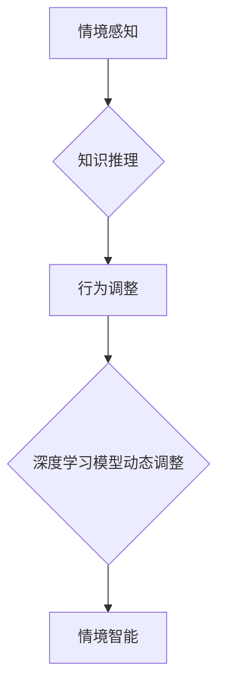

> 深度学习、情境智能、动态调整、模型优化、迁移学习、神经网络、算法原理、实践应用

## 1. 背景介绍

深度学习作为人工智能领域最前沿的技术之一，在图像识别、自然语言处理、语音识别等领域取得了突破性的进展。然而，传统的深度学习模型往往在面对新的场景或任务时表现不佳，缺乏泛化能力和适应性。这主要是因为这些模型在训练过程中依赖于大量的标注数据，而现实世界中获取高质量标注数据往往成本高昂且耗时。

情境智能 (Contextual Intelligence) 旨在赋予人工智能系统理解和适应不同情境的能力，使其能够在面对新的场景或任务时灵活调整行为，并做出最优决策。动态调整深度学习模型参数，使其能够根据不同的情境进行优化，是实现情境智能的关键技术之一。

## 2. 核心概念与联系

**2.1 情境智能**

情境智能是指人工智能系统能够理解和利用上下文信息，从而做出更智能、更符合人类认知的决策。它涉及到以下几个关键方面：

* **上下文感知:**  系统能够从环境、用户行为、历史记录等方面获取上下文信息。
* **知识推理:** 系统能够根据上下文信息进行逻辑推理，推断出隐藏的信息和潜在的关系。
* **行为调整:** 系统能够根据上下文信息调整自己的行为策略，以达到最佳效果。

**2.2 深度学习模型动态调整**

深度学习模型动态调整是指在训练完成后，根据实际应用场景的变化，对模型参数进行实时或离线调整，以提高模型的性能和适应性。

**2.3 核心概念联系**

情境智能和深度学习模型动态调整相互关联，共同推动人工智能系统的进化。

* 情境智能为深度学习模型动态调整提供了目标和方向，即根据不同的情境，调整模型参数以获得最佳性能。
* 深度学习模型动态调整为实现情境智能提供了技术手段，通过对模型参数的调整，可以使模型更加灵活、适应性强。

**2.4 Mermaid 流程图**



## 3. 核心算法原理 & 具体操作步骤

### 3.1 算法原理概述

深度学习模型动态调整的算法原理主要基于以下几个方面：

* **迁移学习:** 利用预训练模型的知识，在新的任务或场景下进行微调，减少训练数据需求。
* **元学习:** 学习如何学习，能够快速适应新的任务和环境。
* **在线学习:** 在数据流式更新的情况下，不断更新模型参数，使其能够适应不断变化的环境。

### 3.2 算法步骤详解

**3.2.1 迁移学习**

1. **选择预训练模型:** 根据目标任务选择合适的预训练模型，例如 ImageNet 预训练的卷积神经网络 (CNN) 用于图像识别任务。
2. **特征提取:** 将预训练模型的特征提取层作为基础，构建新的模型架构。
3. **微调:** 使用目标任务的数据对新的模型进行微调，调整模型参数以适应新的任务。

**3.2.2 元学习**

1. **构建元学习模型:** 使用元学习算法训练一个元学习模型，例如 MAML (Model-Agnostic Meta-Learning)。
2. **内循环训练:** 在每个任务上进行少量样本的训练，更新模型参数。
3. **外循环更新:** 根据内循环训练的结果，更新元学习模型的参数。

**3.2.3 在线学习**

1. **数据流式更新:** 接收不断更新的数据流。
2. **模型更新:** 使用在线学习算法，例如 SGD (Stochastic Gradient Descent) 或 Adam，根据新数据更新模型参数。

### 3.3 算法优缺点

| 算法 | 优点 | 缺点 |
|---|---|---|
| 迁移学习 | 减少训练数据需求，提高训练效率 | 需要选择合适的预训练模型，预训练模型可能不适合所有任务 |
| 元学习 | 快速适应新的任务，提高泛化能力 | 训练复杂度高，需要大量数据 |
| 在线学习 | 能够适应不断变化的环境，实时更新模型 | 需要保证数据质量，容易出现过拟合问题 |

### 3.4 算法应用领域

* **图像识别:**  迁移学习可以用于快速训练新的图像识别模型，例如识别特定物体的图像。
* **自然语言处理:** 元学习可以用于快速适应新的自然语言处理任务，例如文本分类、机器翻译等。
* **推荐系统:** 在线学习可以用于实时更新推荐系统的模型，根据用户的行为和偏好进行个性化推荐。

## 4. 数学模型和公式 & 详细讲解 & 举例说明

### 4.1 数学模型构建

**4.1.1 迁移学习模型**

假设预训练模型的参数为 θ<sub>p</sub>，目标任务的数据为 (x<sub>i</sub>, y<sub>i</sub>)，目标任务模型的参数为 θ<sub>t</sub>。迁移学习模型的目标是找到最佳的 θ<sub>t</sub>，使得目标任务的损失函数最小化。

损失函数:

$$L(\theta_t) = \sum_{i=1}^{N} L(f(x_i, \theta_t), y_i)$$

其中，f(x<sub>i</sub>, θ<sub>t</sub>) 是目标任务模型对输入 x<sub>i</sub> 的预测结果，N 是训练样本的数量。

**4.1.2 元学习模型**

元学习模型的目标是学习一个能够快速适应新任务的策略。

策略:

$$ \theta_t = \phi(\theta_p, \mathcal{D}_t)$$

其中，θ<sub>p</sub> 是预训练模型的参数，mathcal{D}<sub>t</sub> 是目标任务的数据集。

### 4.2 公式推导过程

**4.2.1 迁移学习模型参数更新**

使用梯度下降算法更新目标任务模型的参数：

$$\theta_t = \theta_t - \alpha \nabla_{\theta_t} L(\theta_t)$$

其中，α 是学习率。

**4.2.2 元学习模型参数更新**

使用元学习算法更新元学习模型的参数：

$$\phi = \phi - \beta \nabla_{\phi} \mathcal{L}(\phi)$$

其中，β 是学习率，mathcal{L}(φ) 是元学习模型的损失函数。

### 4.3 案例分析与讲解

**4.3.1 迁移学习案例**

使用 ImageNet 预训练的 ResNet 模型进行猫狗识别任务。

* 选择 ResNet 模型作为预训练模型。
* 将 ResNet 模型的特征提取层作为基础，构建新的模型架构，并添加全连接层进行分类。
* 使用猫狗识别数据集对新的模型进行微调。

**4.3.2 元学习案例**

使用 MAML 算法训练一个元学习模型，用于快速适应新的文本分类任务。

* 使用多个文本分类数据集进行训练，每个数据集包含多个子任务。
* 在每个子任务上进行少量样本的训练，更新模型参数。
* 根据内循环训练的结果，更新元学习模型的参数。
* 在新的文本分类任务上，使用预训练的元学习模型进行微调，即可快速适应新的任务。

## 5. 项目实践：代码实例和详细解释说明

### 5.1 开发环境搭建

* Python 3.7+
* TensorFlow 2.0+
* PyTorch 1.0+
* CUDA 10.0+ (可选)

### 5.2 源代码详细实现

```python
# 迁移学习示例代码

import tensorflow as tf

# 加载预训练模型
model = tf.keras.applications.ResNet50(weights='imagenet', include_top=False)

# 构建新的模型架构
input_tensor = tf.keras.Input(shape=(224, 224, 3))
x = model(input_tensor, training=False)
x = tf.keras.layers.GlobalAveragePooling2D()(x)
x = tf.keras.layers.Dense(1024, activation='relu')(x)
output_tensor = tf.keras.layers.Dense(2, activation='softmax')(x)

# 创建新的模型
new_model = tf.keras.Model(inputs=input_tensor, outputs=output_tensor)

# 微调模型
new_model.compile(optimizer='adam', loss='categorical_crossentropy', metrics=['accuracy'])
new_model.fit(train_data, train_labels, epochs=10)

# 在线学习示例代码

import torch
import torch.nn as nn

# 定义在线学习模型
class OnlineLearningModel(nn.Module):
    def __init__(self):
        super(OnlineLearningModel, self).__init__()
        self.fc1 = nn.Linear(10, 5)
        self.fc2 = nn.Linear(5, 1)

    def forward(self, x):
        x = torch.relu(self.fc1(x))
        x = self.fc2(x)
        return x

# 实例化模型
model = OnlineLearningModel()

# 定义优化器
optimizer = torch.optim.SGD(model.parameters(), lr=0.01)

# 在线学习
for epoch in range(100):
    for data, target in train_loader:
        # 前向传播
        output = model(data)
        # 计算损失
        loss = nn.MSELoss()(output, target)
        # 反向传播
        optimizer.zero_grad()
        loss.backward()
        # 更新参数
        optimizer.step()
```

### 5.3 代码解读与分析

* 迁移学习示例代码演示了如何使用预训练模型进行微调，以适应新的任务。
* 在线学习示例代码演示了如何使用在线学习算法，在数据流式更新的情况下，不断更新模型参数。

### 5.4 运行结果展示

运行上述代码，可以观察到模型的训练过程和最终的性能指标。

## 6. 实际应用场景

### 6.1 情境感知

* **智能家居:** 根据用户的行为和环境信息，智能家居系统可以自动调节灯光、温度、音乐等，提供更加舒适的生活体验。
* **个性化推荐:** 在线学习算法可以根据用户的浏览历史、购买记录等信息，实时更新推荐系统的模型，提供更加个性化的商品推荐。

### 6.2 深度学习模型动态调整

* **自动驾驶:** 在面对复杂路况时，自动驾驶系统可以根据实时路况信息，动态调整模型参数，提高决策的准确性和安全性。
* **医疗诊断:** 深度学习模型可以用于辅助医生进行疾病诊断，根据患者的症状、检查结果等信息，动态调整模型参数，提高诊断的准确率。

### 6.4 未来应用展望

情境智能和深度学习模型动态调整将推动人工智能技术的进一步发展，在更多领域发挥重要作用。例如：

* **人机交互:** 人工智能系统将能够更加自然地理解和响应用户的意图，提供更加人性化的交互体验。
* **智能决策:** 人工智能系统将能够在复杂环境下，根据情境信息进行更加智能的决策，辅助人类解决问题。

## 7. 工具和资源推荐

### 7.1 学习资源推荐

* **书籍:**
    * 深度学习
    * 人工智能：一种现代方法
* **在线课程:**
    * Coursera: 深度学习
    * Udacity: 
    * fast.ai: 深度学习课程

### 7.2 开发工具推荐

* **TensorFlow:** 开源深度学习框架
* **PyTorch:** 开源深度学习框架
* **Keras:** 高级深度学习API

### 7.3 相关论文推荐

* **Attention Is All You Need:** https://arxiv.org/abs/1706.03762
* **BERT: Pre-training of Deep Bidirectional Transformers for Language Understanding:** https://arxiv.org/abs/1810.04805
* **Meta-Learning