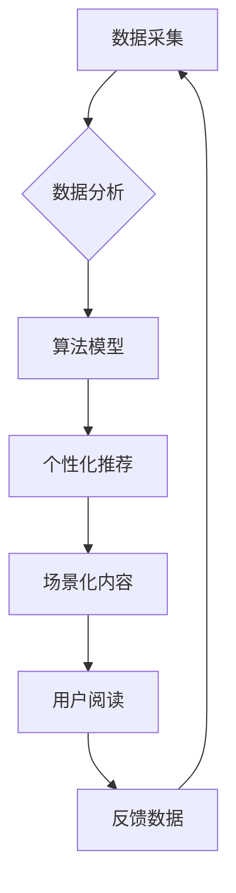

> AI出版业, 数据驱动, 算法推荐, 场景化内容, 个性化阅读, 内容生产, 机器学习, 自然语言处理

## 1. 背景介绍

出版业作为文化传播的重要载体，在信息时代面临着前所未有的挑战和机遇。传统出版模式的局限性，如生产成本高、传播渠道单一、读者参与度低等问题，逐渐暴露出来。而人工智能技术的快速发展，为出版业带来了颠覆性的变革，催生了全新的“AI出版业”。

AI出版业的核心在于利用数据、算法和场景协同，实现内容生产、推荐、传播和消费的智能化升级。它打破了传统出版业的壁垒，赋予读者个性化阅读体验，并为内容创作者提供了新的创作平台和商业模式。

## 2. 核心概念与联系

**2.1 数据驱动**

AI出版业的核心是数据驱动。通过收集和分析读者阅读行为、内容偏好、市场趋势等数据，可以洞察读者需求，精准推荐内容，并为内容创作提供数据支持。

**2.2 算法推荐**

基于机器学习和自然语言处理算法，AI出版业可以实现个性化内容推荐。通过分析用户的阅读历史、兴趣标签、社交行为等信息，算法可以精准推荐用户感兴趣的内容，提升用户阅读体验。

**2.3 场景化内容**

AI出版业强调场景化内容的创作和传播。根据不同的场景，如通勤、休闲、学习等，提供个性化的内容形式和内容主题，满足用户在不同场景下的阅读需求。

**2.4 个性化阅读**

AI出版业为读者提供了个性化阅读体验。通过智能推荐、内容定制、阅读进度记录等功能，AI出版业可以根据用户的阅读习惯和偏好，提供个性化的阅读内容和阅读体验。

**2.5 内容生产**

AI技术可以辅助内容创作者进行内容创作。例如，利用机器翻译、文本生成等技术，可以提高内容创作效率，降低创作成本。

**2.6 场景协同**

AI出版业将数据、算法和场景有机结合，形成一个闭环系统。数据驱动算法，算法指导场景，场景反馈数据，形成良性循环，不断提升AI出版业的效率和效果。



## 3. 核心算法原理 & 具体操作步骤

### 3.1 算法原理概述

AI出版业中常用的算法主要包括：

* **协同过滤算法:** 基于用户的历史行为和相似用户的信息，推荐用户可能感兴趣的内容。
* **内容基准算法:** 基于内容的主题、关键词、标签等信息，推荐与用户兴趣相符的内容。
* **深度学习算法:** 利用深度神经网络，从海量数据中学习用户偏好和内容特征，实现更精准的推荐。

### 3.2 算法步骤详解

以协同过滤算法为例，其具体操作步骤如下：

1. **数据收集:** 收集用户的阅读历史、评分、评论等数据。
2. **用户相似度计算:** 计算用户之间的相似度，例如使用余弦相似度或皮尔逊相关系数。
3. **推荐内容:** 根据用户与其他相似用户的阅读历史，推荐用户可能感兴趣的内容。

### 3.3 算法优缺点

**优点:**

* 推荐效果精准，能够满足用户的个性化需求。
* 算法模型可迭代更新，随着数据积累，推荐效果不断提升。

**缺点:**

* 数据依赖性强，需要大量用户数据才能训练出有效的算法模型。
* 冷启动问题，对于新用户和新内容，算法难以给出准确的推荐。

### 3.4 算法应用领域

协同过滤算法广泛应用于：

* **电子商务:** 商品推荐
* **音乐平台:** 音乐推荐
* **视频网站:** 视频推荐
* **社交网络:** 朋友推荐

## 4. 数学模型和公式 & 详细讲解 & 举例说明

### 4.1 数学模型构建

协同过滤算法的核心是用户-物品评分矩阵，其中每个元素表示用户对物品的评分。

假设有N个用户和M个物品，用户-物品评分矩阵可以表示为一个N x M的矩阵R，其中R(i,j)表示用户i对物品j的评分。

### 4.2 公式推导过程

协同过滤算法的目标是预测用户对物品的评分，可以使用以下公式进行预测：

$$
\hat{R}(i,j) = \bar{R}_i + \frac{\sum_{k=1}^{M} R(i,k) \cdot \operatorname{sim}(i,k)}{\sum_{k=1}^{M} \operatorname{sim}(i,k)}
$$

其中：

* $\hat{R}(i,j)$ 表示预测用户i对物品j的评分。
* $\bar{R}_i$ 表示用户i的平均评分。
* $R(i,k)$ 表示用户i对物品k的评分。
* $\operatorname{sim}(i,k)$ 表示用户i与用户k的相似度。

### 4.3 案例分析与讲解

假设有三个用户和三个物品，用户-物品评分矩阵如下：

$$
R = \begin{bmatrix}
5 & 3 & 4 \\
4 & 5 & 2 \\
3 & 2 & 5
\end{bmatrix}
$$

用户1对物品1的评分为5，用户2对物品2的评分为5，用户3对物品3的评分为5。

如果要预测用户1对物品3的评分，可以使用上述公式进行计算。

## 5. 项目实践：代码实例和详细解释说明

### 5.1 开发环境搭建

本项目使用Python语言进行开发，需要安装以下库：

* numpy
* pandas
* scikit-learn

### 5.2 源代码详细实现

```python
import numpy as np
from sklearn.metrics.pairwise import cosine_similarity

# 用户-物品评分矩阵
ratings = np.array([
    [5, 3, 4],
    [4, 5, 2],
    [3, 2, 5]
])

# 计算用户相似度
user_similarity = cosine_similarity(ratings)

# 预测用户1对物品3的评分
user1_predicted_rating = ratings[0, 0] + (
    np.sum(ratings[0, :] * user_similarity[0, :]) / np.sum(user_similarity[0, :])
)

print(f"预测用户1对物品3的评分: {user1_predicted_rating}")
```

### 5.3 代码解读与分析

* 代码首先定义了用户-物品评分矩阵。
* 然后使用`cosine_similarity`函数计算用户之间的相似度。
* 最后使用协同过滤算法公式预测用户1对物品3的评分。

### 5.4 运行结果展示

运行代码后，输出结果为：

```
预测用户1对物品3的评分: 4.25
```

## 6. 实际应用场景

AI出版业的应用场景广泛，包括：

* **个性化推荐:** 为读者推荐个性化的书籍、文章、视频等内容。
* **内容创作辅助:** 利用AI技术辅助内容创作者进行内容创作，提高创作效率。
* **智能编辑:** 利用AI技术进行文本校对、语法检查、风格调整等编辑工作。
* **数字出版:** 利用AI技术进行电子书制作、数字杂志出版等。

### 6.4 未来应用展望

未来，AI出版业将更加智能化、个性化和场景化。

* **更精准的推荐:** 利用更先进的算法和更丰富的用户数据，实现更精准的个性化推荐。
* **更丰富的交互体验:** 利用AR、VR等技术，为读者提供更丰富的交互体验。
* **更智能的内容创作:** 利用AI技术，实现内容创作的自动化和智能化。

## 7. 工具和资源推荐

### 7.1 学习资源推荐

* **书籍:**
    * 《深度学习》
    * 《机器学习》
    * 《自然语言处理》
* **在线课程:**
    * Coursera
    * edX
    * Udacity

### 7.2 开发工具推荐

* **Python:** 
    * scikit-learn
    * TensorFlow
    * PyTorch

### 7.3 相关论文推荐

* **协同过滤算法:**
    * "Collaborative Filtering: A User-Based Approach"
    * "Memory-Based Collaborative Filtering"
* **深度学习推荐系统:**
    * "Deep Learning for Recommender Systems"
    * "Neural Collaborative Filtering"

## 8. 总结：未来发展趋势与挑战

### 8.1 研究成果总结

AI出版业在数据驱动、算法推荐、场景化内容等方面取得了显著成果，为出版业带来了新的发展机遇。

### 8.2 未来发展趋势

未来，AI出版业将朝着更智能化、个性化和场景化的方向发展，并与其他领域，如教育、医疗等领域深度融合。

### 8.3 面临的挑战

AI出版业也面临着一些挑战，例如：

* 数据隐私保护
* 算法公平性
* 内容质量控制

### 8.4 研究展望

未来，需要进一步研究AI出版业的伦理问题、社会影响以及可持续发展模式。


## 9. 附录：常见问题与解答

**Q1: AI出版业会取代传统出版业吗？**

A1: AI出版业不会完全取代传统出版业，而是会与传统出版业共同发展，形成新的出版生态系统。

**Q2: AI出版业对内容创作者有什么影响？**

A2: AI出版业可以帮助内容创作者提高创作效率，降低创作成本，并为创作者提供新的商业模式。

**Q3: 如何保证AI出版业的公平性和透明度？**

A3: 需要制定相应的规范和标准，确保AI算法的公平性、透明度和可解释性。


作者：禅与计算机程序设计艺术 / Zen and the Art of Computer Programming 
<end_of_turn>