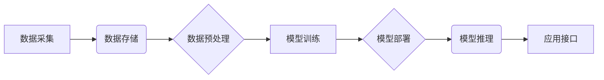

> AI创业公司,技术架构,性能优化,成本优化,安全优化,云计算,机器学习,深度学习,大数据

## 1. 背景介绍

在当今科技飞速发展的时代，人工智能（AI）技术正在各个领域掀起一场革命。AI创业公司应运而生，涌现出许多创新应用，例如智能客服、自动驾驶、医疗诊断等。然而，随着AI应用的规模和复杂度不断提升，AI创业公司面临着诸多技术挑战，其中技术架构的优化尤为关键。

技术架构是AI系统的骨架，它决定了系统的性能、成本和安全性。一个合理的架构可以有效地提高系统的效率，降低运营成本，并保障数据的安全。然而，许多AI创业公司在初期往往缺乏对技术架构的深入思考，导致系统性能瓶颈、成本过高、安全风险等问题。

本文将深入探讨AI创业公司的技术架构优化，从性能优化、成本优化和安全优化三个方面进行分析，并提供一些实践建议。

## 2. 核心概念与联系

**2.1 核心概念**

* **性能优化:** 指提高AI系统的响应速度、处理能力和资源利用率。
* **成本优化:** 指降低AI系统的部署、运行和维护成本。
* **安全优化:** 指保障AI系统的安全性和数据隐私。

**2.2 架构联系**

AI系统的技术架构通常包括以下几个关键部分：

* **数据层:** 包含数据的采集、存储、处理和管理。
* **模型层:** 包含AI模型的训练、部署和调优。
* **计算层:** 提供计算资源，支持模型的训练和推理。
* **应用层:** 提供用户接口，将AI模型应用于实际场景。

这些部分之间相互关联，共同构成AI系统的整体架构。

**2.3 架构流程图**



## 3. 核心算法原理 & 具体操作步骤

**3.1 算法原理概述**

在AI创业公司的技术架构优化中，算法优化是至关重要的。选择合适的算法可以显著提高系统的性能和效率。例如，在数据处理方面，可以使用 MapReduce 算法进行大规模数据并行处理，在模型训练方面，可以使用深度学习算法进行复杂模式的学习。

**3.2 算法步骤详解**

* **数据预处理:** 

    * 数据清洗：去除数据中的噪声、缺失值和重复数据。
    * 数据转换：将数据转换为模型可识别的格式。
    * 数据特征工程：提取数据的特征，以便模型更好地学习。

* **模型训练:**

    * 选择合适的模型架构。
    * 训练模型参数，使模型能够准确地预测或分类数据。
    * 评估模型性能，并进行模型调优。

* **模型部署:**

    * 将训练好的模型部署到生产环境中。
    * 提供模型推理接口，以便用户调用模型进行预测或分类。

**3.3 算法优缺点**

* **MapReduce:**

    * 优点：并行处理能力强，适用于大规模数据处理。
    * 缺点：数据传输开销大，对数据分布有要求。

* **深度学习:**

    * 优点：能够学习复杂模式，在图像识别、自然语言处理等领域表现出色。
    * 缺点：训练时间长，对计算资源要求高。

**3.4 算法应用领域**

* **数据分析:** 使用 MapReduce 算法进行大规模数据分析，发现数据中的趋势和模式。
* **图像识别:** 使用深度学习算法进行图像识别，例如人脸识别、物体检测。
* **自然语言处理:** 使用深度学习算法进行自然语言处理，例如文本分类、机器翻译。

## 4. 数学模型和公式 & 详细讲解 & 举例说明

**4.1 数学模型构建**

在AI系统中，数学模型是描述系统行为和关系的抽象表示。例如，在机器学习中，模型参数的更新过程可以用梯度下降算法来描述，其数学模型可以表示为：

$$
\theta_{t+1} = \theta_t - \eta \nabla L(\theta_t)
$$

其中：

* $\theta$ 表示模型参数。
* $t$ 表示迭代次数。
* $\eta$ 表示学习率。
* $L(\theta)$ 表示损失函数，用于衡量模型预测结果与真实值的差异。
* $\nabla L(\theta)$ 表示损失函数的梯度，表示模型参数变化的方向。

**4.2 公式推导过程**

梯度下降算法的基本思想是通过不断迭代更新模型参数，使损失函数的值逐渐减小。

* 首先，计算损失函数的梯度，即模型参数变化的方向。
* 然后，根据学习率和梯度值，更新模型参数。
* 重复上述步骤，直到损失函数达到最小值。

**4.3 案例分析与讲解**

假设我们有一个线性回归模型，其目标是预测房价。模型的数学表达式为：

$$
y = w_0 + w_1 x_1 + w_2 x_2 + ... + w_n x_n
$$

其中：

* $y$ 表示房价。
* $w_0, w_1, ..., w_n$ 表示模型参数。
* $x_1, x_2, ..., x_n$ 表示房屋特征，例如面积、位置等。

我们可以使用梯度下降算法来训练模型参数，使模型能够准确地预测房价。

## 5. 项目实践：代码实例和详细解释说明

**5.1 开发环境搭建**

* 操作系统：Ubuntu 20.04
* Python 版本：3.8
* 框架：TensorFlow 2.0

**5.2 源代码详细实现**

```python
import tensorflow as tf

# 定义模型
model = tf.keras.models.Sequential([
    tf.keras.layers.Dense(64, activation='relu', input_shape=(784,)),
    tf.keras.layers.Dense(10, activation='softmax')
])

# 编译模型
model.compile(optimizer='adam',
              loss='sparse_categorical_crossentropy',
              metrics=['accuracy'])

# 训练模型
model.fit(x_train, y_train, epochs=10)

# 评估模型
loss, accuracy = model.evaluate(x_test, y_test)
print('Loss:', loss)
print('Accuracy:', accuracy)
```

**5.3 代码解读与分析**

* 首先，我们定义了一个简单的多层感知机模型。
* 然后，我们使用 Adam 优化器、交叉熵损失函数和准确率指标来编译模型。
* 接着，我们使用训练数据训练模型，并设置训练轮数为 10。
* 最后，我们使用测试数据评估模型的性能。

**5.4 运行结果展示**

训练完成后，我们可以查看模型的损失值和准确率。

## 6. 实际应用场景

**6.1 智能客服**

AI创业公司可以利用自然语言处理技术，构建智能客服系统，自动回答用户常见问题，提高客户服务效率。

**6.2 自动驾驶**

AI创业公司可以利用计算机视觉和机器学习技术，开发自动驾驶系统，实现车辆自动驾驶功能。

**6.3 医疗诊断**

AI创业公司可以利用深度学习技术，开发医疗诊断系统，辅助医生进行疾病诊断，提高诊断准确率。

**6.4 未来应用展望**

随着AI技术的不断发展，AI创业公司将有更多机会应用AI技术，解决社会问题，创造新的价值。例如，在教育领域，AI可以个性化学习方案，提高学习效率；在金融领域，AI可以进行风险评估，提高金融服务效率。

## 7. 工具和资源推荐

**7.1 学习资源推荐**

* **Coursera:** 提供丰富的AI课程，例如 Andrew Ng 的机器学习课程。
* **Udacity:** 提供AI相关的职业培训课程，例如 AI Engineer Nanodegree。
* **Kaggle:** 提供AI竞赛平台，可以练习AI算法和模型。

**7.2 开发工具推荐**

* **TensorFlow:** 开源深度学习框架，支持多种硬件平台。
* **PyTorch:** 开源深度学习框架，以其灵活性和易用性而闻名。
* **Scikit-learn:** 开源机器学习库，提供各种机器学习算法。

**7.3 相关论文推荐**

* **Deep Learning** by Ian Goodfellow, Yoshua Bengio, and Aaron Courville
* **Attention Is All You Need** by Ashish Vaswani et al.
* **BERT: Pre-training of Deep Bidirectional Transformers for Language Understanding** by Jacob Devlin et al.

## 8. 总结：未来发展趋势与挑战

**8.1 研究成果总结**

近年来，AI技术取得了长足的进步，在各个领域都取得了突破性进展。例如，在图像识别、自然语言处理、语音识别等领域，AI模型的性能已经接近或超过人类水平。

**8.2 未来发展趋势**

* **模型规模化:** 未来，AI模型的规模将继续扩大，模型参数数量将达到数亿甚至数千亿。
* **模型泛化能力:** 研究者将致力于提高AI模型的泛化能力，使其能够适应更多不同的场景和数据。
* **模型解释性:** 如何解释AI模型的决策过程，使其更加透明和可信，是未来研究的重要方向。

**8.3 面临的挑战**

* **数据安全:** AI模型的训练和部署需要大量数据，如何保障数据的安全和隐私是重要的挑战。
* **算法公平性:** AI算法可能存在偏见，导致不公平的结果，如何确保算法的公平性和公正性是需要解决的问题。
* **伦理问题:** AI技术的快速发展引发了伦理问题，例如AI的责任归属、AI的就业影响等，需要社会各界共同探讨和解决。

**8.4 研究展望**

未来，AI技术将继续发展，为人类社会带来更多福祉。研究者将继续探索AI技术的潜力，解决AI技术面临的挑战，推动AI技术朝着更加安全、可靠、可解释的方向发展。

## 9. 附录：常见问题与解答

**9.1 如何选择合适的AI算法？**

选择合适的AI算法取决于具体的应用场景和数据特点。例如，对于分类问题，可以使用支持向量机、决策树或神经网络等算法；对于回归问题，可以使用线性回归、逻辑回归或神经网络等算法。

**9.2 如何评估AI模型的性能？**

常用的AI模型性能评估指标包括准确率、召回率、F1-score、AUC等。选择合适的评估指标取决于具体的应用场景和任务目标。

**9.3 如何解决AI模型的过拟合问题？**

过拟合是指AI模型在训练数据上表现良好，但在测试数据上表现较差。解决过拟合问题的方法包括：

* 增加训练数据量
* 使用正则化技术
* 使用交叉验证技术
* 使用Dropout技术


作者：禅与计算机程序设计艺术 / Zen and the Art of Computer Programming 
<end_of_turn>