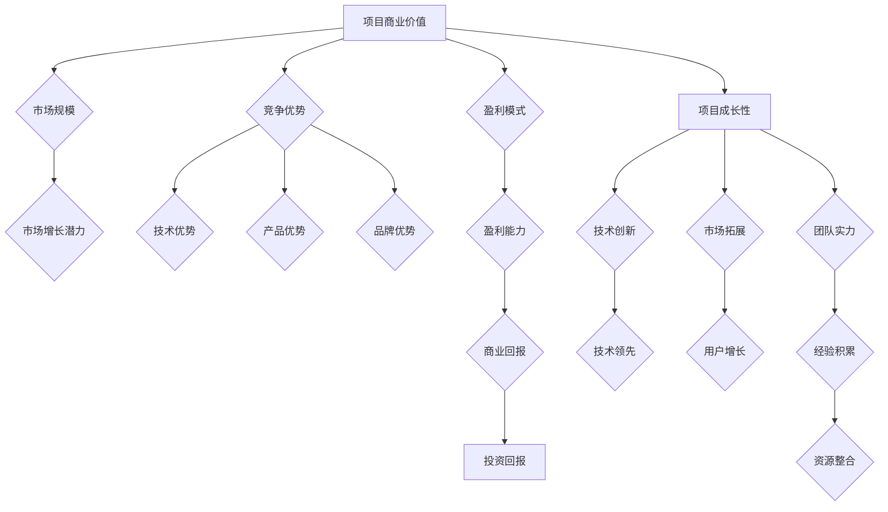

> AI创业, 融资趋势, 商业价值, 成长性, 风险投资, 投资策略, 技术创新, 市场需求

## 1. 背景介绍

近年来，人工智能（AI）技术蓬勃发展，为各行各业带来了革命性的变革。AI创业公司如雨后春笋般涌现，吸引了大量风险投资者的目光。然而，随着市场竞争的加剧，AI创业融资也面临着新的挑战和机遇。传统的融资模式逐渐被新的趋势所取代，投资者更加注重项目的商业价值和成长性。

**1.1 AI创业融资现状**

近年来，全球AI创业融资规模持续增长，投资金额和交易数量都呈现出显著的上升趋势。据统计，2022年全球AI创业融资总额超过1000亿美元，其中美国、中国和欧洲是主要的投资目的地。

**1.2 融资趋势变化**

传统的AI创业融资模式主要依赖于技术创新和专利保护。然而，随着AI技术的成熟和普及，投资者更加关注项目的商业价值和市场潜力。

* **从技术驱动向商业价值驱动转变:** 投资者不再仅仅关注AI技术的先进性，而是更加注重项目的商业模式、市场需求和盈利能力。
* **从早期阶段向成长期投资转变:** 投资者更加倾向于投资处于成长期的AI创业公司，这些公司已经验证了商业模式，并具备一定的市场份额和增长潜力。
* **从单一投资模式向多元化投资模式转变:** 除了传统的风险投资，AI创业公司也开始寻求其他融资方式，例如战略投资、股权融资、债权融资等。

## 2. 核心概念与联系

**2.1 商业价值**

商业价值是指一个项目能够为投资者创造的经济效益。对于AI创业公司来说，商业价值主要体现在以下几个方面：

* **市场规模:** 项目所处市场规模的大小，以及市场增长潜力。
* **竞争优势:** 项目拥有的技术优势、产品优势、品牌优势等，能够帮助其在市场竞争中脱颖而出。
* **盈利模式:** 项目能够如何盈利，以及盈利能力的稳定性和可持续性。

**2.2 成长性**

成长性是指一个项目未来发展潜力的强弱。对于AI创业公司来说，成长性主要体现在以下几个方面：

* **技术创新:** 项目是否能够持续进行技术创新，保持领先地位。
* **市场拓展:** 项目是否能够拓展新的市场，扩大用户群体。
* **团队实力:** 项目团队的经验、能力和资源，能够支撑项目的快速发展。

**2.3 投资策略**

投资者在选择投资AI创业公司时，需要制定合理的投资策略，并根据项目的商业价值和成长性进行评估。

* **风险承受能力:** 投资者自身的风险承受能力，决定了其能够接受的投资风险水平。
* **投资期限:** 投资者预期获得回报的时间，决定了其投资的期限和策略。
* **投资组合:** 投资者需要构建合理的投资组合，分散投资风险。

**2.4 Mermaid 流程图**



## 3. 核心算法原理 & 具体操作步骤

**3.1 算法原理概述**

在AI创业融资中，算法可以用于分析项目数据，预测投资回报率，以及优化投资策略。常见的AI算法包括机器学习、深度学习、自然语言处理等。

**3.2 算法步骤详解**

1. **数据收集:** 收集相关项目数据，例如财务数据、市场数据、技术数据等。
2. **数据预处理:** 对数据进行清洗、转换、特征提取等处理，使其适合算法训练。
3. **模型选择:** 根据项目特点和投资目标，选择合适的AI算法模型。
4. **模型训练:** 使用训练数据训练模型，使其能够学习数据中的规律。
5. **模型评估:** 使用测试数据评估模型的性能，例如准确率、召回率、F1-score等。
6. **模型部署:** 将训练好的模型部署到实际应用场景中，用于预测投资回报率或优化投资策略。

**3.3 算法优缺点**

* **优点:** 能够自动分析大量数据，发现隐藏的模式和趋势，提高投资决策的准确性。
* **缺点:** 算法的性能依赖于数据质量，数据偏差会导致算法结果不准确。

**3.4 算法应用领域**

* **投资风险评估:** 利用算法分析项目数据，评估投资风险，帮助投资者做出更明智的决策。
* **投资回报预测:** 利用算法预测项目的未来回报率，帮助投资者制定投资策略。
* **投资组合优化:** 利用算法优化投资组合，分散投资风险，提高投资收益。

## 4. 数学模型和公式 & 详细讲解 & 举例说明

**4.1 数学模型构建**

在AI创业融资中，可以使用数学模型来量化项目的商业价值和成长性。例如，可以使用 discounted cash flow (DCF) 模型来预测项目的未来现金流，并计算出项目的内在价值。

**4.2 公式推导过程**

DCF模型的核心公式如下：

$$
V = \sum_{t=1}^{n} \frac{CF_t}{(1+r)^t} + \frac{FV_n}{(1+r)^n}
$$

其中：

* $V$：项目内在价值
* $CF_t$：第t年的现金流
* $r$：贴现率
* $n$：预测期
* $FV_n$：预测期末的终端价值

**4.3 案例分析与讲解**

假设一家AI创业公司预计未来5年的现金流分别为100万美元、200万美元、300万美元、400万美元和500万美元，贴现率为10%。则该公司的内在价值为：

$$
V = \frac{1000000}{(1+0.1)^1} + \frac{2000000}{(1+0.1)^2} + \frac{3000000}{(1+0.1)^3} + \frac{4000000}{(1+0.1)^4} + \frac{5000000}{(1+0.1)^5} + \frac{FV_5}{(1+0.1)^5}
$$

需要根据项目的具体情况，确定预测期末的终端价值 $FV_5$。

## 5. 项目实践：代码实例和详细解释说明

**5.1 开发环境搭建**

* Python 3.x
* Jupyter Notebook
* NumPy
* Pandas
* Scikit-learn

**5.2 源代码详细实现**

```python
import numpy as np
import pandas as pd
from sklearn.linear_model import LinearRegression

# 数据加载
data = pd.read_csv('ai_startup_data.csv')

# 数据预处理
X = data[['market_size', 'tech_advantage', 'profit_model']]
y = data['investment_return']

# 模型训练
model = LinearRegression()
model.fit(X, y)

# 模型预测
new_data = pd.DataFrame({'market_size': [1000], 'tech_advantage': [0.8], 'profit_model': [0.9]})
predicted_return = model.predict(new_data)

# 结果展示
print(f'预测的投资回报率: {predicted_return[0]}')
```

**5.3 代码解读与分析**

* 代码首先加载数据，并进行数据预处理，将特征变量和目标变量分离。
* 然后，使用线性回归模型训练模型，并使用训练好的模型对新数据进行预测。
* 最后，打印预测的投资回报率。

**5.4 运行结果展示**

运行代码后，会输出预测的投资回报率。

## 6. 实际应用场景

**6.1 风险投资机构**

风险投资机构可以使用AI算法分析创业公司的商业价值和成长性，帮助其做出更明智的投资决策。

**6.2 创业公司**

创业公司可以使用AI算法分析市场需求和竞争对手，帮助其制定更有效的商业策略。

**6.3 政府机构**

政府机构可以使用AI算法分析科技创新趋势，制定相应的政策支持。

**6.4 未来应用展望**

随着AI技术的不断发展，AI创业融资将更加智能化、自动化和个性化。

## 7. 工具和资源推荐

**7.1 学习资源推荐**

* **在线课程:** Coursera, edX, Udacity
* **书籍:** 《深度学习》、《机器学习实战》
* **博客:** Towards Data Science, Machine Learning Mastery

**7.2 开发工具推荐**

* **Python:** Jupyter Notebook, PyCharm
* **机器学习库:** Scikit-learn, TensorFlow, PyTorch

**7.3 相关论文推荐**

* **《人工智能投资策略》**
* **《AI创业融资趋势分析》**

## 8. 总结：未来发展趋势与挑战

**8.1 研究成果总结**

AI创业融资的新趋势已经形成，投资者更加注重项目的商业价值和成长性。AI算法可以帮助投资者分析项目数据，提高投资决策的准确性。

**8.2 未来发展趋势**

* **更智能化的投资决策:** AI算法将更加智能化，能够自动分析项目数据，并提供更精准的投资建议。
* **更个性化的投资服务:** AI将提供更个性化的投资服务，根据投资者的风险偏好和投资目标，定制相应的投资方案。
* **更广泛的应用场景:** AI创业融资将应用于更广泛的场景，例如政府扶持、企业融资等。

**8.3 面临的挑战**

* **数据质量问题:** AI算法的性能依赖于数据质量，数据偏差会导致算法结果不准确。
* **算法解释性问题:** 许多AI算法是黑箱模型，难以解释其决策过程，这可能会导致投资者缺乏信任。
* **伦理问题:** AI创业融资可能会带来一些伦理问题，例如算法偏见、数据隐私等。

**8.4 研究展望**

未来研究方向包括：

* **提高数据质量:** 开发更有效的算法和方法，提高数据质量。
* **增强算法解释性:** 研究可解释AI算法，提高算法的透明度和可信度。
* **解决伦理问题:** 制定相应的伦理规范和法律法规，规范AI创业融资的应用。

## 9. 附录：常见问题与解答

**9.1 如何评估AI创业公司的商业价值？**

可以使用DCF模型、估值指标等方法评估AI创业公司的商业价值。

**9.2 如何选择合适的AI算法？**

选择合适的AI算法需要根据项目的具体情况和投资目标进行选择。

**9.3 AI创业融资有哪些风险？**

AI创业融资存在技术风险、市场风险、监管风险等风险。

**9.4 如何规避AI创业融资的风险？**

可以通过充分调研、科学决策、风险控制等措施规避AI创业融资的风险。


作者：禅与计算机程序设计艺术 / Zen and the Art of Computer Programming 
<end_of_turn>