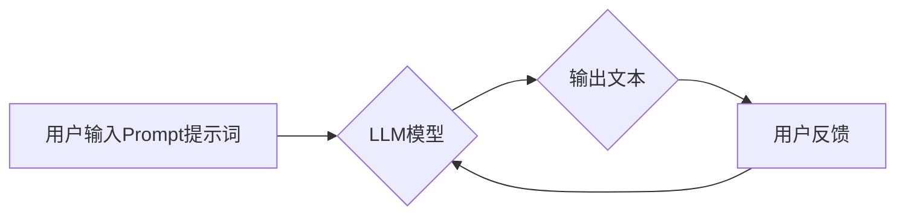

> AI大模型,Prompt提示词,输出引导语,文本生成,自然语言处理,模型优化

## 1. 背景介绍

近年来，大语言模型（LLM）在自然语言处理（NLP）领域取得了显著进展，展现出强大的文本生成、翻译、摘要等能力。然而，LLM的性能很大程度上依赖于高质量的Prompt提示词。Prompt提示词是用户与模型交互的关键环节，它决定了模型的输入信息和预期输出。

传统的Prompt提示词往往是简单的文本指令，缺乏针对性和引导性，导致模型生成的文本质量参差不齐。为了提升LLM的性能，研究者们提出了各种Prompt提示词优化方法，其中使用输出引导语（Output Guiding）是一种较为有效的方法。

输出引导语是指在Prompt提示词中加入对模型输出的预期描述，引导模型生成符合特定格式、风格或主题的文本。

## 2. 核心概念与联系

### 2.1  Prompt提示词

Prompt提示词是用户与LLM交互的关键信息，它包含了用户想要模型完成的任务描述、输入数据以及期望的输出格式等。

### 2.2  输出引导语

输出引导语是一种特殊的Prompt提示词，它包含了对模型输出的预期描述，例如：

* 文本格式：例如“生成一个包含标题和段落结构的新闻报道”
* 文本风格：例如“以幽默风趣的语气撰写一篇博客文章”
* 文本主题：例如“围绕人工智能伦理问题进行讨论”

### 2.3  LLM模型

大语言模型（LLM）是一种基于深度学习的强大人工智能模型，能够理解和生成人类语言。LLM通常由 Transformer 架构组成，拥有大量的参数，能够学习复杂的语言模式和语义关系。

**Mermaid 流程图**



## 3. 核心算法原理 & 具体操作步骤

### 3.1  算法原理概述

输出引导语的原理是通过在Prompt提示词中加入对模型输出的预期描述，引导模型生成符合特定要求的文本。

当模型接收到包含输出引导语的Prompt提示词时，它会根据引导语的信息调整自身的生成策略，例如：

* 调整词语选择：模型会倾向于选择与引导语相符的词语。
* 调整语法结构：模型会根据引导语的格式要求调整文本的语法结构。
* 调整文本风格：模型会根据引导语的风格要求调整文本的语气和表达方式。

### 3.2  算法步骤详解

1. **定义输出引导语:** 首先需要明确输出引导语的内容，例如文本格式、风格、主题等。
2. **设计Prompt提示词:** 将输出引导语融入到Prompt提示词中，使其成为提示词的一部分。
3. **输入Prompt提示词:** 将设计好的Prompt提示词输入到LLM模型中。
4. **模型生成文本:** LLM模型根据Prompt提示词和输出引导语的信息生成文本。
5. **评估文本质量:** 对生成的文本进行评估，判断其是否符合预期要求。
6. **迭代优化:** 根据评估结果，对输出引导语和Prompt提示词进行调整，不断优化模型的生成效果。

### 3.3  算法优缺点

**优点:**

* 提升文本质量：输出引导语可以有效地引导模型生成符合特定要求的文本，提升文本质量。
* 增强模型可控性：输出引导语可以增强用户对模型的控制能力，使其能够生成更符合预期结果的文本。
* 降低训练成本：输出引导语可以减少模型训练所需的样本数据量，降低训练成本。

**缺点:**

* 设计难度：设计有效的输出引导语需要一定的技巧和经验，并非易事。
* 泛化能力：输出引导语可能会导致模型过度拟合，降低其在其他任务上的泛化能力。

### 3.4  算法应用领域

输出引导语的应用领域非常广泛，例如：

* 文本生成：生成新闻报道、小说、诗歌、剧本等。
* 聊天机器人：引导聊天机器人生成更自然、更符合语境的对话。
* 代码生成：引导代码生成工具生成符合特定规范的代码。
* 数据标注：引导模型生成高质量的数据标注，用于训练其他机器学习模型。

## 4. 数学模型和公式 & 详细讲解 & 举例说明

输出引导语的实现通常基于Transformer模型，其核心是注意力机制。注意力机制允许模型在处理文本时，关注不同词语之间的关系，并根据这些关系调整词语的权重。

### 4.1  数学模型构建

假设我们有一个包含N个词语的文本序列，每个词语都对应一个词向量。输出引导语可以看作是一个额外的词向量，它代表了对模型输出的预期描述。

在Transformer模型中，注意力机制计算每个词语与所有其他词语之间的相关性，并根据相关性调整词语的权重。

公式：

$$
Attention(Q, K, V) = softmax(\frac{QK^T}{\sqrt{d_k}})V
$$

其中：

* Q：查询矩阵，表示当前词语的词向量。
* K：键矩阵，表示所有其他词语的词向量。
* V：值矩阵，表示所有词语的词向量。
* $d_k$：键向量的维度。

### 4.2  公式推导过程

输出引导语可以被融入到注意力机制中，通过调整查询矩阵Q，引导模型关注与输出引导语相关的词语。

例如，我们可以将输出引导语与当前词语的词向量进行拼接，作为新的查询矩阵Q。

### 4.3  案例分析与讲解

假设我们想要生成一个幽默风趣的文本，输出引导语可以是“幽默风趣”。

我们可以将“幽默风趣”的词向量与当前词语的词向量进行拼接，作为新的查询矩阵Q。

这样，模型在处理文本时，会更加关注与“幽默风趣”相关的词语，从而生成更符合预期风格的文本。

## 5. 项目实践：代码实例和详细解释说明

### 5.1  开发环境搭建

* Python 3.7+
* PyTorch 1.7+
* Transformers 4.10+

### 5.2  源代码详细实现

```python
from transformers import AutoModelForCausalLM, AutoTokenizer

# 加载预训练模型和词典
model_name = "gpt2"
tokenizer = AutoTokenizer.from_pretrained(model_name)
model = AutoModelForCausalLM.from_pretrained(model_name)

# 定义输出引导语
output_guide = "幽默风趣"

# 定义Prompt提示词
prompt = f"请写一篇关于人工智能的幽默风趣的文章：{output_guide}"

# 将Prompt提示词转换为模型输入格式
input_ids = tokenizer.encode(prompt, return_tensors="pt")

# 使用模型生成文本
output = model.generate(input_ids, max_length=100)

# 将生成文本转换为可读文本
generated_text = tokenizer.decode(output[0], skip_special_tokens=True)

# 打印生成文本
print(generated_text)
```

### 5.3  代码解读与分析

* 代码首先加载预训练的GPT-2模型和词典。
* 然后定义输出引导语和Prompt提示词。
* 将Prompt提示词转换为模型输入格式。
* 使用模型生成文本，并设置最大长度为100个词。
* 将生成文本转换为可读文本，并打印输出。

### 5.4  运行结果展示

运行代码后，会输出一篇关于人工智能的幽默风趣的文章。

## 6. 实际应用场景

### 6.1  新闻报道生成

可以使用输出引导语引导模型生成符合新闻报道格式的文本，例如：

* 标题：新闻标题
* 时间：新闻发布时间
* 地点：新闻发生地点
* 内容：新闻事件描述

### 6.2  聊天机器人对话

可以使用输出引导语引导聊天机器人生成更自然、更符合语境的对话，例如：

* 幽默风趣：让聊天机器人以幽默风趣的语气进行对话。
* 专业知识：让聊天机器人以专业知识的语气进行对话。
* 情感表达：让聊天机器人表达特定的情感，例如开心、悲伤、愤怒等。

### 6.3  代码生成

可以使用输出引导语引导代码生成工具生成符合特定规范的代码，例如：

* 编程语言：指定代码的编程语言。
* 代码风格：指定代码的风格规范。
* 功能需求：描述代码的功能需求。

### 6.4  未来应用展望

输出引导语在未来将有更广泛的应用场景，例如：

* 个性化内容生成：根据用户的喜好和需求生成个性化的内容。
* 自动写作辅助：帮助用户更快、更轻松地完成写作任务。
* 机器人交互增强：提升机器人与人类的交互体验。

## 7. 工具和资源推荐

### 7.1  学习资源推荐

* **论文:**
    * "Prompt Engineering for Large Language Models"
    * "Output Guiding for Text Generation with Large Language Models"
* **博客:**
    * OpenAI Blog
    * Hugging Face Blog

### 7.2  开发工具推荐

* **Transformers:** 一个用于处理自然语言处理任务的开源库。
* **Hugging Face:** 一个用于分享和探索预训练模型的平台。

### 7.3  相关论文推荐

* "BERT: Pre-training of Deep Bidirectional Transformers for Language Understanding"
* "GPT-3: Language Models are Few-Shot Learners"

## 8. 总结：未来发展趋势与挑战

### 8.1  研究成果总结

输出引导语是一种有效的Prompt提示词优化方法，能够提升LLM的文本生成质量和可控性。

### 8.2  未来发展趋势

未来，输出引导语的研究将朝着以下方向发展：

* 更智能的输出引导语生成方法：开发能够自动生成有效输出引导语的算法。
* 多模态输出引导语：将图像、音频等多模态信息融入到输出引导语中，提升模型的生成能力。
* 跨语言输出引导语：研究跨语言输出引导语的生成和应用。

### 8.3  面临的挑战

输出引导语的研究还面临一些挑战：

* 设计有效输出引导语的难度：设计有效的输出引导语需要一定的技巧和经验。
* 泛化能力问题：输出引导语可能会导致模型过度拟合，降低其在其他任务上的泛化能力。
* 伦理问题：输出引导语可能会被用于生成虚假信息或进行恶意攻击，需要关注其伦理问题。

### 8.4  研究展望

未来，我们将继续研究输出引导语的理论和应用，努力开发更智能、更有效的输出引导语生成方法，推动LLM技术的发展。

## 9. 附录：常见问题与解答

### 9.1  如何设计有效的输出引导语？

设计有效的输出引导语需要考虑以下几个因素：

* 明确目标：明确输出引导语想要达到的效果。
* 语言简洁：使用简洁明了的语言描述输出要求。
* 具体化程度：根据具体任务调整输出引导语的具体化程度。
* 实验验证：通过实验验证输出引导语的效果。

### 9.2  输出引导语会影响模型的性能吗？

输出引导语可以提升模型的性能，但过度使用可能会导致模型过度拟合，降低其泛化能力。因此，需要根据具体任务和模型情况合理使用输出引导语。

### 9.3  输出引导语有哪些伦理问题？

输出引导语可能会被用于生成虚假信息或进行恶意攻击，需要关注其伦理问题。在使用输出引导语时，需要考虑其潜在的负面影响，并采取相应的措施进行规避。


作者：禅与计算机程序设计艺术 / Zen and the Art of Computer Programming 
<end_of_turn>