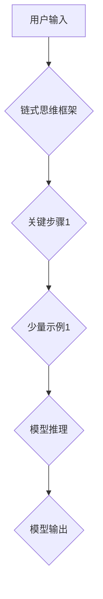

> AI大模型,Prompt提示词,链式思维,少量示例,最佳实践,自然语言处理,文本生成

## 1. 背景介绍

近年来，大语言模型（LLM）在自然语言处理（NLP）领域取得了显著进展，展现出强大的文本生成、翻译、摘要等能力。然而，LLM的性能很大程度上依赖于高质量的Prompt提示词。一个精心设计的Prompt可以引导模型生成更准确、更相关的输出，而一个模糊或不完整的Prompt则可能导致模型产生错误或不相关的结果。

传统的Prompt设计方法往往依赖于人工经验和试错，效率低下且难以保证质量。随着AI技术的不断发展，研究者们开始探索更有效、更智能的Prompt设计方法。其中，结合链式思维和少量示例的Prompt设计方法逐渐成为研究热点。

## 2. 核心概念与联系

### 2.1 链式思维

链式思维是一种逻辑推理方法，它将多个概念或想法串联起来，形成一个完整的逻辑链条。在Prompt设计中，链式思维可以帮助我们构建更清晰、更结构化的Prompt，引导模型沿着预设的逻辑路径进行推理和生成。

### 2.2 少量示例

少量示例是指在Prompt中提供少量具体的例子，以示范期望的输出格式或内容。少量示例可以帮助模型理解用户的意图，并提高其生成准确率。

### 2.3 核心概念联系

结合链式思维和少量示例的Prompt设计方法，可以将这两个概念有机地结合起来。首先，我们利用链式思维构建一个清晰的逻辑框架，明确模型需要完成的任务和步骤。然后，在关键步骤中添加少量示例，帮助模型理解具体的要求和期望的输出格式。



## 3. 核心算法原理 & 具体操作步骤

### 3.1 算法原理概述

结合链式思维和少量示例的Prompt设计方法本质上是一种基于强化学习的优化算法。

1. **初始化:**  随机生成一个初始Prompt。
2. **评估:** 使用训练好的LLM生成文本，并根据预设的评价指标评估生成的文本质量。
3. **优化:** 根据评价结果，调整Prompt中的链式思维框架和少量示例，以提高生成的文本质量。
4. **迭代:** 重复步骤2和3，直到达到预设的优化目标。

### 3.2 算法步骤详解

1. **构建链式思维框架:**  根据任务需求，将任务分解成多个步骤，并用逻辑关系串联起来，形成一个清晰的链式思维框架。
2. **选择关键步骤:**  在链式思维框架中，选择需要添加少量示例的关键步骤。
3. **生成少量示例:**  根据关键步骤的要求，生成少量具体的例子，以示范期望的输出格式或内容。
4. **评估Prompt效果:**  使用训练好的LLM生成文本，并根据预设的评价指标评估生成的文本质量。
5. **优化Prompt:**  根据评价结果，调整Prompt中的链式思维框架和少量示例，以提高生成的文本质量。

### 3.3 算法优缺点

**优点:**

* 可以生成更准确、更相关的文本输出。
* 能够提高模型的泛化能力。
* 能够减少人工干预，提高效率。

**缺点:**

* 需要一定的专业知识和经验来构建链式思维框架和生成少量示例。
* 算法的优化过程可能比较复杂，需要多次迭代才能达到预设的目标。

### 3.4 算法应用领域

结合链式思维和少量示例的Prompt设计方法可以应用于各种NLP任务，例如：

* 文本生成
* 机器翻译
* 文本摘要
* 问答系统
* 代码生成

## 4. 数学模型和公式 & 详细讲解 & 举例说明

### 4.1 数学模型构建

在结合链式思维和少量示例的Prompt设计方法中，我们可以使用强化学习的数学模型来优化Prompt。

其中，状态空间表示Prompt的结构和内容，动作空间表示对Prompt进行调整的操作，奖励函数表示生成的文本质量。

### 4.2 公式推导过程

强化学习的Bellman方程可以用来更新状态价值函数：

$$
V(s) = \max_{\alpha} \sum_{s' \in S} P(s' | s, \alpha) [r(s, \alpha, s') + \gamma V(s')]
$$

其中：

* $V(s)$ 表示状态 $s$ 的价值函数。
* $\alpha$ 表示动作。
* $S$ 表示状态空间。
* $P(s' | s, \alpha)$ 表示从状态 $s$ 执行动作 $\alpha$ 到状态 $s'$ 的转移概率。
* $r(s, \alpha, s')$ 表示从状态 $s$ 执行动作 $\alpha$ 到状态 $s'$ 的奖励。
* $\gamma$ 表示折扣因子。

### 4.3 案例分析与讲解

假设我们想要设计一个Prompt来生成一篇关于“人工智能”的文章。我们可以使用链式思维框架将任务分解成以下步骤：

1. 确定主题：人工智能
2. 搜集信息：相关概念、发展历史、应用场景
3. 结构化内容：引言、正文、结论
4. 撰写文章：使用简洁明了的语言，并结合搜集的信息

我们可以将这些步骤作为Prompt的链式思维框架，并在关键步骤中添加少量示例，例如：

* **搜集信息:**  提供一些关于人工智能的关键词，例如“机器学习”、“深度学习”、“自然语言处理”。
* **结构化内容:**  提供一篇关于人工智能的文章结构示例。
* **撰写文章:**  提供一些关于人工智能的写作风格示例。

## 5. 项目实践：代码实例和详细解释说明

### 5.1 开发环境搭建

* Python 3.7+
* TensorFlow 2.0+
* PyTorch 1.0+
* NLTK 3.5+

### 5.2 源代码详细实现

```python
import tensorflow as tf

# 定义Prompt结构
class Prompt:
    def __init__(self, chain_thinking_framework, examples):
        self.chain_thinking_framework = chain_thinking_framework
        self.examples = examples

# 定义奖励函数
def reward_function(generated_text):
    # 根据预设的评价指标评估生成的文本质量
    # ...

# 定义优化算法
def optimize_prompt(prompt, dataset):
    # 使用强化学习算法优化Prompt
    # ...

# 示例代码
prompt = Prompt(
    chain_thinking_framework=[
        "确定主题",
        "搜集信息",
        "结构化内容",
        "撰写文章"
    ],
    examples=[
        {"keyword": "人工智能", "information": ["机器学习", "深度学习", "自然语言处理"]},
        {"structure": "引言-正文-结论"},
        {"style": "简洁明了"}
    ]
)

# 使用优化算法优化Prompt
optimized_prompt = optimize_prompt(prompt, dataset)

# 使用优化后的Prompt生成文本
generated_text = llm.generate_text(optimized_prompt)
```

### 5.3 代码解读与分析

* `Prompt` 类定义了Prompt的结构，包括链式思维框架和少量示例。
* `reward_function` 函数定义了评估生成的文本质量的奖励函数。
* `optimize_prompt` 函数定义了使用强化学习算法优化Prompt的函数。
* 示例代码演示了如何使用`Prompt`类和`optimize_prompt`函数来优化Prompt并生成文本。

### 5.4 运行结果展示

使用优化后的Prompt生成的文本质量应该比使用原始Prompt生成的文本质量更高。

## 6. 实际应用场景

结合链式思维和少量示例的Prompt设计方法可以应用于各种实际场景，例如：

* **自动写作:**  生成新闻报道、产品描述、博客文章等。
* **聊天机器人:**  设计更自然、更流畅的对话体验。
* **代码生成:**  根据用户需求生成代码片段。
* **教育辅助:**  生成个性化的学习内容和练习题。

### 6.4 未来应用展望

随着AI技术的不断发展，结合链式思维和少量示例的Prompt设计方法将发挥越来越重要的作用。未来，我们可以期待看到以下应用：

* **更智能的Prompt设计:**  利用机器学习算法自动生成更有效的Prompt。
* **跨模态Prompt设计:**  将文本、图像、音频等多种模态信息结合起来设计Prompt。
* **个性化Prompt设计:**  根据用户的需求和偏好定制个性化的Prompt。

## 7. 工具和资源推荐

### 7.1 学习资源推荐

* **书籍:**
    * 《深度学习》
    * 《自然语言处理》
    * 《强化学习》
* **在线课程:**
    * Coursera: 深度学习
    * edX: 自然语言处理
    * Udacity: 强化学习

### 7.2 开发工具推荐

* **TensorFlow:**  开源机器学习框架
* **PyTorch:**  开源机器学习框架
* **HuggingFace:**  开源自然语言处理模型库

### 7.3 相关论文推荐

* **BERT: Pre-training of Deep Bidirectional Transformers for Language Understanding**
* **GPT-3: Language Models are Few-Shot Learners**
* **Chain-of-Thought Prompting Elicits Reasoning in Large Language Models**

## 8. 总结：未来发展趋势与挑战

### 8.1 研究成果总结

结合链式思维和少量示例的Prompt设计方法取得了显著进展，能够有效提高LLM的文本生成质量。

### 8.2 未来发展趋势

未来，Prompt设计将朝着更智能、更个性化、更跨模态的方向发展。

### 8.3 面临的挑战

* 如何设计更有效的Prompt，以引导模型进行更复杂的推理和生成更高质量的文本。
* 如何解决Prompt设计中的数据稀缺问题。
* 如何确保Prompt设计的安全性、可靠性和可解释性。

### 8.4 研究展望

未来研究将重点关注以下几个方面：

* 开发更智能的Prompt设计算法。
* 探索跨模态Prompt设计方法。
* 研究Prompt设计的安全性、可靠性和可解释性。

## 9. 附录：常见问题与解答

* **Q1: 如何构建链式思维框架？**

    A1: 可以根据任务需求，将任务分解成多个步骤，并用逻辑关系串联起来。

* **Q2: 如何生成少量示例？**

    A2: 可以根据关键步骤的要求，提供一些具体的例子，以示范期望的输出格式或内容。

* **Q3: 如何评估Prompt效果？**

    A3: 可以使用预设的评价指标评估生成的文本质量，例如BLEU、ROUGE等。


作者：禅与计算机程序设计艺术 / Zen and the Art of Computer Programming 
<end_of_turn>