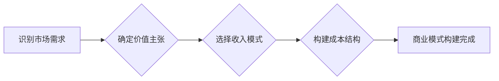

> AI大模型，商业模式，可持续发展，创业，技术应用，市场需求

## 1. 背景介绍

近年来，人工智能（AI）技术取得了飞速发展，特别是大模型的涌现，为各行各业带来了前所未有的机遇。大模型，是指参数规模庞大、训练数据海量的人工智能模型，具备强大的泛化能力和学习能力，能够在自然语言处理、计算机视觉、语音识别等领域取得突破性进展。

然而，大模型的开发和应用也面临着诸多挑战，其中之一就是商业模式的构建。如何将大模型的技术优势转化为可持续的商业价值，是众多AI创业者面临的难题。

## 2. 核心概念与联系

**2.1 AI大模型的特性**

* **规模化：** 大模型拥有数亿甚至数十亿的参数，需要海量数据进行训练。
* **泛化能力强：** 经过大规模数据训练，大模型能够在不同领域和任务上表现出较强的泛化能力。
* **可迁移学习：** 大模型可以将已有的知识迁移到新的任务和领域，降低了模型训练的成本和时间。

**2.2 商业模式的定义**

商业模式是指一个企业为创造、传递和捕获价值而采取的策略和方法。它包括企业的价值主张、目标客户、收入来源、成本结构等关键要素。

**2.3 AI大模型与商业模式的联系**

大模型的强大能力为商业模式创新提供了新的可能性。通过将大模型应用于不同的领域，可以创造出新的价值，满足用户的需求，并实现商业盈利。

**2.4 商业模式的构建流程**

* **识别市场需求：** 首先要明确市场上存在哪些未被满足的需求，哪些问题可以由大模型解决。
* **确定价值主张：** 明确大模型能够为用户提供哪些独特的价值，例如提高效率、降低成本、提升体验等。
* **选择收入模式：** 确定如何从用户那里获取收入，例如订阅服务、按需付费、数据交易等。
* **构建成本结构：** 分析大模型开发、训练、部署和维护的成本，并制定相应的成本控制策略。

**2.5 Mermaid 流程图**



## 3. 核心算法原理 & 具体操作步骤

**3.1 算法原理概述**

大模型的训练主要基于深度学习算法，其中Transformer模型是目前最流行的架构之一。Transformer模型利用注意力机制，能够捕捉文本序列中的长距离依赖关系，从而实现更准确的理解和生成。

**3.2 算法步骤详解**

1. **数据预处理：** 将原始文本数据进行清洗、分词、标记等预处理操作，使其能够被模型理解。
2. **模型训练：** 使用深度学习框架（例如TensorFlow、PyTorch）训练Transformer模型，通过反向传播算法不断调整模型参数，使其能够生成更准确的输出。
3. **模型评估：** 使用测试数据集评估模型的性能，并根据评估结果进行模型调优。
4. **模型部署：** 将训练好的模型部署到服务器或云平台，使其能够为用户提供服务。

**3.3 算法优缺点**

* **优点：** 强大的泛化能力、可迁移学习能力、处理长距离依赖关系的能力。
* **缺点：** 训练成本高、模型参数量大、需要大量数据进行训练。

**3.4 算法应用领域**

* 自然语言处理：文本分类、情感分析、机器翻译、文本摘要等。
* 计算机视觉：图像识别、物体检测、图像生成等。
* 语音识别：语音转文本、语音合成等。

## 4. 数学模型和公式 & 详细讲解 & 举例说明

**4.1 数学模型构建**

Transformer模型的核心是注意力机制，它通过计算词之间的相关性来理解文本的语义。注意力机制可以表示为以下数学公式：

$$
Attention(Q, K, V) = softmax(\frac{QK^T}{\sqrt{d_k}})V
$$

其中：

* $Q$：查询矩阵
* $K$：键矩阵
* $V$：值矩阵
* $d_k$：键向量的维度
* $softmax$：softmax函数

**4.2 公式推导过程**

注意力机制的公式通过计算查询向量与键向量的点积，并使用softmax函数将其归一化，从而得到每个词对查询词的注意力权重。这些权重用于加权求和值向量，最终得到对查询词的上下文表示。

**4.3 案例分析与讲解**

例如，在翻译句子“The cat sat on the mat”时，注意力机制可以帮助模型关注“cat”和“sat”之间的关系，从而更好地理解句子含义。

## 5. 项目实践：代码实例和详细解释说明

**5.1 开发环境搭建**

* Python 3.7+
* TensorFlow 2.0+
* PyTorch 1.0+
* CUDA 10.0+

**5.2 源代码详细实现**

```python
import tensorflow as tf

# 定义Transformer模型
class Transformer(tf.keras.Model):
    def __init__(self, vocab_size, embedding_dim, num_heads, num_layers):
        super(Transformer, self).__init__()
        self.embedding = tf.keras.layers.Embedding(vocab_size, embedding_dim)
        self.transformer_layers = tf.keras.layers.StackedRNNCells([
            tf.keras.layers.MultiHeadAttention(num_heads=num_heads, key_dim=embedding_dim)
            for _ in range(num_layers)
        ])

    def call(self, inputs):
        # Embedding
        embedded = self.embedding(inputs)
        # Transformer layers
        output = self.transformer_layers(embedded)
        return output

# 实例化模型
model = Transformer(vocab_size=10000, embedding_dim=512, num_heads=8, num_layers=6)

# 训练模型
model.compile(optimizer='adam', loss='mse')
model.fit(x_train, y_train, epochs=10)
```

**5.3 代码解读与分析**

* 代码定义了一个Transformer模型，包含嵌入层、多头注意力层和堆叠的RNN单元。
* 嵌入层将输入词转换为向量表示。
* 多头注意力层捕捉词之间的关系。
* 堆叠的RNN单元对上下文信息进行编码。
* 模型使用Adam优化器和均方误差损失函数进行训练。

**5.4 运行结果展示**

训练完成后，模型可以用于预测新的文本序列。

## 6. 实际应用场景

**6.1 自然语言处理**

* **机器翻译：** 将文本从一种语言翻译成另一种语言。
* **文本摘要：** 从长文本中提取关键信息生成摘要。
* **对话系统：** 开发能够与人类进行自然对话的聊天机器人。

**6.2 计算机视觉**

* **图像识别：** 将图像分类为不同的类别。
* **物体检测：** 在图像中识别和定位特定物体。
* **图像生成：** 根据文本描述生成图像。

**6.3 其他领域**

* **金融：** 风险评估、欺诈检测、客户服务自动化。
* **医疗：** 疾病诊断、药物研发、医疗影像分析。
* **教育：** 个性化学习、智能辅导、自动批改作业。

**6.4 未来应用展望**

随着大模型技术的不断发展，其应用场景将更加广泛，例如：

* **通用人工智能：** 开发能够执行各种人类任务的通用人工智能系统。
* **个性化体验：** 为每个用户提供个性化的产品和服务。
* **科学发现：** 加速科学研究，推动科技创新。

## 7. 工具和资源推荐

**7.1 学习资源推荐**

* **书籍：**
    * 《深度学习》
    * 《自然语言处理》
    * 《Transformer模型详解》
* **在线课程：**
    * Coursera
    * edX
    * Udacity

**7.2 开发工具推荐**

* **深度学习框架：** TensorFlow、PyTorch
* **云平台：** Google Cloud Platform、Amazon Web Services、Microsoft Azure

**7.3 相关论文推荐**

* 《Attention Is All You Need》
* 《BERT: Pre-training of Deep Bidirectional Transformers for Language Understanding》
* 《GPT-3: Language Models are Few-Shot Learners》

## 8. 总结：未来发展趋势与挑战

**8.1 研究成果总结**

近年来，大模型技术取得了显著进展，在自然语言处理、计算机视觉等领域取得了突破性成果。

**8.2 未来发展趋势**

* **模型规模化：** 模型参数规模将继续扩大，训练数据量也将进一步增加。
* **多模态学习：** 大模型将能够处理多种数据类型，例如文本、图像、音频等。
* **可解释性：** 研究如何提高大模型的可解释性，使其决策过程更加透明。

**8.3 面临的挑战**

* **训练成本高：** 大模型的训练需要大量的计算资源和时间。
* **数据安全：** 大模型的训练需要大量数据，如何保证数据安全是一个重要问题。
* **伦理问题：** 大模型的应用可能带来一些伦理问题，例如偏见、歧视等。

**8.4 研究展望**

未来，大模型技术将继续发展，并应用于更多领域，为人类社会带来更多福祉。

## 9. 附录：常见问题与解答

**9.1 如何选择合适的AI大模型？**

选择合适的AI大模型需要根据具体的应用场景和需求进行评估。需要考虑模型的规模、性能、训练数据、成本等因素。

**9.2 如何部署AI大模型？**

AI大模型的部署方式多种多样，可以部署到服务器、云平台、边缘设备等。需要根据实际情况选择合适的部署方式。

**9.3 如何保证AI大模型的安全性？**

AI大模型的安全性需要从多个方面考虑，例如数据安全、模型安全、攻击防御等。需要采取相应的安全措施来保障模型的安全性。


作者：禅与计算机程序设计艺术 / Zen and the Art of Computer Programming 
<end_of_turn>