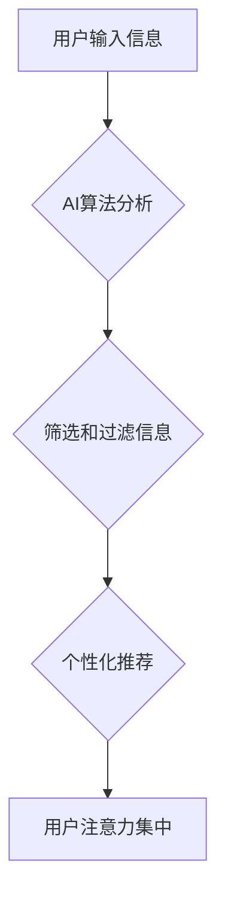

> 人工智能，注意力，感知，深度学习，神经网络，认知科学

## 1. 背景介绍

在信息爆炸的时代，我们每天都被来自各种渠道的海量信息所包围。如何有效地筛选和处理这些信息，集中注意力，并做出明智的决策，成为了当今社会面临的重大挑战。而人工智能（AI）作为一种新兴技术，正在深刻地改变着我们与信息交互的方式，也对我们对注意力的感知产生了深远的影响。

传统的认知科学认为注意力是一种主动的、受控的认知过程，我们能够选择性地关注某些信息，而忽略其他信息。然而，随着AI技术的不断发展，特别是深度学习技术的突破，我们开始认识到注意力可能并非完全由人类主观意志控制，而是受到多种因素的影响，包括生物学、心理学和社会环境等。

## 2. 核心概念与联系

### 2.1 注意力机制

注意力机制是深度学习领域近年来发展起来的一种重要技术，它能够帮助模型模拟人类的注意力机制，专注于输入数据中最重要的部分，从而提高模型的性能。

注意力机制的核心思想是通过一个“注意力权重”来分配输入数据的不同部分的关注度。这些权重可以根据模型的学习结果动态调整，使得模型能够在不同任务和场景下，灵活地选择关注哪些信息。

### 2.2 AI对注意力的影响

AI技术对我们对注意力的感知产生了多方面的影响：

* **信息过滤和筛选:** AI算法能够快速分析海量信息，并根据用户的需求和偏好，过滤和筛选出最相关的信息，帮助我们集中注意力。
* **个性化内容推荐:** AI算法能够根据用户的历史行为和兴趣爱好，推荐个性化的内容，吸引用户的注意力，并引导用户进行更深入的探索。
* **沉浸式体验:** AI技术可以创造出更加沉浸式的体验，例如虚拟现实和增强现实，这些技术能够吸引用户的注意力，并引导用户参与到虚拟世界中。
* **认知增强:** AI技术可以辅助人类进行认知增强，例如通过智能语音助手来帮助我们记忆信息，或者通过智能学习平台来帮助我们提高学习效率。

### 2.3  Mermaid 流程图



## 3. 核心算法原理 & 具体操作步骤

### 3.1  算法原理概述

注意力机制的核心思想是通过一个“注意力权重”来分配输入数据的不同部分的关注度。这些权重可以根据模型的学习结果动态调整，使得模型能够在不同任务和场景下，灵活地选择关注哪些信息。

常见的注意力机制类型包括：

* **自注意力机制 (Self-Attention):**  用于处理序列数据，例如文本和语音，能够捕捉序列中不同元素之间的关系。
* **交叉注意力机制 (Cross-Attention):** 用于处理多个序列之间的关系，例如机器翻译和文本摘要。
* **位置感知注意力机制 (Positional-Aware Attention):**  能够考虑序列中元素的顺序信息，提高模型的理解能力。

### 3.2  算法步骤详解

1. **计算注意力权重:**  根据输入数据和模型的参数，计算每个元素的注意力权重。
2. **加权求和:**  将注意力权重与输入数据相乘，并求和，得到加权后的输出。
3. **非线性变换:**  对加权后的输出进行非线性变换，例如ReLU激活函数，以提高模型的表达能力。

### 3.3  算法优缺点

**优点:**

* 能够有效地捕捉序列数据中的长距离依赖关系。
* 能够灵活地选择关注哪些信息，提高模型的性能。
* 能够解释模型的决策过程，提高模型的可解释性。

**缺点:**

* 计算复杂度较高，训练时间较长。
* 容易受到噪声数据的影响。
* 难以处理长序列数据。

### 3.4  算法应用领域

注意力机制在众多领域都有广泛的应用，例如：

* **自然语言处理:** 机器翻译、文本摘要、问答系统、情感分析等。
* **计算机视觉:** 图像分类、目标检测、图像分割等。
* **语音识别:** 语音转文本、语音合成等。
* **推荐系统:** 个性化推荐、内容过滤等。

## 4. 数学模型和公式 & 详细讲解 & 举例说明

### 4.1  数学模型构建

注意力机制的数学模型可以概括为以下公式：

$$
\text{Attention}(Q, K, V) = \text{softmax}\left(\frac{Q K^T}{\sqrt{d_k}}\right) V
$$

其中：

* $Q$：查询矩阵，表示需要关注的信息。
* $K$：键矩阵，表示所有信息的键值。
* $V$：值矩阵，表示所有信息的具体值。
* $d_k$：键向量的维度。
* $\text{softmax}$：softmax函数，用于将注意力权重归一化到[0, 1]之间。

### 4.2  公式推导过程

公式推导过程可以分为以下几个步骤：

1. 计算查询矩阵 $Q$ 和键矩阵 $K$ 的点积，即 $QK^T$。
2. 将点积结果除以 $\sqrt{d_k}$，以规范化权重。
3. 应用softmax函数对点积结果进行归一化，得到注意力权重矩阵。
4. 将注意力权重矩阵与值矩阵 $V$ 相乘，得到加权后的输出。

### 4.3  案例分析与讲解

例如，在机器翻译任务中，查询矩阵 $Q$ 表示源语言句子中的每个单词，键矩阵 $K$ 和值矩阵 $V$ 表示目标语言词典中的每个单词及其对应的向量表示。通过注意力机制，模型可以学习到源语言句子中每个单词与目标语言词典中哪些单词的相关性，从而生成更准确的翻译结果。

## 5. 项目实践：代码实例和详细解释说明

### 5.1  开发环境搭建

* Python 3.7+
* TensorFlow 2.0+
* PyTorch 1.0+

### 5.2  源代码详细实现

```python
import tensorflow as tf

# 定义注意力机制
def attention_layer(query, key, value, mask=None):
    # 计算注意力权重
    scores = tf.matmul(query, key, transpose_b=True) / tf.math.sqrt(tf.cast(key.shape[-1], tf.float32))
    if mask is not None:
        scores += (mask * -1e9)
    attention_weights = tf.nn.softmax(scores, axis=-1)
    # 加权求和
    context_vector = tf.matmul(attention_weights, value)
    return context_vector, attention_weights

# 示例代码
query = tf.random.normal([32, 10, 64])
key = tf.random.normal([32, 10, 64])
value = tf.random.normal([32, 10, 128])

context_vector, attention_weights = attention_layer(query, key, value)
print(context_vector.shape)
print(attention_weights.shape)
```

### 5.3  代码解读与分析

* `attention_layer` 函数定义了注意力机制的核心逻辑。
* `scores` 计算了查询向量与键向量的点积，并进行规范化。
* `attention_weights` 使用 softmax 函数将点积结果归一化，得到注意力权重。
* `context_vector` 通过加权求和，将注意力权重与值向量相乘，得到加权后的输出。

### 5.4  运行结果展示

运行上述代码，会输出 `context_vector` 和 `attention_weights` 的形状，分别为 `(32, 10, 128)` 和 `(32, 10, 10)`。

## 6. 实际应用场景

### 6.1  医疗诊断

AI算法可以分析患者的病历、影像数据等信息，并结合注意力机制，重点关注与疾病相关的关键信息，辅助医生进行诊断。

### 6.2  金融风险评估

AI算法可以分析金融数据的文本信息、交易记录等，并利用注意力机制，识别潜在的风险因素，帮助金融机构进行风险评估和控制。

### 6.3  教育个性化学习

AI算法可以根据学生的学习情况和兴趣爱好，个性化推荐学习内容，并利用注意力机制，引导学生集中注意力，提高学习效率。

### 6.4  未来应用展望

随着AI技术的不断发展，注意力机制将在更多领域得到应用，例如：

* **自动驾驶:**  帮助自动驾驶系统更好地感知周围环境，并做出更准确的决策。
* **机器人交互:**  使机器人能够更好地理解人类的语言和行为，并进行更自然的交互。
* **人机融合:**  帮助人类和机器更好地协作，提高工作效率和生产力。

## 7. 工具和资源推荐

### 7.1  学习资源推荐

* **书籍:**
    * 《深度学习》
    * 《Attention Is All You Need》
* **在线课程:**
    * Coursera: 深度学习
    * Udacity: 自然语言处理
* **博客:**
    * Jay Alammar's Blog: https://jalammar.github.io/

### 7.2  开发工具推荐

* **TensorFlow:** https://www.tensorflow.org/
* **PyTorch:** https://pytorch.org/
* **Keras:** https://keras.io/

### 7.3  相关论文推荐

* 《Attention Is All You Need》
* 《BERT: Pre-training of Deep Bidirectional Transformers for Language Understanding》
* 《Transformer-XL: Attentive Language Models Beyond a Fixed-Length Context》

## 8. 总结：未来发展趋势与挑战

### 8.1  研究成果总结

注意力机制在近年来取得了显著的进展，并在众多领域取得了成功应用。

### 8.2  未来发展趋势

未来，注意力机制的研究将朝着以下几个方向发展：

* **更有效的注意力机制:**  设计更有效的注意力机制，提高模型的性能和效率。
* **跨模态注意力机制:**  研究跨模态注意力机制，能够处理不同模态的数据，例如文本、图像、音频等。
* **可解释性注意力机制:**  研究可解释性注意力机制，能够解释模型的决策过程，提高模型的可信度。

### 8.3  面临的挑战

注意力机制也面临着一些挑战：

* **计算复杂度:**  注意力机制的计算复杂度较高，难以处理长序列数据。
* **数据依赖性:**  注意力机制的性能依赖于训练数据的质量。
* **可解释性:**  注意力机制的决策过程难以解释，难以获得用户的信任。

### 8.4  研究展望

未来，我们需要继续探索更有效的注意力机制，并解决其面临的挑战，使其能够更好地服务于人类社会。

## 9. 附录：常见问题与解答

### 9.1  Q: 注意力机制与深度学习的关系是什么？

### 9.2  A:

注意力机制是一种深度学习中的重要技术，它能够帮助模型模拟人类的注意力机制，专注于输入数据中最重要的部分，从而提高模型的性能。

### 9.3  Q: 注意力机制有哪些类型？

### 9.4  A:

常见的注意力机制类型包括：

* 自注意力机制 (Self-Attention)
* 交叉注意力机制 (Cross-Attention)
* 位置感知注意力机制 (Positional-Aware Attention)

### 9.5  Q: 注意力机制有哪些应用场景？

### 9.6  A:

注意力机制在众多领域都有广泛的应用，例如：

* 自然语言处理
* 计算机视觉
* 语音识别
* 推荐系统


作者：禅与计算机程序设计艺术 / Zen and the Art of Computer Programming 
<end_of_turn>