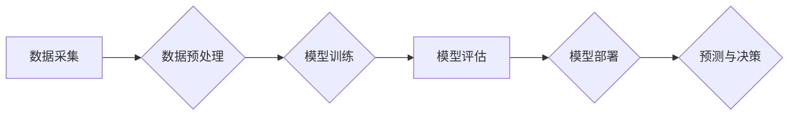

> 人工智能，深度学习，机器学习，自然语言处理，计算机视觉，产业变革，自动化，数据驱动

## 1. 背景介绍

人工智能（AI）正以惊人的速度发展，从实验室的理论研究走向现实世界的广泛应用。AI技术正在深刻地改变着各个行业，推动着产业的数字化转型和升级。

近年来，深度学习算法的突破性进展，以及海量数据的积累，为AI技术的快速发展提供了强劲动力。深度学习算法能够从海量数据中自动学习特征，从而实现对复杂问题的解决，例如图像识别、语音识别、自然语言处理等。

## 2. 核心概念与联系

**2.1  人工智能（AI）**

人工智能是指模拟人类智能行为的计算机系统。AI的目标是让机器能够像人类一样学习、推理、解决问题和做出决策。

**2.2  机器学习（ML）**

机器学习是人工智能的一个子领域，它使计算机能够从数据中学习，无需明确编程。机器学习算法通过分析数据模式，建立数学模型，从而预测未来结果或做出决策。

**2.3  深度学习（DL）**

深度学习是机器学习的一个子领域，它使用多层神经网络来模拟人类大脑的结构和功能。深度学习算法能够学习更复杂的特征，从而实现更准确的预测和更强大的智能。

**2.4  自然语言处理（NLP）**

自然语言处理是指使计算机能够理解、处理和生成人类语言的技术。NLP应用广泛，例如机器翻译、文本摘要、聊天机器人等。

**2.5  计算机视觉（CV）**

计算机视觉是指使计算机能够“看”和理解图像的技术。CV应用广泛，例如图像识别、物体检测、人脸识别等。

**2.6  产业变革**

AI技术正在深刻地改变着各个行业，例如制造业、金融业、医疗保健业、零售业等。AI技术可以提高效率、降低成本、创造新的商业模式，从而推动产业的数字化转型和升级。

**Mermaid 流程图**



## 3. 核心算法原理 & 具体操作步骤

### 3.1  算法原理概述

深度学习算法的核心是多层神经网络。神经网络由多个节点（神经元）组成，每个节点都连接到其他节点，并通过权重来传递信息。

深度学习算法通过训练神经网络，学习到数据中的特征和模式。训练过程 involves 调整神经网络的权重，使得网络的输出与实际结果尽可能接近。

### 3.2  算法步骤详解

1. **数据准备:** 收集和预处理数据，例如清洗数据、特征工程等。
2. **模型选择:** 选择合适的深度学习模型，例如卷积神经网络（CNN）、循环神经网络（RNN）等。
3. **模型训练:** 使用训练数据训练模型，调整模型参数，使得模型的预测结果尽可能准确。
4. **模型评估:** 使用测试数据评估模型的性能，例如准确率、召回率等。
5. **模型部署:** 将训练好的模型部署到实际应用场景中，例如云平台、边缘设备等。

### 3.3  算法优缺点

**优点:**

* 能够学习复杂特征，实现高精度预测。
* 能够处理海量数据。
* 能够自动学习，无需人工特征工程。

**缺点:**

* 训练成本高，需要大量计算资源和时间。
* 数据依赖性强，模型性能受数据质量影响。
* 可解释性差，难以理解模型的决策过程。

### 3.4  算法应用领域

深度学习算法应用广泛，例如：

* **计算机视觉:** 图像识别、物体检测、人脸识别、图像生成等。
* **自然语言处理:** 机器翻译、文本摘要、情感分析、聊天机器人等。
* **语音识别:** 语音转文本、语音助手等。
* **医疗保健:** 疾病诊断、药物研发、医疗影像分析等。
* **金融:** 风险评估、欺诈检测、投资决策等。

## 4. 数学模型和公式 & 详细讲解 & 举例说明

### 4.1  数学模型构建

深度学习模型通常由多个层组成，每层都包含多个神经元。每个神经元接收来自上一层的输入，并通过激活函数进行处理，输出到下一层。

**神经网络模型:**

$$
y = f(W_L x_L + b_L)
$$

其中：

* $y$ 是输出值
* $x_L$ 是上一层的输出值
* $W_L$ 是当前层的权重矩阵
* $b_L$ 是当前层的偏置向量
* $f$ 是激活函数

### 4.2  公式推导过程

深度学习模型的训练过程是通过反向传播算法来进行的。反向传播算法通过计算损失函数的梯度，来更新模型参数，使得模型的预测结果尽可能接近实际结果。

**损失函数:**

$$
L = \frac{1}{N} \sum_{i=1}^{N} (y_i - \hat{y}_i)^2
$$

其中：

* $L$ 是损失函数
* $N$ 是样本数量
* $y_i$ 是实际值
* $\hat{y}_i$ 是预测值

**梯度下降算法:**

$$
\theta = \theta - \alpha \nabla L(\theta)
$$

其中：

* $\theta$ 是模型参数
* $\alpha$ 是学习率
* $\nabla L(\theta)$ 是损失函数的梯度

### 4.3  案例分析与讲解

例如，在图像识别任务中，可以使用卷积神经网络（CNN）模型来识别图像中的物体。CNN模型通过卷积层和池化层来提取图像特征，并通过全连接层来进行分类。

## 5. 项目实践：代码实例和详细解释说明

### 5.1  开发环境搭建

* Python 3.x
* TensorFlow 或 PyTorch 深度学习框架
* Jupyter Notebook 或 VS Code 代码编辑器

### 5.2  源代码详细实现

```python
import tensorflow as tf

# 定义模型结构
model = tf.keras.models.Sequential([
    tf.keras.layers.Conv2D(32, (3, 3), activation='relu', input_shape=(28, 28, 1)),
    tf.keras.layers.MaxPooling2D((2, 2)),
    tf.keras.layers.Conv2D(64, (3, 3), activation='relu'),
    tf.keras.layers.MaxPooling2D((2, 2)),
    tf.keras.layers.Flatten(),
    tf.keras.layers.Dense(10, activation='softmax')
])

# 编译模型
model.compile(optimizer='adam',
              loss='sparse_categorical_crossentropy',
              metrics=['accuracy'])

# 训练模型
model.fit(x_train, y_train, epochs=5)

# 评估模型
loss, accuracy = model.evaluate(x_test, y_test)
print('Test loss:', loss)
print('Test accuracy:', accuracy)
```

### 5.3  代码解读与分析

* 代码首先定义了卷积神经网络模型的结构，包括卷积层、池化层和全连接层。
* 然后，代码编译了模型，指定了优化器、损失函数和评估指标。
* 接着，代码训练了模型，使用训练数据进行迭代训练。
* 最后，代码评估了模型的性能，使用测试数据计算损失和准确率。

### 5.4  运行结果展示

训练完成后，可以查看模型的训练过程和测试结果，例如损失函数的变化趋势和准确率。

## 6. 实际应用场景

### 6.1  制造业

* **智能制造:** 利用AI技术实现自动化生产、质量控制、 predictive maintenance等。
* **机器人自动化:** 开发AI驱动的机器人，用于完成重复性任务、危险作业等。

### 6.2  金融业

* **风险管理:** 利用AI技术识别和评估金融风险，例如欺诈检测、信用评分等。
* **投资决策:** 利用AI技术分析市场数据，进行投资决策和风险管理。

### 6.3  医疗保健业

* **疾病诊断:** 利用AI技术分析医疗影像，辅助医生进行疾病诊断。
* **药物研发:** 利用AI技术加速药物研发过程，例如药物发现、临床试验等。

### 6.4  未来应用展望

AI技术的发展将继续推动产业的数字化转型和升级，例如：

* **个性化服务:** 利用AI技术提供个性化的产品和服务，例如个性化推荐、定制化医疗等。
* **智能城市:** 利用AI技术建设智慧城市，例如交通管理、环境监测等。
* **新兴产业:** AI技术将催生新的产业和商业模式，例如自动驾驶、元宇宙等。

## 7. 工具和资源推荐

### 7.1  学习资源推荐

* **在线课程:** Coursera、edX、Udacity 等平台提供丰富的AI课程。
* **书籍:** 《深度学习》、《机器学习》、《人工智能导论》等书籍。
* **开源项目:** TensorFlow、PyTorch、OpenCV 等开源项目。

### 7.2  开发工具推荐

* **Python:** 广泛用于AI开发的编程语言。
* **Jupyter Notebook:** 用于代码编写、数据分析和可视化。
* **VS Code:** 功能强大的代码编辑器。

### 7.3  相关论文推荐

* **《ImageNet Classification with Deep Convolutional Neural Networks》**
* **《Attention Is All You Need》**
* **《BERT: Pre-training of Deep Bidirectional Transformers for Language Understanding》**

## 8. 总结：未来发展趋势与挑战

### 8.1  研究成果总结

近年来，AI技术取得了显著的进展，例如深度学习算法的突破性进展，以及海量数据的积累。AI技术正在深刻地改变着各个行业，推动产业的数字化转型和升级。

### 8.2  未来发展趋势

* **模型规模和能力的提升:** 未来，AI模型将更加强大，能够处理更复杂的任务。
* **模型解释性和可信度的提升:** 研究人员将致力于提高AI模型的可解释性和可信度，使其更加透明和可靠。
* **边缘计算和联邦学习的应用:** AI技术将更加广泛地应用于边缘设备和分布式数据环境。
* **跨模态学习和通用人工智能:** 研究人员将致力于开发能够理解和处理多种模态数据的AI模型，以及更接近人类智能的通用人工智能。

### 8.3  面临的挑战

* **数据安全和隐私保护:** AI技术的应用需要处理大量数据，因此数据安全和隐私保护是一个重要的挑战。
* **算法偏见和公平性:** AI算法可能存在偏见，导致不公平的结果。
* **伦理和社会影响:** AI技术的应用可能带来伦理和社会问题，例如就业替代、算法监管等。

### 8.4  研究展望

未来，AI技术将继续发展，并对社会产生深远的影响。研究人员将继续致力于解决AI技术面临的挑战，并探索AI技术的应用潜力。


## 9. 附录：常见问题与解答

**Q1: 什么是深度学习？**

A1: 深度学习是一种机器学习的子领域，它使用多层神经网络来模拟人类大脑的结构和功能。

**Q2: 深度学习有哪些应用场景？**

A2: 深度学习应用广泛，例如图像识别、自然语言处理、语音识别、医疗诊断等。

**Q3: 如何学习深度学习？**

A3: 可以通过在线课程、书籍、开源项目等方式学习深度学习。

**作者：禅与计算机程序设计艺术 / Zen and the Art of Computer Programming**


<end_of_turn>