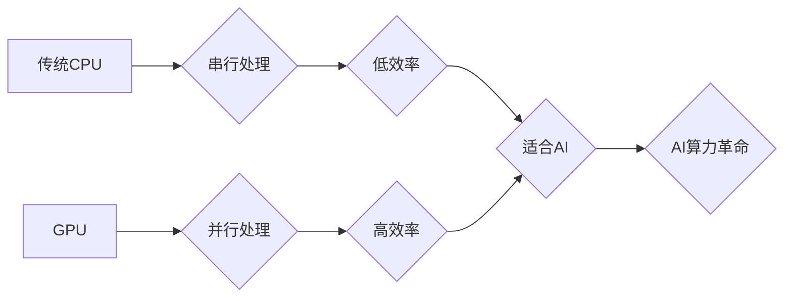

> NVIDIA, GPU, AI, 深度学习, 计算能力, CUDA, Tensor Core, 数据中心

## 1. 背景介绍

人工智能（AI）正以惊人的速度发展，其核心驱动力是强大的计算能力。从语音识别到图像识别，从自然语言处理到自动驾驶，AI的应用领域日益广泛，对算力的需求也呈指数级增长。在这个AI算力革命的浪潮中，NVIDIA扮演着至关重要的角色。

NVIDIA，一家总部位于美国加州的半导体公司，以其高性能图形处理单元（GPU）而闻名。GPU最初被设计用于处理图形渲染，但其并行计算能力使其成为AI训练和推理的理想平台。

## 2. 核心概念与联系

**2.1 GPU架构与AI计算**

传统CPU采用串行处理模式，只能一次处理一个指令，而GPU则采用并行处理模式，可以同时处理大量指令。这种并行计算能力使得GPU在处理海量数据和进行复杂的数学运算方面具有显著优势，这正是AI训练和推理的核心需求。

**2.2 CUDA平台与AI开发**

NVIDIA开发了CUDA（Compute Unified Device Architecture）平台，为开发者提供了一套完整的工具和库，用于将应用程序移植到GPU上进行加速。CUDA平台的广泛应用和成熟生态系统，为AI开发提供了强大的支持。

**2.3 Tensor Core与AI加速**

为了进一步提升AI计算性能，NVIDIA推出了Tensor Core，一种专门用于深度学习运算的专用硬件加速器。Tensor Core通过并行计算和矩阵乘法优化，大幅提高了深度学习模型的训练速度和推理效率。

**Mermaid 流程图**



## 3. 核心算法原理 & 具体操作步骤

**3.1 算法原理概述**

深度学习算法的核心是多层神经网络，通过学习数据中的特征和模式，实现对数据的理解和预测。常见的深度学习算法包括卷积神经网络（CNN）、循环神经网络（RNN）和Transformer等。

**3.2 算法步骤详解**

1. **数据预处理:** 将原始数据转换为深度学习模型可以理解的格式，例如归一化、编码等。
2. **模型构建:** 根据任务需求选择合适的深度学习模型架构，并定义模型参数。
3. **模型训练:** 使用训练数据训练模型，通过调整模型参数，使模型的预测结果与真实值尽可能接近。
4. **模型评估:** 使用测试数据评估模型的性能，例如准确率、召回率等。
5. **模型部署:** 将训练好的模型部署到实际应用场景中，用于进行预测或推理。

**3.3 算法优缺点**

**优点:**

* 能够学习复杂的数据模式，实现高精度预测。
* 具有强大的泛化能力，能够应用于多种不同的任务。

**缺点:**

* 训练数据量要求高，需要大量的计算资源。
* 模型解释性较差，难以理解模型的决策过程。

**3.4 算法应用领域**

* **图像识别:** 人脸识别、物体检测、图像分类等。
* **自然语言处理:** 语音识别、机器翻译、文本摘要等。
* **自动驾驶:** 路线规划、物体检测、驾驶决策等。
* **医疗诊断:** 病理图像分析、疾病预测等。

## 4. 数学模型和公式 & 详细讲解 & 举例说明

**4.1 数学模型构建**

深度学习模型的核心是神经网络，其结构由多个层组成，每层包含多个神经元。每个神经元接收来自上一层的输入信号，并通过激活函数进行处理，输出到下一层。

**4.2 公式推导过程**

深度学习模型的训练过程是通过优化模型参数来最小化损失函数的过程。损失函数衡量模型预测结果与真实值的差距。常用的损失函数包括均方误差（MSE）和交叉熵损失（Cross-Entropy Loss）。

**4.3 案例分析与讲解**

以图像分类为例，假设我们有一个包含10个类别的图像数据集。训练一个深度学习模型来识别这些类别，我们可以使用卷积神经网络（CNN）作为模型架构。CNN可以学习图像中的特征，并将其映射到不同的类别。

训练过程中，我们会使用训练数据来更新模型参数，使模型的预测结果与真实类别尽可能一致。损失函数会计算模型预测结果与真实类别的差距，并根据这个差距调整模型参数。

**数学公式**

* **损失函数:**

$$
L = \frac{1}{N} \sum_{i=1}^{N} \mathcal{L}(y_i, \hat{y}_i)
$$

其中：

* $L$ 是损失函数
* $N$ 是样本数量
* $\mathcal{L}$ 是单个样本的损失函数
* $y_i$ 是真实类别
* $\hat{y}_i$ 是模型预测类别

* **梯度下降算法:**

$$
\theta = \theta - \alpha \nabla L(\theta)
$$

其中：

* $\theta$ 是模型参数
* $\alpha$ 是学习率
* $\nabla L(\theta)$ 是损失函数对模型参数的梯度

## 5. 项目实践：代码实例和详细解释说明

**5.1 开发环境搭建**

* 操作系统：Ubuntu 20.04
* CUDA Toolkit：11.4
* cuDNN：8.1
* Python：3.8
* 深度学习框架：TensorFlow 2.x

**5.2 源代码详细实现**

```python
import tensorflow as tf

# 定义模型架构
model = tf.keras.models.Sequential([
    tf.keras.layers.Conv2D(32, (3, 3), activation='relu', input_shape=(28, 28, 1)),
    tf.keras.layers.MaxPooling2D((2, 2)),
    tf.keras.layers.Conv2D(64, (3, 3), activation='relu'),
    tf.keras.layers.MaxPooling2D((2, 2)),
    tf.keras.layers.Flatten(),
    tf.keras.layers.Dense(10, activation='softmax')
])

# 编译模型
model.compile(optimizer='adam',
              loss='sparse_categorical_crossentropy',
              metrics=['accuracy'])

# 训练模型
model.fit(x_train, y_train, epochs=5)

# 评估模型
loss, accuracy = model.evaluate(x_test, y_test)
print('Test loss:', loss)
print('Test accuracy:', accuracy)
```

**5.3 代码解读与分析**

这段代码定义了一个简单的卷积神经网络模型，用于手写数字识别任务。

* `tf.keras.models.Sequential` 创建了一个顺序模型，层级结构清晰。
* `tf.keras.layers.Conv2D` 定义卷积层，用于提取图像特征。
* `tf.keras.layers.MaxPooling2D` 定义最大池化层，用于降维和提高模型鲁棒性。
* `tf.keras.layers.Flatten` 将多维特征转换为一维向量。
* `tf.keras.layers.Dense` 定义全连接层，用于分类。
* `model.compile` 编译模型，指定优化器、损失函数和评价指标。
* `model.fit` 训练模型，使用训练数据进行迭代训练。
* `model.evaluate` 评估模型，使用测试数据计算损失和准确率。

**5.4 运行结果展示**

训练完成后，模型的准确率通常会达到较高的水平，例如在MNIST手写数字识别任务中，准确率可以达到98%以上。

## 6. 实际应用场景

**6.1 图像识别**

* **人脸识别:** 用于身份验证、安全监控等场景。
* **物体检测:** 用于自动驾驶、安防监控等场景。
* **图像分类:** 用于医疗诊断、产品分类等场景。

**6.2 自然语言处理**

* **语音识别:** 用于智能语音助手、语音搜索等场景。
* **机器翻译:** 用于跨语言沟通、文本翻译等场景。
* **文本摘要:** 用于新闻提要、文档压缩等场景。

**6.3 自动驾驶**

* **路径规划:** 用于自动驾驶汽车规划行驶路线。
* **物体检测:** 用于自动驾驶汽车识别周围环境中的物体。
* **驾驶决策:** 用于自动驾驶汽车做出驾驶决策。

**6.4 未来应用展望**

* **个性化推荐:** 基于用户行为和偏好，提供个性化商品推荐。
* **医疗诊断辅助:** 辅助医生进行疾病诊断，提高诊断准确率。
* **科学研究:** 加速科学研究，例如药物研发、材料科学等。

## 7. 工具和资源推荐

**7.1 学习资源推荐**

* **深度学习课程:** Coursera、edX、Udacity等平台提供丰富的深度学习课程。
* **深度学习书籍:** 《深度学习》、《动手学深度学习》等书籍。
* **在线文档:** TensorFlow、PyTorch等深度学习框架的官方文档。

**7.2 开发工具推荐**

* **深度学习框架:** TensorFlow、PyTorch、Keras等。
* **IDE:** VS Code、PyCharm等。
* **GPU加速库:** CUDA、cuDNN等。

**7.3 相关论文推荐**

* **AlexNet:** 《ImageNet Classification with Deep Convolutional Neural Networks》
* **VGGNet:** 《Very Deep Convolutional Networks for Large-Scale Image Recognition》
* **ResNet:** 《Deep Residual Learning for Image Recognition》

## 8. 总结：未来发展趋势与挑战

**8.1 研究成果总结**

近年来，深度学习取得了令人瞩目的成就，在图像识别、自然语言处理、自动驾驶等领域取得了突破性进展。NVIDIA在AI算力革命中发挥着关键作用，其GPU和CUDA平台为深度学习的发展提供了强大的支持。

**8.2 未来发展趋势**

* **模型规模和复杂度提升:** 未来深度学习模型将更加庞大，包含更多层和参数，以实现更精细的特征学习和更准确的预测。
* **模型效率和可解释性提升:** 研究者将致力于开发更轻量级、更高效的深度学习模型，并提高模型的解释性，使其决策过程更加透明。
* **边缘计算和分布式训练:** 深度学习模型将部署到边缘设备，实现更快速的推理和更低的延迟。分布式训练技术将进一步提升模型训练效率。

**8.3 面临的挑战**

* **数据获取和标注:** 深度学习模型需要大量的训练数据，数据获取和标注成本高昂。
* **计算资源需求:** 训练大型深度学习模型需要大量的计算资源，这对于资源有限的机构和个人来说是一个挑战。
* **模型安全性和隐私性:** 深度学习模型可能存在安全漏洞和隐私泄露风险，需要采取相应的安全措施。

**8.4 研究展望**

未来，深度学习将继续朝着更智能、更安全、更可解释的方向发展。NVIDIA将继续在AI算力领域发挥引领作用，为深度学习的发展提供强大的技术支持。

## 9. 附录：常见问题与解答

**9.1 如何选择合适的GPU？**

选择合适的GPU取决于具体的应用场景和预算。对于深度学习训练，建议选择具有高算力、大内存和高带宽的GPU，例如NVIDIA A100、H100等。

**9.2 如何安装CUDA和cuDNN？**

NVIDIA官网提供详细的CUDA和cuDNN安装指南。

**9.3 如何使用TensorFlow或PyTorch进行深度学习开发？**

TensorFlow和PyTorch都提供了丰富的文档和教程，可以帮助开发者快速入门。

作者：禅与计算机程序设计艺术 / Zen and the Art of Computer Programming


<end_of_turn>