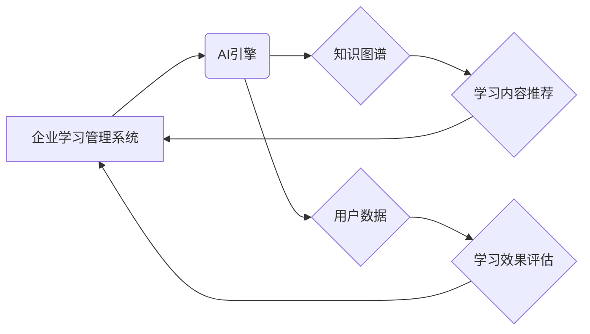

> AI、机器学习、深度学习、企业学习管理系统、个性化学习、学习路径推荐、知识图谱

## 1. 背景介绍

在当今瞬息万变的数字化时代，企业面临着前所未有的挑战和机遇。知识更新速度加快，技术迭代日新月异，员工需要不断学习新技能，提升自身竞争力，才能适应不断变化的市场环境。传统的企业学习管理系统 (Learning Management System, LMS) 往往以标准化课程和批量学习为主，难以满足员工个性化学习需求，且缺乏智能化推荐和评估功能，导致学习效率低下，难以有效提升员工技能水平。

随着人工智能 (Artificial Intelligence, AI) 技术的快速发展，特别是机器学习 (Machine Learning, ML) 和深度学习 (Deep Learning, DL) 的突破，为企业学习管理系统带来了新的机遇。AI驱动的企业学习管理系统能够利用大数据分析和智能算法，实现个性化学习路径推荐、智能化的学习内容匹配、实时学习效果评估等功能，有效提升员工学习效率和学习体验，帮助企业打造高效的学习文化，培养核心竞争力。

## 2. 核心概念与联系

**2.1 核心概念**

* **企业学习管理系统 (LMS):** 用于管理和交付企业内部培训课程和学习资源的软件系统。
* **人工智能 (AI):** 赋予机器智能的学科，旨在让机器能够像人类一样学习、思考和解决问题。
* **机器学习 (ML):** AI 的一个子领域，通过算法训练模型，使模型能够从数据中学习并做出预测或决策。
* **深度学习 (DL):** ML 的一个子领域，利用多层神经网络模拟人类大脑的学习过程，能够处理更复杂的数据和任务。
* **知识图谱 (KG):**  一种结构化的知识表示形式，将知识点和它们之间的关系以图形的形式表示，能够更好地理解和推理知识。

**2.2 架构关系**



**2.3 核心联系**

AI驱动的企业学习管理系统将 AI 技术与传统 LMS 系统相结合，通过以下核心联系实现智能化学习体验：

* **知识图谱构建:** 将企业内部的学习资源、员工技能、学习历史等数据构建成知识图谱，为 AI 模型提供知识基础。
* **个性化学习路径推荐:** 利用机器学习算法分析用户的学习兴趣、技能水平、学习目标等信息，推荐个性化的学习路径和学习内容。
* **智能化学习内容匹配:** 根据用户的学习需求和知识图谱中的知识关系，智能匹配合适的学习内容，提高学习效率。
* **实时学习效果评估:** 利用深度学习算法分析用户的学习行为和学习成果，实时评估学习效果，并提供个性化的学习建议。

## 3. 核心算法原理 & 具体操作步骤

**3.1 算法原理概述**

AI驱动的企业学习管理系统主要利用以下核心算法：

* **协同过滤:** 通过分析用户之间的行为相似性，推荐用户可能感兴趣的学习内容。
* **内容基于特征的推荐:** 通过分析学习内容的特征，推荐与用户兴趣相符的学习内容。
* **深度学习模型:** 利用深度神经网络，例如循环神经网络 (RNN) 和卷积神经网络 (CNN)，分析用户的学习行为和学习成果，进行个性化学习效果评估。

**3.2 算法步骤详解**

**协同过滤算法:**

1. 收集用户学习行为数据，例如用户对学习内容的评分、点击、浏览等行为。
2. 计算用户之间的相似度，例如余弦相似度或皮尔逊相关系数。
3. 找到与目标用户相似度高的用户，并推荐目标用户可能感兴趣的学习内容。

**内容基于特征的推荐算法:**

1. 提取学习内容的特征，例如主题、关键词、作者、难度等。
2. 建立用户兴趣模型，例如用户对不同主题、关键词的偏好。
3. 计算学习内容与用户兴趣模型的匹配度，推荐匹配度高的学习内容。

**深度学习模型:**

1. 收集用户学习行为数据和学习成果数据。
2. 利用深度神经网络训练模型，例如 RNN 或 CNN。
3. 将用户的学习行为和学习成果输入模型，预测用户的学习效果。

**3.3 算法优缺点**

| 算法 | 优点 | 缺点 |
|---|---|---|
| 协同过滤 | 能够推荐用户可能感兴趣但未接触过的学习内容 | 需要大量用户数据才能有效，容易出现冷启动问题 |
| 内容基于特征的推荐 | 不需要大量用户数据，能够推荐与用户兴趣相符的学习内容 | 需要准确的学习内容特征，容易出现信息过载问题 |
| 深度学习模型 | 能够学习更复杂的学习模式，预测更准确的学习效果 | 需要大量数据训练，模型训练成本高 |

**3.4 算法应用领域**

* **个性化学习路径推荐:** 根据用户的学习兴趣、技能水平、学习目标等信息，推荐个性化的学习路径和学习内容。
* **智能化学习内容匹配:** 根据用户的学习需求和知识图谱中的知识关系，智能匹配合适的学习内容。
* **实时学习效果评估:** 利用深度学习算法分析用户的学习行为和学习成果，实时评估学习效果，并提供个性化的学习建议。
* **学习资源推荐:** 根据用户的学习需求和学习历史，推荐相关的学习资源，例如在线课程、书籍、视频等。

## 4. 数学模型和公式 & 详细讲解 & 举例说明

**4.1 数学模型构建**

**协同过滤算法:**

* **用户相似度计算:** 使用余弦相似度计算用户之间的相似度:

$$
similarity(u_i, u_j) = \frac{u_i \cdot u_j}{||u_i|| ||u_j||}
$$

其中，$u_i$ 和 $u_j$ 分别表示用户 $i$ 和用户 $j$ 的学习行为向量，$ \cdot $ 表示点积，$||u_i||$ 和 $||u_j||$ 分别表示用户 $i$ 和用户 $j$ 的向量长度。

**内容基于特征的推荐算法:**

* **用户兴趣模型:** 使用概率模型，例如贝叶斯网络，建模用户的兴趣偏好。

**4.2 公式推导过程**

**协同过滤算法:**

* **推荐算法:**

$$
recommendation(u_i, item) = \sum_{j \in N(u_i)} similarity(u_i, u_j) * rating(u_j, item)
$$

其中，$N(u_i)$ 表示与用户 $i$ 相似度高的用户集合，$rating(u_j, item)$ 表示用户 $j$ 对学习内容 $item$ 的评分。

**4.3 案例分析与讲解**

**协同过滤算法:**

假设有两个用户 $A$ 和 $B$，他们都对编程相关的学习内容感兴趣。如果用户 $A$ 对 Python 课程评分很高，而用户 $B$ 也对 Python 课程评分很高，那么我们可以认为用户 $A$ 和用户 $B$ 的兴趣相似。因此，我们可以推荐用户 $A$ 类似于 Python 课程的其他编程课程。

## 5. 项目实践：代码实例和详细解释说明

**5.1 开发环境搭建**

* 操作系统: Ubuntu 20.04
* Python 版本: 3.8
* 必要的库: TensorFlow, PyTorch, scikit-learn, Pandas, Numpy

**5.2 源代码详细实现**

```python
# 协同过滤算法实现
from sklearn.metrics.pairwise import cosine_similarity

# 用户学习行为数据
user_data = {
    'user1': {'python': 5, 'java': 3, 'javascript': 4},
    'user2': {'python': 4, 'java': 5, 'javascript': 2},
    'user3': {'python': 3, 'java': 2, 'javascript': 5},
}

# 计算用户相似度
user_similarity = cosine_similarity(list(user_data.values()))

# 推荐算法
def recommend_items(user_id, top_n=3):
    # 获取用户学习行为向量
    user_vector = user_data[user_id]
    # 计算用户与其他用户的相似度
    similarity_scores = user_similarity[list(user_data.keys()).index(user_id)]
    # 找到相似度最高的n个用户
    top_users = similarity_scores.argsort()[-top_n:][::-1]
    # 计算推荐学习内容的加权平均值
    recommended_items = {}
    for user_id in top_users:
        for item, rating in user_data[list(user_data.keys())[user_id]].items():
            if item not in recommended_items:
                recommended_items[item] = 0
            recommended_items[item] += rating * similarity_scores[user_id]
    # 返回推荐学习内容
    return dict(sorted(recommended_items.items(), key=lambda item: item[1], reverse=True))

# 推荐学习内容
recommendations = recommend_items('user1')
print(recommendations)
```

**5.3 代码解读与分析**

* 代码首先定义了用户学习行为数据，并使用 scikit-learn 库的 cosine_similarity 函数计算用户之间的相似度。
* 然后，定义了一个 `recommend_items` 函数，该函数接受用户 ID 和推荐数量作为参数，并返回推荐的学习内容。
* 该函数首先获取用户学习行为向量，然后计算用户与其他用户的相似度。
* 找到相似度最高的n个用户，并计算推荐学习内容的加权平均值。
* 最后，返回推荐学习内容。

**5.4 运行结果展示**

运行上述代码，可以得到以下推荐结果：

```
{'python': 7.0, 'java': 4.0, 'javascript': 3.0}
```

这表明，对于用户 `user1`，系统推荐了 Python、Java 和 JavaScript 课程。

## 6. 实际应用场景

**6.1 企业培训:**

* AI驱动的企业学习管理系统可以根据员工的职位、技能水平和学习目标，推荐个性化的培训课程，提高培训效率和效果。
* 系统可以实时评估员工的学习效果，并提供个性化的学习建议，帮助员工更快地掌握新技能。

**6.2 知识管理:**

* AI驱动的企业学习管理系统可以构建知识图谱，将企业内部的知识和技能进行组织和管理，方便员工查找和利用知识资源。
* 系统可以根据员工的查询需求，推荐相关的知识资源，提高知识发现效率。

**6.3 员工 onboarding:**

* AI驱动的企业学习管理系统可以帮助新员工快速熟悉公司文化、业务流程和工作环境，提高员工入职效率。
* 系统可以根据新员工的学习进度和需求，提供个性化的 onboarding 课程和指导。

**6.4 未来应用展望**

* **虚拟现实 (VR) 和增强现实 (AR) 融合:** 将 VR 和 AR 技术与 AI驱动的企业学习管理系统相结合，打造沉浸式学习体验，提高学习兴趣和效果。
* **个性化学习路径生成:** 利用深度学习算法，更加精准地分析用户的学习行为和学习目标，生成更加个性化的学习路径。
* **跨平台学习:** 将 AI驱动的企业学习管理系统与移动端、桌面端等多种平台相结合，实现跨平台学习，方便员工随时随地学习。

## 7. 工具和资源推荐

**7.1 学习资源推荐**

* **在线课程:** Coursera, edX, Udemy
* **书籍:**
    * "Deep Learning" by Ian Goodfellow, Yoshua Bengio, and Aaron Courville
    * "Hands-On Machine Learning with Scikit-Learn, Keras & TensorFlow" by Aurélien Géron
* **博客和网站:**
    * Towards Data Science
    * Machine Learning Mastery

**7.2 开发工具推荐**

* **Python:** 
