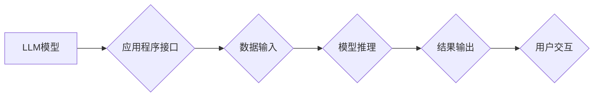

> LLMs, LLM OS, 嵌入式AI, 应用程序开发, 编程语言, 模型部署, 效率优化, 硬件加速

## 1. 背景介绍

近年来，大型语言模型（LLMs）的蓬勃发展，为人工智能领域带来了革命性的变革。从文本生成、翻译到代码编写，LLMs展现出惊人的能力，并逐渐渗透到各个领域。然而，将这些强大的模型应用于实际场景，仍然面临着诸多挑战。

传统的LLM部署方式通常依赖于云端服务器，这导致了模型访问延迟、资源消耗高以及安全性问题等。为了解决这些问题，Andrej Karpathy，一位享誉全球的AI专家，提出了“LLM OS”的概念。

LLM OS旨在将LLMs嵌入到各种设备中，构建一个类似于传统操作系统（如Windows、Linux）的框架，从而实现高效、安全、便捷的模型部署和应用开发。

## 2. 核心概念与联系

LLM OS的核心概念是将LLM视为一个可编程的软件组件，并提供一套统一的接口和工具，方便开发者将LLMs集成到应用程序中。

**LLM OS 架构**

**核心概念:**

* **模型库:** 提供预训练的LLM模型，并支持用户自定义模型训练和部署。
* **应用程序接口:** 定义了与LLM交互的标准接口，方便开发者调用模型进行推理。
* **数据管理:** 提供数据存储、处理和安全管理功能，确保数据安全和隐私。
* **资源管理:** 动态分配资源，优化模型运行效率，并支持多模型并发执行。
* **安全机制:** 确保模型安全运行，防止恶意攻击和数据泄露。

## 3. 核心算法原理 & 具体操作步骤

### 3.1  算法原理概述

LLM OS的核心算法原理基于深度学习和自然语言处理技术。

* **深度学习:** LLMs通常基于Transformer网络架构，通过大量文本数据进行训练，学习语言的语法和语义。
* **自然语言处理:** LLMs可以理解和生成人类语言，并执行各种自然语言任务，例如文本分类、问答、机器翻译等。

### 3.2  算法步骤详解

1. **模型训练:** 使用大量文本数据训练LLM模型，学习语言的表示和关系。
2. **模型部署:** 将训练好的LLM模型部署到目标设备，例如嵌入式设备、云服务器等。
3. **数据预处理:** 将用户输入的数据进行预处理，例如分词、词向量化等，使其能够被LLM模型理解。
4. **模型推理:** 将预处理后的数据输入到LLM模型中，进行推理，得到模型输出。
5. **结果处理:** 对模型输出进行处理，例如解码、格式化等，使其能够被用户理解。

### 3.3  算法优缺点

**优点:**

* **强大的语言理解和生成能力:** LLMs能够理解和生成人类语言，并执行各种自然语言任务。
* **可定制性:** 用户可以根据自己的需求，自定义模型训练和部署。
* **高效性:** LLM OS可以优化模型运行效率，并支持多模型并发执行。

**缺点:**

* **模型规模庞大:** LLMs通常需要大量的计算资源进行训练和部署。
* **数据依赖性:** LLMs的性能取决于训练数据的质量和数量。
* **安全风险:** LLMs可能存在被恶意利用的风险，例如生成虚假信息、进行攻击等。

### 3.4  算法应用领域

LLM OS的应用领域非常广泛，包括：

* **智能助手:** 构建更智能、更自然的语音助手和聊天机器人。
* **内容创作:** 自动生成文章、故事、诗歌等内容。
* **代码生成:** 自动生成代码，提高开发效率。
* **教育:** 提供个性化的学习体验，辅助学生学习。
* **医疗:** 辅助医生诊断疾病、分析病历等。

## 4. 数学模型和公式 & 详细讲解 & 举例说明

### 4.1  数学模型构建

LLM的核心数学模型是Transformer网络，其主要结构包括：

* **编码器:** 将输入文本序列编码成固定长度的向量表示。
* **解码器:** 根据编码后的向量表示，生成目标文本序列。

Transformer网络利用自注意力机制，能够捕捉文本序列中长距离依赖关系，从而实现更准确的语言理解和生成。

### 4.2  公式推导过程

Transformer网络的注意力机制公式如下：

$$
Attention(Q, K, V) = softmax(\frac{QK^T}{\sqrt{d_k}})V
$$

其中：

* $Q$：查询矩阵
* $K$：键矩阵
* $V$：值矩阵
* $d_k$：键向量的维度
* $softmax$：softmax函数

### 4.3  案例分析与讲解

假设我们有一个句子“The cat sat on the mat”，将其编码为向量表示，然后使用注意力机制计算每个词与其他词之间的相关性。

通过注意力机制，我们可以发现“cat”与“sat”之间存在强相关性，因为它们描述了同一件事。而“mat”与其他词的相关性较弱。

## 5. 项目实践：代码实例和详细解释说明

### 5.1  开发环境搭建

LLM OS的开发环境通常基于Linux系统，并需要安装一些必要的软件包，例如Python、TensorFlow、PyTorch等。

### 5.2  源代码详细实现

LLM OS的源代码通常由多个模块组成，例如模型库、应用程序接口、数据管理模块等。

### 5.3  代码解读与分析

LLM OS的代码实现需要结合其架构和算法原理进行解读和分析。

### 5.4  运行结果展示

LLM OS的运行结果可以包括模型推理结果、应用程序输出等。

## 6. 实际应用场景

### 6.1  智能助手

LLM OS可以用于构建更智能、更自然的语音助手和聊天机器人，例如：

* **对话理解:** 理解用户的自然语言输入，并进行相应的响应。
* **任务执行:** 执行用户的指令，例如设置闹钟、查询天气等。
* **个性化服务:** 根据用户的喜好和历史记录，提供个性化的服务。

### 6.2  内容创作

LLM OS可以用于自动生成各种类型的文本内容，例如：

* **文章写作:** 根据给定的主题和关键词，自动生成文章。
* **故事创作:** 根据给定的情节和人物，自动生成故事。
* **诗歌创作:** 根据给定的主题和风格，自动生成诗歌。

### 6.3  代码生成

LLM OS可以用于自动生成代码，例如：

* **代码补全:** 根据用户的输入，自动补全代码。
* **代码翻译:** 将代码从一种编程语言翻译成另一种编程语言。
* **代码生成:** 根据给定的需求，自动生成代码。

### 6.4  未来应用展望

LLM OS的应用场景还在不断扩展，未来可能应用于：

* **教育:** 提供个性化的学习体验，辅助学生学习。
* **医疗:** 辅助医生诊断疾病、分析病历等。
* **金融:** 进行风险评估、欺诈检测等。

## 7. 工具和资源推荐

### 7.1  学习资源推荐

* **书籍:**
    * 《深度学习》
    * 《自然语言处理》
* **在线课程:**
    * Coursera
    * edX
* **博客和论坛:**
    * Hugging Face
    * TensorFlow Blog

### 7.2  开发工具推荐

* **Python:** 广泛用于深度学习和自然语言处理开发。
* **TensorFlow:** 开源深度学习框架。
* **PyTorch:** 开源深度学习框架。
* **Hugging Face Transformers:** 提供预训练的LLM模型和工具。

### 7.3  相关论文推荐

* **Attention Is All You Need:** https://arxiv.org/abs/1706.03762
* **BERT: Pre-training of Deep Bidirectional Transformers for Language Understanding:** https://arxiv.org/abs/1810.04805

## 8. 总结：未来发展趋势与挑战

### 8.1  研究成果总结

LLM OS的提出，为将LLMs应用于实际场景提供了新的思路和方法。

LLM OS的开发和应用，推动了深度学习和自然语言处理技术的进步，并为人工智能的未来发展指明了方向。

### 8.2  未来发展趋势

LLM OS的未来发展趋势包括：

* **模型效率优化:** 降低LLM模型的计算资源消耗，使其能够部署在更低功耗的设备上。
* **安全性和隐私保护:** 加强LLM模型的安全性和隐私保护机制，防止恶意攻击和数据泄露。
* **多模态融合:** 将LLM与其他模态数据（例如图像、音频）融合，构建更全面的智能系统。

### 8.3  面临的挑战

LLM OS的开发和应用也面临着一些挑战：

* **模型规模庞大:** LLMs通常需要大量的计算资源进行训练和部署，这对于资源有限的设备来说是一个挑战。
* **数据依赖性:** LLMs的性能取决于训练数据的质量和数量，而高质量的训练数据往往难以获取。
* **伦理问题:** LLMs可能存在被恶意利用的风险，例如生成虚假信息、进行攻击等，需要认真考虑其伦理问题。

### 8.4  研究展望

未来，LLM OS的研究将继续深入，探索更有效的模型架构、更安全的部署方式以及更广泛的应用场景。

## 9. 附录：常见问题与解答

**常见问题:**

* **LLM OS与传统操作系统有什么区别？**
* **LLM OS如何保证模型安全性和隐私保护？**
* **LLM OS有哪些应用场景？**

**解答:**

* **LLM OS与传统操作系统有什么区别？**

LLM OS与传统操作系统最大的区别在于，LLM OS将LLM模型视为一个可编程的软件组件，并提供一套统一的接口和工具，方便开发者将LLMs集成到应用程序中。而传统操作系统则主要负责硬件资源管理、进程调度等系统级任务。

* **LLM OS如何保证模型安全性和隐私保护？**

LLM OS采用多种安全机制来保证模型安全性和隐私保护，例如：

* **模型加密:** 将模型参数加密，防止未经授权的访问。
* **数据脱敏:** 对用户数据进行脱敏处理，保护用户隐私。
* **安全审计:** 对模型运行过程进行安全审计，及时发现和处理安全问题。

* **LLM OS有哪些应用场景？**

LLM OS的应用场景非常广泛，包括智能助手、内容创作、代码生成、教育、医疗等。

**作者：禅与计算机程序设计艺术 / Zen and the Art of Computer Programming**

<end_of_turn>