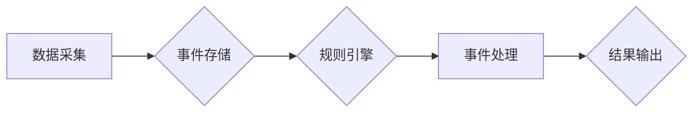

> CEP, 事件处理, 流式数据, 实时分析, 规则引擎, 代码实例, Java

## 1. 背景介绍

在当今数据爆炸的时代，海量数据以高速流动的形式涌入企业系统。如何实时地捕捉、分析和响应这些流动的事件，已成为企业数字化转型和智能化升级的关键。事件处理引擎 (CEP) 应运而生，它能够实时地处理流式数据，并根据预先定义的规则，触发相应的业务逻辑。

CEP 是一种用于处理实时事件流的软件系统，它能够从各种数据源中收集事件数据，并根据预先定义的规则进行分析和处理。CEP 系统通常由以下几个主要组件组成：

* **数据采集组件:** 从各种数据源收集事件数据，例如传感器数据、日志数据、交易数据等。
* **事件存储组件:** 存储收集到的事件数据，并提供高效的查询和检索功能。
* **规则引擎组件:** 根据预先定义的规则，对事件数据进行分析和处理。
* **事件处理组件:** 根据规则引擎的分析结果，触发相应的业务逻辑，例如发送报警、更新数据库、执行自动化任务等。

## 2. 核心概念与联系

CEP 的核心概念包括事件、流、规则和事件处理。

* **事件:** 事件是 CEP 系统处理的基本单位，它代表了某个特定时刻发生的某个特定的事实或状态变化。事件通常包含事件类型、事件时间戳、事件属性等信息。
* **流:** 事件流是指一系列按时间顺序排列的事件。CEP 系统通常处理的是流式数据，即不断涌入的新事件。
* **规则:** 规则是 CEP 系统的核心逻辑，它定义了如何对事件流进行分析和处理。规则通常由条件和操作两部分组成，条件用于筛选符合特定条件的事件，操作用于对符合条件的事件进行处理。
* **事件处理:** 事件处理是指根据规则引擎的分析结果，对事件数据进行处理的过程。事件处理可以包括发送报警、更新数据库、执行自动化任务等各种操作。

**CEP 系统架构流程图:**



## 3. 核心算法原理 & 具体操作步骤

### 3.1  算法原理概述

CEP 系统的核心算法通常是基于状态机和事件匹配的。状态机用于管理事件流的处理状态，事件匹配用于根据规则筛选和处理符合条件的事件。

### 3.2  算法步骤详解

1. **事件接收:** CEP 系统接收来自数据源的事件数据。
2. **事件存储:** CEP 系统将接收到的事件数据存储在事件存储组件中。
3. **规则匹配:** CEP 系统根据预先定义的规则，对事件存储中的事件数据进行匹配。
4. **状态机更新:** 当事件匹配成功时，CEP 系统会更新状态机的状态。
5. **事件处理:** 根据状态机的当前状态和匹配的事件数据，CEP 系统会触发相应的事件处理逻辑。
6. **结果输出:** CEP 系统将处理结果输出到指定的输出通道，例如数据库、消息队列、报警系统等。

### 3.3  算法优缺点

**优点:**

* **实时性:** CEP 系统能够实时地处理流式数据，并根据规则触发相应的业务逻辑。
* **灵活性和可扩展性:** CEP 系统可以根据业务需求灵活地定义规则，并扩展处理能力。
* **易于维护:** CEP 系统的规则定义和事件处理逻辑相对独立，易于维护和更新。

**缺点:**

* **资源消耗:** CEP 系统处理大量流式数据，可能会消耗较多的系统资源。
* **复杂性:** CEP 系统的架构和算法相对复杂，需要专业的技术人员进行开发和维护。

### 3.4  算法应用领域

CEP 算法广泛应用于以下领域:

* **金融领域:** 风险管理、欺诈检测、交易监控
* **物联网领域:** 设备状态监控、异常报警、智能控制
* **电商领域:** 商品推荐、用户行为分析、库存管理
* **交通领域:** 交通流量监控、拥堵预警、导航服务

## 4. 数学模型和公式 & 详细讲解 & 举例说明

### 4.1  数学模型构建

CEP 系统的数学模型通常基于事件流的概率统计和时间序列分析。

* **事件概率:** 事件发生的概率可以根据历史数据进行统计分析。
* **时间序列分析:** 事件的时间序列可以进行分析，例如识别趋势、季节性变化和异常值。

### 4.2  公式推导过程

例如，我们可以使用贝叶斯定理来计算事件发生的概率。

$$P(A|B) = \frac{P(B|A)P(A)}{P(B)}$$

其中:

* $P(A|B)$ 是事件 A 在事件 B 发生的条件下的概率。
* $P(B|A)$ 是事件 B 在事件 A 发生的条件下的概率。
* $P(A)$ 是事件 A 的概率。
* $P(B)$ 是事件 B 的概率。

### 4.3  案例分析与讲解

例如，假设我们想要检测信用卡欺诈行为。我们可以根据历史数据统计欺诈行为发生的概率，以及欺诈行为发生的条件，例如交易金额、交易地点、交易时间等。然后，我们可以使用贝叶斯定理来计算当前交易是否为欺诈行为的概率。

## 5. 项目实践：代码实例和详细解释说明

### 5.1  开发环境搭建

* Java Development Kit (JDK) 8 或以上版本
* Apache Maven 3 或以上版本
* Eclipse 或 IntelliJ IDEA 等 IDE

### 5.2  源代码详细实现

```java
import org.apache.flink.api.common.functions.MapFunction;
import org.apache.flink.api.java.tuple.Tuple2;
import org.apache.flink.streaming.api.datastream.DataStream;
import org.apache.flink.streaming.api.environment.StreamExecutionEnvironment;

public class CEPExample {

    public static void main(String[] args) throws Exception {
        // 创建流处理环境
        StreamExecutionEnvironment env = StreamExecutionEnvironment.getExecutionEnvironment();

        // 定义事件数据类型
        DataStream<String> eventStream = env.fromElements("user1 login", "user2 login", "user1 logout", "user2 login", "user1 login");

        // 使用 map 函数将事件数据转换为 Tuple2
        DataStream<Tuple2<String, Long>> transformedStream = eventStream.map(new MapFunction<String, Tuple2<String, Long>>() {
            @Override
            public Tuple2<String, Long> map(String value) throws Exception {
                String[] parts = value.split(" ");
                return new Tuple2<>(parts[0], Long.parseLong(parts[1]));
            }
        });

        // ... 规则引擎处理逻辑 ...

        // 执行流处理程序
        env.execute("CEP Example");
    }
}
```

### 5.3  代码解读与分析

* **事件数据类型:** 事件数据类型可以根据实际业务需求进行定义。
* **事件转换:** 使用 map 函数将事件数据转换为 Tuple2，方便后续规则引擎处理。
* **规则引擎处理逻辑:** 规则引擎处理逻辑可以根据实际业务需求进行实现。

### 5.4  运行结果展示

运行结果展示可以根据实际业务需求进行设计。

## 6. 实际应用场景

### 6.1  金融领域

* **欺诈检测:** CEP 系统可以实时监控交易数据，识别异常交易行为，并触发相应的报警机制。
* **风险管理:** CEP 系统可以实时分析市场数据，识别潜在的风险，并帮助金融机构进行风险控制。

### 6.2  物联网领域

* **设备状态监控:** CEP 系统可以实时监控设备运行状态，识别设备故障，并及时进行维护。
* **异常报警:** CEP 系统可以实时分析传感器数据，识别异常事件，并触发相应的报警机制。

### 6.3  电商领域

* **商品推荐:** CEP 系统可以实时分析用户行为数据，推荐个性化的商品。
* **库存管理:** CEP 系统可以实时监控库存数据，及时进行补货。

### 6.4  未来应用展望

随着物联网、大数据、人工智能等技术的快速发展，CEP 系统将在更多领域得到应用，例如智慧城市、医疗健康、教育培训等。

## 7. 工具和资源推荐

### 7.1  学习资源推荐

* **书籍:**
    * "Stream Processing with Apache Flink" by Stephan Ewen, Kostas Tzoumas, and others
    * "Apache Kafka: The Definitive Guide" by Neha Narkhede, Gwen Shapira, and Todd Palino
* **在线课程:**
    * Coursera: "Data Engineering with Apache Flink"
    * Udemy: "Apache Kafka: The Complete Guide"

### 7.2  开发工具推荐

* **Apache Flink:** 开源流处理框架
* **Apache Kafka:** 开源消息队列系统
* **Apache Spark:** 开源大数据处理框架

### 7.3  相关论文推荐

* "CEP: Concepts, Architectures, and Applications" by Philip S. Yu and others
* "Stream Processing: A Survey" by Michael J. Franklin and others

## 8. 总结：未来发展趋势与挑战

### 8.1  研究成果总结

CEP 系统已经取得了显著的成果，并在多个领域得到了广泛应用。

### 8.2  未来发展趋势

* **更强大的计算能力:** 随着硬件技术的进步，CEP 系统将能够处理更大的数据量和更复杂的规则。
* **更智能的分析能力:** 随着人工智能技术的进步，CEP 系统将能够进行更智能的分析，例如预测未来事件和识别复杂模式。
* **更广泛的应用场景:** CEP 系统将应用于更多领域，例如智慧城市、医疗健康、教育培训等。

### 8.3  面临的挑战

* **数据质量:** CEP 系统对数据质量要求较高，需要保证数据的准确性和完整性。
* **规则复杂度:** CEP 系统的规则定义可能会变得越来越复杂，需要开发更强大的规则引擎。
* **系统性能:** CEP 系统需要能够处理海量数据，需要不断优化系统性能。

### 8.4  研究展望

未来，CEP 系统的研究将继续朝着更智能、更强大、更广泛的方向发展。


## 9. 附录：常见问题与解答

* **Q1: CEP 系统与传统数据库有什么区别？**

* **A1:** CEP 系统专门用于处理流式数据，而传统数据库主要用于处理静态数据。CEP 系统能够实时地分析流式数据，并根据规则触发相应的业务逻辑，而传统数据库则无法做到这一点。

* **Q2: 如何定义 CEP 系统的规则？**

* **A2:** CEP 系统的规则通常使用一种规则语言进行定义，例如 XQuery、SQL 或 DSL。规则语言的具体语法和功能取决于具体的 CEP 系统。

* **Q3: CEP 系统的资源消耗如何控制？**

* **A3:** CEP 系统的资源消耗可以通过优化规则、减少数据冗余、使用高效的算法等方式进行控制。

* **Q4: CEP 系统的安全性如何保障？**

* **A4:** CEP 系统的安全性可以通过加密、身份验证、授权等措施进行保障。


作者：禅与计算机程序设计艺术 / Zen and the Art of Computer Programming 
<end_of_turn>