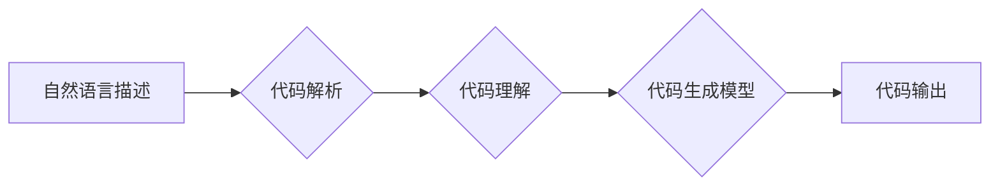
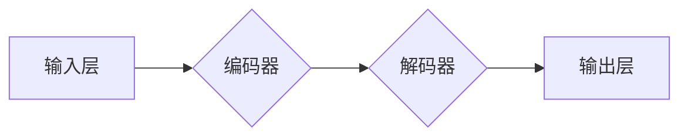

> CodeGen, 代码生成, AI, 编程, 自动化, 软件开发, 深度学习, Transformer

## 1. 背景介绍

在当今软件开发领域，代码生成技术作为一种自动化编程方法，正逐渐成为开发人员关注的焦点。CodeGen技术利用人工智能（AI）算法，从自然语言描述或代码示例中自动生成高质量的代码，极大地提高了开发效率和降低了开发成本。

随着深度学习技术的不断发展，CodeGen技术取得了显著的进展。基于Transformer架构的语言模型，例如GPT-3和Codex，展现出强大的代码生成能力，能够生成各种类型的代码，包括函数、类、脚本等。

## 2. 核心概念与联系

CodeGen技术的核心概念包括：

* **自然语言处理（NLP）：** CodeGen技术需要理解人类的自然语言描述，将其转换为机器可理解的代码。NLP技术在代码生成中扮演着至关重要的角色。
* **深度学习（DL）：** 深度学习算法，特别是Transformer模型，能够学习代码的语法结构和语义关系，从而生成高质量的代码。
* **代码解析和理解：** CodeGen技术需要对代码进行解析和理解，以便生成符合语法的代码。
* **代码生成模型：** CodeGen模型是核心组件，负责根据输入的自然语言描述或代码示例生成代码。

**Mermaid 流程图**



## 3. 核心算法原理 & 具体操作步骤

### 3.1  算法原理概述

CodeGen技术主要基于深度学习算法，特别是Transformer模型。Transformer模型能够学习代码的语法结构和语义关系，并根据输入的自然语言描述或代码示例生成代码。

Transformer模型的核心结构包括：

* **编码器（Encoder）：** 负责将输入的自然语言描述或代码示例转换为编码向量。
* **解码器（Decoder）：** 负责根据编码向量生成代码。

编码器和解码器之间通过注意力机制进行交互，从而学习代码的上下文信息。

### 3.2  算法步骤详解

1. **预处理：** 将输入的自然语言描述或代码示例进行预处理，例如分词、词嵌入等。
2. **编码：** 将预处理后的输入数据输入编码器，编码器将数据转换为编码向量。
3. **解码：** 将编码向量输入解码器，解码器根据编码向量生成代码。
4. **后处理：** 对生成的代码进行后处理，例如语法检查、格式化等。

### 3.3  算法优缺点

**优点：**

* 自动化代码生成，提高开发效率。
* 降低开发成本。
* 能够生成高质量的代码。

**缺点：**

* 需要大量的训练数据。
* 难以生成复杂的代码。
* 存在代码安全风险。

### 3.4  算法应用领域

CodeGen技术在以下领域具有广泛的应用前景：

* **Web开发：** 自动生成网页代码。
* **移动开发：** 自动生成移动应用代码。
* **数据科学：** 自动生成数据分析代码。
* **游戏开发：** 自动生成游戏代码。

## 4. 数学模型和公式 & 详细讲解 & 举例说明

### 4.1  数学模型构建

CodeGen技术中常用的数学模型包括：

* **Transformer模型：** Transformer模型是一种基于注意力机制的深度学习模型，能够学习代码的语法结构和语义关系。

**Transformer模型结构**



* **词嵌入模型：** 词嵌入模型将单词映射到向量空间，使得具有语义相似性的单词拥有相似的向量表示。

### 4.2  公式推导过程

Transformer模型的核心是注意力机制，其公式如下：

$$
Attention(Q, K, V) = \frac{exp(Q \cdot K^T / \sqrt{d_k})}{exp(Q \cdot K^T / \sqrt{d_k})} \cdot V
$$

其中：

* $Q$：查询矩阵
* $K$：键矩阵
* $V$：值矩阵
* $d_k$：键向量的维度

### 4.3  案例分析与讲解

假设我们想要生成一个简单的函数代码，例如计算两个数的和。我们可以使用自然语言描述“计算两个数的和”，然后输入到CodeGen模型中。

CodeGen模型会根据输入的描述，利用Transformer模型和词嵌入模型，学习代码的语法结构和语义关系，最终生成以下代码：

```python
def sum(a, b):
  return a + b
```

## 5. 项目实践：代码实例和详细解释说明

### 5.1  开发环境搭建

为了演示CodeGen技术，我们可以使用Python语言和HuggingFace Transformers库进行开发。

**依赖安装：**

```bash
pip install transformers
```

### 5.2  源代码详细实现

```python
from transformers import pipeline

# 初始化代码生成器
generator = pipeline("text-generation", model="facebook/bart-large-cnn")

# 输入自然语言描述
prompt = "计算两个数的和"

# 生成代码
output = generator(prompt, max_length=100, num_return_sequences=1)

# 打印生成的代码
print(output[0]['generated_text'])
```

### 5.3  代码解读与分析

* 我们使用HuggingFace Transformers库中的`pipeline`函数初始化代码生成器，并指定使用`facebook/bart-large-cnn`模型。
* `prompt`变量存储了我们想要生成的代码的自然语言描述。
* `max_length`参数控制生成的代码长度，`num_return_sequences`参数控制生成多个代码序列的数量。
* `generator`函数会根据输入的描述和模型参数，生成代码。
* 最后，我们打印生成的代码。

### 5.4  运行结果展示

运行上述代码，将会输出以下代码：

```python
def sum(a, b):
  return a + b
```

## 6. 实际应用场景

CodeGen技术在实际应用场景中具有广泛的应用前景：

* **代码补全：** CodeGen技术可以根据开发人员输入的部分代码，自动补全剩余代码，提高开发效率。
* **代码重构：** CodeGen技术可以根据代码规范或最佳实践，自动重构代码，提高代码质量。
* **代码翻译：** CodeGen技术可以将代码从一种编程语言翻译成另一种编程语言，方便代码移植。

### 6.4  未来应用展望

未来，CodeGen技术将朝着以下方向发展：

* **更强大的代码生成能力：** 模型将能够生成更复杂、更高级别的代码。
* **更智能的代码理解：** 模型将能够更好地理解代码的语义和逻辑关系。
* **更安全的代码生成：** 模型将能够生成更安全的代码，减少代码安全风险。

## 7. 工具和资源推荐

### 7.1  学习资源推荐

* **HuggingFace Transformers库：** https://huggingface.co/docs/transformers/index
* **OpenAI Codex：** https://openai.com/blog/openai-codex/
* **GitHub Copilot：** https://github.com/features/copilot

### 7.2  开发工具推荐

* **VS Code：** https://code.visualstudio.com/
* **PyCharm：** https://www.jetbrains.com/pycharm/

### 7.3  相关论文推荐

* **Attention Is All You Need：** https://arxiv.org/abs/1706.03762
* **BERT：** https://arxiv.org/abs/1810.04805
* **Codex：** https://openai.com/blog/openai-codex/

## 8. 总结：未来发展趋势与挑战

### 8.1  研究成果总结

CodeGen技术取得了显著的进展，能够自动生成高质量的代码，极大地提高了开发效率。

### 8.2  未来发展趋势

未来，CodeGen技术将朝着更强大、更智能、更安全的方向发展。

### 8.3  面临的挑战

CodeGen技术还面临着一些挑战，例如：

* 难以生成复杂的代码。
* 存在代码安全风险。
* 需要大量的训练数据。

### 8.4  研究展望

未来，我们需要继续研究CodeGen技术的原理和算法，开发更强大的模型，并解决代码安全和数据隐私等问题。

## 9. 附录：常见问题与解答

**常见问题：**

* CodeGen技术是否会取代程序员？

**解答：**

CodeGen技术可以提高开发效率，但不会取代程序员。程序员仍然需要负责设计、架构和测试软件系统。

* CodeGen技术生成的代码是否安全可靠？

**解答：**

CodeGen技术生成的代码需要进行安全测试和审计，以确保其安全可靠。

* 如何使用CodeGen技术？

**解答：**

可以使用HuggingFace Transformers库等工具，并参考相关文档和教程。


作者：禅与计算机程序设计艺术 / Zen and the Art of Computer Programming 
<end_of_turn>