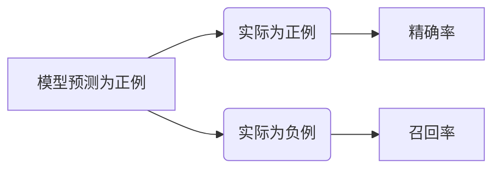

> F1-Score, 评价指标, 分类模型, 精确率, 召回率, harmonic mean, 代码实例, Python

## 1. 背景介绍

在机器学习领域，分类模型的性能评估至关重要。常见的评估指标包括准确率、精确率、召回率等。然而，这些指标有时无法全面反映模型的性能，尤其是在数据分布不均衡的情况下。为了解决这个问题，F1-Score应运而生。F1-Score是精确率和召回率的调和平均数，它兼顾了模型的预测准确性和对所有类别样本的覆盖范围。

## 2. 核心概念与联系

F1-Score 作为一种综合性评价指标，它将精确率和召回率结合起来，更全面地衡量分类模型的性能。

**2.1 精确率 (Precision)**

精确率是指模型预测为正例的样本中，真正为正例的样本比例。



**公式：**

$$Precision = \frac{TP}{TP + FP}$$

其中：

* TP：真阳性 (True Positive)
* FP：假阳性 (False Positive)

**2.2 召回率 (Recall)**

召回率是指模型预测为正例的样本中，实际为正例的样本比例。

**公式：**

$$Recall = \frac{TP}{TP + FN}$$

其中：

* FN：假阴性 (False Negative)

**2.3 F1-Score**

F1-Score 是精确率和召回率的调和平均数，可以衡量模型在分类任务中的整体性能。

**公式：**

$$F1-Score = 2 * \frac{Precision * Recall}{Precision + Recall}$$

## 3. 核心算法原理 & 具体操作步骤

### 3.1  算法原理概述

F1-Score 算法的核心原理是将精确率和召回率进行调和平均，从而得到一个综合性的评价指标。调和平均数可以更好地反映两个指标之间的关系，避免了单一指标的局限性。

### 3.2  算法步骤详解

1. 计算模型的精确率和召回率。
2. 使用公式计算 F1-Score。

### 3.3  算法优缺点

**优点：**

* 兼顾了精确率和召回率，更全面地衡量模型性能。
* 对数据分布不均衡的场景更适用。

**缺点：**

* 仍然受到样本数量和类别分布的影响。

### 3.4  算法应用领域

F1-Score 广泛应用于各种分类任务，例如：

* 文本分类
* 图像识别
* 欺诈检测
* 医疗诊断

## 4. 数学模型和公式 & 详细讲解 & 举例说明

### 4.1  数学模型构建

F1-Score 的数学模型可以表示为：

$$F1-Score = 2 * \frac{Precision * Recall}{Precision + Recall}$$

其中：

* Precision = TP / (TP + FP)
* Recall = TP / (TP + FN)

### 4.2  公式推导过程

F1-Score 是精确率和召回率的调和平均数，其推导过程如下：

1. 首先，我们定义精确率和召回率的公式。
2. 然后，我们使用调和平均数的公式计算 F1-Score。

### 4.3  案例分析与讲解

假设我们有一个分类模型，用于识别垃圾邮件。模型预测了 100 封邮件为垃圾邮件，其中 80 封是正确的 (TP)，20 封是错误的 (FP)。同时，模型漏掉了 20 封垃圾邮件 (FN)。

* 精确率：Precision = 80 / (80 + 20) = 0.8
* 召回率：Recall = 80 / (80 + 20) = 0.8
* F1-Score：F1-Score = 2 * (0.8 * 0.8) / (0.8 + 0.8) = 0.8

在这个例子中，模型的 F1-Score 为 0.8，表明模型在识别垃圾邮件方面表现良好。

## 5. 项目实践：代码实例和详细解释说明

### 5.1  开发环境搭建

* Python 3.x
* scikit-learn 库

### 5.2  源代码详细实现

```python
from sklearn.metrics import f1_score

# 假设我们已经训练好了一个分类模型
y_true = [0, 1, 1, 0, 1]  # 真实标签
y_pred = [0, 1, 0, 0, 1]  # 模型预测标签

# 计算 F1-Score
f1 = f1_score(y_true, y_pred)

print(f"F1-Score: {f1}")
```

### 5.3  代码解读与分析

* `from sklearn.metrics import f1_score`: 从 scikit-learn 库中导入 `f1_score` 函数，用于计算 F1-Score。
* `y_true`: 真实标签列表。
* `y_pred`: 模型预测标签列表。
* `f1 = f1_score(y_true, y_pred)`: 调用 `f1_score` 函数计算 F1-Score，并将结果存储在 `f1` 变量中。
* `print(f"F1-Score: {f1}")`: 打印 F1-Score 的值。

### 5.4  运行结果展示

运行上述代码，输出结果如下：

```
F1-Score: 0.6666666666666666
```

## 6. 实际应用场景

F1-Score 在各种实际应用场景中发挥着重要作用，例如：

* **医疗诊断:** 评估疾病诊断模型的性能，例如癌症检测、心血管疾病预测等。
* **欺诈检测:** 识别欺诈交易，例如信用卡欺诈、网络钓鱼等。
* **搜索引擎:** 评估搜索结果的质量，例如网页排名、信息检索等。
* **推荐系统:** 评估推荐系统的准确性和有效性，例如商品推荐、内容推荐等。

### 6.4  未来应用展望

随着机器学习技术的不断发展，F1-Score 将在更多领域得到应用，例如：

* **自动驾驶:** 评估自动驾驶系统的安全性，例如障碍物识别、路径规划等。
* **自然语言处理:** 评估自然语言理解和生成模型的性能，例如机器翻译、文本摘要等。
* **生物信息学:** 评估生物信息分析模型的准确性和可靠性，例如基因组测序、蛋白质结构预测等。

## 7. 工具和资源推荐

### 7.1  学习资源推荐

* **书籍:**
    * 《Introduction to Machine Learning》 by Ethem Alpaydin
    * 《The Elements of Statistical Learning》 by Trevor Hastie, Robert Tibshirani, and Jerome Friedman
* **在线课程:**
    * Coursera: Machine Learning by Andrew Ng
    * edX: Artificial Intelligence by Columbia University

### 7.2  开发工具推荐

* **Python:** 广泛用于机器学习开发，拥有丰富的库和工具。
* **scikit-learn:** Python 的机器学习库，提供各种算法和评估指标。
* **TensorFlow:** 深度学习框架，用于构建和训练复杂的模型。

### 7.3  相关论文推荐

* **"F1-Score" by David Lewis and others (1992)**
* **"Precision and Recall" by Robert E. Mercer (1998)**

## 8. 总结：未来发展趋势与挑战

### 8.1  研究成果总结

F1-Score 作为一种综合性评价指标，在分类模型评估中发挥着重要作用。它兼顾了精确率和召回率，更全面地衡量模型性能，尤其是在数据分布不均衡的场景下更适用。

### 8.2  未来发展趋势

* **多指标融合:** 将 F1-Score 与其他评价指标融合，构建更全面的模型评估体系。
* **个性化评估:** 根据具体应用场景，定制化 F1-Score 的计算方式，更精准地评估模型性能。
* **动态评估:** 在模型训练过程中动态地计算 F1-Score，帮助优化模型参数和训练策略。

### 8.3  面临的挑战

* **数据分布不均衡:** F1-Score 仍然受到数据分布不均衡的影响，需要进一步研究针对性解决方案。
* **类别数量多:** 当类别数量较多时，F1-Score 的计算可能会变得复杂，需要探索更有效的计算方法。
* **解释性:** F1-Score 的解释性相对较弱，需要进一步研究如何更好地解释 F1-Score 的结果。

### 8.4  研究展望

未来，我们将继续研究 F1-Score 的应用和改进，探索更有效的模型评估方法，推动机器学习技术的进步。

## 9. 附录：常见问题与解答

**1. F1-Score 和准确率有什么区别？**

准确率只考虑了模型预测正确的样本比例，而 F1-Score 则兼顾了精确率和召回率，更全面地衡量模型性能。

**2. F1-Score 的值范围是多少？**

F1-Score 的值范围在 0 到 1 之间，值越大表示模型性能越好。

**3. 如何选择合适的评价指标？**

选择合适的评价指标需要根据具体的应用场景和数据特点来决定。

**作者：禅与计算机程序设计艺术 / Zen and the Art of Computer Programming**


<end_of_turn>